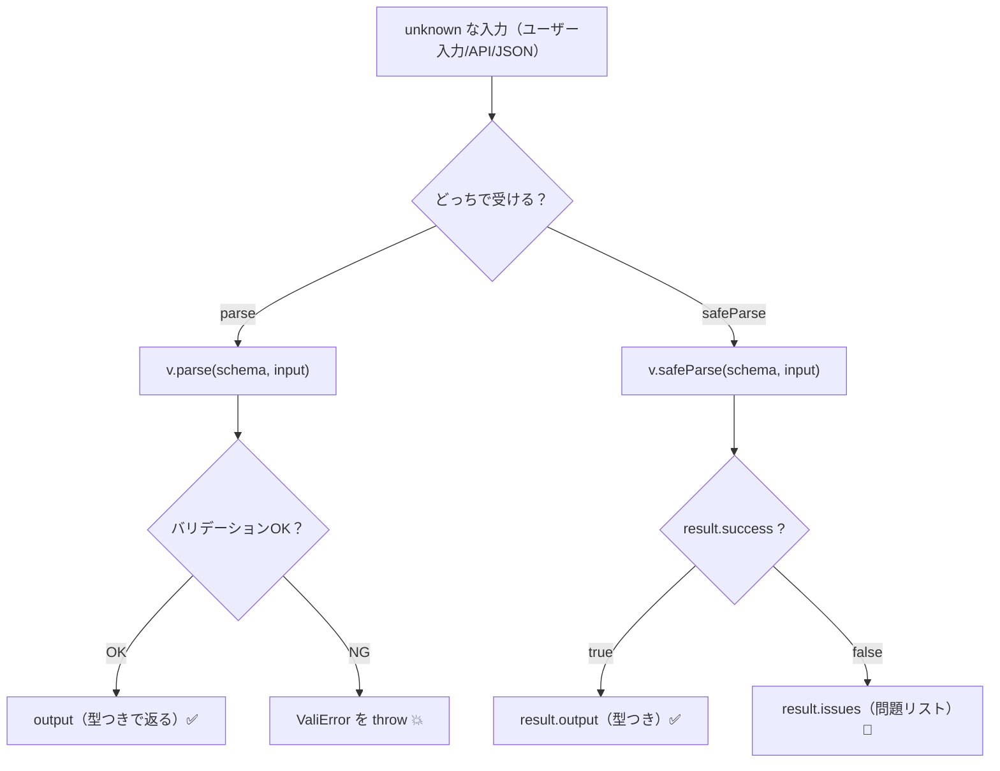

# 第259章：`parse` と `safeParse` の使い分け

今回は **「バリデーション失敗したとき、例外で止める？それとも結果として受け取る？」** の話だよ〜😊
Valibot には大きく **2つの流儀** があるんだ👇 ([Valibot][1])

* **`parse`**：OKなら型つきデータを返す、NGなら **`ValiError` を throw** 💥 ([Valibot][1])
* **`safeParse`**：OK/NGを **結果オブジェクト** で返す（`.success / .output / .issues`）📦 ([Valibot][1])

---

## まずは全体像を図でつかもう🗺️




---

## 使い分けの結論（迷ったらこれ！）🎯

| 目的                                  | おすすめ        | 理由                                       |
| ----------------------------------- | ----------- | ---------------------------------------- |
| フォーム入力で「エラー文を表示したい」😊               | `safeParse` | 例外を出さずに `.issues` が取れる ([Valibot][1])    |
| “ここは壊れてたら止めたい” 設定ファイル/サーバー内部のデータ 💪 | `parse`     | NGなら即 throw（fail-fast）できる ([Valibot][1]) |
| try/catch が増えるのがイヤ🙃                | `safeParse` | if 文でスッキリ書ける ([Valibot][1])              |

---

## サンプル：同じスキーマで両方やってみる🧪✨

### 1) スキーマを作る（`src/validation/profile.ts` みたいな場所）📁

```ts
import * as v from "valibot";

export const ProfileSchema = v.object({
  name: v.pipe(
    v.string("名前は必須だよ😊"),
    v.minLength(2, "名前は2文字以上でお願い🙏")
  ),
  email: v.pipe(
    v.string("メールは必須だよ📧"),
    v.email("メール形式じゃないかも…🤔")
  ),
});

export type Profile = v.InferOutput<typeof ProfileSchema>;
```

> `parse` も `safeParse` も、**通ったときの出力型（`InferOutput`）** がそのまま使えるよ🧠✨ ([Valibot][2])

---

### 2) `parse`：成功は気持ちいいけど、失敗は throw 💥

```ts
import * as v from "valibot";
import { ProfileSchema } from "./validation/profile";

export function validateWithParse(input: unknown) {
  try {
    const data = v.parse(ProfileSchema, input);
    // data は型つき（Profile）
    return { ok: true as const, data };
  } catch (err) {
    // 失敗すると ValiError が飛んでくる
    if (err instanceof v.ValiError) {
      return { ok: false as const, issues: err.issues };
    }
    throw err; // それ以外は想定外なので投げ直し
  }
}
```

`parse` は **「失敗＝例外」** っていう強いスタイルだよ🔥 ([Valibot][1])

---

### 3) `safeParse`：フォーム向き！結果で受け取る📦💕

```ts
import * as v from "valibot";
import { ProfileSchema } from "./validation/profile";

export function validateWithSafeParse(input: unknown) {
  const result = v.safeParse(ProfileSchema, input);

  if (result.success) {
    // result.output は型つき（Profile）
    return { ok: true as const, data: result.output };
  }

  // result.issues に全部入ってる
  return { ok: false as const, issues: result.issues };
}
```

`safeParse` は `.success` が **true/false** で分かれて、OKなら `.output`、NGなら `.issues` が見れるよ〜✨ ([Valibot][1])

---

## React実戦：`safeParse` でエラー表示までやっちゃう😆🧡

ポイントはここ👇

* `safeParse` で `issues` を取る
* そのままだと情報が多いので、**`v.flatten()`** で「表示しやすい形」にする ([Valibot][3])

```tsx
import { useState } from "react";
import * as v from "valibot";
import { ProfileSchema, type Profile } from "./validation/profile";

type FlatErrors = Record<string, string[]>;

export function ProfileForm() {
  const [form, setForm] = useState({ name: "", email: "" });
  const [errors, setErrors] = useState<FlatErrors>({});
  const [saved, setSaved] = useState<Profile | null>(null);

  const onSubmit = (e: React.FormEvent) => {
    e.preventDefault();

    const result = v.safeParse(ProfileSchema, form);

    if (result.success) {
      setErrors({});
      setSaved(result.output);
      return;
    }

    const flat = v.flatten<typeof ProfileSchema>(result.issues);
    setErrors(flat.nested ?? {});
    setSaved(null);
  };

  return (
    <div style={{ maxWidth: 420 }}>
      <h2>プロフィール登録 ✨</h2>

      <form onSubmit={onSubmit}>
        <div style={{ marginBottom: 12 }}>
          <label>
            名前：
            <input
              value={form.name}
              onChange={(e) => setForm({ ...form, name: e.target.value })}
            />
          </label>

          {errors["name"]?.map((m, i) => (
            <p key={i} style={{ margin: "4px 0" }}>
              ❌ {m}
            </p>
          ))}
        </div>

        <div style={{ marginBottom: 12 }}>
          <label>
            メール：
            <input
              value={form.email}
              onChange={(e) => setForm({ ...form, email: e.target.value })}
            />
          </label>

          {errors["email"]?.map((m, i) => (
            <p key={i} style={{ margin: "4px 0" }}>
              ❌ {m}
            </p>
          ))}
        </div>

        <button type="submit">保存する 💾</button>
      </form>

      {saved && (
        <pre style={{ marginTop: 16 }}>
          🎉 保存できた！{"\n"}
          {JSON.stringify(saved, null, 2)}
        </pre>
      )}
    </div>
  );
}
```

`v.flatten()` は、issues を **`{ nested: { "email": ["..."] } }` みたいに扱いやすく** してくれるイメージだよ🧁 ([Valibot][3])

---

## ちょいテク：エラーを「最初の1個だけ」にしたい時🙋‍♀️

「全部のエラー出すと、ちょっと怖い😵」ってときは、設定で止められるよ！
`abortEarly` や `abortPipeEarly` が用意されてる（`parse` の例が公式にあるよ）🧯 ([Valibot][1])

---

## まとめ🌸

* **`parse`**：失敗で throw（try/catch 必須になりがち）💥 ([Valibot][1])
* **`safeParse`**：結果で受ける（フォーム＆画面表示に超向く）📦 ([Valibot][1])
* エラー表示は `issues` → **`flatten`** が便利✨ ([Valibot][3])

---

## ミニチェック（1分）⏱️💡

1. フォームでエラー文を出したい → どっち？
2. 「ここ壊れてたら即落としてOK」な設定読み込み → どっち？
3. `safeParse` の結果オブジェクトで、成功判定は何を見る？

（答え：1=`safeParse`、2=`parse`、3=`result.success` 😊）

[1]: https://valibot.dev/guides/parse-data/ "Parse data | Valibot"
[2]: https://valibot.dev/guides/infer-types/?utm_source=chatgpt.com "Infer types"
[3]: https://valibot.dev/guides/issues/ "Issues | Valibot"
