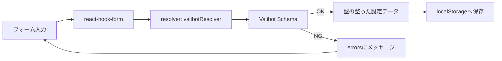
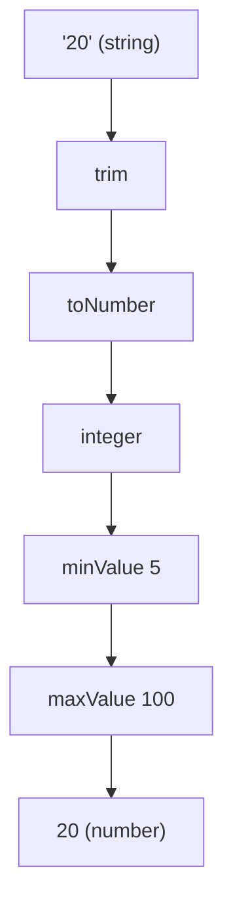

# 第260章：練習：Valibot で作る厳格な設定フォーム

今回は「設定画面っぽいやつ」を本気で作ります！📋
ポイントは **Valibot で“型も中身も”ガチガチに守る** こと💪
React Hook Form と合体して、「入力→検証→保存」まで一気にやるよ〜😊

---

## できあがりイメージ 🎨

* 表示名（必須）
* テーマ（system / light / dark）
* 言語（ja / en）
* 1ページの表示件数（文字入力→**numberに変換**して検証！）
* 通知：ON/OFF（ONのときだけメール入力欄が出る📩）
* 開発者モード：ON/OFF（ONのときだけ API URL 入力欄が出る🧪）

---

## 全体の流れ（図）🗺️





`valibotResolver` で React Hook Form と Valibot を接続するよ〜📌

---

## 1) まずはインストール 📦✨

PowerShell / ターミナルで👇

```bash
npm i react-hook-form valibot @hookform/resolvers
```

---

## 2) スキーマを作る（ガチガチ設定の心臓部❤️）🧠

`src/schemas/settingsSchema.ts` を作成👇

* `pipe` で「trim→検証→変換」みたいに順番に並べられるのが Valibot の気持ちよさだよ🫶 ([valibot.dev][1])
* `toNumber` は「文字列→number変換」をやってくれる！変換できない時はエラーにできるよ✨ ([valibot.dev][2])
* `check` で「通知ONならメール必須」みたいな **条件付きバリデーション** が書けるよ👍 ([valibot.dev][3])
* さらに `strictObject` で **想定外のキーを拒否**（地味に安全🔥） ([valibot.dev][4])

```ts
// src/schemas/settingsSchema.ts
import * as v from "valibot";

const DisplayNameSchema = v.pipe(
  v.string("表示名は必須だよ〜🙂"),
  v.trim(),
  v.minLength(2, "表示名は2文字以上にしてね✨"),
  v.maxLength(20, "表示名は20文字までだよ〜😅")
);

const ThemeSchema = v.picklist(
  ["system", "light", "dark"],
  "テーマを選んでね🎨"
);

const LanguageSchema = v.picklist(["ja", "en"], "言語を選んでね🌍");

const ItemsPerPageSchema = v.pipe(
  v.string("表示件数は必須だよ〜📌"),
  v.trim(),
  v.toNumber("数字で入れてね🔢"),
  v.integer("整数（1,2,3…）だけだよ〜🙏"),
  v.minValue(5, "最低でも5件は表示しよっ🙂"),
  v.maxValue(100, "多くても100件までにしてね😵")
);

const EmailSchema = v.pipe(
  v.string("メール入れてね📩"),
  v.trim(),
  v.toLowerCase(),
  v.email("メールの形がちょっと変かも？😳")
);

const UrlSchema = v.pipe(
  v.string("URLを入れてね🔗"),
  v.trim(),
  v.url("URLの形が変だよ〜😵")
);

// 入力（フォーム）は string が多いけど、出力は number に変換される感じを狙うよ✨
export const SettingsSchema = v.pipe(
  v.strictObject({
    account: v.strictObject({
      displayName: DisplayNameSchema,
    }),
    ui: v.strictObject({
      theme: ThemeSchema,
      language: LanguageSchema,
      itemsPerPage: ItemsPerPageSchema, // string -> number に変換される
    }),
    notifications: v.strictObject({
      enabled: v.boolean(),
      email: v.optional(EmailSchema), // 空文字は後で undefined に変換する（フォーム側で）
    }),
    developer: v.strictObject({
      devMode: v.boolean(),
      apiEndpoint: v.optional(UrlSchema), // 空文字は後で undefined に変換する（フォーム側で）
    }),
  }),
  // 条件付きチェック：通知ONなら email 必須！📩
  v.check(
    (s) => !s.notifications.enabled || !!s.notifications.email,
    "通知をONにするならメールアドレスも入れてね📩✨"
  ),
  // 条件付きチェック：開発者モードONなら API URL 必須！🧪
  v.check(
    (s) => !s.developer.devMode || !!s.developer.apiEndpoint,
    "開発者モードをONにするなら API URL も必要だよ🧪🔗"
  )
);

// 入力型（フォームの生データ）
export type SettingsInput = v.InferInput<typeof SettingsSchema>;

// 出力型（変換後のデータ：itemsPerPage が number になる！）
export type SettingsOutput = v.InferOutput<typeof SettingsSchema>;
```

---

## 3) フォーム本体を作る 🧾✨

`src/components/SettingsForm.tsx` を作成👇
ここで `valibotResolver` を使って接続するよ〜🔌

```tsx
// src/components/SettingsForm.tsx
import * as v from "valibot";
import { useForm } from "react-hook-form";
import { valibotResolver } from "@hookform/resolvers/valibot";

import { SettingsSchema, type SettingsInput, type SettingsOutput } from "../schemas/settingsSchema";
import styles from "./SettingsForm.module.css";

export function SettingsForm() {
  const {
    register,
    handleSubmit,
    watch,
    formState: { errors, isSubmitting },
  } = useForm<SettingsInput>({
    resolver: valibotResolver(SettingsSchema),
    mode: "onBlur",
    defaultValues: {
      account: { displayName: "" },
      ui: { theme: "system", language: "ja", itemsPerPage: "20" },
      notifications: { enabled: false, email: undefined },
      developer: { devMode: false, apiEndpoint: undefined },
    },
  });

  const notificationsEnabled = watch("notifications.enabled");
  const devMode = watch("developer.devMode");

  const onSubmit = async (values: SettingsInput) => {
    // handleSubmit が通ってる時点でバリデーションはOK✨
    // でも「変換後の型（SettingsOutput）」で扱いたいので parse して確定させるよ🧠
    const parsed: SettingsOutput = v.parse(SettingsSchema, values);

    localStorage.setItem("appSettings", JSON.stringify(parsed, null, 2));
    alert("保存したよ〜✨🎉");
  };

  return (
    <div className={styles.wrap}>
      <h1 className={styles.title}>設定フォーム ⚙️✨</h1>

      <form className={styles.form} onSubmit={handleSubmit(onSubmit)}>
        {/* 表示名 */}
        <div className={styles.field}>
          <label>表示名</label>
          <input
            placeholder="例）あきちゃん"
            {...register("account.displayName")}
          />
          {errors.account?.displayName?.message && (
            <p className={styles.error}>{errors.account.displayName.message}</p>
          )}
        </div>

        {/* UI設定 */}
        <div className={styles.field}>
          <label>テーマ 🎨</label>
          <select {...register("ui.theme")}>
            <option value="system">system（端末に合わせる）</option>
            <option value="light">light</option>
            <option value="dark">dark</option>
          </select>
          {errors.ui?.theme?.message && (
            <p className={styles.error}>{errors.ui.theme.message}</p>
          )}
        </div>

        <div className={styles.field}>
          <label>言語 🌍</label>
          <select {...register("ui.language")}>
            <option value="ja">日本語</option>
            <option value="en">English</option>
          </select>
          {errors.ui?.language?.message && (
            <p className={styles.error}>{errors.ui.language.message}</p>
          )}
        </div>

        <div className={styles.field}>
          <label>1ページの表示件数 🔢</label>
          <input
            inputMode="numeric"
            placeholder="例）20"
            {...register("ui.itemsPerPage")}
          />
          <p className={styles.helper}>
            入力は文字列だけど、Valibotで number に変換して保存するよ✨
          </p>
          {errors.ui?.itemsPerPage?.message && (
            <p className={styles.error}>{errors.ui.itemsPerPage.message}</p>
          )}
        </div>

        {/* 通知 */}
        <div className={styles.field}>
          <label className={styles.row}>
            <input type="checkbox" {...register("notifications.enabled")} />
            通知をONにする 📩
          </label>
          {errors.notifications?.enabled?.message && (
            <p className={styles.error}>{errors.notifications.enabled.message}</p>
          )}
        </div>

        {notificationsEnabled && (
          <div className={styles.field}>
            <label>通知用メール 📩</label>
            <input
              placeholder="example@mail.com"
              {...register("notifications.email", {
                // optional は undefined を許すけど、フォームの空欄は "" になりがち🥲
                // なので空欄は undefined に変換してあげるよ✨
                setValueAs: (val) => (val === "" ? undefined : val),
              })}
            />
            {errors.notifications?.email?.message && (
              <p className={styles.error}>{errors.notifications.email.message}</p>
            )}
          </div>
        )}

        {/* 開発者 */}
        <div className={styles.field}>
          <label className={styles.row}>
            <input type="checkbox" {...register("developer.devMode")} />
            開発者モード 🧪
          </label>
          {errors.developer?.devMode?.message && (
            <p className={styles.error}>{errors.developer.devMode.message}</p>
          )}
        </div>

        {devMode && (
          <div className={styles.field}>
            <label>API エンドポイント 🔗</label>
            <input
              placeholder="https://api.example.com"
              {...register("developer.apiEndpoint", {
                setValueAs: (val) => (val === "" ? undefined : val),
              })}
            />
            {errors.developer?.apiEndpoint?.message && (
              <p className={styles.error}>{errors.developer.apiEndpoint.message}</p>
            )}
          </div>
        )}

        <button className={styles.button} disabled={isSubmitting}>
          {isSubmitting ? "保存中…⏳" : "保存する 💾✨"}
        </button>
      </form>
    </div>
  );
}
```

---

## 4) CSS（最低限でOK👌）🎀

`src/components/SettingsForm.module.css`

```css
.wrap {
  max-width: 620px;
  margin: 24px auto;
  padding: 16px;
}

.title {
  font-size: 22px;
  margin-bottom: 12px;
}

.form {
  border: 1px solid #ddd;
  border-radius: 14px;
  padding: 16px;
  display: grid;
  gap: 12px;
}

.field {
  display: grid;
  gap: 6px;
}

.row {
  display: flex;
  align-items: center;
  gap: 8px;
}

input,
select {
  border: 1px solid #ccc;
  border-radius: 10px;
  padding: 10px 12px;
}

.helper {
  font-size: 12px;
  opacity: 0.75;
}

.error {
  font-size: 13px;
  color: #c00;
}

.button {
  border: none;
  border-radius: 12px;
  padding: 12px 14px;
  cursor: pointer;
}
```

---

## 5) 表示する（App.tsx）🚀

`src/App.tsx`

```tsx
import { SettingsForm } from "./components/SettingsForm";

export default function App() {
  return <SettingsForm />;
}
```

---

## 変換のイメージ（itemsPerPage）🔁✨

「入力は '20'（string）なのに、保存は 20（number）になる」って気持ちよさがこれ！😆



`toNumber` は「文字列を number に変換できないときエラーにする」っていうのが公式の説明だよ✨ ([valibot.dev][2])

---

## 動作チェック ✅🎮

1. 表示名を1文字にしてみる → エラー出る🙂
2. 表示件数を `abc` にする → 「数字で入れてね🔢」になる😆
3. 通知ONにしてメール空欄 → 「通知ONならメール必須📩」になる
4. 開発者モードONにしてURL空欄 → 「API URL 必須🔗」になる

保存したら DevTools で👇見てみてね（Application → Local Storage）

* key: `appSettings`

---

## おかわり課題（余裕あったら）🍰✨

* ✅ 「言語が en のときは表示名は英数字だけ」みたいなルールを `check` で追加してみる🧠 ([valibot.dev][3])
* ✅ `strictObject` を全部のネストにも使って、さらにガードを固くしてみる🛡️ ([valibot.dev][4])
* ✅ 保存後に「保存しました🎉」みたいなミニ通知（簡易Toast）を自作してみる🔔

---

必要なら、次の第261章（Biome）に行く前に、このフォームを **UIライブラリ（shadcn/ui）で見た目プロっぽくする版** も作れるよ😎✨

[1]: https://valibot.dev/guides/pipelines/?utm_source=chatgpt.com "Pipelines"
[2]: https://valibot.dev/api/toNumber/ "toNumber | Valibot"
[3]: https://valibot.dev/api/check/?utm_source=chatgpt.com "check"
[4]: https://valibot.dev/guides/intersections/?utm_source=chatgpt.com "Intersections"
