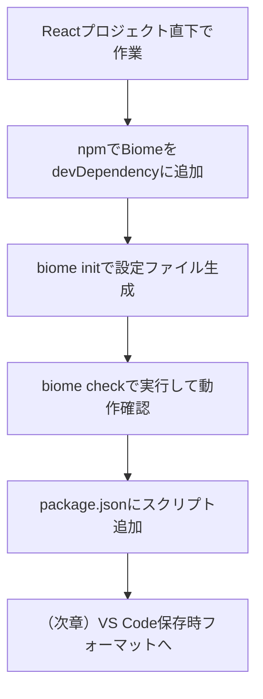

# 第262章：Biome の導入と初期設定

この章では、React プロジェクトに **Biome（リンター＋フォーマッター）** を入れて、まずは **CLIで「整形＆チェックできる状態」** まで作ります💪😊
（VS Code の保存時フォーマットは次章でがっつりやるよ〜！）

---

## この章のゴール 🎯

* Biome をプロジェクトにインストールできる ✅
* `biome.json` を作って、最低限の初期設定ができる ✅
* `biome check` で **整形・lint・import整理** を一発で回せる ✅ ([Biome][1])

---

## 全体の流れ（図）🗺️




---

## 1) Biome をインストールする 📦✨

プロジェクトのルート（`package.json` がある場所）で、これ👇

```bash
npm i -D -E @biomejs/biome
```

* `-D`：開発用（devDependencies）に入る
* `-E`：**バージョン固定**（チーム開発でも環境ズレが起きにくい！） ([Biome][2])


---

## 2) 初期設定ファイルを作る（biome init）🧪📝

次にこれ👇

```bash
npx @biomejs/biome init
```

これで、プロジェクト直下に **`biome.json`** が生成されます💡 ([Biome][2])

---

## 3) `biome.json` を“気持ちよく”整える（おすすめ最小セット）🌸


`biome.json` を開いて、まずは **`$schema`** を入れるのがおすすめ！
VS Code で入力補完が効いて、設定がめちゃラクになります😊

公式が案内してる書き方はこれ👇（node_modules 内の schema を参照） ([Biome][3])

```json
{
  "$schema": "./node_modules/@biomejs/biome/configuration_schema.json",

  "formatter": {
    "enabled": true
  },
  "linter": {
    "enabled": true
  }
}
```

> もし `biome.json` のままだとコメントが書けなくてつらいなら、`biome.jsonc` にリネームしてOKだよ（Biome は `biome.jsonc` も読めるよ） ([Biome][4])

---

## 4) まずは動かしてみる（いちばん大事）🔍✨

### ✅ 全体チェック（整形・lint・import整理）

```bash
npx @biomejs/biome check .
```

### ✅ 自動で直せるやつは直す（--write）

```bash
npx @biomejs/biome check --write .
```

`check` は **formatter + linter + import整理** をまとめてやってくれる便利コマンドだよ〜！ ([Biome][1])

---

## 5) npm scripts を用意して、いつでもワンコマンド化 🧷💨

毎回 `npx ...` 打つのだるいので、`package.json` に追加しよっ😆

```json
{
  "scripts": {
    "biome:check": "biome check .",
    "biome:fix": "biome check --write .",
    "biome:format": "biome format --write .",
    "biome:lint": "biome lint ."
  }
}
```

以後はこれでOK👇

```bash
npm run biome:check
npm run biome:fix
```

`format` / `lint` / `check` みたいなコマンド体系は公式CLIにも載ってるよ 📚 ([Biome][1])

---

## 6) よくある「あれ？😵」と対処法 🩹

### ❓ `biome` が見つからない

* だいたい「ターミナルを開き直してない」か「違うフォルダにいる」やつ！
* まず **プロジェクト直下**で `npm run biome:check` を試してね✅
* それでもダメなら `npx @biomejs/biome check .` に戻れば確実👍 ([Biome][2])

### ❓ `biome.json` の設定で迷子

* とりあえず最初は **enabled だけ true** でOK🙆‍♀️
* 細かいルール調整は次の章や、移行章（ESLint/Prettier移行）でやるとスムーズ！

---

## ミニ練習（5分）⏱️🧠✨

1. わざとコードを崩す（インデントぐちゃぐちゃ、不要な空行など）😈
2. `npm run biome:fix` を実行
3. **自動で整って感動**する🎉

---

## チェックリスト ✅✅✅

* [ ] `npm i -D -E @biomejs/biome` できた ([Biome][2])
* [ ] `npx @biomejs/biome init` で `biome.json` ができた ([Biome][2])
* [ ] `biome check --write .` が通った（or 直った） ([Biome][1])
* [ ] `package.json` に `biome:fix` などスクリプト追加した

---

## 次章予告（第263章）📣💖

次は **VS Code 拡張**を入れて、**保存した瞬間に自動整形✨** まで持っていくよ！
エディタ連携は公式の VS Code 拡張があるので安心〜！ ([Biome][5])

[1]: https://biomejs.dev/reference/cli/?utm_source=chatgpt.com "CLI - Biome"
[2]: https://biomejs.dev/guides/getting-started/ "Getting Started | Biome"
[3]: https://biomejs.dev/reference/configuration/ "Configuration | Biome"
[4]: https://biomejs.dev/guides/configure-biome/?utm_source=chatgpt.com "Configure Biome"
[5]: https://biomejs.dev/reference/vscode/?utm_source=chatgpt.com "VS Code extension | Biome"
