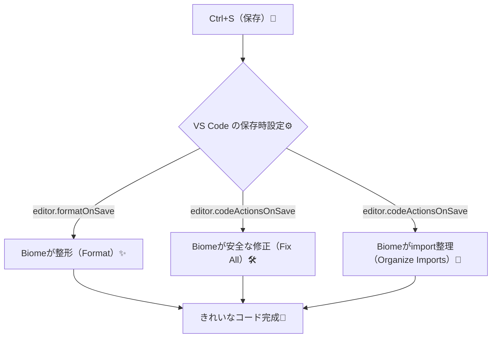

# 第263章：VS Code 拡張機能と「保存時フォーマット」

この章では **「保存した瞬間に、コードが勝手にキレイになる」** 状態を作ります🥳
Biome の VS Code 拡張を入れて、**Format（整形）** と **Fix（安全な修正）** を “自動化” しちゃおう〜！🧹💕

---

## まず全体像（保存したら何が起きる？）👀




Biome の VS Code 拡張は、VS Code に「フォーマッタ」として登録され、整形やコード修正に連携できます。([Biome][1])

---

## 1) VS Code に Biome 拡張を入れる 🧩


### ✅ 入れ方（いちばん普通の手順）

1. VS Code を開く
2. 左の四角いアイコン（Extensions） or `Ctrl + Shift + X`
3. 検索で **Biome**
4. **Biome（biomejs.biome）** をインストール✨（公式拡張）([Visual Studio Marketplace][2])

---

## 2) Biome を「デフォルトのフォーマッタ」にする 🎯


保存時フォーマットは、VS Code 側が「どのフォーマッタで整形するか」を決めます。
ここで Biome を選んであげるのがコツ💡

### ✅ GUIでやる（おすすめ・迷いにくい）🧠

1. 対象ファイル（例：`App.tsx`）を開く
2. `Ctrl + Shift + P`（コマンドパレット）
3. **Format Document With…**
4. **Configure Default Formatter**
5. **Biome** を選択✨ ([Biome][3])

---

## 3) 「保存時フォーマット」をONにする ✨💾


### ✅ settings.json に書く（プロジェクトだけに効かせるのが気楽👍）

プロジェクト直下に **`.vscode/settings.json`** を作って、こう書きます👇
（すでにあるなら追記でOK！）

```json
{
  "editor.formatOnSave": true
}
```

`editor.formatOnSave` を `true` にすると「保存時に整形」が有効になります。([Biome][1])

---

## 4) 保存時に「安全な修正（Fix）」も走らせる 🛠️✨

Biome は、**安全に直せるものだけ**を自動修正できます（危険な修正は勝手にしない感じ👍）
VS Code の `editor.codeActionsOnSave` に設定します。

```json
{
  "editor.codeActionsOnSave": {
    "source.fixAll.biome": "explicit"
  }
}
```

これで保存時に “安全な修正” が適用されます。([Biome][1])

### 📝 `"explicit"` ってなに？

* **明示的に保存したとき（Ctrl+S）だけ動く**イメージでOK👌
* オートセーブ運用だと、意図しないタイミングで走りにくくて安心✨

---

## 5) 保存時に import も整理する 🧩✨

import の並び替えも、保存時にできちゃう！

```json
{
  "editor.codeActionsOnSave": {
    "source.organizeImports.biome": "explicit"
  }
}
```

Biome 拡張は import sorting を保存時にできるよ、って明記されています。([Biome][1])

---

## 6) まとめて “完成形” の `.vscode/settings.json` ✅🎉

「整形 + 安全修正 + import整理」をまとめると、こんな感じが気持ちいいです☺️

```json
{
  "editor.formatOnSave": true,
  "editor.codeActionsOnSave": {
    "source.fixAll.biome": "explicit",
    "source.organizeImports.biome": "explicit"
  },

  "[javascript]": { "editor.defaultFormatter": "biomejs.biome" },
  "[javascriptreact]": { "editor.defaultFormatter": "biomejs.biome" },
  "[typescript]": { "editor.defaultFormatter": "biomejs.biome" },
  "[typescriptreact]": { "editor.defaultFormatter": "biomejs.biome" }
}
```

ポイントは👇

* `editor.formatOnSave` が **整形（Format）**
* `codeActionsOnSave` が **修正（Fix）** と **import整理**
* `defaultFormatter` は **「どのフォーマッタを使うか」指定**（Prettier等がいる環境で特に効く）🧠✨

---

## 7) うまく動かないときチェック ✅🕵️‍♀️

### ✅ ① “保存しても整形されない！”

* `editor.formatOnSave: true` になってる？([Biome][1])
* **Biome がデフォルトフォーマッタ**になってる？（2) の手順）([Biome][3])

### ✅ ② “プロジェクトによっては Biome を効かせたくない…”

そんなときは `biome.requireConfiguration` が便利！
`true` にすると **`biome.json` があるプロジェクトだけ** Biome がフォーマッタとして登録されます。([Biome][1])

### ✅ ③ Windows で Biome を更新したら変になった/更新できない

Windows は実行中のバイナリがロックされやすいので、Biome 拡張には “一時場所で動かす” 設定があり、既定で Windows は `true` です。([Biome][1])
それでも拡張アップデート後に挙動が怪しい時は、**VS Code を完全終了→biomeプロセス終了→再起動**が案内されています。([Biome][1])

---

## ミニ練習 🎮✨「わざと汚して、保存でピカピカにする」

1. `src/App.tsx` を開く
2. ちょっと雑にスペースや改行を崩す（わざとでOK🤣）
3. `Ctrl + S` 💾
4. **スッ…✨**って整うのを確認！

---

次の章（第264章）では、いよいよ **ESLint / Prettier から Biome に乗り換える手順**に入っていきます🚚✨
この章の状態ができてると、移行がめちゃラクになるよ〜！💪💖

[1]: https://biomejs.dev/reference/vscode/ "VS Code extension | Biome"
[2]: https://marketplace.visualstudio.com/items?itemName=biomejs.biome&utm_source=chatgpt.com "Biome"
[3]: https://biomejs.dev/guides/editors/first-party-extensions/ "First-party extensions | Biome"
