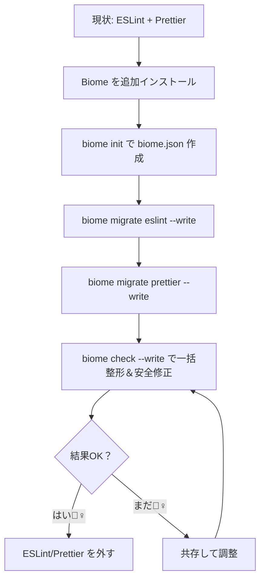

# 第264章：ESLint / Prettier からの移行ガイド

「設定ファイル多すぎ問題 🤯」を、Biome でスッキリさせよ〜！🧹💨
この章では **ESLint + Prettier → Biome** への移行を、**安全に・段階的に**やる手順でまとめるね😊

---

## ゴール🎯

* ESLint と Prettier の役割を **Biome に寄せる**（まずは共存でもOK）🫶
* コマンド1つで **format / lint / import整理** を回せるようにする✨（`biome check`）
* VS Code の保存だけで **整形＆安全な修正**が入るようにする💾✨

---

## 全体の流れ（ざっくり図解）🗺️




---

## 0) 移行前の安全策🛟（超だいじ！）

* まず **コミット**して逃げ道を作る🧷✨（戻せるのが正義）
* CI があるなら、今の状態でテストが通るのを確認✅

---

## 1) Biome を入れる（Windows / npm）📦✨


PowerShell でプロジェクト直下に移動して👇

```bash
npm i -D -E @biomejs/biome
npx @biomejs/biome init
```

* `-E` は **Biome のバージョンを固定**するため（チーム開発で結果がズレにくい）だよ📌 ([Biome][1])
* `init` で `biome.json` が作られるよ🧾 ([Biome][1])

---

## 2) ESLint 設定を Biome に移す（自動変換）🔁


```bash
npx @biomejs/biome migrate eslint --write
```

ポイント👇

* これ、**今ある biome.json を上書き**するよ⚠️ ([Biome][2])
* さらに、場合によっては **`recommended` が false になって、ルールが大量列挙**されることがあるよ（びっくりするけど仕様…！）😵 ([Biome][2])
* ESLint が VCS（`.gitignore`）を見てたのと同じ感覚に寄せるなら、**Biome の VCS 連携を有効化推奨**だよ🧠 ([Biome][2])
* YAML の ESLint 設定は（少なくとも現状）未対応⚠️ ([Biome][2])
* “inspired rules” も移したいなら `--include-inspired` もあるよ（必要なときだけでOK）✨ ([Biome][2])

---

## 3) Prettier 設定を Biome に移す（自動変換）💅✨

```bash
npx @biomejs/biome migrate prettier --write
```

ポイント👇

* Biome は Prettier にかなり寄せてるけど、**デフォルトが違う**（例：インデントがタブ寄り）ので、移行コマンドで設定を写すのがラク！🫶 ([Biome][2])
* 実行すると `indentStyle: "space"` みたいな、Prettier相当の設定が `biome.json` に入る感じになるよ🧾 ([Biome][2])

---

## 4) `biome.json` を “わかりやすく” 整える🧼✨

### 4-1) `$schema` を入れて、VS Code の補完を強くする💪

`biome.json` の先頭あたりに👇（どっちかでOK）

* node_modules を参照する書き方： ([Biome][3])

```json
{
  "$schema": "./node_modules/@biomejs/biome/configuration_schema.json"
}
```

* Web の schema を参照する書き方（例）： ([Biome][3])

```json
{
  "$schema": "https://biomejs.dev/schemas/2.0.5/schema.json"
}
```

### 4-2) `.gitignore` を効かせたい（おすすめ）🧲

Biome の VCS 連携は **opt-in（自分でON）**だよ👇 ([Biome][4])

```json
{
  "vcs": {
    "enabled": true,
    "clientKind": "git",
    "useIgnoreFile": true
  }
}
```

---

## 5) まずは Biome を回してみる（整形＋安全修正）🧪✨


「全部まとめてやって〜！」はこれ👇

```bash
npx @biomejs/biome check --write
```

`check --write` は **format + lint + import整理**をまとめてやってくれるよ✅ ([Biome][1])

---

## 6) package.json の scripts を “Biome基準” にする🧾✨

例（好みでOK）👇

```json
{
  "scripts": {
    "lint": "biome lint .",
    "format": "biome format --write .",
    "check": "biome check .",
    "fix": "biome check --write .",
    "ci": "biome ci ."
  }
}
```

CI 向けに `biome ci` も用意されてるよ（`check` っぽいけど CI 最適化）🏃‍♀️💨 ([Biome][1])

---

## 7) VS Code を「保存だけで最強」にする🪄💾

Biome 公式拡張は👇ができるよ

* 保存時フォーマット
* 保存時の安全な修正（Fix on Save）
* import 並び替え（Organize Imports） ([Biome][5])

`.vscode/settings.json` に例👇

```json
{
  "editor.formatOnSave": true,
  "editor.codeActionsOnSave": {
    "source.fixAll.biome": "explicit",
    "source.organizeImports.biome": "explicit"
  }
}
```

この設定値は公式ドキュメントに載ってるやつだよ✅ ([Biome][5])

---

## 8) ESLint / Prettier を “外す” タイミング⏰

いきなり消さなくてOK！😌
おすすめの外し方は👇

* ① まず Biome を導入（共存）
* ② `biome check --write` で差分を整える
* ③ しばらく運用して問題ないのを確認
* ④ ESLint/Prettier の実行を止める
* ⑤ 依存パッケージと設定ファイルを削除🧹✨

よく消すファイル例（あるものだけでOK）👇

* ESLint: `.eslintrc.*`, `eslint.config.*`, `.eslintignore`
* Prettier: `.prettierrc*`, `prettier.config.*`, `.prettierignore`

---

## よくあるつまづき🐣💥

* **「Prettier と完全に同じ出力じゃない！」**
  → Biome は高互換だけど、細部の違いはあり得るよ（まずはチームで“許容ライン”を決めるのが勝ち）🫶 ([Biome][2])
* **「ESLint のプラグイン全部は移せない…」**
  → その場合は “Biomeをformatter中心、lintはESLint残す” みたいな段階運用もアリだよ😊（最終的に寄せるでもOK）

---

## ミニ練習（この章のゴール確認）🏁✨

1. `npm i -D -E @biomejs/biome` → `biome init` を実行✅ ([Biome][1])
2. `migrate eslint --write` と `migrate prettier --write` を実行✅ ([Biome][2])
3. `biome check --write` で整形＆安全修正✅ ([Biome][1])
4. VS Code の保存で整形・修正・import整理が動くか確認✅ ([Biome][5])

---

次の章（第265章）は **「Biome のルールをどうカスタムするか」**だよ🎛️✨
移行できたら、今度は「自分のチームに合う治安づくり」しよ〜😊💖

[1]: https://biomejs.dev/guides/getting-started/ "Getting Started | Biome"
[2]: https://biomejs.dev/guides/migrate-eslint-prettier/ "Migrate from ESLint and Prettier | Biome"
[3]: https://biomejs.dev/reference/configuration/ "Configuration | Biome"
[4]: https://biomejs.dev/guides/integrate-in-vcs/?utm_source=chatgpt.com "Integrate Biome with your VCS"
[5]: https://biomejs.dev/reference/vscode/ "VS Code extension | Biome"
