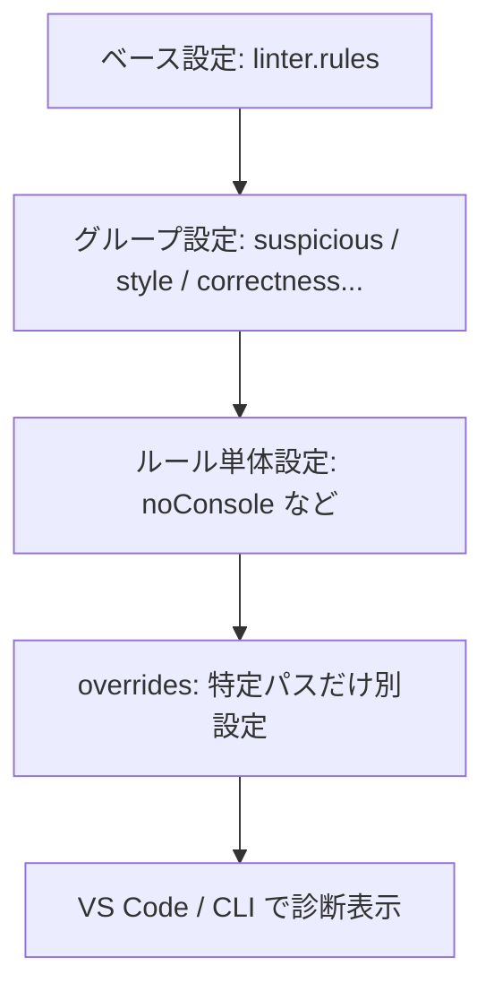

# 第265章：Lint ルールのカスタマイズ

この章では、Biome の **Lint（コードの注意・バグっぽい所を見つけるやつ）** を「プロジェクトに合う性格」に調整していくよ〜！🧩💡
React 開発だと「ここは厳しめにしたい」「ここはゆるくしたい」が絶対出るので、カスタマイズできるとめちゃ安心😌🫶

---

## 1) まずは全体像：どこで何を設定するの？🗺️

Biome のルール設定は、基本 **`biome.json` / `biome.jsonc` の `linter.rules`** に書くよ✍️
ルールは「グループ（カテゴリ）」に分かれてて、代表的にはこんな感じ👇（a11y / correctness / style / suspicious…など）([Biome][1])

* ✅ **recommended**：おすすめセット（デフォルトで有効）([Biome][1])
* 🎛️ **グループ単位**で ON/OFF や severity（warn/error など）を一括調整
* 🎯 **ルール単体**で severity（warn/error/off など）や options を指定
* 🧷 **overrides** で「特定フォルダ・特定拡張子だけ」設定を変える（超重要！）([Biome][1])

図にするとこんな流れだよ👇




---

## 2) ルールの「強さ（severity）」を知ろう🔥➡️🧊

グループ（例：`a11y`）は **文字列で severity を一括指定**できるよ！
使える値は `on/off/info/warn/error` など。`on` は「ルール本来のデフォルト強さで出してね」って意味✨([Biome][1])

たとえば「アクセシビリティ系は今は軽めに info で見たいな〜」ならこう👇

```jsonc
{
  "linter": {
    "enabled": true,
    "rules": {
      "a11y": "info"
    }
  }
}
```

---

## 3) “おすすめセット” を軸にして、必要なルールだけ追加する🥗➕🍖

### ✅ デフォルトは recommended が ON

`linter.rules.recommended` はデフォルト `true`（おすすめルールが有効）だよ([Biome][1])
ここを軸にして、「おすすめに入ってないけど欲しい」ルールを足していくのが超やりやすい🧠✨

---

## 4) 実践①：console を禁止したい（でも error/warn は許したい）🧯🪵

フロントって、つい `console.log()` 置きがちだよね😂
Biome には **`noConsole`** があって、これは **おすすめではないので自分で有効化が必要**だよ〜([Biome][2])

### 4-1) まずは “禁止（error）” にする🚫

```jsonc
{
  "linter": {
    "enabled": true,
    "rules": {
      "recommended": true,
      "suspicious": {
        "noConsole": "error"
      }
    }
  }
}
```

### 4-2) でも `console.error` とかは許したい🙆‍♀️

`noConsole` は options で「許可するメソッド」を指定できるよ🧰✨([Biome][2])

```jsonc
{
  "linter": {
    "enabled": true,
    "rules": {
      "recommended": true,
      "suspicious": {
        "noConsole": {
          "level": "error",
          "options": {
            "allow": ["assert", "error", "info", "warn"]
          }
        }
      }
    }
  }
}
```

> これで `console.log` は怒られるけど、`console.error` はOKにできるよ🙂‍↕️✨

---

## 5) 実践②：未使用の引数は “error” に格上げしたい（チームで厳しめ）👀⚡

Biome のルールページには「どう設定するか」の例が載ってることが多いよ！
たとえば `noUnusedFunctionParameters` はこうやって `correctness` グループに書くのが基本形👇([Biome][3])

```jsonc
{
  "linter": {
    "rules": {
      "correctness": {
        "noUnusedFunctionParameters": "error"
      }
    }
  }
}
```

> ちなみにこのルール、「使わない引数は `_` で始めるとOK」みたいな逃げ道も用意されてるのが優しい🥹🫶([Biome][3])

---

## 6) 実践③：React Hooks の依存配列チェックを “自分のカスタムフック” にも効かせたい🪝✨

`useEffect` の依存配列をチェックしてくれる **`useExhaustiveDependencies`** は、カスタムフックにも対応できるよ！
設定例（hooks 配列で「どの引数が closure / deps か」を指定）👇([Biome][4])

```jsonc
{
  "linter": {
    "rules": {
      "correctness": {
        "useExhaustiveDependencies": {
          "options": {
            "hooks": [
              { "name": "useLocation", "closureIndex": 0, "dependenciesIndex": 1 },
              { "name": "useQuery", "closureIndex": 2, "dependenciesIndex": 0 }
            ]
          }
        }
      }
    }
  }
}
```

「うちのプロジェクトのフックにもちゃんとチェック効かせたい！」ってとき超便利🥰🧠

---

## 7) overrides：テストファイルだけ “ゆるく” したい（あるある）🧪🍡

テストって `console.log` でデバッグしたくなったり、`any` 的な妥協が出たり…あるよね😂
そんなときは **`overrides`** が最強！
**上に書いた基本設定を、特定パスだけ上書き**できるよ。さらに **順番が超大事で、最初にマッチしたものだけが使われる**よ🧷([Biome][1])

例：`**/*.test.tsx` と `**/*.spec.tsx` だけ `noConsole` を OFF にする👇

```jsonc
{
  "linter": {
    "enabled": true,
    "rules": {
      "recommended": true,
      "suspicious": {
        "noConsole": "error"
      }
    }
  },
  "overrides": [
    {
      "includes": ["**/*.test.ts", "**/*.test.tsx", "**/*.spec.ts", "**/*.spec.tsx"],
      "linter": {
        "rules": {
          "suspicious": {
            "noConsole": "off"
          }
        }
      }
    }
  ]
}
```

---

## 8) “この1行だけ黙ってて！”（最終手段）🤫🩹

「分かってるけど今回は意図的！」って時は、抑制コメント（suppression）も使えるよ。
`useExhaustiveDependencies` の例だと、こんな `biome-ignore` があるよね👇([Biome][4])

```ts
// biome-ignore lint/correctness/useExhaustiveDependencies(a): suppress dependency a
useEffect(() => {
  console.log(a);
}, []);
```

⚠️ ただし、依存配列の抑制はバグりやすいから「コードで直せるなら直す」が基本だよ〜😖💦([Biome][4])

---

## 9) ルールの探し方：困ったら `biome explain` 🧠🔍

「このルール何？」「デフォルト強さは？」ってなったら、CLI の `biome explain` が便利！
Biome の設定ドキュメントでも `explain` コマンドが案内されてるよ🧾✨([Biome][1])

```bash
biome explain noDebugger
```

---

## 10) ミニ演習（10〜15分）⏱️🎀

### 演習A：console ルールを入れてみよう🧯

1. `noConsole` を error で有効化（`console.log` が怒られる）
2. options で `error/warn/info` だけ許可してみる（`console.error` はOK）

（設定の形はこの章の例そのままでOK🙆‍♀️）([Biome][2])

### 演習B：テストだけ console OK にしよう🧪

* `overrides` で `**/*.test.tsx` だけ `noConsole: off` にしてみる
  （「最初にマッチした overrides だけが使われる」も意識！）([Biome][1])

### 演習C：`biome lint` を “一部だけ” 走らせて動作確認しよう🏃‍♀️

CLI には `lint` コマンドがあって、対象を絞れるオプションもあるよ（`--only` など）([Biome][5])
※細かい使い方は次章以降でさらに活躍するよ〜！

---

## まとめ🎉✨

* まずは **recommended を軸**にして、必要なルールだけ足すのがラク🧠
* **ルール単体**は `group: { ruleName: "warn" }` みたいに書く🧩([Biome][3])
* **overrides** で「テストだけ」「特定フォルダだけ」ゆるくできる（順番大事！）🧷([Biome][1])
* 困ったら **`biome explain`** で調べる🔍([Biome][5])

次の **第266章（CI/CD への組み込み）**では、このルールたちを GitHub Actions などで自動チェックして「通らないとマージできない」みたいにしていくよ〜💪😺

[1]: https://biomejs.dev/reference/configuration/ "Configuration | Biome"
[2]: https://biomejs.dev/linter/rules/no-console/ "noConsole | Biome"
[3]: https://biomejs.dev/linter/rules/no-unused-function-parameters/ "noUnusedFunctionParameters | Biome"
[4]: https://biomejs.dev/linter/rules/use-exhaustive-dependencies/ "useExhaustiveDependencies | Biome"
[5]: https://biomejs.dev/reference/cli/ "CLI | Biome"
