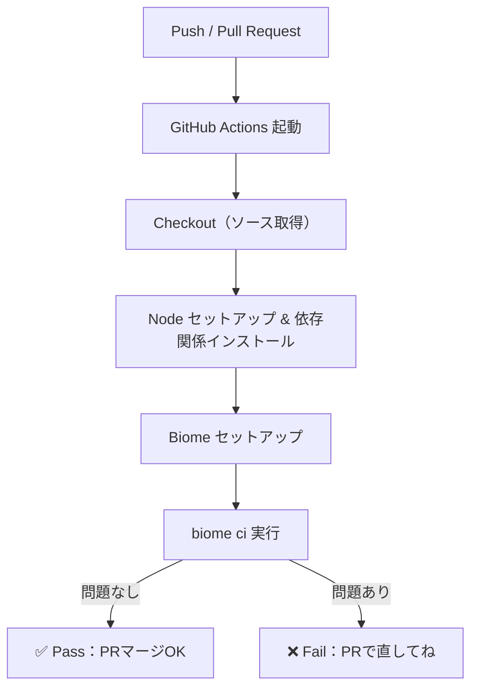
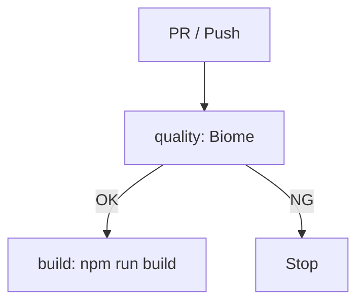

# 第266章：CI/CD パイプラインへの組み込み

この章では、**GitHub に push / PR を出した瞬間に、自動で Biome が走って**「整形できてないよ！」「Lint で引っかかったよ！」を見つけてくれる仕組みを作ります✨
Biome には **CI向けの `biome ci`** が用意されていて、CI で回すのにピッタリです🎯 ([Biome][1])

---

## 1) まず全体の流れをイメージしよ〜😺🗺️




---

## 2) “CIでやること” を決める✍️✨（おすすめ方針）

CI では基本これでOKです👇

* ✅ **整形チェック**（フォーマット崩れ検知）
* ✅ **Lint チェック**（怪しいコード検知）
* ✅ **PR上にエラーを表示**（見逃し防止）

Biome は `--reporter` を指定できて、**GitHub 用の `--reporter=github`** を使うと、PRのチェック結果として「ここがダメ！」を出しやすいです📌 ([Biome][2])

---

## 3) package.json に “CI用コマンド” を用意（任意だけど超おすすめ）🧰💕

ローカルとCIで同じコマンドを叩けると、事故が減ります👍
（すでに scripts があるなら読み替えてOK！）

```json
{
  "scripts": {
    "biome:check": "biome check .",
    "biome:ci": "biome ci . --reporter=github"
  }
}
```

> メモ📝：Biome を devDependencies に入れているなら `npm run biome:ci` で動きます。
> “Biome 自体をCIで入れる” ところは次でやるよ〜😊

---

## 4) GitHub Actions を作る（これが本題）🎬✨

リポジトリに次のファイルを作ります👇

📁 `.github/workflows/biome.yml`

**よくある構成（おすすめ）**：Node をセットアップして依存関係を入れてから Biome を回すやつ。
Biome 設定が `extends` などで外部依存を持つ可能性があるなら、この形が安心です🧷（公式も、その場合は Node & 依存関係のセットアップが必要だよ〜と言ってます） ([Biome][3])

```yaml
name: Code quality (Biome)

on:
  pull_request:
  push:
    branches: [main]

jobs:
  quality:
    runs-on: ubuntu-latest

    permissions:
      contents: read

    steps:
      - name: Checkout
        uses: actions/checkout@v5
        with:
          persist-credentials: false

      - name: Setup Node.js
        uses: actions/setup-node@v4
        with:
          node-version: 22
          cache: "npm"

      - name: Install dependencies
        run: npm ci

      - name: Setup Biome
        uses: biomejs/setup-biome@v2

      - name: Run Biome (CI)
        run: biome ci . --reporter=github
```

### ここがポイントだよ😊💡

* `biomejs/setup-biome@v2` は **Biome を GitHub Actions の runner に入れてくれる公式アクション**です✨ ([Biome][3])
* `setup-biome` は、lockfile / package.json から **Biome のバージョンを自動検出**もしてくれます（そして依存関係に Biome のバージョンをちゃんと固定するのが推奨！）📌 ([GitHub][4])
* `biome ci` は **`biome check` 相当だけど CI 向け最適化**が入ってるよ、って位置づけです🏎️ ([Biome][1])

---

## 5) “CI → ビルド →（将来）デプロイ” の形にしたい時（ミニCD感）🎁🚢

「品質チェックが通ったらビルドもする！」ってしたいなら、`needs:` でつなぐのがキレイ✨



例（ビルド job 追加）👇

```yaml
jobs:
  quality:
    runs-on: ubuntu-latest
    steps:
      - uses: actions/checkout@v5
      - uses: actions/setup-node@v4
        with:
          node-version: 22
          cache: "npm"
      - run: npm ci
      - uses: biomejs/setup-biome@v2
      - run: biome ci . --reporter=github

  build:
    runs-on: ubuntu-latest
    needs: quality
    steps:
      - uses: actions/checkout@v5
      - uses: actions/setup-node@v4
        with:
          node-version: 22
          cache: "npm"
      - run: npm ci
      - run: npm run build
```

> デプロイ（CD）は、Vercel / Cloudflare Pages など各サービスの Action をこの `build` の後ろに足す感じだよ〜🚀✨

---

## 6) よくあるハマりどころ（先回り🫶🧯）

### 😵「CIだと Biome の設定が読めてない気がする」

* `extends` で外部パッケージの設定を参照してる場合、**CIでも依存関係が必要**です。なので `npm ci` を先に入れてるこの章の形が安全👌 ([Biome][3])

### 🤔「Biome のバージョン、毎回変わったら怖い…」

* `@biomejs/biome` を依存関係に入れて **バージョン固定**しておくのが推奨です📌 ([GitHub][4])

### 📝「PRで見やすく結果出したい！」

* `biome ci . --reporter=github` を使うと、GitHub のPRワークフローでメッセージを出せます📌 ([Biome][2])

---

## 7) 仕上げ：動作確認の手順 ✅🎉

1. 上の `.github/workflows/biome.yml` をコミット
2. GitHub に push
3. PR を作る（または main に push）
4. ✅ GitHub の “Actions” / PR の “Checks” に **Biome の結果**が出たら成功🎊✨

---

次の章（第267章）は **Biome の Analyzer（コード解析）**に入って、ルールの理解が一気に深まるところだよ〜🔎💖

[1]: https://biomejs.dev/guides/getting-started/ "Getting Started | Biome"
[2]: https://biomejs.dev/reference/reporters/ "Reporters | Biome"
[3]: https://biomejs.dev/recipes/continuous-integration/ "Continuous Integration | Biome"
[4]: https://github.com/biomejs/setup-biome "GitHub - biomejs/setup-biome: Setup the Biome CLI in GitHub Actions"
