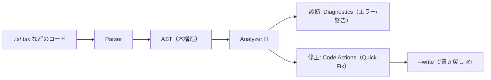

# 第267章：Biome の Analyzer（コード解析）機能

今日は **「Biome がコードを“読んで”、問題を見つけたり、直したりしてくれる仕組み」**＝ **Analyzer** を、ふんわり理解して使えるようになるのがゴールだよ〜！😊💕

---

## 1) Analyzer ってなに？🕵️‍♀️


Biomeの **Analyzer は “コードを解析して、診断（diagnostics）や修正（code actions）を出す脳みそ”** みたいな存在だよ🧠✨
公式ドキュメントでも「Analyzer は linter と assist の土台」って説明されてるよ〜！ ([Biome][1])

イメージはこんな感じ👇



---

## 2) 「biome check」が強い理由 💪✨

Biomeには `format` / `lint` などがあるけど、**`check` は “全部セット”** なのが便利！

公式CLIの説明だと `biome check` は **formatter + linter + import sorting** を走らせるよってなってるよ ✅ ([Biome][2])
CI向けの `biome ci` も同じく **formatter + linter + import sorting** を実行するよ〜！ ([Biome][2])

---

## 3) まずは体験！Analyzerの結果を見てみよう 👀⚡

プロジェクトのルート（`package.json` がある場所）で、PowerShell か VS Code のターミナルを開いて👇

### ✅ 解析だけ（変更しない）

```bash
npx biome check .
```

### ✅ 自動修正もする（安全な範囲で）

```bash
npx biome check . --write
```

`check` には `--write` が用意されてるよ（公式CLIに載ってる） ([Biome][2])

> 💡「安全じゃない修正」も含めたい時は `--unsafe` もあるよ（ただし慎重に！） ([Biome][2])

---

## 4) Diagnostics（診断）の読み方 🧾✨

Biomeの診断は「何がダメで、どう直せるか」をかなり丁寧に出してくれる設計だよ📣
“診断の構造を知ると読みやすいよ”って公式も言ってる！ ([Biome][3])

そしてルールにはグループがあって、たとえば JavaScript/TypeScript だとこんな感じで大量に用意されてるよ（例：Correctness / Suspicious / Security…） ([Biome][4])

ルール一覧ページには、

* ✅ **recommended かどうか**
* 🛠️ **安全に直せる修正（safe fix）があるか**
* ⚠️ **unsafe fix があるか**
  みたいな “アイコンの意味” も載ってるよ！ ([Biome][4])

---

## 5) Analyzerの「修正」＝ Code Actions（Quick Fix）🪄

Biomeは “見つけるだけ” じゃなくて **直し方も提案**してくれるのが強いよ〜！😍

たとえば **import の整理**（並び替え）も “コードアクション” として用意されてる：
`organizeImports` は import/export を一定ルールで並べてくれるよ 📦✨ ([Biome][5])

---

## 6) VS Code で Analyzer をフル活用する設定 💖🧰

Biome の VS Code 拡張は、**整形・lint・リファクタ（コード修正）**まで統合してくれるよ！ ([Biome][6])

### ✅ 保存時に “安全な修正” を自動適用する（Fix on Save）

公式ページの例そのまま貼るね👇 ([Biome][6])

```json
{
  "editor.codeActionsOnSave": {
    "source.fixAll.biome": "explicit"
  }
}
```

### ✅ 保存時に import を自動で整える（import sorting）

これも公式の例👇 ([Biome][6])

```json
{
  "editor.codeActionsOnSave": {
    "source.organizeImports.biome": "explicit"
  }
}
```

### 🪟 Windowsあるある注意：Biome更新できない問題

Windowsは実行中のバイナリをロックしがちで、Biome拡張にはその対策設定があるよ（デフォルトはWindowsだけ `true` になってるよ） ([Biome][6])
→ 「Biomeをアップデートできない！」ってなったら、このへんが理由になりやすい🙏💦

---

## 7) どうしても直したくない時：抑制（Suppressions）🙅‍♀️📝

「ここはわざとこう書いてるんだよね〜」って時、Biomeは **抑制コメント**が使えるよ✨
しかも **lint だけじゃなく assist（アクション）も同じ仕組みで抑制できる**って明言されてる！ ([Biome][1])

### ✅ 1行だけ抑制（例）

```ts
// biome-ignore lint/suspicious/noDoubleEquals: legacy API の都合で必要
if (a == b) {
  // ...
}
```

### ✅ 範囲で抑制（start/end）

公式に `biome-ignore-start` / `biome-ignore-end` が載ってるよ🧷 ([Biome][1])

```ts
// biome-ignore-start lint/suspicious/noDoubleEquals: この範囲は古い仕様対応
a == b;
c == d;
// biome-ignore-end lint/suspicious/noDoubleEquals: ここまで
```

### ✅ ファイル全体を抑制（v2で強化）

Biome v2では `// biome-ignore-all` もサポートされたよ〜！ ([Biome][7])

```ts
// biome-ignore-all lint/suspicious/noDoubleEquals: このファイルは移行前なので一旦スルー
```

---

## 8) ミニ演習：Analyzerを「見る→直す→抑制する」🎮✨

1. 適当な `src/sandbox.tsx` を作って、わざと崩して書く😈

   * import順バラバラ
   * `==` を使う
   * 未使用変数を作る
2. ターミナルで実行👇

   ```bash
   npx biome check . 
   ```
3. 直せるなら直してみる👇

   ```bash
   npx biome check . --write
   ```
4. 「ここだけは直したくない」場所に `biome-ignore` を付けてみる📝（上の例）

---

## まとめ 🎀

* **Analyzer = コードを解析して “診断” と “修正提案” を出す頭脳** 🧠 ([Biome][1])
* `biome check` は **format + lint + import sorting** のセットで超便利 ✅ ([Biome][2])
* VS Code では **Fix on Save / import sorting on save** を入れると気持ちよく回るよ💖 ([Biome][6])
* どうしても無理なら **Suppressions** で“意図的に無視”もできる🙆‍♀️ ([Biome][1])

---

次の章（第268章）は「大規模プロジェクトでパフォーマンス比較」だから、**“なぜBiomeが速いって言われるの？”** を、体感ベースでやっていこ〜！🚀💕

[1]: https://biomejs.dev/analyzer/suppressions/?utm_source=chatgpt.com "Suppressions - Biome"
[2]: https://biomejs.dev/reference/cli/ "CLI | Biome"
[3]: https://biomejs.dev/reference/diagnostics/?utm_source=chatgpt.com "Diagnostics - Biome"
[4]: https://biomejs.dev/linter/javascript/rules/?utm_source=chatgpt.com "JavaScript Rules | Biome"
[5]: https://biomejs.dev/assist/actions/organize-imports/?utm_source=chatgpt.com "organizeImports | Biome"
[6]: https://biomejs.dev/reference/vscode/ "VS Code extension | Biome"
[7]: https://biomejs.dev/blog/biome-v2-0-beta/?utm_source=chatgpt.com "Biome v2.0 beta"
