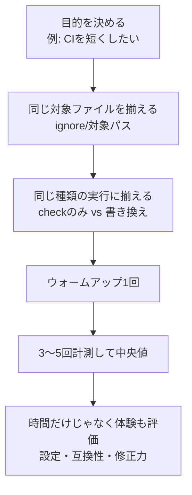

# 第268章：大規模プロジェクトでのパフォーマンス比較

大規模（ファイル数が多い・モノレポ・CIが重い）になってくると、**「ツールが1回走るのに何秒か」**が、そのままチームの時間を吸っていきます…😵‍💫
今日は **Biome と（従来の）ESLint + Prettier** を、あなたのプロジェクトで“ちゃんと公平に”比べるやり方を身につけます💪✨

---

## 今日のゴール🎯

* 速さ比較でやりがちなミス（ズルい条件）を避けられる🙅‍♀️
* Windowsで、同じ条件で計測できる📏
* 大規模向けの「CIを軽くする回し方」まで分かる⚡

---

## まず大事：比較の手順（ここが9割）🧠


「速かった！」って言う前に、**同じ条件**に揃えないと意味がなくなります😭



---

## Biomeの“比較相手”を揃える（コマンド確認）✅

Biomeは **format / lint / check** があり、まとめてやるなら `check`。公式のGetting Startedでもこの形になってます。([Biome][1])

* フォーマット（書き換えあり）
  ([Biome][1])
* リント（書き換えあり）
  ([Biome][1])
* フォーマット＋リント＋import整理（書き換えあり）
  ([Biome][1])

そしてCIで比較したいなら、**書き換えしない読み取り専用**の `biome ci` が本命です（CI向けコマンドとして定義されています）。([Biome][2])

---

## 1) 計測の前準備（大規模ほど効く）🧹🧊

### ✅ 比較条件の固定（超大事）

* どっちも **“チェックのみ”** で揃える（書き換えは時間が変わりやすい）
* 同じ対象ディレクトリ（例：`src` と `packages` だけ、など）
* 余計なもの除外：`node_modules`, `dist`, `build` など
  （ここがズレると、結果が崩壊します😇）

### ✅ Biomeの初期化（まだなら）

`biome.json` を作るならこれ（公式）。([Biome][1])

```powershell
npx @biomejs/biome init
```

---

## 2) Windows（PowerShell）で“公平なベンチ”を取る📏🪟

### Biome（CI想定：読み取り専用）

```powershell
# まずウォームアップ（1回捨てる）
npx @biomejs/biome ci .

# 3回測って中央値っぽく見る（ザックリでOK）
Measure-Command { npx @biomejs/biome ci . }
Measure-Command { npx @biomejs/biome ci . }
Measure-Command { npx @biomejs/biome ci . }
```

`biome ci` は **フォーマット・リント・import整理を“書き換えなし”で実行するCI用コマンド**です。([Biome][2])

---

### ESLint + Prettier（例：チェックのみ）

プロジェクトの設定でコマンドは変わるけど、よくある比較の形はこんな感じ👇

```powershell
# ESLint（チェックのみ）
Measure-Command { npx eslint . }

# Prettier（チェックのみ）
Measure-Command { npx prettier --check . }
```

⚠️注意：ESLint/Prettier側は「対象ファイルの指定」や「ignore」がズレやすいので、**同じ範囲**に合わせてね🙏

---

## 3) “大規模プロジェクトっぽい比較観点”チェックリスト🧾✨

時間だけ見て「勝った負けた」すると事故ります🚑

### ⏱️ 速度系（数字で見える）

* 初回（Cold）：CIでよく起きる
* 2回目以降（Warm）：ローカルで体感に近い
* 変更ファイルだけ（Incremental）：PR運用で超重要

### 🧠 体験系（地味に大事）

* 設定の分かりやすさ（ルール地獄になってない？😵‍💫）
* 直せる範囲（自動修正がどこまで安全？）
* エラー表示の読みやすさ

---

## 4) 大規模ならコレ：変更ファイルだけ回す（CI最適化）⚡🧩

Biomeの `biome ci` には **変更分だけに寄せる**ためのオプションがあります（`--changed` や `--since=REF`）。([Biome][2])

例（PRで「mainとの差分だけ」見るイメージ）：

```powershell
npx @biomejs/biome ci --changed --since=origin/main .
```

これ、モノレポで効くと **体感が別物**になります😳✨
（もちろん、CI環境やGitの取り方で効き方が変わるので、まずは自分のCIで計測がいちばん！）

---

## 5) 結果の読み方（ありがちな落とし穴）🕳️

* **`--write` で比べない**：書き換えは差分量でブレます（公平じゃない）
* **対象ファイルがズレてない？**：ESLintはTS/TSXだけ、BiomeはJSON/CSSも…みたいなズレが起きがち
* **“速いけど検出できてない”**もある：ルール差・互換差は必ず見る👀

Biomeは「Web向けツールチェーン」で、複数言語のフォーマットに対応し、Prettier互換性の指標も公開しています。([Biome][3])
だからこそ、**あなたのプロジェクトで“何が対象になっているか”**を揃えるのが超大事です🫶

---

## ミニ課題（10分）🧁

1. `biome ci .` を3回測って、時間を書き出す✍️
2. `eslint .` と `prettier --check .` を同じ範囲で測る✍️
3. 「CIで困ってるのはどっち？」を1行で結論にする💬

   * 例：「PRのたびにlintが遅い」→ `--changed/--since` を優先したい、など

---

## まとめ🎉

* 大規模の比較は **“計測の作法”がすべて**📏✨
* CI比較なら **`biome ci`（読み取り専用）**が軸([Biome][2])
* 変更分だけ回すのが大規模では強い（`--changed`, `--since`）([Biome][2])

---

次は、あなたの環境に合わせて **「測る対象ディレクトリ」**をキレイに決めて、比較がブレない `package.json` scripts を作るテンプレも用意できるよ😊💡

[1]: https://biomejs.dev/guides/getting-started/ "Getting Started | Biome"
[2]: https://biomejs.dev/reference/cli/?utm_source=chatgpt.com "CLI - Biome"
[3]: https://biomejs.dev/?utm_source=chatgpt.com "Biome, toolchain of the web"
