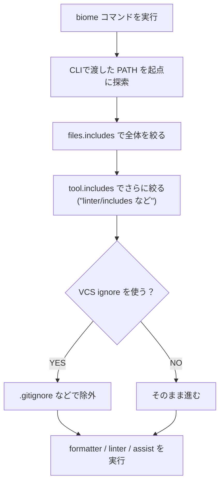

# 第269章：トラブルシューティングと除外設定

この章では「Biomeが思ったとおりに動かないときの直し方」と「触ってほしくないフォルダ/ファイルをちゃんと除外する方法」をまとめて攻略します😊💪

---

## 1) まず押さえる：Biomeが「どのファイルを見るか」の決まり方 👀📁


Biomeはだいたいこんな順番で「対象ファイル」を決めます👇
（ここを理解すると、トラブルの8割が解決します😆）



* `files.includes` は「全ツール共通のフィルター」です。ここで落ちたファイルは、**どのツール設定でも復活できません**。([Biome][1])
* `files.includes` は glob パターンで指定できます（例：`src/**/*.js`）。([Biome][2])
* Biomeはデフォで一部の“保護ファイル”（lockファイル等）を無視します。([Biome][1])

---

## 2) 除外設定の基本：`!` と `!!` の使い分けが超大事 😳🧠

`files.includes` は「入れるリスト」なんだけど、**否定パターン**（`!` / `!!`）で除外もできます。([Biome][1])

* `!`：lint/format などの処理から除外（ただしプロジェクト解析のために“インデックス”はされ得る）([Biome][1])
* `!!`：プロジェクト解析（インデックス）からも除外（distみたいな“見なくていい塊”向き）([Biome][1])
* 否定パターンを書く前に、先に `"**"` を入れておく必要があります（基本形）。([Biome][1])

イメージ👇


### ✅ 例：React + Vite のプロジェクトでよくある除外テンプレ 📦✨

```jsonc
{
  "files": {
    "includes": [
      "**",

      // 生成物：整形/検査はしない（でも参照解決には必要なケースも）
      "!**/*.generated.ts",
      "!**/*.generated.tsx",

      // ビルド成果物：解析も含め完全に除外したい
      "!!**/dist",

      // node_modules は通常触らない（必要なら明示）
      "!!**/node_modules"
    ]
  }
}
```

> 💡ポイント：フォルダ除外は `dist/**` みたいに末尾 `/**` を付けなくてOK（v2.2以降）。
> `/**` を付けるとフォルダ自体は探索されてパフォーマンスが落ちることがあるよ〜、という注意があります。([Biome][3])

---

## 3) 「Biomeが効かない😭」ときの鉄板トラブルシュート集 🔧😵‍💫➡️😄

### 3-1) VS Codeで保存しても整形されない 💾❌

チェック順（上からやると早いよ✨）

1. **format on save がONか**
   VS Codeの `editor.formatOnSave` を `true` にします。([Biome][4])

2. **Fix on Save も使いたいなら**（ルール修正も自動でやりたい時）
   Biome拡張は `source.fixAll.biome` を提供してます。([Biome][4])

例（`settings.json`）👇

```jsonc
{
  "editor.formatOnSave": true,
  "editor.codeActionsOnSave": {
    "source.fixAll.biome": "explicit",
    "source.organizeImports.biome": "explicit"
  }
}
```

3. **「そもそもBiomeがフォーマッタ登録されてない」問題**
   `biome.requireConfiguration` を `true` にしてると、`biome.json` が無い場所ではBiomeが動きません（逆に安全🤝）。([Biome][4])
   → 今開いてるフォルダに `biome.json` があるか見てね👀✨

---

### 3-2) VS Codeが「違う設定」を読んでる気がする 🤔📄

これ、めっちゃあるやつです😇

* **設定ファイルの場所を明示**：`biome.configurationPath` を指定できます。([Biome][4])
* **複数フォルダのワークスペース**（multi-root）だと、拡張はフォルダごとにBiomeを作ります。([Biome][4])

  * なので「親フォルダを開いてるけど、`biome.json` は子フォルダにある」みたいな時にズレが起きがち💥

---

### 3-3) CLIだと動くのに、VS Codeだけ動きが変 🤖⚡

* **VS Code側が使うBiomeバイナリ**を指定できます：`biome.lsp.bin`。([Biome][4])

  * 「グローバルに入れたBiome」と「プロジェクトのBiome」が混ざると事故りやすいです😵‍💫

---

### 3-4) “除外したはず”のフォルダがまだ見られてる気がする 🫠📁

よくある原因👇

* `files.includes` に `**` を入れてなくて、否定パターンが効いてない
  → 否定パターン前に `**` が必要です。([Biome][1])
* フォルダ除外に `dist/**` を使ってて重い
  → `dist` / `**/dist` でOK（末尾 `/**` 不要）という指摘があります。([Biome][3])

---

## 4) 困ったらこれ：原因切り分け用コマンド集 🧪🧰

### 4-1) 「どの設定で」「どのファイルを見たか」知りたい 👀

`--verbose` が便利！処理したファイルや追加情報を出してくれます。([Biome][5])

```bash
npx biome check . --verbose
```

### 4-2) 設定ファイルの探索が怪しいとき 📍

`--config-path` で設定ファイル（またはディレクトリ）を指定できます。([Biome][5])

```bash
npx biome check . --config-path=.
```

### 4-3) まとめて自動修正したい ✨🧹

* `--write`：安全な修正 + 整形 + import整理
* `--fix`：`--write` の別名
* `--unsafe`：危険な修正も含める（`--write` とセット推奨）([Biome][5])

```bash
npx biome check . --write
npx biome check . --write --unsafe
```

### 4-4) .gitignore をちゃんと使いたい 🧾

`--vcs-use-ignore-file` をONにすると、ignoreファイルの指定を使って除外できます。([Biome][5])

```bash
npx biome check . --vcs-use-ignore-file=true
```

---

## 5) ミニ練習：dist と generated を“いい感じに”除外してみよ〜 🧸🎯

1. `src/generated/hello.generated.ts` を作る（中身は適当でOK）✍️
2. `biome.json` の `files.includes` をこの形にする👇

```jsonc
{
  "files": {
    "includes": [
      "**",
      "!**/*.generated.ts",
      "!!**/dist"
    ]
  }
}
```

3. 実行して確認✨

```bash
npx biome check . --verbose
```

* `hello.generated.ts` に対する lint/format が出なければOK（`!` が効いてる）🎉 ([Biome][1])
* `dist` が解析対象から消えた感じならOK（`!!` が効いてる）🚀 ([Biome][1])

---

必要なら、次の第270章（既存プロジェクトをBiomeに完全移行）に向けて、**あなたの想定フォルダ構成（例：`src/`, `apps/`, `packages/`）**に合わせた「除外テンプレ」をこちらで作って渡せますよ😊✨

[1]: https://biomejs.dev/guides/configure-biome/ "Configure Biome | Biome"
[2]: https://biomejs.dev/reference/configuration/ "Configuration | Biome"
[3]: https://biomejs.dev/linter/rules/use-biome-ignore-folder/ "useBiomeIgnoreFolder | Biome"
[4]: https://biomejs.dev/reference/vscode/ "VS Code extension | Biome"
[5]: https://biomejs.dev/reference/cli/ "CLI | Biome"
