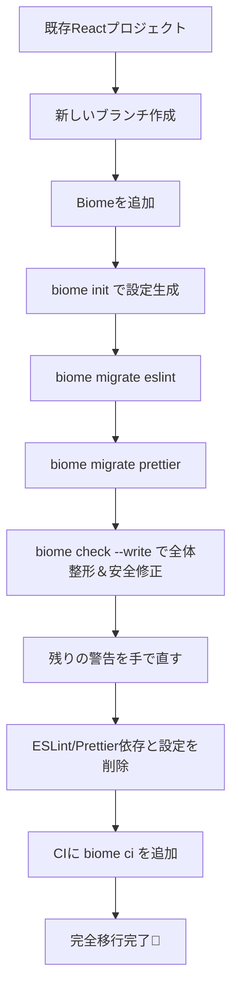

# 第270章：練習：既存プロジェクトを Biome に完全移行する

今日は「ESLint + Prettier（＋周辺ツール）」で動いてる既存Reactプロジェクトを、**Biome 1本**に寄せていく練習だよ〜！🧹💨
ゴールはこれ👇

* ✅ `biome.json` がある
* ✅ フォーマット＆リントが **Biome** で動く
* ✅ VS Code の保存時フォーマットも Biome
* ✅ CI でも `biome ci` が走る
* ✅ ESLint/Prettierの設定ファイルや依存が消える（必要なら段階的でもOK）

---

## 今日の作業の流れ（全体像）🗺️




---

## 1) まずはブランチを切る 🌱🧡

移行はファイルがいっぱい変わるから、必ず分けよ〜！

```bash
git switch -c chore/migrate-to-biome
```

---

## 2) Biome を入れる（devDependencies）📦✨

Biomeはプロジェクトに **dev dependency** として入れるのが基本だよ〜！
公式も `-E`（固定）をおすすめしてる🧷 ([Biome][1])

```bash
npm i -D -E @biomejs/biome
```

---

## 3) biome.json を作る（init）🧾

ゼロ設定でも動くけど、移行するなら設定ファイル作ろう！
`init` で `biome.json` を生成できるよ〜 ([Biome][1])

```bash
npx @biomejs/biome init
```

> ここで `biome.json`（または `biome.jsonc`）がプロジェクト直下にできてたらOK！

---

## 4) ESLint → Biome に移植（migrate eslint）🧳

Biomeには移行コマンドがある！強い！💪✨
ESLint設定を読み込んで、Biome側のルールへできるだけ変換してくれるよ。([Biome][2])

```bash
npx @biomejs/biome migrate eslint --write
```

### よくあるポイント 👀

* これ、**既存の `biome.json` を上書き**することがあるよ（公式にも注意あり）([Biome][2])
* 「ESLintと完全に同じ挙動」にはならないこともある（オプション差など）([Biome][2])
* “inspired” ルールも含めたいなら👇（必要なときだけでOK）

`````bash
npx @biomejs/biome migrate eslint --write --include-inspired
```` :contentReference[oaicite:5]{index=5}

---

## 5) Prettier → Biome に移植（migrate prettier）🎀

BiomeのフォーマッタはPrettierに近いけど、**デフォルト値が違う**（例：タブ/スペース）ことがあるのね。  
だから `migrate prettier` で寄せちゃうのが早い！ :contentReference[oaicite:6]{index=6}

````bash
npx @biomejs/biome migrate prettier --write
`````

---

## 6) いったん全ファイルに Biome を当てる（check --write）🧼🧽

`check` は **format + lint + import整理** をまとめてやってくれる便利コマンド！([Biome][1])

```bash
npx @biomejs/biome check --write .
```

### ここでやること 📝

* ✅ 自動で直るものは一気に直す
* ✅ 残る警告/エラーは **1個ずつ**つぶす（焦らない💕）

---

## 7) package.json の scripts を Biome に寄せる 🔧

ESLint/Prettier を呼んでる scripts を Biome に置き換えよ〜！

例👇（プロジェクトに合わせて名前は好きでOK！）

```json
{
  "scripts": {
    "format": "biome format --write .",
    "lint": "biome lint .",
    "check": "biome check .",
    "check:fix": "biome check --write ."
  }
}
```

> `biome` は `node_modules` に入ってれば npm scripts から普通に呼べるよ☺️

---

## 8) VS Code を「保存したらBiome」にする 🧠💡

Biomeには公式VS Code拡張があるよ！([Biome][3])
さらに保存時フォーマットは `editor.formatOnSave` を `true` にすればOK！([Biome][3])
安全な自動修正（Fix on Save）も設定できるよ〜！([Biome][3])

### VS Code の settings.json（プロジェクト側 .vscode 推奨）⚙️

```json
{
  "editor.formatOnSave": true,
  "editor.codeActionsOnSave": {
    "source.fixAll.biome": "explicit",
    "source.organizeImports.biome": "explicit"
  }
}
```

> Prettier拡張が生きてると取り合いになることがあるから、**Format Document With...** で Biome を選んでおくと安定しやすいよ🫶

---

## 9) `.gitignore` を尊重させる（おすすめ）🙈✨

既存プロジェクトは生成物（dist等）を無視したいよね！
BiomeはGit連携を **明示的にON** にできて、`.gitignore`（＋ `.ignore`）を見てくれるよ〜 ([Biome][4])

`biome.json` にこれを追加（または確認）👇

```json
{
  "vcs": {
    "enabled": true,
    "clientKind": "git",
    "useIgnoreFile": true
  }
}
```

さらに、ビルド成果物は **force-ignore（!!）** で強めに除外もできる（dist/build など）([Biome][5])

```json
{
  "files": {
    "includes": ["**", "!!**/dist", "!!**/build"]
  }
}
```

---

## 10) ESLint/Prettier を削除する 🗑️✨

ここまで動いたら、いよいよお片付け！🧹💕

### 依存をアンインストール

（例：入ってるものに合わせて消してね）

```bash
npm remove eslint prettier
npm remove -D eslint-config-prettier eslint-plugin-react eslint-plugin-react-hooks @typescript-eslint/eslint-plugin @typescript-eslint/parser
```

### 設定ファイルを削除

消してOKになりやすいもの👇

* `.eslintrc.*` / `eslint.config.*`
* `.eslintignore`
* `.prettierrc.*` / `prettier.config.*`

---

## 11) CI に `biome ci` を追加する 🤖✅

CI向けには `biome ci` が用意されてるよ（`check` 相当だけどCI最適化）([Biome][1])

GitHub Actions 例👇

```yaml
name: CI

on:
  pull_request:
  push:
    branches: [main]

jobs:
  biome:
    runs-on: ubuntu-latest
    steps:
      - uses: actions/checkout@v4
      - uses: actions/setup-node@v4
        with:
          node-version: 20
      - run: npm ci
      - run: npx @biomejs/biome ci .
```

---

## よくあるつまずき 🔥（ミニ対処集）

* 🌀 **“思ったより大量に差分が出た”**
  → まずはOK！`migrate prettier` で寄せても差が出ることある。1回 `check --write` 当てたら、あとは落ち着いて「残りだけ」直そ🙂

* 😵 **“VS Code の保存時フォーマットがBiomじゃない気がする”**
  → VS Code拡張が入ってるか確認＆ `editor.formatOnSave: true` を確認！([Biome][3])
  → それでも怪しいときは「Format Document With...」で Biome を明示指定！

* 🙈 **“dist まで見に行って遅い/怒られる”**
  → `files.includes` の `!!**/dist` を入れる（強い除外）([Biome][5])

---

## 練習課題（この章のゴール🎯）✨

1. `npm run check:fix`（Biome一括）を作って、実際に走らせる 🏃‍♀️💨
2. ESLint/Prettier の設定ファイルを削除しても困らない状態にする 🧹
3. CI に `biome ci .` を追加して、PRで落ちないのを確認する ✅💕

---

## まとめ 🎉

* Biomeは **init → migrate（eslint/prettier）→ check --write** の流れが超強い！([Biome][2])
* VS Code は保存時フォーマット＆Fix on Saveで快適になるよ〜🩷([Biome][3])
* CI は `biome ci` で締めると「チームで崩れない」状態になる！([Biome][1])

次の章からは、Biomeで整った世界を前提にして、さらに別の領域に突入できるよ〜！🚀💖

[1]: https://biomejs.dev/guides/getting-started/ "Getting Started | Biome"
[2]: https://biomejs.dev/guides/migrate-eslint-prettier/ "Migrate from ESLint and Prettier | Biome"
[3]: https://biomejs.dev/reference/vscode/ "VS Code extension | Biome"
[4]: https://biomejs.dev/guides/integrate-in-vcs/ "Integrate Biome with your VCS | Biome"
[5]: https://biomejs.dev/reference/configuration/ "Configuration | Biome"
