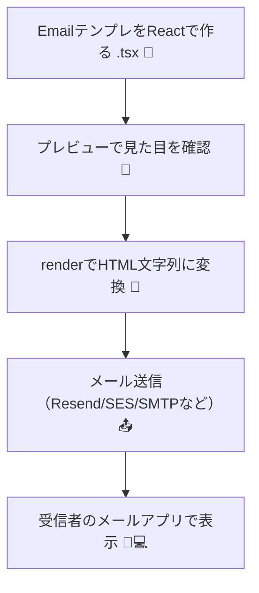

# 第271章：React Email の衝撃

## 1) まず最初に…HTMLメールって、なんであんなに大変なの？🥲📮

HTMLメールって、Webページと違って **制限だらけ** なんだよね💦

* メールアプリ（Gmail / Outlook / iPhoneメールなど）ごとに表示がズレる😵‍💫
* CSSが効かない・効きにくいことがある（特にOutlookが強敵）😇
* レイアウトが**テーブル（`<table>`）中心**になりがちで、辛い…🍽️
* 「プレビュー用の一行（受信箱で見えるやつ）」も地味に重要👀✨

ここで登場するのが **React Email**！💥
「メールをHTMLで手打ちする地獄」から、かなり救ってくれるよ〜🛟

---

## 2) React Emailってなに？🤔💡

**Reactでメールテンプレを作る**ための仕組み＆コンポーネント集だよ🎁
公式の説明も「面倒なテーブル地獄や古いマークアップを避けて、いい感じのメールを作れる」ってスタンス！ ([React Email][1])

特にポイントはここ👇✨

* メール専用のコンポーネントが用意されてる（`Html`, `Container`, `Text`, `Button` など） ([React Email][1])
* Gmail/Outlookなどの差分の痛みを減らす方向で作られてる ([GitHub][2])
* Tailwindも使える（メール向けに「インライン化」してくれる仕組みがある） ([React Email][3])

---


## 3) 「書く」から「組む」へ 🧩✨（この章の主役）

WebのHTMLメールって、ありがちなのがこれ👇

* 1通ごとにHTMLをコピペして修正して…
* ちょっと文言変えたら別バージョンが増殖して…
* ヘッダー/フッターの修正が全メールに波及して崩壊…🫠

React Emailの発想は逆！
**メールは“部品（コンポーネント）”を組み立てるもの**🧱🧱🧱

たとえば…

* `Header`（ロゴ・挨拶）
* `Main`（本文）
* `CTAButton`（購入ボタン）
* `Footer`（会社情報・解除リンク）

を作っておけば、メールごとに「組み合わせ」を変えるだけでOK🥳

---

## 4) ざっくり全体像（図でつかもう）🗺️✨




この「C」のところが超大事で、React Emailは **renderでHTMLにするのが基本ルート** だよ〜って公式も言ってるよ（exportは補助的） ([React Email][4])

---


## 5) “受信箱の一行プレビュー”が超大事👀（地味だけど最強）

メールって、開かれる前に **受信箱で勝負** してるよね📮⚔️

React Emailには、そのための `Preview` コンポーネントがあるよ✨ ([React Email][5])

イメージ👇（こういうのをテンプレの先頭に置く！）

```tsx
import { Html, Head, Preview, Body, Container, Text } from "@react-email/components";

export const WelcomeEmail = () => {
  return (
    <Html>
      <Head />
      <Preview>はじめまして！登録ありがとうございます🎉</Preview>

      <Body>
        <Container>
          <Text>こみやんまさん、ようこそ〜！💌</Text>
          <Text>これから楽しく進めようね😊</Text>
        </Container>
      </Body>
    </Html>
  );
};
```

この `Preview` の文字が、Gmailとかで「件名の下に薄く出る一行」になってくれる感じだよ📩✨ ([React Email][5])

---

## 6) React Emailが“衝撃”な理由トップ3 ⚡🥳

### ① 再利用できる（コピペ地獄が消える）🧩

「ボタン」「フッター」みたいな定番を部品にして、あとは組むだけ。

### ② “メール向けの作法”をコンポーネントに任せられる🙏

メールはクセが強いから、普通のdivレイアウト感覚で行くと破滅しがち😇
React Emailはメール向けの前提で作られたコンポーネントが揃ってるよ ([React Email][1])

### ③ Tailwindもいける（ただしメールの制限は意識！）🎨

Tailwindのラッパーが用意されていて、メール向けにスタイルを扱えるよ（ただしメールクライアント制限はある） ([React Email][3])

---

## 7) よくある誤解（先に潰しとこ）🧨🙂

### ❌ 誤解：「テンプレは export してHTMLファイル作るのが普通でしょ？」

👉 公式は「基本は render（送る瞬間にprops渡してHTML化）」が推し！ exportは補助的だよ〜って注意してるよ ([React Email][4])

---

## 8) ミニ課題（今日のゴール感）🎯✨

まだセットアップ前でもOKな“脳トレ課題”ね🧠💕

### ✅ 課題A：メールを3つの部品に分けてみよう🧩

「ようこそメール」を想像して、部品を分けるならどれ？👇

* `EmailHeader`
* `EmailBody`
* `EmailFooter`

それぞれ「何を入れる？」をメモしてみてね✍️😊
（次章以降で、ほんとに作っていくよ〜！）

---

## 9) まとめ 🎀

* HTMLメールはクセ強で、手書きするとつらい🥲
* React Emailは **メールをReactの部品で“組む”** 発想に変えてくれる💌🧩
* `Preview` みたいな「メール特有の大事ポイント」もコンポーネントで扱える👀✨ ([React Email][5])
* render中心の運用が基本（exportは補助） ([React Email][4])

---

次の第272章では、いよいよ **セットアップ＆開発サーバー** で「作ったメールをプレビューする」とこに入るよ〜！🚀💻✨

[1]: https://react.email/docs/introduction?utm_source=chatgpt.com "Build and send emails using React and TypeScript."
[2]: https://github.com/resend/react-email?utm_source=chatgpt.com "resend/react-email: 💌 Build and send emails using React"
[3]: https://react.email/docs/components/tailwind?utm_source=chatgpt.com "Tailwind"
[4]: https://react.email/docs/cli?utm_source=chatgpt.com "CLI"
[5]: https://react.email/docs/components/preview?utm_source=chatgpt.com "Preview"
