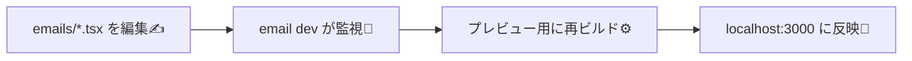

[](https://blog.logrocket.com/streamline-email-creation-react-email/?utm_source=chatgpt.com)

# 第272章：セットアップと開発サーバー

この章は「React Email を動かして、プレビュー画面（開発サーバー）でメールを見ながら編集できる状態」を作ります😊
メールって一回送って確認…だと地獄なので、まずは**ブラウザでプレビューできる環境**を最速で作っちゃおうね💨

---

## ゴール 🎯✨

* React Email のプロジェクト（または既存プロジェクト内）に環境を用意する🧰
* `localhost:3000` にプレビュー画面を出す🌈
* `emails` の中の `.tsx` を編集すると、すぐ反映される状態にする⚡

---

## まずは最短ルート（おすすめ）🚀：`create-email` で一発セットアップ


公式が推してる一番カンタンな方法だよ😊（まずはここでOK！） ([React Email][1])

### 1) 新規フォルダで実行（VS Code のターミナルでもOK）🖥️✨

```bash
npx create-email@latest
```

これで `react-email-starter` ってフォルダが作られるよ〜！ ([React Email][1])

### 2) フォルダに移動して依存関係を入れる📦

```bash
cd react-email-starter
npm install
```

### 3) 開発サーバー起動🌟

```bash
npm run dev
```

起動したらブラウザでここにアクセス👇

* `http://localhost:3000`

`emails` フォルダの中のファイルを編集して保存すると、すぐ反映されるよ⚡ ([React Email][1])

---

## 既存プロジェクトに「メール機能だけ」足す方法（手動セットアップ）🔧💡

「アプリ本体は別にあるけど、メールテンプレだけ入れたい！」って時はこちら。 ([React Email][2])

### 1) 依存関係をインストール📦

```bash
npm install react-email @react-email/preview-server -D -E
npm install @react-email/components react react-dom -E
```

（プレビューサーバーが開発体験の核だよ〜🧠✨） ([React Email][2])

### 2) `package.json` にスクリプト追加📝

```json
{
  "scripts": {
    "email:dev": "email dev"
  }
}
```

（この `email dev` がプレビューサーバー起動コマンド！） ([React Email][3])

### 3) `emails` フォルダを作って、テンプレを1つ置く💌

例：`emails/email.tsx`

```tsx
import * as React from "react";
import { Html, Head, Body, Container, Text, Button } from "@react-email/components";

export default function SampleEmail() {
  return (
    <Html>
      <Head />
      <Body style={{ fontFamily: "Arial, sans-serif" }}>
        <Container style={{ padding: "24px" }}>
          <Text style={{ fontSize: "18px" }}>やっほー！React Email のテストだよ😊💌</Text>
          <Button href="https://example.com" style={{ padding: "12px 16px" }}>
            ボタン押してみてね✨
          </Button>
        </Container>
      </Body>
    </Html>
  );
}
```

### 4) 開発サーバー起動🌈

```bash
npm run email:dev
```

ブラウザで `http://localhost:3000` を開くとプレビューできるよ！ ([React Email][2])

---

## 「開発サーバー」って何してるの？👀🔁（超ざっくり図解）



この “編集→即反映” があるから、メール制作が気持ちよく進むよ〜🥳✨

---

## よく使う設定：ポートとフォルダを変える⚙️🧩

`email dev` はデフォルトで👇

* テンプレフォルダ：`emails`
* ポート：`3000` ([React Email][3])

たとえば、`src/emails` に置きたい＆ポートを 3001 にしたいなら：

```bash
email dev --dir src/emails --port 3001
```

（`--dir` と `--port` が用意されてるよ） ([React Email][3])

---

## つまずきポイント（Windowsあるある）🪟💦

### 1) `3000` が既に使われてる（起動できない）🚧

別アプリが使ってるだけのことが多いよ〜😵
➡️ **ポート変更**しよ！

```bash
email dev --port 3001
```

### 2) 「テンプレが表示されない」😢

だいたいこれ👇

* `emails` フォルダの場所が違う
* `.tsx` の export が default じゃない
  ➡️ まずは **デフォルト構成（emails直下）** に戻すのが早いよ😊

---

## ミニ課題（5分）🧪✨

1. `emails/hello.tsx` を新しく作る💌
2. 中身は `email.tsx` をコピーして、テキストだけ変える✍️
3. ブラウザの左メニュー（一覧）に増えたら成功🎉（増え方は環境により少し違うけど、テンプレが選べるようになるよ）

---

次の章（第273章）では、React Email の専用コンポーネント（`Html`, `Text`, `Button` など）を「メールっぽく崩れない書き方」で整理していくよ〜💪💌✨

[1]: https://react.email/docs/getting-started/automatic-setup?utm_source=chatgpt.com "Automatic Setup"
[2]: https://react.email/docs/getting-started/manual-setup?utm_source=chatgpt.com "Manual Setup"
[3]: https://react.email/docs/cli?utm_source=chatgpt.com "CLI"
