# 第273章：専用コンポーネント (`Html`, `Button`, `Text`)

今日は **React Emailの基本3人組**を仲良く使えるようになる回だよ〜！🥰
この3つだけで「ちゃんとメールっぽいHTML」を作れるようになる👌

* `Html`：メール全体の“外枠”🏠
* `Text`：文章の“段落”📝
* `Button`：メールの“押せるボタン（＝実はリンク）”🔗

React Emailは「メールの古いHTML地獄（テーブル地獄）をなるべく避けて作る」ための標準コンポーネント集だよ〜📦✨ ([React Email][1])

---

## まずは全体像をイメージしよ〜🧠✨（図解）

```mermaid
flowchart LR
  A[Emailテンプレ .tsx] --> B[email dev でプレビュー]
  B --> C[HTML文字列に変換]
  C --> D[メールクライアントで表示<br/>Gmail / Outlook など]
```




---

## 1) `Html`：メールの“いちばん外側”🏠✨


`Html`は「メール全体を包む」コンポーネントだよ〜！
ここで **言語（lang）** と **文章方向（dir）** を決められるよ👍

* `lang`：デフォルト `"en"`（日本語なら `"ja"` がオススメ）
* `dir`：デフォルト `"ltr"`（左→右） ([React Email][2])

**ミニ例：**

```tsx
import { Html, Text } from "@react-email/components";

export default function MiniEmail() {
  return (
    <Html lang="ja" dir="ltr">
      <Text>こんにちは〜！これはミニメールだよ☺️</Text>
    </Html>
  );
}
```

---

## 2) `Text`：段落を作る📝✨


`Text`は「**空白（余白）で区切られた文章ブロック**」＝段落を作る担当だよ👍 ([React Email][3])
メールって、改行や余白がクライアントごとに崩れやすいから、`Text`で段落を作るのが安全〜🙆‍♀️

**例：段落を2つにする**

```tsx
import { Html, Text } from "@react-email/components";

export default function ParagraphEmail() {
  return (
    <Html lang="ja">
      <Text>やっほー！サークルの新歓の案内だよ📣</Text>
      <Text>気になったら、下のボタンから詳細を見てね〜😊</Text>
    </Html>
  );
}
```

---

## 3) `Button`：ボタンっぽい見た目の“リンク”🔗✨


ここ超だいじ！！
メール世界の「ボタン」は、だいたい **リンク（`<a>`）** のことだよ〜！😳
React Emailの`Button`も、裏側は **`<a>` をボタンっぽくスタイルしたもの**なんだって！ ([React Email][4])

* `href`：必須（押したときの移動先） ([React Email][4])
* `target`：デフォルト `"_blank"`（新しいタブ） ([React Email][4])

**例：**

```tsx
import { Html, Button } from "@react-email/components";

export default function ButtonEmail() {
  return (
    <Html lang="ja">
      <Button href="https://example.com" style={{ padding: "12px 18px" }}>
        詳細を見る✨
      </Button>
    </Html>
  );
}
```

💡注意：メールはJavaScriptが動かないことが多いから、`onClick`みたいなのは基本ナシだよ🙅‍♀️
「押したら移動」は `href` でやるのが正解〜✅

---

## ハンズオン：3つだけで“ウェルカムメール”を作るよ🎀📩

### ① `emails/WelcomeEmail.tsx` を作成しよ〜🛠️

（React Emailのデフォルトは `emails` ディレクトリ想定だよ〜）

```tsx
import { Html, Text, Button } from "@react-email/components";

type WelcomeEmailProps = {
  userName?: string;
  joinUrl?: string;
};

export default function WelcomeEmail({
  userName = "さくら",
  joinUrl = "https://example.com/join",
}: WelcomeEmailProps) {
  return (
    <Html lang="ja" dir="ltr">
      <Text>こんにちは {userName}さん🌸</Text>

      <Text>
        サークルに興味持ってくれてありがとう〜！✨
        まずは雰囲気を見に来てね☺️
      </Text>

      <Button
        href={joinUrl}
        target="_blank"
        style={{
          display: "inline-block",
          padding: "12px 18px",
          borderRadius: "10px",
          textDecoration: "none",
          fontWeight: "bold",
        }}
      >
        参加する💌
      </Button>

      <Text style={{ fontSize: "12px", opacity: 0.7 }}>
        ※このメールに心当たりがない場合は破棄してね🙏
      </Text>
    </Html>
  );
}
```

### ② プレビュー起動（Windows）🖥️✨


React EmailのCLIは `email dev` で、テンプレを監視しつつプレビューしてくれるよ〜！ ([React Email][5])
（プロジェクトの設定によっては `npx` 経由がラク👇）

```bash
npx react-email dev
```

* デフォルト：テンプレ置き場 `emails`
* デフォルト：ポート `3000`（`http://localhost:3000`） ([React Email][5])

ブラウザで開いて、`WelcomeEmail` を選べたら成功〜！🎉

---

## ありがちミス集（ここで詰まりがち！）😵‍💫🧯

* ❌ `Button` に `href` を書き忘れ → 必須だよ！ ([React Email][4])
* ❌ メールで `onClick` を期待する → だいたい動かない！リンクでやる🔗
* ❌ `Html` なしで始める → 外枠がないとメールっぽさが崩れやすい🏠 ([React Email][2])
* ✅ 文章は `Text` を増やして段落にする → いちばん安定📝 ([React Email][3])

---

## ミニ課題（5分）⌛💖

1. `Text` をもう1個増やして「場所・日時」を入れてみよ〜📅
2. `Button` の文言を「今すぐ申し込む🚀」に変えてみよ〜
3. `Html lang="ja"` が入ってるかチェック✅ ([React Email][2])

---

次の章（第274章）は **Tailwindでスタイリング🎨** だから、今日の`Button`や`Text`が一気に“それっぽく”なるよ〜！😍

[1]: https://react.email/docs/introduction "React Email - React Email"
[2]: https://react.email/docs/components/html "HTML - React Email"
[3]: https://react.email/docs/components/text "Text - React Email"
[4]: https://react.email/docs/components/button "Button - React Email"
[5]: https://react.email/docs/cli?utm_source=chatgpt.com "CLI"
