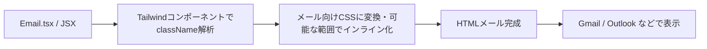

# 第274章：Tailwind CSS によるスタイリング

この章は「React Email を Tailwind で可愛く整える回」だよ〜！💌💖
HTMLメールってCSSが効かなかったりするんだけど、React Email の Tailwind サポートを使うとかなり楽になるよ🥳✨ ([React Email][1])

---

## この章でできるようになること✅✨

* Tailwind の `className` だけでメールをスタイリングできる🎨✨
* “メールで危ないCSS” を避けつつ、見た目を整えるコツがわかる🧠💡
* `pixelBasedPreset` を使って「rem問題」を回避できる🛡️✨ ([React Email][1])

---

## まず大事：メールのCSSは“クセつよ”😵‍💫📩

Webページと違って、メールはクライアント（Gmail/Outlookなど）がCSSを制限することが多いよ〜💦
React Email の Tailwind は、**className を（できる限り）メール向けの形に変換**してくれるのが強み🦾✨
しかも最近の React Email は **Tailwind 4 対応**で、CSSの互換性チェックもしてくれる方向だよ✅ ([Resend][2])

---

## 図解：Tailwind がメールになるまで🌈📬




---

## セットアップ（入ってなければ）🧰✨

React Email 5系（Tailwind 4対応）に合わせるなら、だいたいこの更新が安心💖
（すでに入ってたら読み飛ばしてOK！） ([Resend][2])

```bash
npm i react-email@latest @react-email/components@latest
```

Tailwind コンポーネントは **@react-email/components** から使えるよ✨ ([React Email][1])

---

## 実践：Tailwind で「ようこそメール」を可愛くする💌🌸

### 1) `emails/WelcomeEmail.tsx` を作る✍️✨

```tsx
import {
  Html,
  Head,
  Preview,
  Body,
  Container,
  Section,
  Text,
  Button,
  Hr,
  Tailwind,
  pixelBasedPreset,
} from "@react-email/components";

type WelcomeEmailProps = {
  name: string;
  dashboardUrl: string;
};

export default function WelcomeEmail({ name, dashboardUrl }: WelcomeEmailProps) {
  return (
    <Html>
      <Head />
      {/* メール一覧でチラ見えするプレビュー文（けっこう大事！） */}
      <Preview>{name}さん、登録ありがとう！ダッシュボードはこちら🌸</Preview>

      <Tailwind
        config={{
          // rem が効かないクライアント対策（pxベースに寄せる）
          presets: [pixelBasedPreset],
          theme: {
            extend: {
              colors: {
                brand: "#7C3AED", // むらさき💜
                ink: "#111827", // 文字色（濃いめ）
              },
            },
          },
        }}
      >
        <Body className="bg-slate-50 font-sans">
          <Container className="mx-auto my-10 w-[600px] max-w-full px-4">
            <Section className="rounded-2xl bg-white p-8 shadow-sm">
              <Text className="text-brand text-sm font-semibold">
                Welcome ✨
              </Text>

              <Text className="mt-2 text-2xl font-bold text-ink">
                {name}さん、ようこそ！🎉💖
              </Text>

              <Text className="mt-4 text-base leading-6 text-slate-700">
                登録が完了したよ〜！さっそくダッシュボードで設定を進めよう🧡
              </Text>

              <Section className="mt-6">
                <Button
                  href={dashboardUrl}
                  className="inline-block rounded-xl bg-brand px-5 py-3 text-center text-base font-semibold text-white"
                >
                  ダッシュボードへ行く🚀
                </Button>
              </Section>

              <Hr className="my-6 border border-slate-200" />

              <Text className="text-sm leading-5 text-slate-500">
                もしボタンが押せなかったら、こっちをコピーしてね👇
              </Text>
              <Text className="break-all text-sm text-slate-600">
                {dashboardUrl}
              </Text>
            </Section>

            <Text className="mt-4 text-center text-xs text-slate-400">
              © 2025 Your App 🌙
            </Text>
          </Container>
        </Body>
      </Tailwind>
    </Html>
  );
}

// プレビュー用のダミーデータ（開発サーバーで便利！）
WelcomeEmail.PreviewProps = {
  name: "さくら",
  dashboardUrl: "https://example.com/dashboard",
} satisfies WelcomeEmailProps;
```

### 2) プレビューで確認👀✨

React Email のプレビューサーバーは `email dev` で起動できるよ（デフォルトは `emails` フォルダを見るよ）🚀
ポートも既定で `3000`！ ([React Email][3])

```bash
email dev
```

---

## Tailwindの“メール向け”コツ集💡📩（超大事）

### ✅ まずはこのへんが安定しやすい

* `bg-*`（背景色）🎨
* `text-*`（文字サイズ/色）📝
* `px-* py-*`（余白）📦
* `rounded-*`（角丸）🍡
* `border` / `border-slate-200`（枠線）🧊

### 🛡️ `pixelBasedPreset` は基本ON推奨

Tailwind が `rem` を使う関係で、メールクライアントによっては表示が崩れることがあるよ〜💦
それを避けるための仕組みが `pixelBasedPreset`！ ([React Email][1])

---

## ハマりポイント（先に潰す）💣😇

React Email の Tailwind には、いくつか「今は無理なやつ」があるよ👇

* **Tailwind の内側に Context Provider を置くと `useContext` がうまく動かない**
  → Provider は **Tailwind より外側**に置くのが回避策！ ([React Email][1])
* `prose`（@tailwindcss/typography）みたいな **複雑なセレクタ系は未対応** ([React Email][1])
* `space-*` みたいな一部ユーティリティも効かないことがある
  → 代わりに `mt-*` / `mb-*` / `py-*` を素直に使うのが安定✨ ([React Email][1])
* `hover:` はメールだとそもそも対応が弱め（気にしなくてOK寄り）🫠 ([React Email][1])

---

## ミニ課題🎒✨（5〜10分）

1. ボタン色を **ピンク**にしてみて💗（`brand` を `#EC4899` とか）
2. `Text` を1個追加して「ログインしたら最初にやること3つ」を箇条書き風にしてみて📝✨
3. 角丸を `rounded-2xl` → `rounded-3xl` にして “ふわふわ感” を強めてみて🍰

---

## まとめ🎀

* React Email の `Tailwind` で、`className` スタイリングがかなり楽になるよ💖 ([React Email][1])
* `pixelBasedPreset` は “表示崩れ対策のお守り” って覚えとこ🛡️✨ ([React Email][1])
* クセのあるユーティリティ（`prose` / `space-*` など）は避けて、シンプルなクラスで組むと安定🍀 ([React Email][1])

次の第275章（画像とアセット）で、ロゴ画像を入れてさらに“それっぽいメール”に進化させよ〜！🖼️📩✨

[1]: https://react.email/docs/components/tailwind "Tailwind - React Email"
[2]: https://resend.com/blog/react-email-5 "React Email 5.0 · Resend"
[3]: https://react.email/docs/cli "CLI - React Email"
