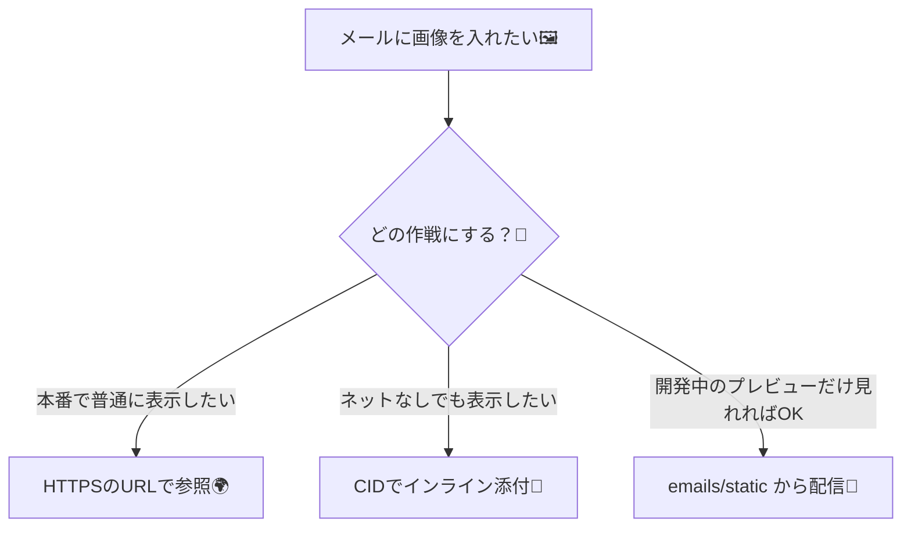
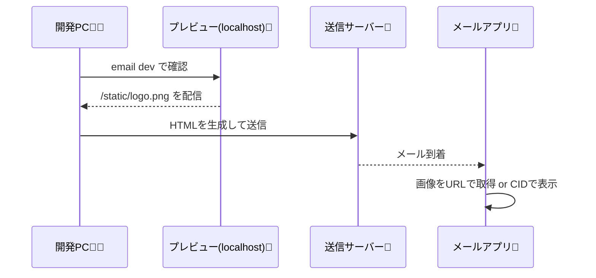

# 第275章：画像とアセットの扱い

この章は「React Emailで画像をちゃんと表示できるようになる」がゴールだよ〜！💪💛
メールの画像って、Webページの画像よりクセ強めなので…コツを押さえていこっ 😆

---

## まず知っておく大事な前提 🧠💡


### ✅ メールの画像はだいたい3パターン



### ✅ 画像形式のおすすめ

`.png / .gif / .jpg` は多くのメールクライアントでOK、`.svg` は非推奨だよ〜（対応が弱い）😢 ([React Email][1])

---

## 1) 開発中：プレビューでローカル画像を表示する 👀🧪


React Emailのプレビューサーバーは、**`emails/static`** を「静的ファイル置き場」として扱えるよ！ ([React Email][2])
（`--dir` を変えてる場合は、そのディレクトリの中に `static` だよ）

### 📁 フォルダ構成（例）

```text
my-react-email/
  emails/
    Welcome.tsx
    static/
      logo.png
      hero.jpg
```

### ▶ プレビューサーバー起動（どっちかでOK）

* だいたいはこれ（スターターに入ってること多い）👇
  `npm run dev`
* もし scripts が無ければ👇
  `npx react-email dev` ([React Email][2])

### 🧩 画像を貼る（`Img` コンポーネント）

```tsx
import { Html, Body, Container, Img, Text } from "@react-email/components";

export default function Welcome() {
  return (
    <Html>
      <Body style={{ backgroundColor: "#f6f6f6", padding: "24px" }}>
        <Container style={{ backgroundColor: "#fff", padding: "24px" }}>
          
          <Text style={{ marginTop: "16px" }}>ようこそ〜！🎉</Text>
        </Container>
      </Body>
    </Html>
  );
}
```

> ポイント：**`/static/...` は「プレビューサーバーのルートからのパス」**だよ〜！ ([React Email][2])

---

## 2) 本番：受信者の環境でも画像が見えるようにする 🌍📩


ここ超重要！⚠️
**メール本文のHTMLに `src="/static/logo.png"` みたいな“相対パス”が入ってると、本番ではまず表示されない**です😵
なので本番は基本…

✅ **`https://...` の画像URL**（CDNや自社サイトに置いたやつ）を使う！

### ✨ よくある「baseUrl 作戦」

```tsx
import { Img } from "@react-email/components";

const baseUrl =
  process.env.ASSET_BASE_URL ?? "https://assets.example.com"; // 自分の環境に合わせてね！

export default function Welcome() {
  return (
    
  );
}
```

💡 開発中は `ASSET_BASE_URL` を空にして `/static/...` を使い、
本番は `https://...` にする、みたいに切り替えると楽だよ〜☺️

---

## 3) どうしても外部アクセスさせたくない：インライン画像（CID）📎🖼️


「受信者が画像読み込みOFFでも表示してほしい！」みたいな時は、**画像を添付として埋め込む（CID）**って手があるよ！

ただし注意点もある👇

* Base64化が必要になるケースがある
* メールサイズが増える
* クライアントによっては弾かれることがある（特にWebメール） ([Resend][3])

### 🧠 イメージ（本文は cid:〜 で参照）

* HTML側：``
* 送信側：添付に `contentId: "logo-image"` を付ける ([Resend][3])

（送信の実装は次の章以降でガッツリやるけど、仕組みだけここで押さえればOK！😆）

---

## メール画像の「事故あるある」集 🚑😂

* ❌ `.svg` を使って一部のクライアントで消える（つらい） ([React Email][1])
* ❌ `width/height` を入れずに、表示がガタガタ（レイアウト崩壊）
* ❌ 画像がデカすぎて読み込みが遅い（そして非表示にされがち）
* ❌ 背景画像に頼る（クライアント差が激しい）
* ✅ `alt` はちゃんと書く（画像OFFでも意味が伝わる） ([React Email][1])

---

## まとめチェックリスト ✅📝

* [ ] 開発中は `emails/static` に置いて `/static/...` で見れる 👀 ([React Email][2])
* [ ] 本番は **必ず `https://...` の絶対URL**にする 🌍
* [ ] 画像は `.png/.jpg/.gif` が安定、`.svg` は避ける 🙅‍♀️ ([React Email][1])
* [ ] `alt` と `width/height` は基本セット ✨

---

## おまけ：データの流れ（なんとなく掴む用）🧠🧵



---

次の第276章は「レスポンシブ＆ダークモード」だよ〜！📱🌙✨
その前に、もしよければこの章のミニ課題👇
**✅ ロゴ（小）＋ヒーロー画像（大）＋SNSアイコン（小）を `emails/static` に置いて3つ表示**してみてね 😆🖼️🖼️🖼️

[1]: https://react.email/docs/components/image "Image - React Email"
[2]: https://react.email/docs/cli "CLI - React Email"
[3]: https://resend.com/docs/dashboard/emails/embed-inline-images "Embed Inline Images - Resend"
