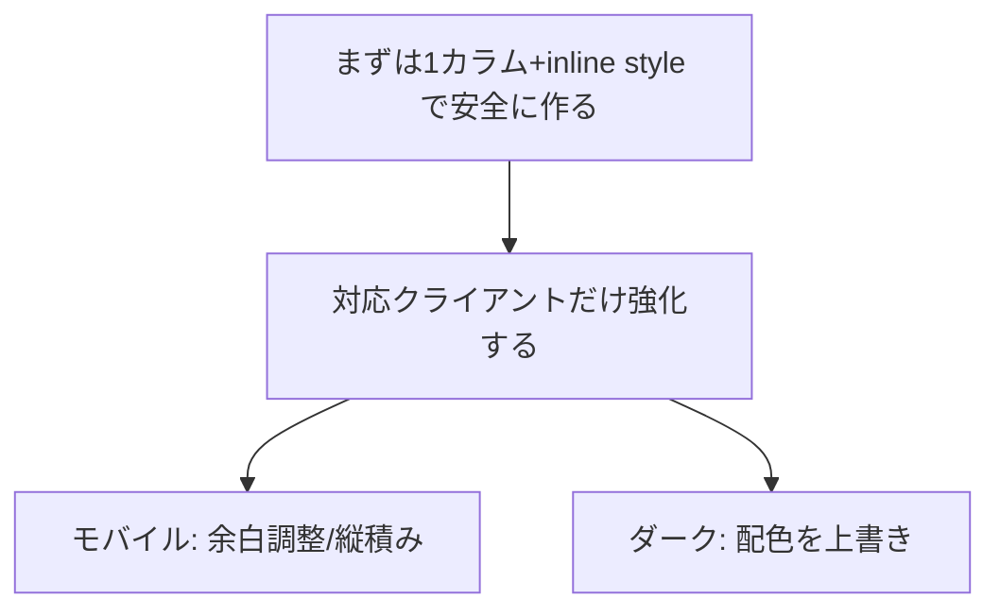
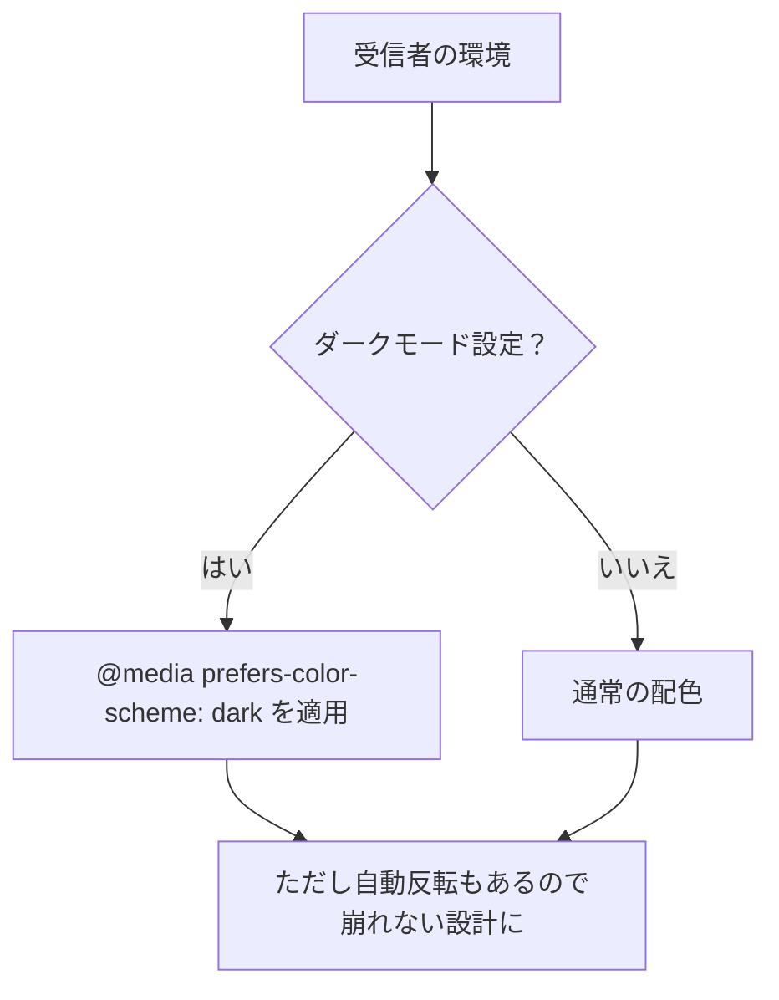

# 第276章：レスポンシブ対応とダークモード

今日のゴールはこれだよ〜！✨

* スマホでも読みやすい「レスポンシブメール」を作れるようになる 📱💨
* ダークモードでも「文字が読める・ボタンが見える」を守れる 🌙🖤
* “崩れないベース” + “対応クライアントだけ強化” の考え方がわかる ✅

（GmailはCSSクラスや通常のメディアクエリをサポートしてるので、やれることは意外と多いよ！） ([Google for Developers][1])
（React Emailの`<Head>`は`meta`や`style`みたいな“head系”を入れる場所だよ） ([React Email][2])

---

## まず大前提：メールは「制限つきブラウザ」🙃


メールって、WebページよりCSSが効かなかったり、勝手に色を変えられたりするのが普通なの…！🥲
だからコツはこれ👇

* **まずは“全員に効く” inline style で崩れない形を作る** 💪
* そのうえで、**対応してるクライアントだけ** `@media` でちょい強化する ✨



---

## レスポンシブの基本ルール 📱✨


メールで一番安定しやすい定番はこれ👇

* コンテンツ幅は **最大600px**（PCで読みやすい王道）
* でもスマホでは **width: 100%** で縮むようにする
* 2カラムはPCで横並び、スマホでは縦に積む（stack）🧱

ポイント：**メディアクエリは“あると嬉しい強化”**にして、無くても読める構成にするのが勝ち🏆

---

## ダークモードの基本ルール 🌙🖤


ダークモードはクライアントごとに挙動がバラバラで、**自動反転**されたりもするよ😵‍💫
なので「自分で上書きできるところは上書き」しつつ、「勝手に変えられても破綻しない」も意識するのがコツ！

* まず `<head>` に **ダークモード対応のmeta** を入れる（Apple系で重要） ([Litmus][3])
* そして `@media (prefers-color-scheme: dark)` で色を上書きする 🌙 ([Litmus][3])



---

## ハンズオン：レスポンシブ + ダークモード対応メールを1本作る 🛠️💌

ここでは `emails/PromoEmail.tsx` を作る想定でいくね！✨
（React Emailのローカル起動は公式だと `npm run email:dev` → `localhost:3000` が定番だよ）

### 1) ファイル作成：`emails/PromoEmail.tsx` ✅

* **inline style**で“崩れないベース”
* `<Head>`の中に

  * `meta`（ダークモード宣言）
  * `<style>`（レスポンシブ & ダーク用の上書き）
    を入れるよ！

```tsx
import * as React from "react";
import {
  Html,
  Head,
  Preview,
  Body,
  Container,
  Section,
  Row,
  Column,
  Text,
  Button,
  Img,
  Hr,
} from "@react-email/components";

export const PromoEmail = () => {
  return (
    <Html lang="ja">
      <Head>
        {/* ダークモード対応を“宣言”（特にApple系で重要） */}
        <meta name="color-scheme" content="light dark" />
        <meta name="supported-color-schemes" content="light dark" />

        {/* “強化パーツ”はstyleに寄せる（無くても読めるのが理想） */}
        <style>{`
          @media screen and (max-width: 600px) {
            .container { width: 100% !important; }
            .px { padding-left: 12px !important; padding-right: 12px !important; }

            /* 2カラムを縦積みに */
            .stack { display: block !important; width: 100% !important; }
            .stack-pad { padding-right: 0 !important; padding-left: 0 !important; }

            /* 画像をスマホ幅にフィット */
            .hero { width: 100% !important; height: auto !important; }
            .center { text-align: center !important; }
          }

          @media (prefers-color-scheme: dark) {
            body, .bg { background: #0b1220 !important; }
            .card { background: #0f172a !important; border-color: #243046 !important; }

            .text { color: #e5e7eb !important; }
            .muted { color: #cbd5e1 !important; }

            .btn { background: #60a5fa !important; color: #0b1220 !important; }
            a { color: #93c5fd !important; }
          }
        `}</style>
      </Head>

      <Preview>冬のセールがはじまったよ！最大50%OFF ✨</Preview>

      <Body style={styles.body} className="bg">
        <Container style={styles.container} className="container px">
          <Section style={styles.card} className="card">
            <Text style={styles.h1} className="text center">
              🎁 Winter Sale ❄️
            </Text>

            <Text style={styles.p} className="muted center">
              12/28〜1/5限定！お気に入りをおトクにゲットしよ〜🛍️✨
            </Text>

            <Hr style={styles.hr} />

            <Row>
              <Column style={styles.colLeft} className="stack stack-pad">
                
              </Column>

              <Column style={styles.colRight} className="stack">
                <Text style={styles.p} className="text">
                  ✅ 人気アイテムが最大 <b>50%OFF</b><br />
                  ✅ 送料は <b>3,000円</b> 以上で無料🚚<br />
                  ✅ 迷ったら「おすすめセット」がおすすめ😉
                </Text>

                <Button href="https://example.com" style={styles.button} className="btn">
                  今すぐセールを見る 👉
                </Button>

                <Text style={styles.small} className="muted">
                  ※ ボタンが押せないときは、これを開いてね：<br />
                  <a href="https://example.com">https://example.com</a>
                </Text>
              </Column>
            </Row>
          </Section>

          <Text style={styles.footer} className="muted center">
            💡 メールはアプリごとに表示が違うよ！崩れたらまず
            「余白」「画像幅」「2カラムの縦積み」を調整すると直りやすい✨
          </Text>
        </Container>
      </Body>
    </Html>
  );
};

const styles: Record<string, React.CSSProperties> = {
  body: {
    backgroundColor: "#f5f7fb",
    margin: 0,
    padding: "24px 0",
    fontFamily:
      'ui-sans-serif, system-ui, -apple-system, "Segoe UI", Roboto, "Helvetica Neue", Arial',
  },
  container: {
    width: "600px",
    maxWidth: "600px",
    margin: "0 auto",
  },
  card: {
    backgroundColor: "#ffffff",
    border: "1px solid #e5e7eb",
    borderRadius: 12,
    padding: 20,
  },
  h1: {
    fontSize: 24,
    fontWeight: 700,
    margin: "0 0 8px",
    color: "#111827",
  },
  p: {
    fontSize: 14,
    lineHeight: "22px",
    margin: "0 0 12px",
    color: "#111827",
  },
  hr: {
    borderColor: "#e5e7eb",
    margin: "16px 0",
  },
  colLeft: {
    width: "55%",
    paddingRight: 12,
    verticalAlign: "top",
  },
  colRight: {
    width: "45%",
    paddingLeft: 12,
    verticalAlign: "top",
  },
  hero: {
    width: "100%",
    maxWidth: "100%",
    height: "auto",
    borderRadius: 10,
    display: "block",
  },
  button: {
    backgroundColor: "#2563eb",
    color: "#ffffff",
    padding: "12px 16px",
    borderRadius: 10,
    textDecoration: "none",
    display: "inline-block",
    fontSize: 14,
    fontWeight: 700,
  },
  small: {
    fontSize: 12,
    lineHeight: "18px",
    margin: "12px 0 0",
    color: "#6b7280",
  },
  footer: {
    fontSize: 12,
    lineHeight: "18px",
    margin: "14px 0 0",
    color: "#6b7280",
  },
};

export default PromoEmail;
```

### 2) 起動してプレビュー 👀💨


```bash
npm run email:dev
```

ブラウザで `localhost:3000` を開いて確認するよ〜

---

## 動作チェックのコツ 🔎📬（超大事！）

* 🧪 **スマホ幅で確認**：プレビュー画面の横幅を縮めて、2カラムが縦に積まれるか見る
* 🌙 **ダークモード確認**：OS/メールアプリをダークにして、文字が読めるか見る
* 🖼️ **画像は必ずURLで**：メールはローカル画像だと表示されないことが多いよ（CDN/公開URL推奨）

---

## よくあるハマり 😵‍💫💥

* 「`<style>`を書いたのに効かない！」
  → メールはクライアント次第で消されることもあるから、**重要な見た目はinline styleで守る**のが基本✨
* 「ダークでロゴが見えない！」
  → 透明PNGに“ふち取り”を入れるとか、暗背景でも見える工夫が効くよ（自動反転もある） ([Litmus][3])
* 「Gmailでレスポンシブ効かない？」
  → Gmailはメディアクエリ自体はサポートしてるけど、環境や差が出ることもあるので“壊れないベース”が最強💪 ([Google for Developers][1])

---

## ミニ宿題 🎒✨

1. ボタンの下に「第二ボタン（詳しく見る）」を追加して、スマホでも押しやすい余白にしてみよう 👉👉
2. ダークモードでカード背景と文字のコントラストを「もう1段階」見やすく調整してみよう 🌙🔧

次の章（第277章）で、これを `render` して **HTML文字列に変換**していくよ〜！📨✨

[1]: https://developers.google.com/workspace/gmail/design/css "CSS Support  |  Gmail  |  Google for Developers"
[2]: https://react.email/docs/components/head?utm_source=chatgpt.com "Head"
[3]: https://www.litmus.com/blog/the-ultimate-guide-to-dark-mode-for-email-marketers "Dark Mode Email: Your Ultimate How-to Guide - Litmus"
