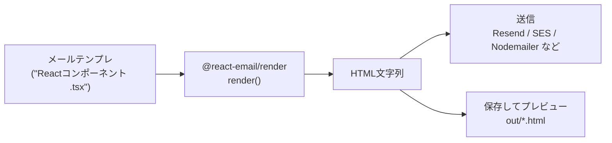

# 第277章：`render` 関数で HTML 文字列に変換

この章では、React Email のテンプレ（Reactコンポーネント）を **「メール本文に送れるHTML文字列」**に変換します😊
ここができると、次の章（Resend APIで送信🚀）にそのまま繋がります！

React Email では `@react-email/render` の `render()` を使って **HTML文字列**を作れます。([React Email][1])
さらに、見やすいHTMLに整形する `pretty()` も使えます。([React Email][1])

---

### まず全体像をつかもう🧠💡（図解）




---

## 1) 必要なパッケージを入れる📦✨

プロジェクトのルートで👇（もう入ってたらスキップOK！）

```bash
npm install @react-email/render -E
```

公式ドキュメントでも、このパッケージを入れて `render()` を使う流れになってます。([React Email][1])

そして今回、**TypeScriptをラクに実行する**ために `tsx` も入れます（超便利😆）

```bash
npm install -D tsx
```

---

## 2) メールテンプレを1つ作る🧩💌

例として `emails/MyTemplate.tsx` を作ります。

```tsx
// emails/MyTemplate.tsx
import * as React from "react";
import { Html, Button, Hr, Text } from "@react-email/components";

type Props = {
  userName: string;
  verifyUrl: string;
};

export function MyTemplate({ userName, verifyUrl }: Props) {
  return (
    <Html lang="ja">
      <Text>やっほー {userName} さん😊</Text>
      <Text>下のボタンからメールアドレスを確認してね👇</Text>

      <Hr />

      <Button href={verifyUrl}>メールアドレスを確認する</Button>

      <Hr />

      <Text style={{ color: "#666" }}>
        ※心当たりがなければ、このメールは無視してOKだよ🙏
      </Text>
    </Html>
  );
}

export default MyTemplate;
```

---

## 3) `render()` で HTML文字列を作って、ファイルに保存する🖨️📄


`scripts/render-email.ts` を作ります。

```ts
// scripts/render-email.ts
import * as React from "react";
import { render, pretty, toPlainText } from "@react-email/render";
import { writeFile, mkdir } from "node:fs/promises";
import MyTemplate from "../emails/MyTemplate";

async function main() {
  // ✅ ここが今回の主役！ render() でHTML文字列を作る
  const html = await render(
    <MyTemplate
      userName="あおい"
      verifyUrl="https://example.com/verify?token=abc123"
    />
  );

  // ✅ 見やすく整形（任意）
  const prettyHtml = await pretty(html);

  // ✅ おまけ：プレーンテキストも作れる（メールは両方あると強い💪）
  const text = toPlainText(html);

  await mkdir("out", { recursive: true });
  await writeFile("out/email.html", prettyHtml, "utf8");
  await writeFile("out/email.txt", text, "utf8");

  console.log("✅ out/email.html と out/email.txt を出力したよ🎉");
}

main().catch((err) => {
  console.error("❌ 失敗:", err);
  process.exit(1);
});
```

* `render()` は **Reactコンポーネント → HTML文字列** に変換します。([React Email][1])
* `pretty()` はHTMLを整形して読みやすくします。([React Email][1])
* プレーンテキストは `toPlainText()` を使うのが推奨で、昔の `plainText` オプションは非推奨扱いです。([React Email][1])

---

## 4) 実行してプレビューしよう👀✨


```bash
npx tsx scripts/render-email.ts
```

成功したら👇ができます！

* `out/email.html`（HTMLメール本文）
* `out/email.txt`（テキスト版）

`out/email.html` をダブルクリックでブラウザ表示してOKです😊
（メールクライアントの癖はあるけど、まずは形を見るのが大事！✨）

---

## 5) ちょい解説：出力HTMLがゴツく見えるのは正常🤣🧱

出力されたHTMLを見て「なんか古いDOCTYPEとか、謎のコメントある😳」ってなるかもですが…

それ、**Outlook対応などの“メール界の闇”**に備えるための“正しさ”です😂
React Email はそこをいい感じに面倒見てくれます👍

---

## よくあるつまずき💥（先回りで回避！）

### ✅ Q1. ブラウザで `render()` 動かしたいんだけど？

可能だけど、Safari/iOS系で `ReadableByteStreamController` のポリフィルが必要になることがあります。公式は `web-streams-polyfill` を案内しています。([React Email][1])
でもこの章のやり方（Nodeで生成）なら、基本は気にしなくてOKだよ🙆‍♀️

### ✅ Q2. 画像のURLが相対パスだとどうなる？

メール送信するときは、だいたい **絶対URL** が必要になるよ！🖼️
（次の章で送信するときに「あれ表示されない😢」ってなりがち）

---

## ミニ課題🎯（5〜10分でOK✨）

1. `MyTemplate` に `planName: string` を追加して、本文に表示してみよう📘
2. `render()` を2回呼んで、
   　- `out/welcome.html`
   　- `out/verify.html`
   　みたいに **テンプレ2種類を書き出す**ようにしてみよう🧪

---

## 次章の予告🚀📨

次はこの `html` 文字列をそのまま使って、**Resend API で本当にメール送信**します！
「作って終わり」じゃなくて、ちゃんと飛ばすとテンション上がるよね😆🔥

[1]: https://react.email/docs/utilities/render "Render - React Email"
