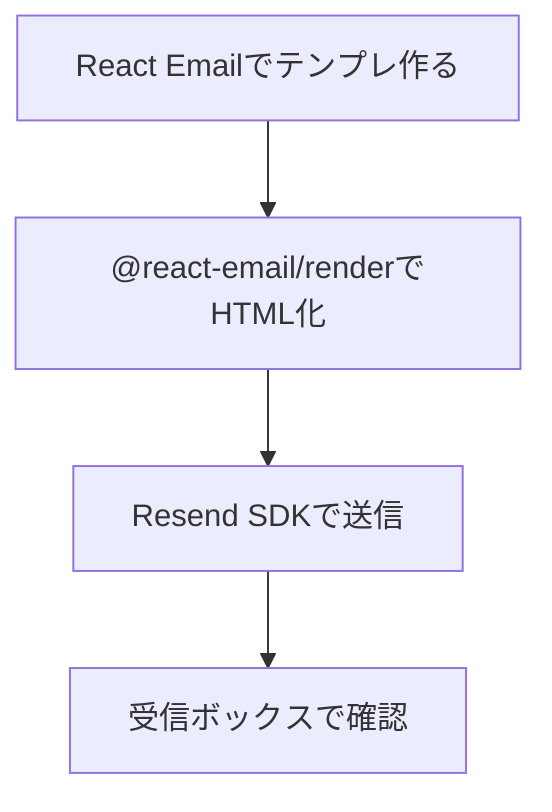
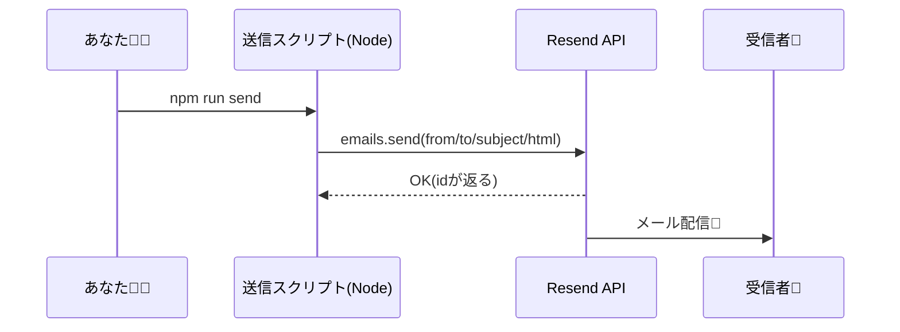

# 第278章：Resend API でメール送信

この章では、**React Emailで作ったメール（第277章でrenderしたHTML）**を、**Resend APIで実際に送信**します🎉
Resend の Node SDK はだいたいこんな形で送れます👇（`resend.emails.send`）。([Resend][1])

---

## まず全体像をつかも〜🗺️






---

## 1) 必要なパッケージを入れる📦

プロジェクトのルートで（PowerShellでOK）👇

```bash
npm i resend @react-email/render dotenv
npm i -D tsx
```

`@react-email/render` の `render` は公式のユーティリティで、Reactのメール部品をHTMLに変換できます。([React Email][2])
（React Email 3.x は React 19 でもちゃんと動くように調整されてるよ〜）([Resend][3])

---

## 2) Resend の API Key を用意して .env に入れる🔑🙈


### やること

1. Resend のダッシュボードで **API Key** を発行
2. プロジェクト直下に `.env` を作って入れる

`.env`（例）👇

```env
RESEND_API_KEY=re_xxxxxxxxxxxxxxxxxxxxxxxxx
```

> ⚠️ APIキーはぜったいGitにコミットしないでね（流出するとヤバい）😇

---

## 3) メールテンプレを1つ作る✉️🌸

例として `emails/WelcomeEmail.tsx` を作るよ〜（フォルダ名は好みでOK）

```tsx
// emails/WelcomeEmail.tsx
import { Html, Head, Body, Container, Text, Button } from "@react-email/components";

type Props = {
  name: string;
};

export default function WelcomeEmail({ name }: Props) {
  return (
    <Html>
      <Head />
      <Body style={{ fontFamily: "Arial, sans-serif" }}>
        <Container style={{ padding: "24px" }}>
          <Text style={{ fontSize: "18px" }}>こんにちは、{name}さん😊</Text>
          <Text>React Email + Resend でメール送信テスト中です📧✨</Text>

          <Button
            href="https://example.com"
            style={{
              display: "inline-block",
              padding: "12px 16px",
              backgroundColor: "#111827",
              color: "#ffffff",
              borderRadius: "8px",
              textDecoration: "none",
            }}
          >
            ボタンも押せるよ👉
          </Button>

          <Text style={{ marginTop: "24px", color: "#6b7280" }}>
            ※これはテスト送信です🧪
          </Text>
        </Container>
      </Body>
    </Html>
  );
}
```

---

## 4) 送信スクリプトを書く（TypeScript）🚀

`src/send.ts` を作って、**renderしたHTMLをResendに投げる**よ！

```tsx
// src/send.ts
import "dotenv/config";
import { Resend } from "resend";
import { render } from "@react-email/render";
import WelcomeEmail from "../emails/WelcomeEmail";

const resend = new Resend(process.env.RESEND_API_KEY);

async function main() {
  if (!process.env.RESEND_API_KEY) {
    throw new Error("RESEND_API_KEY が .env にないよ〜！😭");
  }

  const html = render(<WelcomeEmail name="こみやんま" />, { pretty: true });

  const { data, error } = await resend.emails.send({
    // ドメイン未認証の間は、基本このデフォルト送信元を使うのが安全だよ👍
    // （自前ドメインのFromは、ドメイン認証が終わるまで制限されがち）
    from: "Acme <onboarding@resend.dev>",
    to: ["delivered@resend.dev"], // テスト用に便利（自分のアドレスでもOK）
    subject: "テスト送信だよ〜📧✨",
    html,
  });

  if (error) {
    console.error("送信失敗😭", error);
    process.exit(1);
  }

  console.log("送信OK🎉 id:", data?.id);
}

main();
```

`onboarding@resend.dev` を使った `emails.send` の基本形は公式ドキュメントにも載ってるよ。([Resend][1])
また、ドメイン未認証の間は **Resendのデフォルト送信元しか使えない**ケースがあるので、まずここで成功体験を作るのが◎。([RedwoodSDK][4])

---

## 5) npm script を追加して実行する▶️

`package.json` の `scripts` にこれを追加👇

```json
{
  "scripts": {
    "send": "tsx src/send.ts"
  }
}
```

実行👇

```bash
npm run send
```

成功したら `送信OK🎉 id: ...` みたいに出るはず！


---

## よくある詰まりポイント集🧯😭

* **401/Unauthorized**
  → `RESEND_API_KEY` が間違ってる／読めてない（`.env` の場所・名前ミス多い！）
* **Fromで怒られる**
  → 自前ドメインの `from: you@yourdomain.com` を使ってるのに、ドメイン認証が終わってない
  → まずは `onboarding@resend.dev` を使う（またはResend側で指示された送信元）([RedwoodSDK][4])
* **メールが届かない**
  → 迷惑メールに入ってないか確認📮
  → 送信先を `delivered@resend.dev` みたいなテスト宛先にして挙動を見るのもアリ([Resend][1])

---

## ミニ練習🎀（5分でできる）

1. `WelcomeEmail` に `message` というPropsを増やして、本文を差し替えてみよ〜💬
2. 送信先 `to` を自分のアドレスに変えて、実際に受信してみよ〜📨
3. 余裕があれば、`render` で **プレーンテキスト化**も試してみてね（テキストメール対応にも便利）([React Email][2])

---

## まとめ🎉

* React Email（部品） → `render`（HTML化） → Resend（送信）って流れで超スムーズ📧✨ ([React Email][2])
* まずは **ドメイン未認証でもいける送信元**で成功させるのがコツ😉 ([RedwoodSDK][4])

次の第279章で、NodemailerやAWS SESともつなげて「送信基盤の選び方」っぽい視点が増えてくるよ〜🚚📮

[1]: https://resend.com/docs/send-with-nodejs?utm_source=chatgpt.com "Send emails with Node.js"
[2]: https://react.email/docs/utilities/render?utm_source=chatgpt.com "Render"
[3]: https://resend.com/blog/react-email-3?utm_source=chatgpt.com "React Email 3.0"
[4]: https://docs.rwsdk.com/guides/email/sending-email/?utm_source=chatgpt.com "Sending Email"
