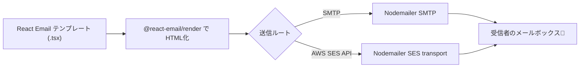

# 第279章：Nodemailer や AWS SES との連携

この章では、React Email で作ったメール（Reactコンポーネント）を **HTML文字列にして**、それを **実際に送信**できるようにします✨
送信ルートは2つやるよ👇

* ✅ **Nodemailer（SMTP）**で送る（開発中のテストに超便利）
* ✅ **AWS SES**で送る（本番向け。大量配信や到達率も強い💪）

React Email は「メールの見た目を作る係」、Nodemailer/SES は「メールを運ぶ係」って感じです😊

---

## 全体の流れ（超重要）🧠✨


React Email は **フロント（ブラウザ）で送るものじゃない**です🙅‍♀️
メール送信は **Node.js側（サーバー or スクリプト）**でやります。秘密鍵とかSMTPパスが漏れちゃうからね🔐



React Email の「render」で HTML化するのが基本ルールです。([React Email][1])

---

## 1) 依存パッケージを入れる（共通）📦✨

プロジェクト直下でOK（Reactプロジェクトなら React/ReactDOM はもう入ってるはず）👍
まずこれ入れよ〜！

```bash
npm i nodemailer @react-email/render @react-email/components
npm i -D tsx
```

* React Email の render は「HTMLに変換する公式ユーティリティ」です。([React Email][2])
* @react-email/render / @react-email/components は npm で提供されています。([npm][3])

---

## 2) メールテンプレを用意する（例）🧁💕

フォルダ例：`emails/WelcomeEmail.tsx`

```tsx
import * as React from "react";
import { Html, Head, Preview, Body, Container, Heading, Text, Button } from "@react-email/components";

type Props = {
  userName: string;
  actionUrl: string;
};

export function WelcomeEmail({ userName, actionUrl }: Props) {
  return (
    <Html lang="ja">
      <Head />
      <Preview>ようこそ！最初のご案内です✨</Preview>

      <Body style={{ backgroundColor: "#f6f6f6", margin: 0, padding: 0 }}>
        <Container style={{ backgroundColor: "#ffffff", padding: 24, margin: "24px auto", borderRadius: 12 }}>
          <Heading style={{ margin: "0 0 12px" }}>ようこそ、{userName}さん🎉</Heading>
          <Text style={{ margin: "0 0 16px", lineHeight: "24px" }}>
            登録ありがとう！下のボタンからスタートできます😊
          </Text>

          <Button
            href={actionUrl}
            style={{
              display: "inline-block",
              padding: "12px 16px",
              borderRadius: 10,
              backgroundColor: "#111827",
              color: "#ffffff",
              textDecoration: "none",
            }}
          >
            はじめる🚀
          </Button>

          <Text style={{ margin: "16px 0 0", color: "#6b7280", fontSize: 12 }}>
            もしボタンが押せないときは、このURLをコピーしてね👇
            <br />
            {actionUrl}
          </Text>
        </Container>
      </Body>
    </Html>
  );
}
```

---

## 3) まずは Nodemailer（SMTP）で送ってみる ✉️🧪

### 3-1) 環境変数を用意（例）🔐

ルートに `.env.local` を作る（Git管理しないでね⚠️）

```env
SMTP_HOST=smtp.example.com
SMTP_PORT=587
SMTP_USER=your_smtp_user
SMTP_PASS=your_smtp_pass

MAIL_FROM="Your App <no-reply@example.com>"
MAIL_TO=your_address@example.com
```

### 3-2) 送信スクリプトを作る（SMTP版）🚀

例：`scripts/send-smtp.ts`

```tsx
import * as React from "react";
import nodemailer from "nodemailer";
import { render, toPlainText } from "@react-email/render";
import { WelcomeEmail } from "../emails/WelcomeEmail";

function mustGet(name: string): string {
  const v = process.env[name];
  if (!v) throw new Error(`環境変数 ${name} がありません`);
  return v;
}

async function main() {
  const host = mustGet("SMTP_HOST");
  const port = Number(mustGet("SMTP_PORT"));
  const user = mustGet("SMTP_USER");
  const pass = mustGet("SMTP_PASS");

  const from = mustGet("MAIL_FROM");
  const to = mustGet("MAIL_TO");

  const email = (
    <WelcomeEmail
      userName="こみやんま"
      actionUrl="https://example.com/start"
    />
  );

  const html = await render(email);
  const text = toPlainText(html);

  const transporter = nodemailer.createTransport({
    host,
    port,
    secure: port === 465,
    auth: { user, pass },
  });

  const info = await transporter.sendMail({
    from,
    to,
    subject: "ようこそメール🎉（SMTPテスト）",
    html,
    text,
  });

  console.log("送れたよ！📮 messageId =", info.messageId);
}

main().catch((e) => {
  console.error(e);
  process.exitCode = 1;
});
```

実行（PowerShell想定）👇

```bash
npx tsx -r dotenv/config scripts/send-smtp.ts
```

※ `-r dotenv/config` を使うなら `dotenv` が必要です。使わないなら、Node の環境変数設定で起動してもOK👌
（dotenvを使う場合：`npm i dotenv`）

---

## 4) AWS SES で送る（本番寄り）🌩️📩

AWS SES は最初「サンドボックス」っていう制限モードになりがちで、**検証済み宛先にしか送れない**など制限があります。([AWS Documentation][4])
また **送信元（From）に使うメール/ドメインは検証が必須**です。([AWS Documentation][5])
さらに、SES は **リージョンごと**に状態が分かれるのでそこも注意！([AWS Documentation][6])

ここでは「Nodemailer の SES transport（SES API）」で送るのが一番ラク＆強いルートをやります✨
Nodemailer の SES transport は **AWS SDK v3 の @aws-sdk/client-sesv2 を使う**のが公式です。([Nodemailer][7])

---

## 5) Nodemailer + AWS SES transport（おすすめ）🥇✨

### 5-1) 追加インストール📦

```bash
npm i @aws-sdk/client-sesv2
```

Nodemailer の SES transport はこれが必要です。([Nodemailer][7])

### 5-2) 環境変数（例）🔐

```env
AWS_REGION=ap-northeast-1
AWS_ACCESS_KEY_ID=xxx
AWS_SECRET_ACCESS_KEY=yyy

MAIL_FROM="Your App <no-reply@yourdomain.com>"
MAIL_TO=your_address@example.com
```

### 5-3) 送信スクリプト（SES transport版）🚀

例：`scripts/send-ses.ts`

```tsx
import * as React from "react";
import nodemailer from "nodemailer";
import { SESv2Client, SendEmailCommand } from "@aws-sdk/client-sesv2";
import { render, toPlainText } from "@react-email/render";
import { WelcomeEmail } from "../emails/WelcomeEmail";

function mustGet(name: string): string {
  const v = process.env[name];
  if (!v) throw new Error(`環境変数 ${name} がありません`);
  return v;
}

async function main() {
  const region = mustGet("AWS_REGION");
  const from = mustGet("MAIL_FROM");
  const to = mustGet("MAIL_TO");

  const sesClient = new SESv2Client({ region });

  const transporter = nodemailer.createTransport({
    SES: { sesClient, SendEmailCommand },
  });

  const email = (
    <WelcomeEmail
      userName="こみやんま"
      actionUrl="https://example.com/start"
    />
  );

  const html = await render(email);
  const text = toPlainText(html);

  const info = await transporter.sendMail({
    from,
    to,
    subject: "ようこそメール🎉（SES transport）",
    html,
    text,
    // SESの便利機能を使いたいときはここ👇（任意）
    // ses: { ConfigurationSetName: "my-config-set" }
  });

  console.log("送れたよ！📮 messageId =", info.messageId);
}

main().catch((e) => {
  console.error(e);
  process.exitCode = 1;
});
```

この形（`SES: { sesClient, SendEmailCommand }`）は **公式ドキュメントにある正解形**です。([Nodemailer][8])

---

## 6) ありがち詰まりポイント 😵‍💫➡️🙂

* 「From のアドレスが拒否される」
  → SES は **送信元の検証が必須**だよ（メール or ドメイン）([AWS Documentation][5])
* 「宛先が未検証で送れない」
  → サンドボックス中は **検証済み宛先にしか送れない**よ([AWS Documentation][4])
* 「リージョン変えたら急に動かない」
  → SES は **リージョンごとに検証や状態が別**だよ([AWS Documentation][6])
* 「@aws-sdk/client-sesv2 が無いと言われる」
  → SES transport は別インストール必要だよ([Nodemailer][7])

---

## 7) 章末ミニ課題（次章の“領収書メール”に繋げるよ🧾✨）

1. `WelcomeEmail` の props を増やして、

* 金額（例：980円）💰
* 注文ID（例：A-2025-0001）🧾
  を表示してみよ〜😊

2. SMTP版 → SES版へ切り替えて、同じテンプレで送れるのを確認👍

---

次の第280章は **「動的データを使った領収書メール」**で、ここで作った送信ルートをそのまま使って “実務っぽいメール” にしていくよ〜！💌🔥

[1]: https://react.email/docs/integrations/overview "Overview - React Email"
[2]: https://react.email/docs/utilities/render "Render - React Email"
[3]: https://www.npmjs.com/package/%40react-email%2Frender?utm_source=chatgpt.com "react-email/render"
[4]: https://docs.aws.amazon.com/ses/latest/dg/request-production-access.html?utm_source=chatgpt.com "Request production access (Moving out of the Amazon SES ..."
[5]: https://docs.aws.amazon.com/ses/latest/dg/verify-addresses-and-domains.html?utm_source=chatgpt.com "Verified identities in Amazon SES - AWS Documentation"
[6]: https://docs.aws.amazon.com/ses/latest/dg/creating-identities.html?utm_source=chatgpt.com "Creating and verifying identities in Amazon SES"
[7]: https://nodemailer.com/transports/ses "SES transport | Nodemailer"
[8]: https://nodemailer.com/transports "Other transports | Nodemailer"
