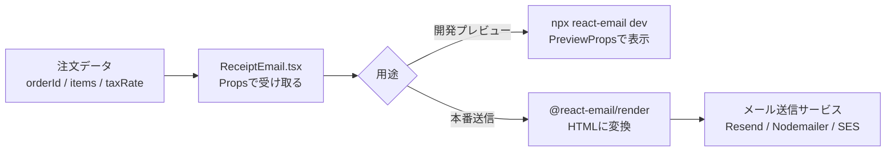

# 第280章：練習：動的データを使った領収書メールの実装

今日は「**注文データ（動的）**を Props で受け取って、**領収書メールを組み立てる**」をやるよ〜！✨
完成したら、プレビューで見れて👀、本番では `render` して送信📩できる形になるよ！

---

## ゴール🎯

* `customerName / orderId / items / 税率` みたいな **動的データ**で領収書メールを作る🧾
* **プレビューでは PreviewProps** を使ってサクッと確認👀（楽しい！）
* **本番では render して HTML に変換**して送れる状態にする📩（これ大事！） ([React Email][1])

---

## 全体の流れ（図解）🗺️




* プレビュー側は `PreviewProps` を使って Props を差し込む仕組みだよ〜！ ([React Email][2])

---

## 1) 領収書メールの Props（型）を決めよう✍️

領収書って「明細が配列」になるから、まずここが肝🧠✨
`items.map()` で表示できるように型を作るよ！

---

## 2) `emails/ReceiptEmail.tsx` を作る🧾✨（完成コード）

> ここでは Tailwind を使って “それっぽい領収書” にするよ🎀


> React Email の Tailwind ラッパー（`Tailwind` + `pixelBasedPreset`）を使うのがおすすめ！ ([React Email][3])

```tsx
import * as React from "react";
import {
  Body,
  Column,
  Container,
  Head,
  Heading,
  Hr,
  Html,
  Link,
  Preview,
  Row,
  Section,
  Text,
  Tailwind,
  pixelBasedPreset,
} from "@react-email/components";

/** 明細1行ぶん */
type ReceiptItem = {
  name: string;      // 商品名
  qty: number;       // 個数
  unitPrice: number; // 単価（円）
};

type ReceiptEmailProps = {
  customerName: string;
  orderId: string;
  issuedAt: string; // "2025-12-28" みたいな文字列でOK
  items: ReceiptItem[];
  taxRate?: number; // 省略したら10%
  supportUrl?: string;
};

/** TSで PreviewProps を安全に生やすための型 */
type EmailTemplate<P> = ((props: P) => React.ReactElement) & {
  PreviewProps?: P;
};

const yen = (n: number) =>
  new Intl.NumberFormat("ja-JP", { style: "currency", currency: "JPY" }).format(n);

const ReceiptEmail: EmailTemplate<ReceiptEmailProps> = ({
  customerName,
  orderId,
  issuedAt,
  items,
  taxRate = 0.1,
  supportUrl = "https://example.com/support",
}) => {
  const subtotal = items.reduce((sum, it) => sum + it.unitPrice * it.qty, 0);
  const tax = Math.round(subtotal * taxRate);
  const total = subtotal + tax;

  return (
    <Html lang="ja">
      <Head />
      <Preview>{customerName}さんの領収書（注文 {orderId}）</Preview>

      <Tailwind config={{ presets: [pixelBasedPreset] }}>
        <Body className="bg-gray-50 font-sans">
          <Container className="mx-auto my-10 w-[600px] rounded-xl bg-white p-8">
            {/* ヘッダー */}
            <Section>
              <Heading className="m-0 text-2xl font-bold">領収書 🧾</Heading>
              <Text className="mt-2 text-gray-600">
                こんにちは {customerName} さん✨ ご購入ありがとうございます！
              </Text>
            </Section>

            {/* 注文情報 */}
            <Section className="mt-4 rounded-lg bg-gray-100 p-4">
              <Row>
                <Column>
                  <Text className="m-0 text-xs uppercase tracking-wide text-gray-500">
                    注文番号
                  </Text>
                  <Text className="m-0 font-medium">{orderId}</Text>
                </Column>
                <Column align="right">
                  <Text className="m-0 text-xs uppercase tracking-wide text-gray-500">
                    発行日
                  </Text>
                  <Text className="m-0 font-medium">{issuedAt}</Text>
                </Column>
              </Row>
            </Section>

            <Hr className="my-6 border-gray-200" />

            {/* 明細 */}
            <Section>
              <Text className="mb-2 font-semibold">ご購入内容 🛍️</Text>

              {items.length === 0 ? (
                <Text className="text-gray-600">（明細がありません）</Text>
              ) : (
                <Section className="rounded-lg border border-gray-200">
                  <Row className="bg-gray-50 px-4 py-2">
                    <Column className="text-xs font-semibold text-gray-600">商品</Column>
                    <Column align="right" className="text-xs font-semibold text-gray-600">
                      数量
                    </Column>
                    <Column align="right" className="text-xs font-semibold text-gray-600">
                      小計
                    </Column>
                  </Row>

                  {items.map((it, idx) => (
                    <Row key={idx} className="px-4 py-3">
                      <Column>
                        <Text className="m-0">{it.name}</Text>
                        <Text className="m-0 text-xs text-gray-500">
                          {yen(it.unitPrice)} / 個
                        </Text>
                      </Column>
                      <Column align="right">
                        <Text className="m-0">{it.qty}</Text>
                      </Column>
                      <Column align="right">
                        <Text className="m-0 font-medium">{yen(it.unitPrice * it.qty)}</Text>
                      </Column>
                    </Row>
                  ))}
                </Section>
              )}
            </Section>

            {/* 合計 */}
            <Section className="mt-6">
              <Row>
                <Column />
                <Column className="w-[260px]">
                  <Row className="py-1">
                    <Column>
                      <Text className="m-0 text-gray-600">小計</Text>
                    </Column>
                    <Column align="right">
                      <Text className="m-0">{yen(subtotal)}</Text>
                    </Column>
                  </Row>

                  <Row className="py-1">
                    <Column>
                      <Text className="m-0 text-gray-600">消費税</Text>
                    </Column>
                    <Column align="right">
                      <Text className="m-0">{yen(tax)}</Text>
                    </Column>
                  </Row>

                  <Hr className="my-2 border-gray-200" />

                  <Row className="py-1">
                    <Column>
                      <Text className="m-0 text-base font-bold">合計</Text>
                    </Column>
                    <Column align="right">
                      <Text className="m-0 text-base font-bold">{yen(total)}</Text>
                    </Column>
                  </Row>
                </Column>
              </Row>
            </Section>

            <Hr className="my-6 border-gray-200" />

            {/* フッター */}
            <Section>
              <Text className="text-sm text-gray-600">
                ご不明点があれば <Link href={supportUrl}>サポートページ</Link> からいつでもどうぞ 💌
              </Text>
              <Text className="text-xs text-gray-400">※このメールは自動送信です。</Text>
            </Section>
          </Container>
        </Body>
      </Tailwind>
    </Html>
  );
};

export default ReceiptEmail;

/** プレビュー用のダミーデータ（PreviewProps） */
ReceiptEmail.PreviewProps = {
  customerName: "佐藤あおい",
  orderId: "A-2025-1228-001",
  issuedAt: "2025-12-28",
  items: [
    { name: "オンライン講座（1ヶ月）", qty: 1, unitPrice: 980 },
    { name: "追加教材セット", qty: 2, unitPrice: 550 },
  ],
  taxRate: 0.1,
  supportUrl: "https://example.com/support",
} satisfies ReceiptEmailProps;
```

* `Preview`（受信トレイのプレビュー文）は **短めが良い**って話もあるよ📝 ([React Email][4])
* `PreviewProps` は **プレビュー画面が自動で props を差し込む**ための仕組みだよ〜！ ([React Email][2])

---

## 3) プレビューで確認しよう👀✨


React Email の CLI で開発サーバを起動するよ〜！

```bash
npx react-email dev
```

これでブラウザにプレビューが出て、`ReceiptEmail.PreviewProps` の内容で表示されるよ🎉 ([Yarn][5])

---

## 4) 本番用：HTML に変換（render）して送れる形にしよう📩

「送信直前に props を入れて render する」のが基本だよ！ ([React Email][2])
まず `@react-email/render` を入れる（入ってなければ）👇 ([React Email][1])

```bash
npm install @react-email/render -E
```

### 例：Node 側で HTML を作る（雰囲気だけでOK🙆‍♀️）

```ts
import * as React from "react";
import { render, pretty } from "@react-email/render";
import ReceiptEmail from "../emails/ReceiptEmail";

async function main() {
  const html = await pretty(
    await render(
      <ReceiptEmail
        customerName="佐藤あおい"
        orderId="A-2025-1228-001"
        issuedAt="2025-12-28"
        items={[
          { name: "オンライン講座（1ヶ月）", qty: 1, unitPrice: 980 },
          { name: "追加教材セット", qty: 2, unitPrice: 550 },
        ]}
      />
    )
  );

  console.log(html);
}

main();
```

---

## 5) 送信（おまけ）📮：Resend だとさらにラク✨

Resend だと `react: <ReceiptEmail ... />` を渡すだけで送れちゃう例があるよ📩 ([React Email][6])
（ここは第278章の復習ポジション！）

---

## つまずきポイント集😵‍💫➡️😄

### ✅ PreviewProps が効かない

* **default export** してるかチェック！プレビューはそれを探してるよ ([React Email][2])

### ✅ 見た目が崩れる（メールあるある）

* メールクライアントはクセ強😇
* Tailwind も「全部OK」じゃないので、盛りすぎ注意だよ〜！ ([React Email][3])

---

## ミニ課題💪✨（やると一気に実戦っぽい！）

1. `discount`（値引き）を Props に追加して、合計に反映してみよ🎟️
2. `companyName / companyAddress` を追加して、領収書っぽさUP🏢
3. `items` が多い時に備えて、明細エリアを「見やすい間隔」に調整してみよ🧼✨

---

必要なら、次の章（281章）の “エッジ” につながるように、**「領収書データをAPIから受け取ってメールを送る設計」**まで一気に絵付きで組んであげるよ〜😆📦

[1]: https://react.email/docs/utilities/render "Render - React Email"
[2]: https://react.email/docs/cli "CLI - React Email"
[3]: https://react.email/docs/components/tailwind "Tailwind - React Email"
[4]: https://react.email/docs/components/preview?utm_source=chatgpt.com "Preview"
[5]: https://classic.yarnpkg.com/en/package/react-email?utm_source=chatgpt.com "react-email"
[6]: https://react.email/docs/integrations/resend "Send email using Resend - React Email"
