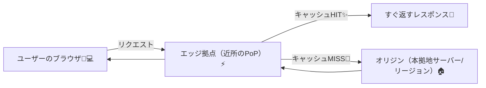
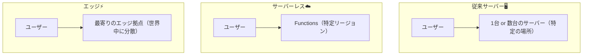

# 第281章：なぜ「エッジ」なのか？

この章では「エッジって結局なに？」「なんで最近みんな言ってるの？」を、ふわっとじゃなく **ちゃんとイメージできる** ようになります😊💡
（次の章から Hono / Cloudflare を触る前の、超だいじな助走だよ〜🏃‍♀️💨）

---

## 1) まず結論：エッジは「ユーザーの近くで動く」🗺️⚡


普通のサーバーって、どこか1か所（東京リージョンとか）に置かれがち。
でもエッジは **世界中の“近所の拠点”** に処理を寄せられるイメージです🌍✨

### 図：ざっくり通信の流れ（CDN + エッジの基本）📦➡️



ポイントはこれ👇

* **近所の拠点（エッジ）** がまず受けてくれる
* キャッシュがあれば **その場で即返す**
* 必要なら本拠地（オリジン）に取りに行く

---

## 2) 「サーバーレス」と何が違うの？🤔☁️➡️⚡


サーバーレス（例：Functions）は超便利だけど、よくある構成は「特定リージョンで動く」になりがちです。
エッジは **“どこから来ても近い場所で動く”** が強い💪✨

### 図：サーバー / サーバーレス / エッジのざっくり比較🧠



---

## 3) エッジが嬉しい理由トップ5 🥇😆


### ① 体感が速い（距離が短い）🚀

ユーザーの近くで返すから、**待ち時間が減りやすい**！

### ② “入口”でさばける（防御・振り分けが上手）🛡️

* Botっぽいアクセスを弾く
* レート制限する
* 国や言語で振り分ける
* A/Bテストを振り分ける
  みたいな「玄関でやる仕事」が得意🏠✨

### ③ キャッシュと相性が良すぎる📦✨

「同じ内容をたくさんの人に返す」系はエッジ最強。

### ④ オリジンの負担が減る💸

本拠地サーバーに行く回数が減る＝コストにも効きやすい💰

### ⑤ “ちょい処理”がめちゃ得意🧁

重い計算じゃなくて、**軽い処理をサクッと** が得意！

---

## 4) 逆に、エッジが苦手なこともあるよ🥲⚠️

エッジは万能じゃない！向き不向きがあります。

* **重い計算（動画変換、機械学習ガッツリ）** 🧱
* **でっかい依存（巨大ライブラリ盛り盛り）** 🧳
* **でかいDBに毎回ガツンとアクセス** 🗄️（DBが遠いと結局遅い）
* **長時間つなぎっぱなし** ⏳（用途による）

なので基本はこう考えるといいよ👇

> エッジは「玄関」と「配達員」🚪📮
> 本格調理（重い処理）は「キッチン（本拠地）」🍳

---

## 5) React開発だと、どこで効くの？⚛️✨

React（フロント）って「ブラウザで動く」けど、現代のアプリはだいたい👇が必要になります。

* ログイン判定🔐
* API（データ取得/保存）📡
* 画像や静的ファイル配信🖼️
* 国/言語/ABテストの出し分け🌏
* SSR/ストリーミング（※やるなら）🌊

このとき **“APIの入口”をエッジに置ける** と、体験が良くなりやすいです😊
しかも、Hono みたいな軽量フレームワークは **エッジ適性が高い** ので、このモジュールと相性バツグン👍✨

---

## 6) ミニ体験：エッジの「最寄り拠点」を見てみよう🔍⚡（Windows）


Cloudflareの「どの拠点につながったか」を見る、超かんたん体験🎮✨

### PowerShellで実行👇

```powershell
irm https://www.cloudflare.com/cdn-cgi/trace
```

出てきた内容の中に、だいたいこんなのがあります👇

* `colo=XXX` ← これが「つながった拠点コード」っぽいやつ🌍
* `ip=` とか `loc=` とかも出ます（出方は環境で少し違うよ）

**同じURLでも、場所が違う人が叩くと `colo` が変わったり**して「近所の拠点につながってる感」が味わえます😆✨

---

## 7) まとめ🧸🎀

* エッジは **ユーザーの近くで動く仕組み** ⚡
* 速さ・キャッシュ・入口処理（防御/振り分け）に強い🛡️
* 重い処理やDB設計は、向き不向きを考えるのが大事🥲
* React時代は「API・認証・出し分け」が増えるので、エッジが効きやすい💡

---

## 次章予告📘✨

次は **「Honoってなに？」** に入って、エッジで動かす相棒を紹介していくよ〜🐶⚡（第282章へGO！）
