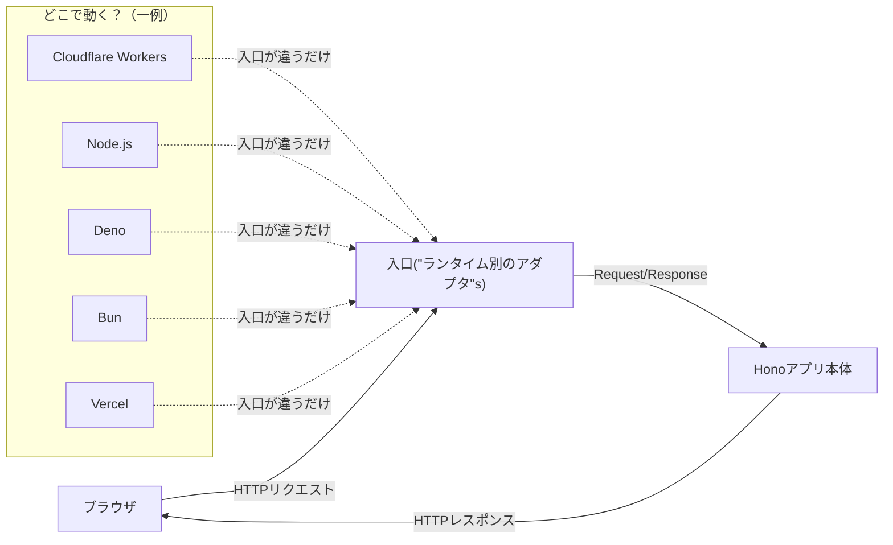
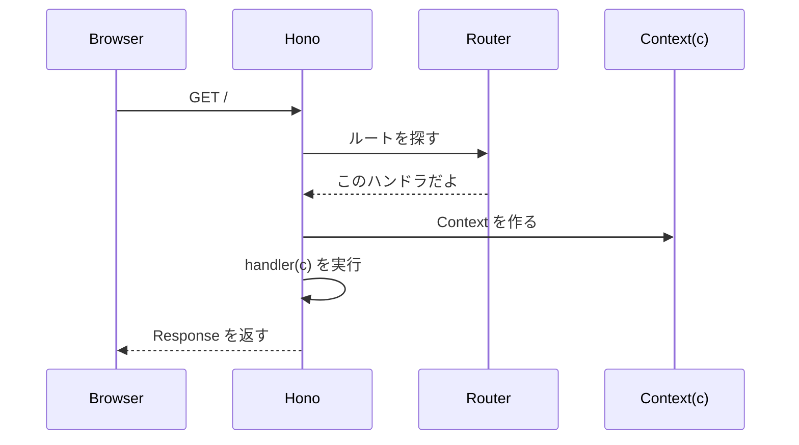

# 第282章：Hono とは？

## この章でわかること 🎯

* Hono が「何者」かが説明できるようになる🙆‍♀️
* 「Web標準ベース」ってどういう意味か、雰囲気がつかめる🌐
* とりあえず動く “Hello Hono!” をローカルで起動できる🚀

---

## そもそも Hono ってなに？🤔🔥


Hono は、**Web標準（Request/Response など）に沿って作られた、軽量でシンプルなWebフレームワーク**だよ〜！✨
しかも **いろんな実行環境で動く**のが強みで、Cloudflare Workers / Deno / Bun / Vercel / Node.js などに対応してるのが特徴☺️
（名前の “Hono” は日本語の「炎」って意味🔥） ([Hono][1])

---

## Hono が嬉しいポイント3つ ✨✨✨

### 1) 「Web標準」ベース 🌐

Hono は、基本の考え方が **`fetch` の世界（Request/Response）**に近いよ！
だから、環境が変わっても「同じ感覚」で書きやすいのが良いところ🙌 ([Hono][1])

### 2) どこでも動く（マルチランタイム）🧳

「同じアプリの中身（ルーティングとか処理）」が、**入口（アダプタ）だけ変えて色んな環境で動く**イメージ！
Hono の公式ドキュメントでも “any JavaScript runtime” って言ってるよ✨ ([Hono][1])

### 3) Cloudflare Workers と相性が良い ☁️⚡

Cloudflare 公式も「Workers と相性良いよ〜」って紹介してる👌
エッジでAPIを動かして、SPA（React）と合体させる、みたいなこともしやすい✨ ([Cloudflare Docs][2])

---

## 図でつかむ：Hono は「本体」と「入口」が分かれてる感じ 🧠🧩




---

## まずは最小の “Hello Hono!” を見る 👀🔥

Hono の基本形はこんな感じ👇（`app.get()` が超わかりやすい！）

```ts
import { Hono } from 'hono'

const app = new Hono()

app.get('/', (c) => {
  return c.text('Hello Hono!')
})

export default app
```

この形は公式の Getting Started にも載ってるよ ✅ ([Hono][3])

---

## 1分で起動してみよ！（Windows + npm）🪄🖥️

### ① プロジェクト作成📦

PowerShell か VS Code のターミナルでOK！

```bash
npm create hono@latest my-hono-app
```

するとテンプレを聞かれるよ〜！
このロードマップ的には **`cloudflare-workers`** を選ぶのが気持ちいい（エッジ感が出る☁️⚡） ([Hono][3])

### ② 依存関係インストール📥

```bash
cd my-hono-app
npm i
```

([Hono][3])

### ③ 開発サーバ起動🚀

```bash
npm run dev
```

([Hono][3])

ブラウザで（Workers テンプレなら）だいたいここにアクセス👇

* `http://localhost:8787` ([Hono][3])

“Hello Hono!” が出たら勝ち〜！🎉🎉🎉


---

## 「Web標準っぽい」ってこういうこと😺🌐

Hono は `c.text()` とか `c.json()` が便利なんだけど、**生の Response を返す**こともできるよ！


この “素のResponse” 感が Web標準っぽさの一つ✨ ([Hono][3])

```ts
app.get('/raw', () => {
  return new Response('Good morning!')
})
```

---

## リクエストが来た時の流れ（ざっくり）📮➡️📦➡️📮



※ ここで出てきた **ルーティング**は次の章（第283章）でガッツリやるよ〜！📍✨

---

## ミニ課題（3分）📝✨

1. `/api/hello` を作って JSON を返してみよう💪
2. 表示が変わったら成功🎉

ヒント（ほぼ答え）👇

```ts
app.get('/api/hello', (c) => {
  return c.json({ ok: true, message: 'Hello Hono!' })
})
```

公式にも “Return JSON” の例があるよ✅ ([Hono][3])

---

## ちょいメモ：HonoX って何？（気になった人だけ）🧁

Hono には **HonoX** っていう「フルスタック寄りのメタフレームワーク」もあるよ〜。
ただし GitHub の README では **alpha（破壊的変更あり）**って明記されてるから、入門はまず Hono 本体がおすすめ☺️ ([GitHub][4])

---

## この章のまとめ 🎀

* Hono は **Web標準ベース**で、**軽量・シンプル**なWebフレームワーク🔥 ([Hono][1])
* **いろんなランタイムで動く**のが強み（Node/Workers/Deno/Bun…）🧳 ([Hono][1])
* `npm create hono@latest` → `npm run dev` でサクッと動く🚀 ([Hono][3])

次の第283章で、`app.get()` とかの **ルーティング**を気持ちよく増やしていこ〜！😆✨

[1]: https://hono.dev/docs/?utm_source=chatgpt.com "Hono - Web framework built on Web Standards"
[2]: https://developers.cloudflare.com/workers/framework-guides/web-apps/more-web-frameworks/hono/?utm_source=chatgpt.com "Hono - Workers"
[3]: https://hono.dev/docs/getting-started/basic "Getting Started - Hono"
[4]: https://github.com/honojs/honox?utm_source=chatgpt.com "HonoX - Hono based meta framework"
