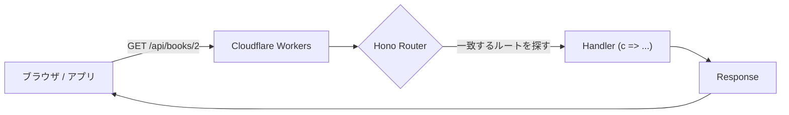

# 第283章：Hono の基本ルーティング

今日のゴールはこれ！👇
**「URL と HTTPメソッド（GET/POST など）で、返す内容を切り替えられる」**ようになることだよ〜☺️💕

---

## 1) まずは動く状態を作ろう 🧰💨

Cloudflare Workers テンプレで Hono を起動するよ！（ローカルで `http://localhost:8787` で動くやつ） ([Hono][1])

```bash
npm create hono@latest hono-routing-demo
cd hono-routing-demo
npm i
npm run dev
```

ブラウザで👇にアクセスしてみてね✨

* `http://localhost:8787`

---

## 2) ルーティングってなに？🤔💡


ざっくり言うと…

* **ルート（Route）** = 「この URL で来たら、これ返す！」っていう **道案内** 🗺️
* Hono は `app.get("/path", handler)` みたいに書くよ🧁
* handler の引数 `c` は **Context**（リクエスト/レスポンス便利セット）だよ📦 ([Hono][2])

図でイメージするとこんな感じ👇



---

## 3) まずは「基本ルート」を書いてみよう ✍️🎀

`src/index.ts` をこんな感じにしてね（テンプレに上書きでOK） ([Hono][1])

```ts
import { Hono } from 'hono'

const app = new Hono()

// ① いちばん基本：GET /
app.get('/', (c) => c.text('Hello! Hono routing demo 👋✨'))

// ② JSONを返す：GET /api
app.get('/api', (c) => {
  return c.json({ message: 'Hello JSON! 🎉' })
})

export default app
```

ブラウザで試してみてね😊✨

* `http://localhost:8787/`
* `http://localhost:8787/api`

`c.text()` と `c.json()` は超よく使うよ〜！ ([Hono][2])

---

## 4) ルートの種類：GET / POST / なんでもOK 😼🧡

Hono は HTTPメソッドごとに書けるよ！

* `app.get(...)` → 取得
* `app.post(...)` → 作成
* `app.all(...)` → どのメソッドでもOK
  （ほかにも `app.on(...)` でカスタムメソッドもいける） ([Hono][3])

---

## 5) パスパラメータ（/users/:id）で「動的URL」🎯✨


たとえば `/:id` みたいに **可変**にできるよ！

```ts
app.get('/users/:id', (c) => {
  const id = c.req.param('id')
  return c.json({ userId: id, ok: true })
})
```

`c.req.param('id')` で取れる！ ([Hono][3])

試す👇

* `http://localhost:8787/users/123`
* `http://localhost:8787/users/akari`

---

## 6) クエリ（?q=...）も取れるよ 🔎💖


検索っぽいやつ！

```ts
app.get('/search', (c) => {
  const q = c.req.query('q') ?? ''
  return c.json({ q })
})
```

`c.req.query('q')` が使えるよ！ ([Hono][4])

試す👇

* `http://localhost:8787/search?q=react`

---

## 7) ちょい実践：ミニ「本API」を作ろう 📚✨（ルーティング練習）

ここからは「ルートが増えるほど嬉しい」例だよ☺️
`/api` 配下をまとめたくて、`basePath('/api')` を使うね！ ([Hono][3])

```ts
import { Hono } from 'hono'

type Book = { id: string; title: string }

const books: Book[] = [
  { id: '1', title: 'はじめてのReact' },
  { id: '2', title: '状態管理こわくない本' },
]

const app = new Hono()

app.get('/', (c) => c.text('Hello! 📚✨'))

const api = new Hono().basePath('/api')

// GET /api/books
api.get('/books', (c) => c.json({ books }))

// GET /api/books/:id
api.get('/books/:id', (c) => {
  const id = c.req.param('id')
  const book = books.find((b) => b.id === id)

  if (!book) {
    c.status(404)
    return c.json({ message: 'Book not found 😢', id })
  }
  return c.json({ book })
})

// POST /api/books  (JSON body: { "title": "..." })
api.post('/books', async (c) => {
  const body = (await c.req.json()) as { title?: string } // JSONパース
  const title = body.title?.trim()

  if (!title) {
    c.status(400)
    return c.json({ message: 'title is required 🙏' })
  }

  const newBook: Book = { id: String(books.length + 1), title }
  books.push(newBook)

  c.status(201)
  return c.json({ book: newBook })
})

app.route('/', api)

// ルートが見つからないときの 404
app.notFound((c) => c.text('404: 迷子です…🥺', 404))

export default app
```

ポイント👇

* `basePath('/api')` で **/api を共通の前置き**にできるよ ([Hono][3])
* POST の JSON は `await c.req.json()` で読めるよ ([Hono][4])
* 404 は `app.notFound(...)` でカスタムできるよ ([Hono][5])

試すURL👇

* GET `http://localhost:8787/api/books`
* GET `http://localhost:8787/api/books/2`
* GET `http://localhost:8787/api/books/999`（404側の分岐チェック✨）

POST はブラウザだけだとやりにくいから、PowerShell で叩くならこんな感じ（任意）👇

```powershell
curl -Method POST "http://localhost:8787/api/books" `
  -Headers @{ "Content-Type"="application/json" } `
  -Body '{ "title": "エッジ入門" }'
```

---

## 8) まとめ 🎀✅

この章でできるようになったこと👇

* `app.get()` / `app.post()` で **ルーティング**できる 🛣️ ([Hono][3])
* `/:id` みたいな **パスパラメータ**を `c.req.param()` で取れる 🎯 ([Hono][4])
* `?q=...` みたいな **クエリ**を `c.req.query()` で取れる 🔎 ([Hono][4])
* 迷子（404）は `app.notFound()` で可愛く案内できる 🥺 ([Hono][5])

---

## ミニ課題（サクッと）📝✨

1. `GET /api/ping` を追加して `{ ok: true }` を返してみよ〜🐣
2. `GET /api/books/:id` に `?debug=1` が付いたら、レスポンスに `debug: true` を入れてみよ〜😆

次の章（第284章）で **Hono と React をつなぐ**話に入っていくと、今日のルーティングがめちゃ活きるよ〜！⚡️💖

[1]: https://hono-ja.pages.dev/docs/getting-started/cloudflare-workers?utm_source=chatgpt.com "Cloudflare Workers - Hono"
[2]: https://hono.dev/docs/api/context "Context - Hono"
[3]: https://hono.dev/docs/api/routing "Routing - Hono"
[4]: https://hono.dev/docs/api/request "HonoRequest - Hono"
[5]: https://hono.dev/docs/api/hono "App - Hono - Hono"
