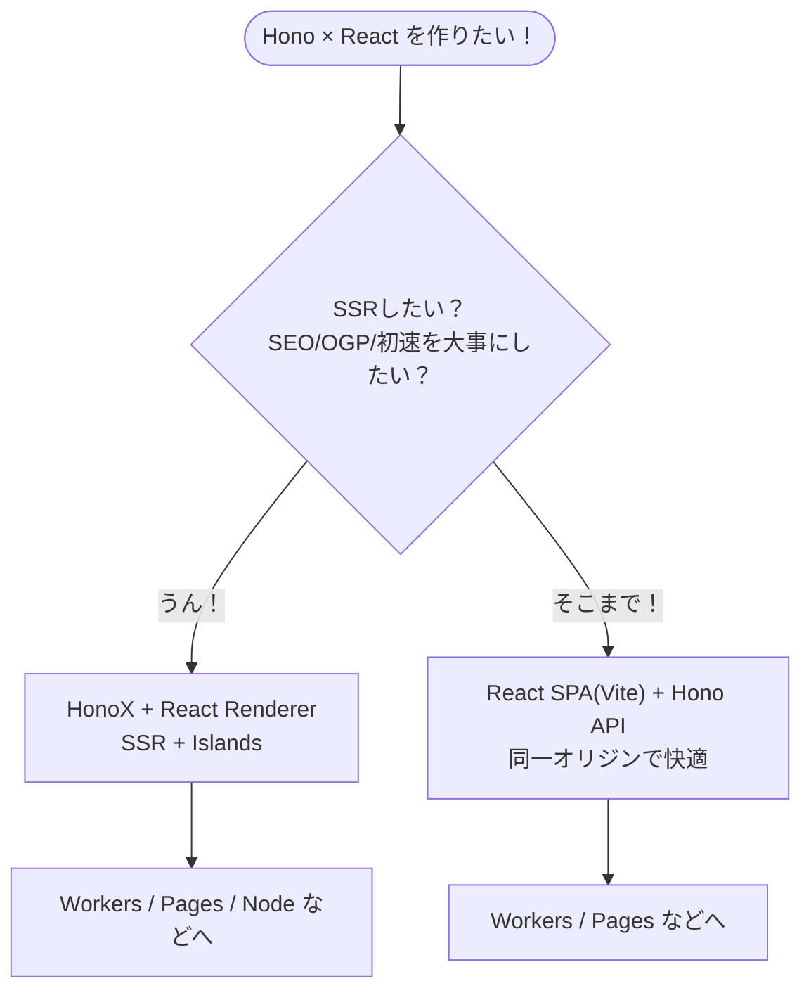
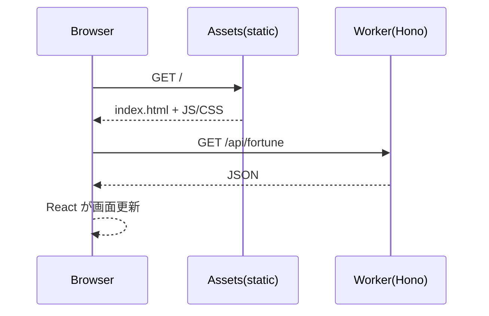

# 第284章：Hono × React (HonoX or Vite)

この章は「**Hono と React をくっつけて、フルスタックっぽく動かす**」回だよ〜！✨
やり方は大きく2つあるよ👇

* **A：React SPA（Vite） + Hono API**（“王道でわかりやすい”）💪
* **B：HonoX + React（SSR + Islands）**（“SSRしたい＆先進的”）🚀

---

## まず全体像（どっちを選ぶ？）🧭✨




* **A（Vite + Hono）**は「Reactの画面」＋「HonoのAPI」を同じプロジェクトで扱いやすいよ✨
  Cloudflare公式テンプレで **Hono API + React SPA** が最初から繋がるのが強い！([Cloudflare Docs][1])
* **B（HonoX）**は Honoベースのメタフレームワークで、**ファイルベースルーティング・高速SSR・Islands**が特徴だよ（ただし **alpha** で破壊的変更あり得るよ⚠️）([GitHub][2])

---

# ハンズオンA：React SPA（Vite） + Hono API を “同居” させる 🥳🧩

ここでは Cloudflare のテンプレを使って、**「Reactが /api を叩いて表示する」**まで一気に作るよ！

## 1) テンプレでプロジェクト作成 🧁

PowerShell でOK🙆‍♀️

```powershell
npm create cloudflare@latest -- my-hono-app --template=cloudflare/templates/vite-react-template
cd my-hono-app
npm install
npm run dev
```

このテンプレは「Honoが Worker 側」「React が SPA 側」で、だいたいこういう構造になるよ👇([Cloudflare Docs][1])

* `src/worker/index.ts` … **Hono API（Workerで動く）**
* `src/react-app/` … **React SPA**
* `wrangler.jsonc` … Workers設定（SPAの not_found_handling など）([Cloudflare Docs][1])

## 2) リクエストの流れ（図で理解）📮✨




「SPAの画面」は静的配信、`/api/*` は Worker(Hono) が返す、って感じだよ〜！([Cloudflare Docs][1])

## 3) Hono 側に API を追加する（占いAPI🔮）

`src/worker/index.ts` を開いて、エンドポイントを追加しよう👇

```ts
import { Hono } from "hono";

const app = new Hono();

app.get("/api/fortune", (c) => {
  const list = ["大吉", "中吉", "小吉", "凶"] as const;
  const fortune = list[Math.floor(Math.random() * list.length)];

  return c.json({
    message: "今日の運勢だよ〜🔮✨",
    fortune,
    at: new Date().toISOString(),
  });
});

export default app;
```

## 4) React 側で表示する（fetchして出す🎀）

`src/react-app/src/App.tsx` を編集して、API結果を表示しよっか！

```tsx
import { useEffect, useState } from "react";
import "./App.css";

type FortuneResponse = {
  message: string;
  fortune: "大吉" | "中吉" | "小吉" | "凶";
  at: string;
};

export default function App() {
  const [data, setData] = useState<FortuneResponse | null>(null);
  const [error, setError] = useState<string | null>(null);

  const reload = async () => {
    setError(null);
    setData(null);
    try {
      const res = await fetch("/api/fortune");
      if (!res.ok) throw new Error(`HTTP ${res.status}`);
      const json = (await res.json()) as FortuneResponse;
      setData(json);
    } catch (e) {
      setError(e instanceof Error ? e.message : "unknown error");
    }
  };

  useEffect(() => {
    void reload();
  }, []);

  return (
    <div style={{ maxWidth: 520, margin: "40px auto", padding: 16 }}>
      <h1>Hono × React 占いアプリ🔮⚛️</h1>

      <button onClick={() => void reload()} style={{ padding: "8px 12px" }}>
        もう一回ひく✨
      </button>

      <div style={{ marginTop: 16, padding: 12, border: "1px solid #ddd", borderRadius: 12 }}>
        {error && <p>エラーだよ〜😭：{error}</p>}
        {!error && !data && <p>読み込み中…⏳</p>}
        {data && (
          <>
            <p>{data.message}</p>
            <p style={{ fontSize: 28, margin: "12px 0" }}>🎯 {data.fortune}</p>
            <small>⏰ {data.at}</small>
          </>
        )}
      </div>
    </div>
  );
}
```

✅ これで「React SPA」から **同一オリジン**で `/api/fortune` を叩けるから、CORSで悩みにくいのが最高〜！💖
（テンプレ自体が “Hono API + React SPA” を繋ぐ前提で組まれてるよ）([Cloudflare Docs][1])

---

# ハンズオンB：HonoX + React（SSRしたい人向け）🌸🧠

HonoXは **Honoベースのメタフレームワーク**で、**ファイルベースルーティング**とか **Islands** ができるよ！([GitHub][2])
ただし **alpha**（仕様変更あり）なので「試して楽しい」枠でいこ〜⚠️([GitHub][2])

## 1) HonoX テンプレで開始（x-basic）🚀

HonoXは `create-hono` で `x-basic` を選ぶ流れが案内されてるよ。([GitHub][2])

```powershell
npm create hono@latest my-honox
cd my-honox
npm install
npm run dev
```

典型的な構成はこんな感じ👇（`app/routes` がルーティングになる）([GitHub][2])

## 2) React を “レンダラーとして” 使う（BYOR）⚛️✨

HonoXは **React などをレンダラーとして持ち込める**よ〜！
Reactの場合は `@hono/react-renderer` を使う例が載ってるよ。([GitHub][2])

### 2-1) 必要パッケージを追加

```powershell
npm i @hono/react-renderer react react-dom hono
npm i -D @types/react @types/react-dom
```

([GitHub][2])

### 2-2) `app/routes/_renderer.tsx` を React Renderer に

（例がそのまま参考になるよ！）([GitHub][2])

```tsx
import { reactRenderer } from "@hono/react-renderer";

export default reactRenderer(({ children, title }) => {
  return (
    <html lang="ja">
      <head>
        <meta charSet="UTF-8" />
        <meta name="viewport" content="width=device-width, initial-scale=1.0" />
        {title ? <title>{title}</title> : null}
        {import.meta.env.PROD ? (
          <script type="module" src="/static/client.js"></script>
        ) : (
          <script type="module" src="/app/client.ts"></script>
        )}
      </head>
      <body>{children}</body>
    </html>
  );
});
```

### 2-3) `app/client.ts` で hydrate を React にする

```ts
import { createClient } from "honox/client";

createClient({
  hydrate: async (elem, root) => {
    const { hydrateRoot } = await import("react-dom/client");
    hydrateRoot(root, elem);
  },
  createElement: async (type: any, props: any) => {
    const { createElement } = await import("react");
    return createElement(type, props);
  },
});
```

([GitHub][2])

### 2-4) `tsconfig.json` に `jsxImportSource`

```json
{
  "compilerOptions": {
    "jsxImportSource": "react"
  }
}
```

([GitHub][2])

> ※ `vite.config.ts` の設定例も README に載ってるから、同じ感じで合わせればOKだよ（client build / ssr external など）。([GitHub][2])

---

## 3) Islands（必要な部分だけ動かす）🏝️✨

HonoXは「動きが必要な部品だけ」クライアントJSを当てられるよ！
`app/islands` に置く（または `$` 付き）ってルールがあるよ〜。([GitHub][2])

---

# よくあるつまずきポイント集 😵‍💫🧯

* **APIが404**：`/api/...` のパスが Worker/Hono 側に生えてるか確認！
* **Reactが /api を叩けない**：別オリジン構成（フロントとAPIが別ポート等）だと CORS が必要になることが多いよ。
  でも今回の Cloudflare テンプレ方式は同一オリジンでラクになりやすい設計だよ〜！([Cloudflare Docs][1])
* **HonoXが動いたり動かなかったり**：alpha だから、依存更新で挙動変わることがあるよ⚠️（固定したいなら lockfile 大事！）([GitHub][2])

---

# ミニ課題（かわいく実力UP💪💖）

1. `/api/fortune` に `color`（ラッキーカラー🎨）も追加してみてね
2. React 側で「色を背景に反映」してみてね（`style={{ background: ... }}` でOK！）

---

次の第285章（RPCで型共有）に行く前に、もしよければ
「A（Vite+Hono）」と「B（HonoX+React）」どっち路線で進めたいか教えて〜！😊✨

[1]: https://developers.cloudflare.com/workers/framework-guides/web-apps/more-web-frameworks/hono/ "Hono · Cloudflare Workers docs"
[2]: https://github.com/honojs/honox "GitHub - honojs/honox: HonoX - Hono based meta framework"
