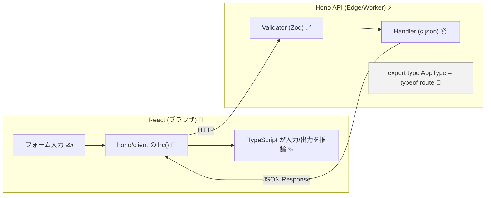
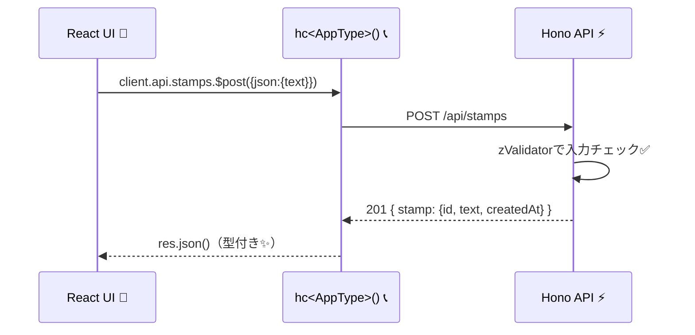

# 第285章：RPC (Remote Procedure Call) で型を共有する

この章は **「フロントとバックエンドで型がズレて泣く」** を卒業する回です🥹🎓
Hono の **RPC** を使うと、**サーバーのルート定義（Hono appの型）をそのままフロントで使える**ので、
「このAPI、何を送って何が返るの？」が **VS Code に全部出ます**🥳💡 ([Hono][1])

---

## 今日のゴール🏁🎯

* ✅ サーバー側で `AppType`（ルートの型）を export する
* ✅ フロント側で `hc<AppType>()` を作る
* ✅ `client.api.xxx.$post()` を呼ぶと、**入力も返り値も型が付く**のを体験する✨ ([Hono][1])

---

## 全体のイメージ図🗺️✨（型が流れる！）




---

## 1) サーバー側：型を export する（Hono RPCのキモ）🔧✨

ポイントはこれ👇

* **Validator（入力チェック）** を入れる（→ 入力型が推論される）
* 返すときは `c.json(..., ステータスコード)` をちゃんと指定（→ 返り値型がキレイになる） ([Hono][1])

### 使うパッケージ📦

（まだ入ってなければ）

```bash
npm i zod @hono/zod-validator
```

### `src/server/app.ts`（例：スタンプ送信API💌）

```ts
import { Hono } from "hono";
import { z } from "zod";
import { zValidator } from "@hono/zod-validator";

const app = new Hono();

// 入力の「形」を決める（これが型共有の源泉✨）
const createStampSchema = z.object({
  text: z.string().min(1).max(30),
});

type Stamp = {
  id: string;
  text: string;
  createdAt: string;
};

// 本当はDBに入れるけど、今回はメモリでOK🙆‍♀️
const stamps: Stamp[] = [];

// ✅ POST /api/stamps （スタンプ作成）
const route = app.post(
  "/api/stamps",
  zValidator("json", createStampSchema),
  async (c) => {
    const { text } = c.req.valid("json"); // ← ここも型付き✨

    const stamp: Stamp = {
      id: crypto.randomUUID(),
      text,
      createdAt: new Date().toISOString(),
    };
    stamps.unshift(stamp);

    // ✅ ステータスコードも付けると、クライアント側で分岐が気持ちいい✨
    return c.json({ stamp }, 201);
  }
);

// ✅ GET /api/stamps （一覧）
app.get("/api/stamps", (c) => {
  return c.json({ stamps }, 200);
});

// ✅ 404も c.json で返す（c.notFound() だと型推論が崩れやすい）🙅‍♀️
app.notFound((c) => c.json({ error: "not found" }, 404));

export type AppType = typeof route; // ← これをフロントで使う！✨
export default app;
```

> Hono RPCは「サーバーの `typeof app（または route）` を export して、クライアントの `hc` に渡すだけ」で型共有できます。 ([Hono][1])

---

## 2) フロント側：`hc<AppType>()` を作る🧡📞

### `.env`（Vite想定）🌱

ローカルのAPI URLを置いとくと便利です✨

```env
VITE_API_URL=http://localhost:8787/
```

### `src/lib/rpc.ts`

```ts
import { hc, InferResponseType } from "hono/client";
import type { AppType } from "../../server/app";

// ✅ 型共有クライアント
export const client = hc<AppType>(import.meta.env.VITE_API_URL);

// 便利：レスポンス型を取り出せる（必要なときだけでOK🙆‍♀️）
export type CreateStampResponse201 = InferResponseType<
  typeof client.api.stamps.$post,
  201
>;

export type GetStampsResponse200 = InferResponseType<
  typeof client.api.stamps.$get,
  200
>;
```

---

## 3) React側：フォームから呼んでみる🎀✨（型が気持ちよすぎる）

今回は React v19 の **Actions** をちょい使いして、
「送信中…」も可愛く出します😌⏳💕

### `src/App.tsx`

```tsx
import { useActionState, useEffect, useState } from "react";
import { client, type GetStampsResponse200 } from "./lib/rpc";

type ActionState = {
  message: string;
};

async function createStampAction(
  _prev: ActionState,
  formData: FormData
): Promise<ActionState> {
  const text = String(formData.get("text") ?? "").trim();

  // ✅ ここで「textが必須」って型とバリデーションで守られてる✨
  const res = await client.api.stamps.$post({
    json: { text },
  });

  // ✅ ステータスコードで分岐できる（型的にも安全）✨
  if (res.status === 201) {
    const data = await res.json(); // ← data.stamp が型付きで出る！
    return { message: `送れたよ〜🎉「${data.stamp.text}」` };
  }

  if (res.status === 404) {
    const data = await res.json();
    return { message: `えっ…404🥲 ${data.error}` };
  }

  // 想定外
  return { message: "なんか失敗したっぽい〜😭" };
}

export default function App() {
  const [state, formAction, isPending] = useActionState(createStampAction, {
    message: "",
  });

  const [stamps, setStamps] = useState<GetStampsResponse200["stamps"]>([]);

  async function reload() {
    const res = await client.api.stamps.$get();
    if (res.ok) {
      const data = await res.json();
      setStamps(data.stamps);
    }
  }

  useEffect(() => {
    void reload();
  }, []);

  useEffect(() => {
    // 送信メッセージが出たら一覧更新（雑でOK！）
    if (state.message) void reload();
  }, [state.message]);

  return (
    <div style={{ maxWidth: 520, margin: "24px auto", padding: 16 }}>
      <h1>スタンプ送信アプリ💌</h1>

      <form action={formAction} style={{ display: "flex", gap: 8 }}>
        <input
          name="text"
          placeholder="30文字までだよ〜🧸"
          style={{ flex: 1, padding: 8 }}
        />
        <button type="submit" disabled={isPending}>
          {isPending ? "送信中…⏳" : "送る📮"}
        </button>
      </form>

      {state.message && <p style={{ marginTop: 12 }}>{state.message}</p>}

      <hr style={{ margin: "16px 0" }} />

      <h2>届いたスタンプ一覧✨</h2>
      {stamps.length === 0 ? (
        <p>まだ何もないよ〜🥹</p>
      ) : (
        <ul>
          {stamps.map((s) => (
            <li key={s.id}>
              {s.text} <small>({new Date(s.createdAt).toLocaleString()})</small>
            </li>
          ))}
        </ul>
      )}
    </div>
  );
}
```

---

## 呼び出しの流れ（シーケンス図）📨➡️⚡➡️🧠



---

## ここが最高ポイント😍💡（型安全のご褒美）


* フロントで `client.api.stamps.$post({ json: { ... } })` と書くと
  **送るべき形がVS Codeに出る**（間違えるとその場で怒られる）✨ ([Hono][1])
* サーバー側で `c.json(..., 201)` みたいに **ステータスコードを明示**すると
  フロント側でも `res.status === 201` で **型がスッと決まる**✨ ([Hono][1])

---

## よくある落とし穴🕳️（ここだけ注意！）

### ① `c.notFound()` を使ったら `res.json()` が unknown っぽくなる🥲

Hono RPCは **Not Found を `c.json(..., 404)` で返す**ほうが型が安定します。 ([Hono][1])

### ② モノレポで型が変になる／効かない😵‍💫

Client/Server 両方の `tsconfig.json` で `compilerOptions.strict: true` が推奨です。 ([Hono][1])
あと、**hono のバージョン差**でも型が荒れることがあるので、同じバージョンに揃えるのが安心です。 ([Catalin's Tech][2])

### ③ IDEが重い（型推論がガチすぎる）🐢

Hono公式で「型を先にコンパイルして軽くする」テクも紹介されてます（大きい案件向け！）。 ([Hono][1])

---

## ミニ課題🎒✨（10〜20分）

1. `DELETE /api/stamps/:id` を追加してみよ🗑️

* 成功：`204`（空）
* 失敗：`404 { error: "not found" }`

2. フロントで

* 削除ボタンを付けて
* `res.status` で分岐してメッセージ出す💬

できたらもう「型ズレ」には戻れないよ…😇💕

---

## まとめ🎉

* Hono RPCは **サーバーの型（`typeof route/app`）を export → フロントの `hc<AppType>()` に渡す**だけでOK✨ ([Hono][1])
* Validator と `c.json(..., status)` を丁寧にすると、型推論がめちゃ綺麗😍
* これで **API定義ファイル地獄** から解放です🎊

---

次の第286章は、これをそのまま **Cloudflare Workers / Pages にデプロイ**して「世界に公開🌍」していくよ〜🚀

[1]: https://hono.dev/docs/guides/rpc "RPC - Hono"
[2]: https://catalins.tech/hono-rpc-in-monorepos/?utm_source=chatgpt.com "Hono RPC And TypeScript Project References - Catalin's Tech"
