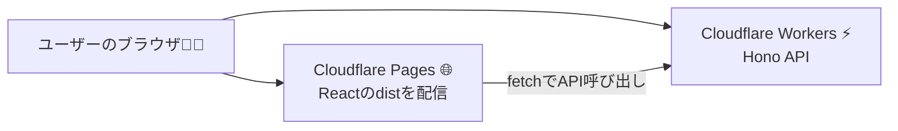

# 第286章：Cloudflare Workers / Pages へのデプロイ

「作ったアプリを、ネットに公開して“本当に使える状態”にする」章だよ〜！🎉✨
今日は **React（フロント）を Pages に**、**Hono API（バックエンド）を Workers に** 出せるようになるのがゴール👍💙

---

## 1) まず整理！Workers と Pages の役割🧠📦

* **Cloudflare Pages**：React（Vite）の `dist` を置いて、世界中に爆速配信📄⚡
* **Cloudflare Workers**：エッジで動く API（Hono など）を動かす🧪⚙️
* **Pages Functions**：Pages の中に `/functions` を置いて、Workers みたいに API を同居できる（同じ Workers の実行環境で動くよ）🏠🔧 ([Cloudflare Docs][1])

---

## 2) 全体像（図）🗺️✨（Mermaid）




---

## 3) React を Cloudflare Pages にデプロイする🌸📤

### A. いちばん王道：Git連携で自動デプロイ🔁✨

Cloudflare公式の React ガイドだと、**ビルドコマンドは `npm run build`、出力先は `dist`** になってるよ📦✅ ([Cloudflare Docs][2])

**ざっくり手順（ダッシュボード）🧭**

1. Cloudflare Dashboard → **Workers & Pages**
2. **Create application → Pages → Import an existing Git repository**
3. 設定でこんな感じ👇

   * Production branch: `main`
   * Build command: `npm run build`
   * Build directory: `dist` ([Cloudflare Docs][2])
4. デプロイ！🎉
   → `*.pages.dev` のURLがもらえる＆コミットごとに自動ビルドされるよ🚀 ([Cloudflare Docs][2])

---

### B. “今すぐ上げたい！”：Direct Upload（Wranglerでアップロード）⚡📦

Git連携なしで、ローカルのビルド成果物をそのまま上げる方法だよ✨
ただし **Direct Upload を選ぶと後から Git 連携に切り替えできない**（作り直しになる）点だけ注意ね🥺💦 ([Cloudflare Docs][3])

**手順（ターミナル / PowerShell）🖥️**

1. まず React をビルド

```bash
npm run build
```

（Viteなら `dist` ができるよ📁）

2. Pages のプロジェクト作成

```bash
npx wrangler pages project create
```

3. `dist` をデプロイ

```bash
npx wrangler pages deploy dist
```

このコマンドで `<PROJECT_NAME>.pages.dev` に公開されるよ〜！🎉🌈 ([Cloudflare Docs][3])

---

## 4) SPAの「リロードしたら404」対策🌀😇（超大事）

React Router みたいな SPA は、`/about` を直接開いたときに 404 になりがち💦
Pages では `_redirects` ファイルで **index.html に寄せる**のが定番だよ✅

* `_redirects` は **静的アセットディレクトリ**（Viteなら `public/` など）に置くのが良いよ📁 ([Cloudflare Docs][4])
* ただし **Pages Functions に当たるリクエストには `_redirects` が効かない**ので、Functions使うならそこはコード側で対応する感じになるよ⚠️ ([Cloudflare Docs][4])

例：`public/_redirects`（Viteだとビルド時に `dist` に入る）

```text
/* /index.html 200
```

---

## 5) Hono API を Cloudflare Workers にデプロイする⚡🧩

### A. まずは設定ファイル：wrangler.jsonc が今どき📝✨

Wrangler は **v3.91.0 以降、`wrangler.jsonc` / `wrangler.json` と `wrangler.toml` が使える**よ。新規は `wrangler.jsonc` 推しになってる👌 ([Cloudflare Docs][5])

（すでに `wrangler.toml` でも全然OKだよ🙆‍♀️）

### B. デプロイ（基本）🚀

Hono側プロジェクトのルートで👇

```bash
npx wrangler deploy
```

これで Workers に公開されるよ⚡🌍

---

## 6) 本番の秘密情報（APIキー等）は “Secrets” にする🔒🗝️

たとえば OpenAI キーとか、Supabase の service role とかね（漏れたら泣く🥲）

### Workers に secret を入れる（推奨）✅

```bash
npx wrangler secret put API_KEY
```

`wrangler secret put` は **新しいバージョンを作って即デプロイ**されるよ⚡🚀 ([Cloudflare Docs][6])

### ローカル開発用の .env / .dev.vars も便利だけど…🧪

`.env*` や `.dev.vars*` は **Git にコミットしない**でね！🙅‍♀️（`.gitignore`へ） ([Cloudflare Docs][6])

---

## 7) フロント（Pages）→ API（Workers）のつなぎ方🔗💙

### いちばんシンプル案：APIのURLを環境変数にする🌱

React側（Vite）で `import.meta.env` を使うよ✨

例：

```ts
const API_BASE = import.meta.env.VITE_API_BASE;

export async function fetchHello() {
  const res = await fetch(`${API_BASE}/api/hello`);
  if (!res.ok) throw new Error("API error");
  return res.json();
}
```

* **開発中**：`VITE_API_BASE=http://localhost:8787` みたいにする
* **本番**：Pages の環境変数に `VITE_API_BASE=https://xxxxx.workers.dev` を入れる

（Pages Functions で API を同居させるなら、`/api/...` を相対パスで叩けてさらにラクになるよ🏠✨ ([Cloudflare Docs][1])）

---

## 8) 今日のチェックリスト✅🌟

* [ ] `npm run build` して `dist` ができた📦
* [ ] Pages にデプロイできた（Git連携 or Direct Upload）🌐
* [ ] SPAのリロード404が出たら `_redirects` を追加できた🌀 ([Cloudflare Docs][4])
* [ ] Workers に `npx wrangler deploy` できた⚡
* [ ] 秘密情報は `npx wrangler secret put` に入れた🔒 ([Cloudflare Docs][6])
* [ ] フロントから API を呼べた🎯✨

---

## ミニ課題🎓💖（所要30〜60分くらい）

1. React を Pages に公開して、URLをスマホでも開いてみる📱✨
2. Hono API を Workers に公開して、ブラウザで `/api/hello` を叩いてJSONが返るのを確認🔍
3. React から fetch で API を呼んで、画面に表示する（成功したらスクショ撮りたくなるやつ😆📸）

---

必要なら次の第287章（D1）に向けて、**「Pages FunctionsにAPI同居」版の構成**と、**フォルダ例（/functions/api/hello.ts）**もセットで出すよ〜！🧁✨

[1]: https://developers.cloudflare.com/pages/functions/ "Functions · Cloudflare Pages docs"
[2]: https://developers.cloudflare.com/pages/framework-guides/deploy-a-react-site/ "React · Cloudflare Pages docs"
[3]: https://developers.cloudflare.com/pages/get-started/direct-upload/ "Direct Upload · Cloudflare Pages docs"
[4]: https://developers.cloudflare.com/pages/configuration/redirects/ "Redirects · Cloudflare Pages docs"
[5]: https://developers.cloudflare.com/workers/wrangler/configuration/ "Configuration - Wrangler · Cloudflare Workers docs"
[6]: https://developers.cloudflare.com/workers/configuration/secrets/ "Secrets · Cloudflare Workers docs"
