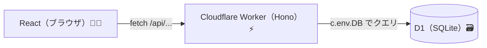
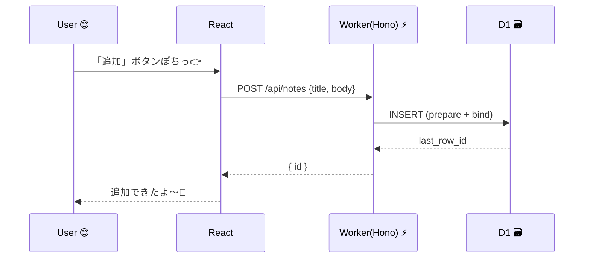

# 第287章：D1 (エッジデータベース) 入門

この章は「Cloudflare Workers（Hono）から、D1（SQLiteベースのDB）を使ってデータを保存＆取得する」入口だよ〜！😊
D1 は Cloudflare の **マネージドなサーバレスSQL（SQLite互換）DB** で、Workers から **バインディング（env）経由**で触れるのが基本スタイル✨ ([Cloudflare Docs][1])

---

## まずD1ってなに？ざっくり理解しよ〜 🧠✨

* D1 = **SQLiteのSQL感覚**で使える、CloudflareのDB
* Workers / Pages から **ほぼ直結**でクエリできる（バインディングで `env.DB` みたいに触る） ([Cloudflare Docs][1])
* **Time Travel（過去に戻す）**もあって、最長30日・分単位で復元できる（強い…！）🕰️ ([Cloudflare Docs][1])

---

## 全体のつながり（図解）🗺️✨




---

## 今日作るもの（ミニ）🎯✨

**「メモAPI」**を作って、D1 に保存するよ📌

* `GET /api/notes`：メモ一覧を返す
* `POST /api/notes`：メモを追加する

---

## 1) D1データベースを作る 🛠️✨（Wrangler）

PowerShell（またはターミナル）でOK！

### ✅ 1-1. Cloudflare にログイン

```bash
npx wrangler login
```

### ✅ 1-2. D1 を作成

例：`edge-notes-db` という名前で作るよ🌸

```bash
npx wrangler@latest d1 create edge-notes-db
```

成功すると、`database_id` が表示されるはず！それを後で使うよ📝
（この流れは公式の Getting started にもあるよ） ([Cloudflare Docs][2])

---

## 2) Worker に D1 を “バインド” する（設定ファイル）🔗✨

最近は **`wrangler.jsonc` 推し**（新機能がJSONでしか使えないこともある）なので、ここも `wrangler.jsonc` で行くね😊 ([Cloudflare Docs][3])

### ✅ `wrangler.jsonc`（例）

`database_id` はさっきのを貼ってね！

```jsonc
{
  "$schema": "./node_modules/wrangler/config-schema.json",
  "name": "edge-notes",
  "main": "src/index.ts",
  "compatibility_date": "2025-12-28",
  "d1_databases": [
    {
      "binding": "DB",
      "database_name": "edge-notes-db",
      "database_id": "ここにあなたのdatabase_id"
    }
  ]
}
```

これで Worker から `env.DB`（Honoなら `c.env.DB`）として使えるよ！ ([Cloudflare Docs][4])

---

## 3) マイグレーションでテーブルを作る 🧱✨

D1 は “SQLファイルで差分管理” が超おすすめ！
（チームでも未来の自分でも助かるやつ🫶）

### ✅ 3-1. マイグレーション作成

```bash
npx wrangler d1 migrations create edge-notes-db init
```

`migrations/` に SQL ファイルができるので、こんな感じにする👇

```sql
-- migrations/0001_init.sql
CREATE TABLE IF NOT EXISTS notes (
  id INTEGER PRIMARY KEY AUTOINCREMENT,
  title TEXT NOT NULL,
  body TEXT NOT NULL,
  created_at TEXT NOT NULL DEFAULT (datetime('now'))
);

CREATE INDEX IF NOT EXISTS idx_notes_created_at ON notes(created_at);
```

### ✅ 3-2. ローカルに反映（開発用）

```bash
npx wrangler d1 migrations apply edge-notes-db --local
```

### ✅ 3-3. 本番（リモート）に反映（必要なタイミングで）

```bash
npx wrangler d1 migrations apply edge-notes-db --remote
```

`--local / --remote` が公式で用意されてるよ🧠 ([Cloudflare Docs][5])

---

## 4) Hono から D1 を叩く（API実装）⚡🗃️

### ✅ ポイント：SQLは `prepare()` + `bind()` が基本だよ🛡️

これ、**SQLインジェクション対策**にもなるし、公式も “推奨” してる✨ ([Cloudflare Docs][6])

### `src/index.ts`（Workers + Hono）

```ts
import { Hono } from "hono";

type Bindings = {
  DB: D1Database;
};

const app = new Hono<{ Bindings: Bindings }>();

app.get("/api/notes", async (c) => {
  const { results } = await c.env.DB.prepare(
    "SELECT id, title, body, created_at FROM notes ORDER BY id DESC LIMIT 50"
  ).all();

  return c.json(results);
});

app.post("/api/notes", async (c) => {
  const data = await c.req.json<{ title: string; body: string }>();

  if (!data.title?.trim() || !data.body?.trim()) {
    return c.json({ message: "title と body は必須だよ〜🥺" }, 400);
  }

  const result = await c.env.DB.prepare(
    "INSERT INTO notes (title, body) VALUES (?, ?)"
  )
    .bind(data.title, data.body)
    .run();

  return c.json({ id: result.meta.last_row_id });
});

export default app;
```

Hono では **`c.env` に bindings が来る**ので、`c.env.DB` でD1に触れるよ〜！ ([Cloudflare Docs][7])

---

## 5) ローカルで動かす（D1込みで動くよ！）🏃‍♀️💨

```bash
npx wrangler dev
```

いまの Wrangler は **`wrangler dev` がローカルモード標準**で、D1 もローカルの別DBとして動くよ✨
しかもローカルは **本番データに勝手に繋がらない**から安心😊 ([Cloudflare Docs][8])

### 🌟注意：ローカルDBは “基本、保持される”

Wrangler v3+ は `wrangler dev` を止めても **データが残る**のが普通だよ！
まっさらで試したいなら `DROP TABLE ...` などで消してから作り直す感じ👌 ([Cloudflare Docs][8])

---

## 6) ちょいテスト（SQL直打ち）🔍✨

ローカルに1件入れてみよ〜！

```bash
npx wrangler d1 execute edge-notes-db --local --command "INSERT INTO notes (title, body) VALUES ('hello', 'D1たのしい！')"
```

一覧も見てみる👇

```bash
npx wrangler d1 execute edge-notes-db --local --command "SELECT * FROM notes ORDER BY id DESC"
```

`d1 execute` にも `--local/--remote` があるよ〜！ ([Cloudflare Docs][5])

---

## React側から呼ぶイメージ（ミニ）📱✨

もし React（Vite）側が別ポートなら、開発中はプロキシが楽ちん😺

### `vite.config.ts`（例）

```ts
import { defineConfig } from "vite";
import react from "@vitejs/plugin-react";

export default defineConfig({
  plugins: [react()],
  server: {
    proxy: {
      "/api": "http://127.0.0.1:8787",
    },
  },
});
```

これで React から `fetch("/api/notes")` でOKになりやすいよ🙌

---

## リクエストの流れ（図解）📨✨



---

## ちょい先取り（すごいやつ）🌍⚡

D1 には **Global Read Replication（読み取りレプリカ）**があって、うまく使うと世界中で読み込みが速くなる方向があるよ〜！
さらに “セッション” を使うと **同じユーザーの操作で整合性（read my own writes みたいな性質）を保つ**設計もある✨ ([The Cloudflare Blog][9])

（ここは第288章以降の「未来」と繋がるゾーンだね😳）

---

## まとめ 🎀

* D1 は **SQLite互換のサーバレスDB**で、Workers と相性バツグン🗃️⚡ ([Cloudflare Docs][1])
* 設定は **バインディング（DB）** → コードは `c.env.DB` で触る😊 ([Cloudflare Docs][7])
* クエリは **prepare + bind** が基本で安全🛡️ ([Cloudflare Docs][6])
* ローカル開発は `wrangler dev` でOK（ローカルDBで動く）🙌 ([Cloudflare Docs][8])

---

## おまけ課題（やると強い💪✨）

* ✅ `DELETE /api/notes/:id` を追加して「削除」できるようにする🧹
* ✅ `title` を部分一致検索する `GET /api/notes?query=...` を作る🔎
* ✅ `created_at` の表示を “いい感じの日時” に整える⏰

必要なら、この章の続きとして「React側のUI（一覧＋追加フォーム）まで完成」も、まるっと作るよ〜😊💖

[1]: https://developers.cloudflare.com/d1/ "Overview · Cloudflare D1 docs"
[2]: https://developers.cloudflare.com/d1/get-started/ "Getting started · Cloudflare D1 docs"
[3]: https://developers.cloudflare.com/workers/wrangler/configuration/ "Configuration - Wrangler · Cloudflare Workers docs"
[4]: https://developers.cloudflare.com/d1/worker-api/d1-database/ "D1 Database · Cloudflare D1 docs"
[5]: https://developers.cloudflare.com/workers/wrangler/commands/ "Commands - Wrangler · Cloudflare Workers docs"
[6]: https://developers.cloudflare.com/d1/worker-api/prepared-statements/ "Prepared statement methods · Cloudflare D1 docs"
[7]: https://developers.cloudflare.com/d1/examples/d1-and-hono/ "Query D1 from Hono · Cloudflare D1 docs"
[8]: https://developers.cloudflare.com/d1/best-practices/local-development/ "Local development · Cloudflare D1 docs"
[9]: https://blog.cloudflare.com/d1-read-replication-beta/ "Sequential consistency without borders: how D1 implements global read replication"
