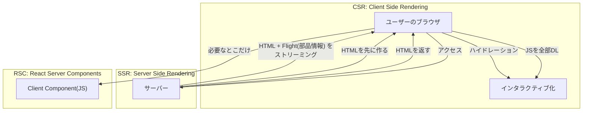
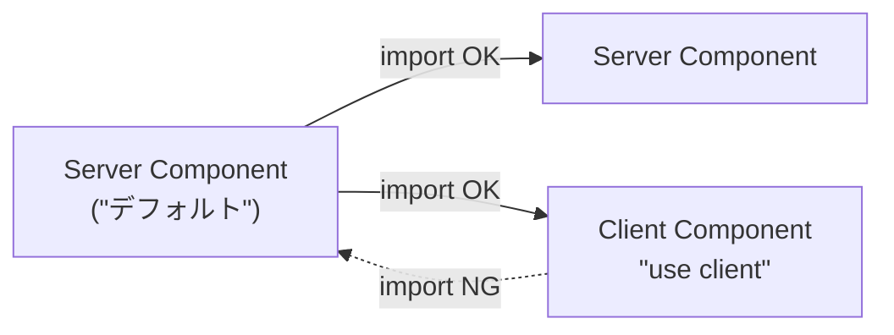

# 第288章：React Server Components (RSC) の未来とHono

### 今回のゴール 🎯

* **RSCって何者？**（SSR/CSRとどう違うの？）を“ふわっと”じゃなく理解する🧠✨
* **Hono × RSC** がなぜ相性いいのか、構成イメージを掴む🧩
* **実際に動く雛形**を触って「Server / Client の境界」を体感する🖐️💻

---

## 1) RSCって結局なに？🧸⚛️

RSC（React Server Components）は、ざっくり言うと👇

* **サーバーで動くコンポーネント**（DBアクセスや秘密鍵が必要な処理もOK🔑）
* でも、ページ全部を“HTMLだけ”で返すのとは違って、**Reactの部品情報（Flight）も一緒に運ぶ**タイプ
* “サーバー”は、クライアントや普通のSSRサーバーとは別環境として扱えるよ、という位置づけ（＝設計がしやすい） ([React][1])

---

## 2) SSR/CSR/RSCの関係を一枚で🖼️✨




ポイントはここ👇😊

* **SSR**は「HTML作って返す」＋「あとでハイドレーション」
* **RSC**は「サーバー側で作った“Reactの部品情報”を、ブラウザが受け取って組み立てる」イメージ（Flightって呼ばれるやつ） ([Qiita][2])

---

## 3) “use client” が境界線 🚧🧡

RSCの世界では、基本は **Server Component（サーバー側）** で、
「ここだけブラウザで動かしたい！」ってファイルにだけ **`"use client"`** を付けます✍️✨



* ✅ Server → Client は呼べる（ページの中にボタン置く、みたいに）
* ❌ Client → Server は呼べない（ブラウザはDB直アクセスできないよね…😇）

---

## 4) なんでHonoと相性いいの？🌩️🚀

Honoは **Web標準ベース**で、**Cloudflare WorkersみたいなEdge**で動かすのが得意✨ ([hono.dev][3])
RSCは **ストリーミング**や“サーバー側で先にやる”のが強みなので、Edgeの軽さと噛み合いやすい、って感じ💡

さらにHonoは、Reactとは別に **hono/jsx** や **Client Components（hono/jsx/dom）** っていう超軽量路線も持ってる（用途で選べるのが強い） ([hono.dev][4])

---

## 5) まずは動かして体感しよ！💻✨（Hono + Vite + RSC 雛形）

HonoでRSCをサクッと試せるボイラープレートが紹介されています ([Zenn][5])
ここではそのREADME通りに動かすよ〜！🍀

### 手順（Windows）🪟

PowerShell（またはターミナル）で👇

```bash
git clone https://github.com/kfly8/boilerplate-hono-vite-rsc.git
cd boilerplate-hono-vite-rsc
npm install
npm run dev
```

* ブラウザで `http://localhost:5173` を開く（READMEにも書いてあるよ） ([GitHub][6])

### フォルダ構成（どこ見ればいい？）👀

この雛形だと、ざっくり👇がヒント🍯

* `src/routes/` … 画面（ルーティング）
* `src/rsc/` … RSCのエントリやレンダラ（RSCの心臓部🫀） ([GitHub][6])

---

## 6) ちょい改造：Client Component を1つ足す 🎮✨

「押したら数字増えるボタン」みたいな、**ブラウザで動く**やつを作ろう！

### (1) Client Component を作る

例：`src/routes/home/components/Counter.client.tsx` を作って👇

```tsx
"use client";

import { useState } from "react";

export function Counter() {
  const [count, setCount] = useState(0);

  return (
    <button
      onClick={() => setCount((c) => c + 1)}
      style={{
        padding: 12,
        borderRadius: 12,
        border: "1px solid #ccc",
        cursor: "pointer",
      }}
    >
      クリック 👉 {count}
    </button>
  );
}
```

* `"use client"` は**いちばん上**に置くのが大事だよ🧷✨

### (2) Server Component 側（ページ）から呼ぶ

例：`src/routes/home/page.tsx`（名前は雛形側と違うかもだけど、homeのpageを探してね🔍）で👇みたいに置く：

```tsx
import { Counter } from "./components/Counter.client";

export default function Page() {
  return (
    <main style={{ padding: 24 }}>
      <h1>Hono × RSC 体験中 ✨</h1>
      <p>下のボタンだけ、ブラウザで動くよ〜🧡</p>
      <Counter />
    </main>
  );
}
```

これで「ページはサーバー寄り、ボタンはクライアント寄り」っていう **混在**が体感できるはず！🥳

---

## 7) “未来”の話：HonoでRSCはどう育つ？🌱🔮

* HonoでRSCを使う実例・試行が出てきてて、「HonoでインタラクティブUI作るならRSCいいかも」って話もあります ([Zenn][5])
* 一方で、Hono系フルスタックの **HonoX** は「Hono + React + Vite + SSR」みたいな思想で、RSCはまだ議論・要望段階っぽい空気もあるよ（Issueが立ってる） ([Qiita][7])

つまり今は、

* **ガチ安定運用**：既にRSCを強く統合してるフレームワーク（例：Next系）
* **軽量&自由度**：Honoベースで必要なものを組む（今回みたいな雛形）
  この2択を、目的で選ぶ時代って感じ😌✨

---

## 8) 超大事：RSCのセキュリティ注意（2025年12月の話）🚨🧯

2025年12月に、RSCの仕組み（Flight payloadのデコード周り）に関連した **未認証RCEの脆弱性**が告知されています。Reactチームは「すぐ更新してね」と強く推奨しています ([React][8])
JPCERT/CC からも注意喚起が出ています ([jpcert.or.jp][9])

なので当面は👇を徹底しよ🙏

* ✅ React関連を **最新パッチ**へアップデート
* ✅ RSC/Server Function系のエンドポイントを、むやみに外へ公開しない（認証・制限・WAFも検討）
* ✅ “サンプルだからOK”で放置しない（雛形ほど危ない😇）

---

## まとめ 🎀

* RSCは「サーバーでReactを組み立てつつ、必要なところだけクライアントにJSを渡す」発想✨ ([React][1])
* HonoはEdge適性が高く、RSCの“ストリーミング/サーバー寄り”と噛み合いやすい🌩️ ([Cloudflare Docs][10])
* まずは雛形で「`"use client"` の境界」を手で触るのが最短ルート💨 ([GitHub][6])
* そして今はセキュリティが特に大事！🚨 ([React][8])

---

## ミニ課題（5〜20分）📝✨

1. `Counter` を「+1」だけじゃなく「-1」も付ける ➖➕😊
2. `Counter` の下に「偶数なら🎉、奇数なら🌀」を表示（条件分岐）
3. Server Component側で `new Date().toLocaleString()` を表示して、**ページ更新すると時間が変わる**のを確認⌛

---

次の章（289章）は「認証とミドルウェア」だから、ここで掴んだ **“サーバー側でやること”**の感覚がめちゃ効いてくるよ〜😺🧡

[1]: https://react.dev/reference/rsc/server-components?utm_source=chatgpt.com "Server Components"
[2]: https://qiita.com/fiord/items/f2da12e63667f17b092b?utm_source=chatgpt.com "React の Flight Protocol って何？"
[3]: https://hono.dev/?utm_source=chatgpt.com "Hono - Web framework built on Web Standards"
[4]: https://hono.dev/docs/guides/jsx-dom?utm_source=chatgpt.com "Client Components"
[5]: https://zenn.dev/kfly8/articles/hono-meets-vite-rsc?utm_source=chatgpt.com "Honoでインタラクティブなコンポーネントを作る時、React ..."
[6]: https://github.com/kfly8/boilerplate-hono-vite-rsc "GitHub - kfly8/boilerplate-hono-vite-rsc: A modern web application boilerplate using Hono framework with Vite and React Server Components (RSC)."
[7]: https://qiita.com/Takumi-4Y/items/a79f9acb31d9dc17b243?utm_source=chatgpt.com "Next.js と何が違う？HonoX 入門 〜思想と設計から見る比較〜"
[8]: https://react.dev/blog/2025/12/03/critical-security-vulnerability-in-react-server-components?utm_source=chatgpt.com "Critical Security Vulnerability in React Server Components"
[9]: https://www.jpcert.or.jp/newsflash/2025120501.html?utm_source=chatgpt.com "React Server Componentsの脆弱性（CVE-2025-55182） ..."
[10]: https://developers.cloudflare.com/workers/framework-guides/web-apps/more-web-frameworks/hono/?utm_source=chatgpt.com "Hono - Workers"
