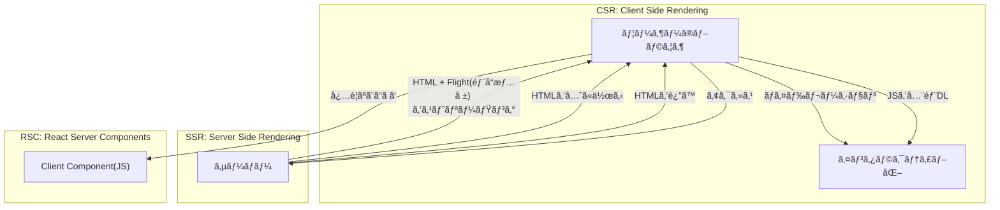
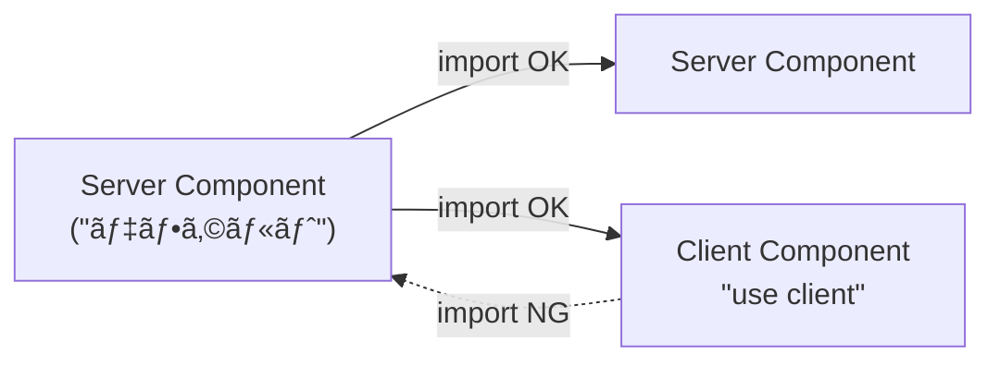

# 第288章：React Server Components (RSC) ã®æœªæ¥ã¨Hono

### 今å›ã®ã‚´ãƒ¼ãƒ« ğŸ¯

* **RSCã£ã¦ä½•è€…？**（SSR/CSRã¨ã©ã†é•ã†ã®ï¼Ÿï¼‰ã‚’“ãµã‚ã£ã¨â€ã˜ã‚ƒãªãç†è§£ã™ã‚‹ğŸ§ âœ¨
* **Hono × RSC** ãŒãªãœç›¸æ€§ã„ã„ã®ã‹ã€æ§‹æˆã‚¤ãƒ¡ãƒ¼ã‚¸ã‚’æ´ã‚€ğŸ§©
* **実際ã«å‹•ã雛形**を触ã£ã¦ã€ŒServer / Client ã®å¢ƒç•Œã€ã‚’体感ã™ã‚‹ğŸ–ï¸ğŸ’»

---

## 1) RSCã£ã¦çµå±€ãªã«ï¼ŸğŸ§¸âš›ï¸

RSC（React Server Components）ã¯ã€ã–ã£ãり言ã†ã¨ğŸ‘‡

* **サーãƒãƒ¼ã§å‹•ãコンãƒãƒ¼ãƒãƒ³ãƒˆ**（DBアクセスや秘密éµãŒå¿…è¦ãªå‡¦ç†ã‚‚OK🔑）
* ã§ã‚‚ã€ãƒšãƒ¼ã‚¸å…¨éƒ¨ã‚’“HTMLã ã‘â€ã§è¿”ã™ã®ã¨ã¯é•ã£ã¦ã€**Reactã®éƒ¨å“情報（Flight）も一緒ã«é‹ã¶**タイプ
* “サーãƒãƒ¼â€ã¯ã€ã‚¯ãƒ©ã‚¤ã‚¢ãƒ³ãƒˆã‚„普通ã®SSRサーãƒãƒ¼ã¨ã¯åˆ¥ç’°å¢ƒã¨ã—ã¦æ‰±ãˆã‚‹ã‚ˆã€ã¨ã„ã†ä½ç½®ã¥ã‘（ï¼è¨­è¨ˆãŒã—ã‚„ã™ã„） ([React][1])

---

## 2) SSR/CSR/RSCã®é–¢ä¿‚を一æšã§ğŸ–¼ï¸âœ¨



```mermaid
flowchart TB
  U[ユーザーã®ãƒ–ラウザ] -->|アクセス| S[サーãƒãƒ¼]
  S -->|HTMLã‚’è¿”ã™| U

  subgraph CSR["CSR: Client Side Rendering"]
    U -->|JSを全部DL| U2[ブラウザã§æç”»]
  end

  subgraph SSR["SSR: Server Side Rendering"]
    S -->|HTMLã‚’å…ˆã«ä½œã‚‹| U
    U -->|ãƒã‚¤ãƒ‰ãƒ¬ãƒ¼ã‚·ãƒ§ãƒ³| U2["インタラクティブ化"]
  end

  subgraph RSC["RSC: React Server Components"]
    S -->|"HTML + Flight(部å“情報) をストリーミング"| U
    U -->|å¿…è¦ãªã¨ã“ã ã‘| C["Client Component(JS)"]
  end
```

ãƒã‚¤ãƒ³ãƒˆã¯ã“ã“👇😊

* **SSR**ã¯ã€ŒHTML作ã£ã¦è¿”ã™ã€ï¼‹ã€Œã‚ã¨ã§ãƒã‚¤ãƒ‰ãƒ¬ãƒ¼ã‚·ãƒ§ãƒ³ã€
* **RSC**ã¯ã€Œã‚µãƒ¼ãƒãƒ¼å´ã§ä½œã£ãŸâ€œReactã®éƒ¨å“情報â€ã‚’ã€ãƒ–ラウザãŒå—ã‘å–ã£ã¦çµ„ã¿ç«‹ã¦ã‚‹ã€ã‚¤ãƒ¡ãƒ¼ã‚¸ï¼ˆFlightã£ã¦å‘¼ã°ã‚Œã‚‹ã‚„ã¤ï¼‰ ([Qiita][2])

---

## 3) “use client†ãŒå¢ƒç•Œç·š 🚧🧡


RSCã®ä¸–ç•Œã§ã¯ã€åŸºæœ¬ã¯ **Server Component（サーãƒãƒ¼å´ï¼‰** ã§ã€
「ã“ã“ã ã‘ブラウザã§å‹•ã‹ã—ãŸã„ï¼ã€ã£ã¦ãƒ•ã‚¡ã‚¤ãƒ«ã«ã ã‘ **`"use client"`** を付ã‘ã¾ã™âœï¸âœ¨


```mermaid
flowchart LR
  SC["Server Component<br>(#quot;デフォルト#quot;)"] -->|import OK| SC2["Server Component"]
  SC -->|import OK| CC["Client Component<br>#quot;use client#quot;"]
  CC -.->|import NG| SC
```

* ✅ Server → Client ã¯å‘¼ã¹ã‚‹ï¼ˆãƒšãƒ¼ã‚¸ã®ä¸­ã«ãƒœã‚¿ãƒ³ç½®ãã€ã¿ãŸã„ã«ï¼‰
* ⌠Client → Server ã¯å‘¼ã¹ãªã„（ブラウザã¯DB直アクセスã§ããªã„よã­â€¦ğŸ˜‡ï¼‰


---

## 4) ãªã‚“ã§Honoã¨ç›¸æ€§ã„ã„ã®ï¼ŸğŸŒ©ï¸ğŸš€


Hono㯠**Web標準ベース**ã§ã€**Cloudflare Workersã¿ãŸã„ãªEdge**ã§å‹•ã‹ã™ã®ãŒå¾—æ„✨ ([hono.dev][3])
RSC㯠**ストリーミング**や“サーãƒãƒ¼å´ã§å…ˆã«ã‚„ã‚‹â€ã®ãŒå¼·ã¿ãªã®ã§ã€Edgeã®è»½ã•ã¨å™›ã¿åˆã„ã‚„ã™ã„ã€ã£ã¦æ„Ÿã˜ğŸ’¡

ã•ã‚‰ã«Honoã¯ã€Reactã¨ã¯åˆ¥ã« **hono/jsx** ã‚„ **Client Components（hono/jsx/dom）** ã£ã¦ã„ã†è¶…軽é‡è·¯ç·šã‚‚æŒã£ã¦ã‚‹ï¼ˆç”¨é€”ã§é¸ã¹ã‚‹ã®ãŒå¼·ã„） ([hono.dev][4])

---

## 5) ã¾ãšã¯å‹•ã‹ã—ã¦ä½“æ„Ÿã—よï¼ğŸ’»âœ¨ï¼ˆHono + Vite + RSC 雛形）

Honoã§RSCをサクッã¨è©¦ã›ã‚‹ãƒœã‚¤ãƒ©ãƒ¼ãƒ—レートãŒç´¹ä»‹ã•ã‚Œã¦ã„ã¾ã™ ([Zenn][5])
ã“ã“ã§ã¯ãã®README通りã«å‹•ã‹ã™ã‚ˆã€œï¼ğŸ€

### 手順（Windows）🪟

PowerShell（ã¾ãŸã¯ã‚¿ãƒ¼ãƒŸãƒŠãƒ«ï¼‰ã§ğŸ‘‡

```bash
git clone https://github.com/kfly8/boilerplate-hono-vite-rsc.git
cd boilerplate-hono-vite-rsc
npm install
npm run dev
```

* ブラウザ㧠`http://localhost:5173` ã‚’é–‹ã（READMEã«ã‚‚書ã„ã¦ã‚るよ） ([GitHub][6])

### フォルダ構æˆï¼ˆã©ã“見れã°ã„ã„？）👀


ã“ã®é››å½¢ã ã¨ã€ã–ã£ãり👇ãŒãƒ’ントğŸ¯

* `src/routes/` … ç”»é¢ï¼ˆãƒ«ãƒ¼ãƒ†ã‚£ãƒ³ã‚°ï¼‰
* `src/rsc/` … RSCã®ã‚¨ãƒ³ãƒˆãƒªã‚„レンダラ（RSCã®å¿ƒè‡“部🫀） ([GitHub][6])

---

## 6) ã¡ã‚‡ã„改造：Client Component ã‚’1ã¤è¶³ã™ ğŸ®âœ¨

「押ã—ãŸã‚‰æ•°å­—増ãˆã‚‹ãƒœã‚¿ãƒ³ã€ã¿ãŸã„ãªã€**ブラウザã§å‹•ã**ã‚„ã¤ã‚’作ã‚ã†ï¼

### (1) Client Component を作る


例：`src/routes/home/components/Counter.client.tsx` を作ã£ã¦ğŸ‘‡

```tsx
"use client";

import { useState } from "react";

export function Counter() {
  const [count, setCount] = useState(0);

  return (
    <button
      onClick={() => setCount((c) => c + 1)}
      style={{
        padding: 12,
        borderRadius: 12,
        border: "1px solid #ccc",
        cursor: "pointer",
      }}
    >
      クリック 👉 {count}
    </button>
  );
}
```

* `"use client"` ã¯**ã„ã¡ã°ã‚“上**ã«ç½®ãã®ãŒå¤§äº‹ã ã‚ˆğŸ§·âœ¨

### (2) Server Component å´ï¼ˆãƒšãƒ¼ã‚¸ï¼‰ã‹ã‚‰å‘¼ã¶

例：`src/routes/home/page.tsx`（åå‰ã¯é››å½¢å´ã¨é•ã†ã‹ã‚‚ã ã‘ã©ã€homeã®pageã‚’æ¢ã—ã¦ã­ğŸ”）ã§ğŸ‘‡ã¿ãŸã„ã«ç½®ã：

```tsx
import { Counter } from "./components/Counter.client";

export default function Page() {
  return (
    <main style={{ padding: 24 }}>
      <h1>Hono × RSC 体験中 ✨</h1>
      <p>下ã®ãƒœã‚¿ãƒ³ã ã‘ã€ãƒ–ラウザã§å‹•ãよ〜🧡</p>
      <Counter />
    </main>
  );
}
```

ã“ã‚Œã§ã€Œãƒšãƒ¼ã‚¸ã¯ã‚µãƒ¼ãƒãƒ¼å¯„ã‚Šã€ãƒœã‚¿ãƒ³ã¯ã‚¯ãƒ©ã‚¤ã‚¢ãƒ³ãƒˆå¯„ã‚Šã€ã£ã¦ã„ㆠ**混在**ãŒä½“æ„Ÿã§ãã‚‹ã¯ãšï¼ğŸ¥³

---

## 7) “未æ¥â€ã®è©±ï¼šHonoã§RSCã¯ã©ã†è‚²ã¤ï¼ŸğŸŒ±ğŸ”®

* Honoã§RSCを使ã†å®Ÿä¾‹ãƒ»è©¦è¡ŒãŒå‡ºã¦ãã¦ã¦ã€ã€ŒHonoã§ã‚¤ãƒ³ã‚¿ãƒ©ã‚¯ãƒ†ã‚£ãƒ–UI作るãªã‚‰RSCã„ã„ã‹ã‚‚ã€ã£ã¦è©±ã‚‚ã‚ã‚Šã¾ã™ ([Zenn][5])
* 一方ã§ã€Hono系フルスタック㮠**HonoX** ã¯ã€ŒHono + React + Vite + SSRã€ã¿ãŸã„ãªæ€æƒ³ã§ã€RSCã¯ã¾ã è­°è«–・è¦æœ›æ®µéšã£ã½ã„空気もã‚るよ（IssueãŒç«‹ã£ã¦ã‚‹ï¼‰ ([Qiita][7])

ã¤ã¾ã‚Šä»Šã¯ã€

* **ガãƒå®‰å®šé‹ç”¨**：既ã«RSCã‚’å¼·ãçµ±åˆã—ã¦ã‚‹ãƒ•ãƒ¬ãƒ¼ãƒ ãƒ¯ãƒ¼ã‚¯ï¼ˆä¾‹ï¼šNext系）
* **軽é‡&自由度**：Honoベースã§å¿…è¦ãªã‚‚ã®ã‚’組む（今å›ã¿ãŸã„ãªé››å½¢ï¼‰
  ã“ã®2æŠã‚’ã€ç›®çš„ã§é¸ã¶æ™‚代ã£ã¦æ„Ÿã˜ğŸ˜Œâœ¨

---

## 8) 超大事：RSCã®ã‚»ã‚­ãƒ¥ãƒªãƒ†ã‚£æ³¨æ„（2025å¹´12月ã®è©±ï¼‰ğŸš¨ğŸ§¯


2025å¹´12月ã«ã€RSCã®ä»•çµ„ã¿ï¼ˆFlight payloadã®ãƒ‡ã‚³ãƒ¼ãƒ‰å‘¨ã‚Šï¼‰ã«é–¢é€£ã—㟠**未èªè¨¼RCEã®è„†å¼±æ€§**ãŒå‘ŠçŸ¥ã•ã‚Œã¦ã„ã¾ã™ã€‚Reactãƒãƒ¼ãƒ ã¯ã€Œã™ãæ›´æ–°ã—ã¦ã­ã€ã¨å¼·ãæ¨å¥¨ã—ã¦ã„ã¾ã™ ([React][8])
JPCERT/CC ã‹ã‚‰ã‚‚注æ„å–šèµ·ãŒå‡ºã¦ã„ã¾ã™ ([jpcert.or.jp][9])

ãªã®ã§å½“é¢ã¯ğŸ‘‡ã‚’徹底ã—よğŸ™

* ✅ React関連を **最新パッãƒ**ã¸ã‚¢ãƒƒãƒ—デート
* ✅ RSC/Server Functionç³»ã®ã‚¨ãƒ³ãƒ‰ãƒã‚¤ãƒ³ãƒˆã‚’ã€ã‚€ã‚„ã¿ã«å¤–ã¸å…¬é–‹ã—ãªã„（èªè¨¼ãƒ»åˆ¶é™ãƒ»WAFも検è¨ï¼‰
* ✅ “サンプルã ã‹ã‚‰OKâ€ã§æ”¾ç½®ã—ãªã„（雛形ã»ã©å±ãªã„😇）

---

## ã¾ã¨ã‚ ğŸ€

* RSCã¯ã€Œã‚µãƒ¼ãƒãƒ¼ã§Reactを組ã¿ç«‹ã¦ã¤ã¤ã€å¿…è¦ãªã¨ã“ã‚ã ã‘クライアントã«JSを渡ã™ã€ç™ºæƒ³âœ¨ ([React][1])
* Honoã¯Edgeé©æ€§ãŒé«˜ãã€RSCã®â€œã‚¹ãƒˆãƒªãƒ¼ãƒŸãƒ³ã‚°/サーãƒãƒ¼å¯„ã‚Šâ€ã¨å™›ã¿åˆã„ã‚„ã™ã„ğŸŒ©ï¸ ([Cloudflare Docs][10])
* ã¾ãšã¯é››å½¢ã§ã€Œ`"use client"` ã®å¢ƒç•Œã€ã‚’手ã§è§¦ã‚‹ã®ãŒæœ€çŸ­ãƒ«ãƒ¼ãƒˆğŸ’¨ ([GitHub][6])
* ãã—ã¦ä»Šã¯ã‚»ã‚­ãƒ¥ãƒªãƒ†ã‚£ãŒç‰¹ã«å¤§äº‹ï¼ğŸš¨ ([React][8])

---

## ミニ課題（5〜20分）ğŸ“✨

1. `Counter` を「+1ã€ã ã‘ã˜ã‚ƒãªã「-1ã€ã‚‚付ã‘ã‚‹ â–â•ğŸ˜Š
2. `Counter` ã®ä¸‹ã«ã€Œå¶æ•°ãªã‚‰ğŸ‰ã€å¥‡æ•°ãªã‚‰ğŸŒ€ã€ã‚’表示（æ¡ä»¶åˆ†å²ï¼‰
3. Server Componentå´ã§ `new Date().toLocaleString()` を表示ã—ã¦ã€**ページ更新ã™ã‚‹ã¨æ™‚é–“ãŒå¤‰ã‚ã‚‹**ã®ã‚’確èªâŒ›

---

次ã®ç« ï¼ˆ289章）ã¯ã€Œèªè¨¼ã¨ãƒŸãƒ‰ãƒ«ã‚¦ã‚§ã‚¢ã€ã ã‹ã‚‰ã€ã“ã“ã§æ´ã‚“ã  **“サーãƒãƒ¼å´ã§ã‚„ã‚‹ã“ã¨â€**ã®æ„Ÿè¦šãŒã‚ã¡ã‚ƒåŠ¹ã„ã¦ãるよ〜😺🧡

[1]: https://react.dev/reference/rsc/server-components?utm_source=chatgpt.com "Server Components"
[2]: https://qiita.com/fiord/items/f2da12e63667f17b092b?utm_source=chatgpt.com "React ã® Flight Protocol ã£ã¦ä½•ï¼Ÿ"
[3]: https://hono.dev/?utm_source=chatgpt.com "Hono - Web framework built on Web Standards"
[4]: https://hono.dev/docs/guides/jsx-dom?utm_source=chatgpt.com "Client Components"
[5]: https://zenn.dev/kfly8/articles/hono-meets-vite-rsc?utm_source=chatgpt.com "Honoã§ã‚¤ãƒ³ã‚¿ãƒ©ã‚¯ãƒ†ã‚£ãƒ–ãªã‚³ãƒ³ãƒãƒ¼ãƒãƒ³ãƒˆã‚’作る時ã€React ..."
[6]: https://github.com/kfly8/boilerplate-hono-vite-rsc "GitHub - kfly8/boilerplate-hono-vite-rsc: A modern web application boilerplate using Hono framework with Vite and React Server Components (RSC)."
[7]: https://qiita.com/Takumi-4Y/items/a79f9acb31d9dc17b243?utm_source=chatgpt.com "Next.js ã¨ä½•ãŒé•ã†ï¼ŸHonoX 入門 〜æ€æƒ³ã¨è¨­è¨ˆã‹ã‚‰è¦‹ã‚‹æ¯”較〜"
[8]: https://react.dev/blog/2025/12/03/critical-security-vulnerability-in-react-server-components?utm_source=chatgpt.com "Critical Security Vulnerability in React Server Components"
[9]: https://www.jpcert.or.jp/newsflash/2025120501.html?utm_source=chatgpt.com "React Server Componentsã®è„†å¼±æ€§ï¼ˆCVE-2025-55182） ..."
[10]: https://developers.cloudflare.com/workers/framework-guides/web-apps/more-web-frameworks/hono/?utm_source=chatgpt.com "Hono - Workers"
