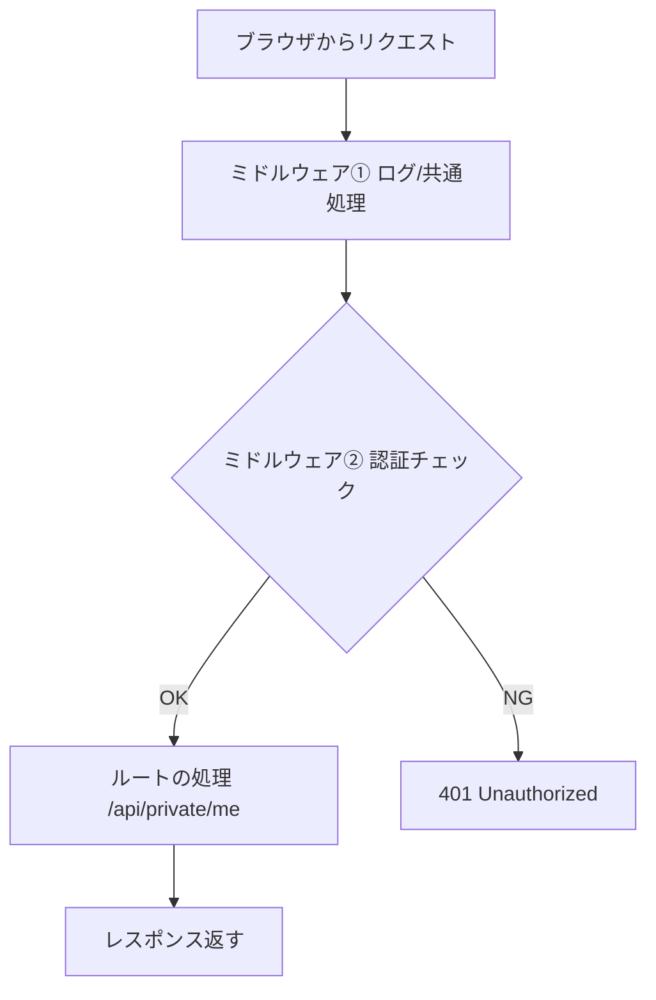

# 第289章：認証とミドルウェア

今日は「**ログインしてる人だけ見れるAPI**」を、**ミドルウェア**でスパッと守れるようにするよ〜！🥳
（※学習用に、ユーザー確認は“固定ユーザー”で超シンプルにします🙏 本番は後半の「発展」へ✨）

---

## 今日のゴール🎯

* `/api/login` でログイン → **JWTを作ってCookieに保存**🍪
* `/api/private/*` は **JWTミドルウェア**で保護🛡️
* React側から `fetch` して「ログインできた！」を体験する💖

---

## まずミドルウェアって何？🧩

ミドルウェアは「**ルート処理の前後**」に割り込んで、チェックや共通処理をする仕組みだよ✨
`await next()` したら次へ進んで、途中で `Response` を返したらそこで止められる（＝門番できる！）🚪🧑‍✈️ ([hono.dev][1])

### イメージ図（門番チェーン）🚧




---

## 今回の認証方針🍪🪪：JWT + HttpOnly Cookie


* JWT = 「改ざんできない身分証」みたいな文字列🪪
* Cookie（HttpOnly）に入れると、JSから盗みにくくなる（読み取れない）🍪✨


* Edge（Workers）では「サーバーのメモリにセッション保存」みたいなのがやりにくいので、**トークン方式**が相性いいよ🙆‍♀️

---

## ① まずは秘密鍵（JWT_SECRET）を用意🔑

Cloudflare Workersでは **Secrets（安全な環境変数）**が使えるよ。`wrangler secret put` で登録できるのが公式の流れ✅ ([hono.dev][2])

### ローカル開発用（`.dev.vars`）

```bash
JWT_SECRET="super-secret-change-me"
```

### 本番用（CloudflareにSecret登録）

```bash
npx wrangler secret put JWT_SECRET
```

> `.dev.vars` はローカル用で、コミットしないのがお約束だよ🫶 ([hono.dev][2])

---

## ② Hono側：ログイン / ログアウト / 保護API を作る🛠️

HonoのJWTミドルウェアは `cookie` オプションで「Cookieからトークン読む」ができるよ🍪 ([hono.dev][3])
JWTの作成（署名）は `sign()` を使えるよ✍️ ([hono.dev][4])
Cookie操作は `setCookie` / `deleteCookie` が便利〜！ ([hono.dev][5])

> ファイル名は例だよ！あなたのWorkerエントリ（例: `src/index.ts`）に合わせてね😊


```ts
import { Hono } from 'hono'
import { jwt } from 'hono/jwt'
import type { JwtVariables } from 'hono/jwt'
import { sign } from 'hono/jwt'
import { setCookie, deleteCookie } from 'hono/cookie'

type Bindings = {
  JWT_SECRET: string
}

type Variables = JwtVariables

const AUTH_COOKIE = 'auth_token' // 本番で強くしたくなったら後で名前を工夫しよ〜🍪
const app = new Hono<{ Bindings: Bindings; Variables: Variables }>()

// ✅ ログイン（学習用：固定ユーザーでOK）
app.post('/api/login', async (c) => {
  const { email, password } = await c.req.json<{
    email: string
    password: string
  }>()

  // 学習用なので固定で判定（本番はDB + ハッシュ化だよ！）
  if (email !== 'test@example.com' || password !== 'password') {
    return c.json({ message: 'メールかパスワードが違うよ😢' }, 401)
  }

  const now = Math.floor(Date.now() / 1000)
  const payload = {
    sub: 'user_001',
    email,
    role: 'user',
    iat: now,
    exp: now + 60 * 60, // 1時間
  }

  const token = await sign(payload, c.env.JWT_SECRET)

  // ローカルは http のことが多いので、https のときだけ Secure を付ける
  const isHttps = new URL(c.req.url).protocol === 'https:'

  setCookie(c, AUTH_COOKIE, token, {
    httpOnly: true,
    secure: isHttps,
    sameSite: 'Lax',
    path: '/',
    maxAge: 60 * 60,
  })

  return c.json({ ok: true })
})

// ✅ ログアウト
app.post('/api/logout', (c) => {
  const isHttps = new URL(c.req.url).protocol === 'https:'
  deleteCookie(c, AUTH_COOKIE, { path: '/', secure: isHttps })
  return c.json({ ok: true })
})

// 🛡️ ここが本題：/api/private/* は全部「認証必須」にする
app.use('/api/private/*', (c, next) => {
  // JWTミドルウェアは Cookie からも読める（cookie オプション）
  const mw = jwt({
    secret: c.env.JWT_SECRET,
    cookie: AUTH_COOKIE,
  })
  return mw(c, next)
})

// ✅ 保護API：ログイン済みなら payload を返す
app.get('/api/private/me', (c) => {
  // jwtミドルウェアを通ると jwtPayload が取れるよ
  const payload = c.get('jwtPayload')
  return c.json({ user: payload })
})

export default app
```

---

## ③ React側：ログインして /me を叩く💻💕


Cookie方式のときは、`fetch` に **`credentials: 'include'`** を付けるのが安心だよ🍪
（特にフロントとAPIが別オリジンのときに重要！）

```tsx
import { useState } from 'react'

type UserPayload = {
  sub: string
  email: string
  role: string
  iat: number
  exp: number
}

export default function App() {
  const [email, setEmail] = useState('test@example.com')
  const [password, setPassword] = useState('password')
  const [me, setMe] = useState<UserPayload | null>(null)
  const [msg, setMsg] = useState('')

  const login = async () => {
    setMsg('ログイン中…⏳')
    const res = await fetch('/api/login', {
      method: 'POST',
      headers: { 'Content-Type': 'application/json' },
      credentials: 'include',
      body: JSON.stringify({ email, password }),
    })

    if (!res.ok) {
      const data = await res.json().catch(() => ({}))
      setMsg(data.message ?? 'ログイン失敗😢')
      return
    }

    setMsg('ログインOK🎉')
    await loadMe()
  }

  const loadMe = async () => {
    const res = await fetch('/api/private/me', { credentials: 'include' })
    if (!res.ok) {
      setMe(null)
      setMsg('まだログインしてないかも🙈')
      return
    }
    const data = await res.json()
    setMe(data.user)
    setMsg('ユーザー情報GET✨')
  }

  const logout = async () => {
    await fetch('/api/logout', { method: 'POST', credentials: 'include' })
    setMe(null)
    setMsg('ログアウトしたよ👋')
  }

  return (
    <div style={{ padding: 24, fontFamily: 'system-ui' }}>
      <h1>第289章：認証とミドルウェア🔐🧩</h1>

      <div style={{ display: 'grid', gap: 12, maxWidth: 420 }}>
        <label>
          メール📧
          <input value={email} onChange={(e) => setEmail(e.target.value)} />
        </label>

        <label>
          パスワード🔑
          <input
            type="password"
            value={password}
            onChange={(e) => setPassword(e.target.value)}
          />
        </label>

        <div style={{ display: 'flex', gap: 8 }}>
          <button onClick={login}>ログイン🚪</button>
          <button onClick={loadMe}>/me を読む👀</button>
          <button onClick={logout}>ログアウト🧹</button>
        </div>

        <div>{msg}</div>

        {me && (
          <pre style={{ background: '#f6f6f6', padding: 12, borderRadius: 8 }}>
            {JSON.stringify(me, null, 2)}
          </pre>
        )}
      </div>
    </div>
  )
}
```

---

## ④ フロントとAPIが別オリジンなら：CORSもセットしよ🌍🔥


HonoにはCORSミドルウェアがあるよ〜！`credentials: true` と `origin` 指定がポイント🧁 ([hono.dev][6])

```ts
import { cors } from 'hono/cors'

app.use(
  '/api/*',
  cors({
    origin: 'http://localhost:5173',
    credentials: true,
  })
)
```

---

## よくある詰まりポイント集😵‍💫➡️😋

### 1) Cookieが保存されない🍪💥

* `Secure: true` のCookieは **HTTPSじゃないと保存されない**ことが多いよ🔒
  だから今回みたいに「httpsのときだけSecure」を付けると安全〜🙆‍♀️
* `SameSite=None` にしたい場合、**Secure必須 & HTTPS必須**が基本だよ！ ([hono.dev][5])

### 2) ミドルウェアで取った値を他のリクエストでも使いたい…🥺


`c.set()` / `c.get()` は **同じリクエストの間だけ有効**だよ（別リクエストに持ち越せない）🧠 ([hono.dev][7])
「永続化したい」なら D1 / KV / Durable Objects の出番だね🌩️🗃️

### 3) ミドルウェアの順番が大事🧩

登録した順に流れるよ〜！途中で `Response` を返したらそこで止まる✨ ([hono.dev][1])

---

## 発展（本番っぽくするなら）🚀✨

### A) “役割”でガード（Authorization）👑

JWTの `role` を見て「adminだけOK」みたいなミドルウェアを自作すると超それっぽい！😎
（ミドルウェアは `c.get('jwtPayload')` を使って判定できるよ） ([hono.dev][3])

### B) サーバー間APIは Bearer トークンが便利🔑

Webhookやバッチみたいな「ブラウザじゃない通信」なら `Authorization: Bearer ...` が扱いやすいよ〜！ ([Cloudflare Docs][8])

### C) 外部認証（Auth0/Clerk等）と繋ぐなら JWK ミドルウェア🪪🌐

公開鍵（JWKS）でトークン検証してくれるミドルウェアがあるよ！Cookieから取り出す設定もできる✨ ([hono.dev][9])

---

## ミニ課題📝（10〜20分でできるよ🎀）

1. `/api/private/admin` を追加してみよう👑
2. `role === 'admin'` のときだけ `200 OK`、それ以外は `403` にしてみよう🚫
3. ログイン時のpayloadの `role` を `admin` に変えたら通る！…みたいにテスト✨

---

必要なら、次の「第290章：最終課題」に繋がる形で、

* D1にユーザーを保存してパスワードをハッシュ化🔐
* Turnstile（bot対策）🤖🚫
* CSRF対策🛡️
  まで含めた“ほぼ実戦セット”版も作れるよ〜！

[1]: https://hono.dev/docs/guides/middleware "Middleware - Hono"
[2]: https://hono.dev/docs/middleware/builtin/bearer-auth "Bearer Auth Middleware - Hono"
[3]: https://hono.dev/docs/middleware/builtin/jwt "JWT Auth Middleware - Hono"
[4]: https://hono.dev/docs/helpers/jwt "JWT Authentication Helper - Hono"
[5]: https://hono.dev/docs/helpers/cookie "Cookie Helper - Hono"
[6]: https://hono.dev/docs/middleware/builtin/cors "CORS Middleware - Hono"
[7]: https://hono.dev/docs/api/context "Context - Hono"
[8]: https://developers.cloudflare.com/workers/configuration/secrets/ "Secrets · Cloudflare Workers docs"
[9]: https://hono.dev/docs/middleware/builtin/jwk "JWK Auth Middleware - Hono"
