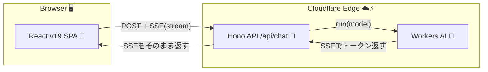

# 第290章：最終課題：エッジで動くフルスタック・AIチャットアプリ

この章では、**React（SPA） + Hono（API） + Cloudflare Workers AI（LLM）**で、**“ChatGPTっぽく文字が流れて出てくる”**チャットアプリを完成させます🫶✨
しかも **エッジ（Cloudflare）**で動くので、体感もサクサクです⚡

---

## 1) 今日はこれを作るよ🎯✨

* 画面右側に入力欄がある「チャットUI」💬
* 送信すると、AIの返事が **少しずつストリーミング表示**される🌊✨
* 「停止」ボタンでストリーミングを中断できる🛑
* APIは **Hono**、AIは **Workers AI**、デプロイは **Cloudflare Workers**☁️

---

## 2) 全体のしくみ（図解）🗺️




**ポイントはSSE（Server-Sent Events）で、返事がちょいちょい届く**ところです🌊✨（Workers AIは `text/event-stream` でストリームが返せます）([Cloudflare Docs][1])

---

## 3) 土台を一撃で作る⚡（Cloudflare公式テンプレ）

Cloudflare公式の “Hono + React SPA + Vite” テンプレを使うと、最短で完成形に近い土台ができます💪✨([Cloudflare Docs][2])

### ✅ 作成コマンド（PowerShellでOK）

```powershell
npm create cloudflare@latest -- my-hono-app --template=cloudflare/templates/vite-react-template
cd my-hono-app
npm run dev
```

* `npm run dev` だけで **ReactもWorkerも一緒に起動**できる構成です（Cloudflare Vite plugin）([Cloudflare Docs][2])
* フォルダ構成も、だいたいこうなってるはず👇([Cloudflare Docs][2])

```text
my-hono-app/
  src/
    worker/        ← Hono API（Cloudflare Worker）
      index.ts
    react-app/     ← React SPA
      src/App.tsx
  wrangler.jsonc   ← Cloudflare設定
  vite.config.ts
```

---

## 4) Workers AI を有効化する🧠✨（wrangler.jsonc）

`wrangler.jsonc` に **AI Binding** を追加します。これで Worker から `env.AI` が使えるようになります🤝✨([Cloudflare Docs][3])

`wrangler.jsonc` を開いて、トップレベルにこれを足してね👇

```jsonc
{
  // ...既存の設定...

  "ai": {
    "binding": "AI"
  }
}
```

---

## 5) Hono側：/api/chat を作る🧩💬

`src/worker/index.ts` を編集して、チャットAPIを追加します✨
**SSE（text/event-stream）でAIの出力をストリーム返却**します🌊([Cloudflare Docs][1])

### ✅ `src/worker/index.ts`（例）

```ts
import { Hono } from "hono";

type ChatRole = "system" | "user" | "assistant";
type ChatMessage = { role: ChatRole; content: string };

// Workers AI Binding は型を厳密にやると長くなるので、まずは any でOK🙆‍♀️
type Bindings = {
  AI: any;
};

const app = new Hono<{ Bindings: Bindings }>();

app.post("/api/chat", async (c) => {
  const body = await c.req.json<{ messages: ChatMessage[] }>();

  // ここで Workers AI を呼ぶ（stream: true がポイント🌊）
  const stream = await c.env.AI.run("@cf/meta/llama-3.1-8b-instruct", {
    messages: body.messages,
    stream: true,
  });

  return new Response(stream, {
    headers: {
      "content-type": "text/event-stream",
      "cache-control": "no-cache",
    },
  });
});

export default app;
```

* `messages` を渡して会話形式にできる＆`stream: true` でSSEストリームになります([Cloudflare Docs][1])
* もし「ストリームなのに一気に返ってくる😵」みたいな挙動が出たら、**圧縮の影響**があることがあります（その場合は `Content-Encoding: identity` を使う回避もあります）([Qiita][4])

---

## 6) React側：チャットUI（ストリーミング表示つき）💬✨

次は `src/react-app/src/App.tsx` を、チャットアプリに作り替えます🫶

ここでは React v19 の `useActionState` を使って、フォーム送信と「送信中」を気持ちよく扱います✨([React][5])

### ✅ `src/react-app/src/App.tsx`

```tsx
import { useActionState, useEffect, useRef, useState } from "react";
import styles from "./App.module.css";

type Role = "user" | "assistant";
type Msg = { id: string; role: Role; content: string };

function uuid() {
  return crypto.randomUUID();
}

async function streamSSE(
  res: Response,
  onData: (text: string) => void,
  signal: AbortSignal
) {
  if (!res.body) throw new Error("レスポンスがストリームじゃないよ🥲");

  const reader = res.body.getReader();
  const dec = new TextDecoder();
  let buf = "";

  while (true) {
    if (signal.aborted) return;

    const { value, done } = await reader.read();
    if (done) break;

    buf += dec.decode(value, { stream: true });
    buf = buf.replaceAll("\r\n", "\n");

    // SSEはイベント区切りがだいたい "\n\n"
    let cut: number;
    while ((cut = buf.indexOf("\n\n")) !== -1) {
      const block = buf.slice(0, cut);
      buf = buf.slice(cut + 2);

      const lines = block.split("\n");
      for (const line of lines) {
        if (!line.startsWith("data:")) continue;

        const data = line.slice(5).trimStart();
        if (!data) continue;
        if (data === "[DONE]") return;

        // Workers AI のSSEは JSONで { response: "..." } が入ってることが多い✨
        // でも崩れても落ちないように、柔らかく処理するよ🧸
        try {
          const obj = JSON.parse(data);
          const delta =
            obj?.response ??
            obj?.delta ??
            obj?.text ??
            (typeof obj === "string" ? obj : "");
          if (delta) onData(delta);
        } catch {
          // JSONじゃなかったら、そのまま文字として扱う
          onData(data);
        }
      }
    }
  }
}

export default function App() {
  const [messages, setMessages] = useState<Msg[]>([
    { id: uuid(), role: "assistant", content: "やっほー！なんでも聞いてね😊✨" },
  ]);

  // 最新messagesを action から参照したいのでrefに退避🧷
  const messagesRef = useRef<Msg[]>(messages);
  useEffect(() => {
    messagesRef.current = messages;
  }, [messages]);

  // 中断用🛑
  const abortRef = useRef<AbortController | null>(null);

  const [_, formAction, isPending] = useActionState(
    async (_prev: null, formData: FormData) => {
      const text = String(formData.get("message") ?? "").trim();
      if (!text) return null;

      // 送信中のやつがあれば止める（連打対策）🛑
      abortRef.current?.abort();
      abortRef.current = new AbortController();

      const userMsg: Msg = { id: uuid(), role: "user", content: text };
      const assistantId = uuid();
      const placeholder: Msg = { id: assistantId, role: "assistant", content: "" };

      // 先に画面へ反映（体感が気持ちいい✨）
      setMessages((m) => [...m, userMsg, placeholder]);

      // APIへ送る会話履歴（roleをWorkers AI形式へ）
      const history = [...messagesRef.current, userMsg].map((m) => ({
        role: m.role,
        content: m.content,
      }));

      // systemプロンプトも足しちゃう（性格づけ）🎀
      const payload = {
        messages: [
          { role: "system", content: "You are a friendly assistant. Keep it concise." },
          ...history,
        ],
      };

      const res = await fetch("/api/chat", {
        method: "POST",
        headers: { "content-type": "application/json" },
        body: JSON.stringify(payload),
        signal: abortRef.current.signal,
      });

      if (!res.ok) {
        setMessages((m) =>
          m.map((x) =>
            x.id === assistantId
              ? { ...x, content: "ごめん…APIが失敗したっぽい🥲（" + res.status + "）" }
              : x
          )
        );
        return null;
      }

      try {
        await streamSSE(
          res,
          (delta) => {
            setMessages((m) =>
              m.map((x) =>
                x.id === assistantId ? { ...x, content: x.content + delta } : x
              )
            );
          },
          abortRef.current.signal
        );
      } catch (e) {
        setMessages((m) =>
          m.map((x) =>
            x.id === assistantId
              ? { ...x, content: x.content + "\n\n（ストリーム中にエラーが出たよ🥲）" }
              : x
          )
        );
      }

      return null;
    },
    null
  );

  const stop = () => {
    abortRef.current?.abort();
  };

  return (
    <div className={styles.page}>
      <header className={styles.header}>
        <h1>Edge AI Chat 🌩️💬</h1>
        <button className={styles.stop} onClick={stop} disabled={!isPending}>
          停止🛑
        </button>
      </header>

      <main className={styles.chat}>
        {messages.map((m) => (
          <div
            key={m.id}
            className={m.role === "user" ? styles.userBubble : styles.aiBubble}
          >
            <div className={styles.role}>
              {m.role === "user" ? "You🙂" : "AI🤖"}
            </div>
            <div className={styles.text}>{m.content}</div>
          </div>
        ))}

        {isPending && <div className={styles.pending}>考え中…🧠💭</div>}
      </main>

      <form className={styles.form} action={formAction}>
        <input
          className={styles.input}
          name="message"
          placeholder="メッセージを入力してね…😊"
          autoComplete="off"
        />
        <button className={styles.send} type="submit" disabled={isPending}>
          送信📨
        </button>
      </form>
    </div>
  );
}
```

* `useActionState` は `[state, formAction, isPending]` を返してくれるので、「送信中」のUIが作りやすいです✨([React][5])
* Workers AI のストリームは **SSEで `data: { JSON }` が流れてくることが多い**ので、その想定で柔らかくパースしてます🌊([Qiita][4])

---

## 7) ちょいCSSで“それっぽく”する🎨✨

`src/react-app/src/App.module.css` を作ってね👇

```css
.page {
  max-width: 820px;
  margin: 0 auto;
  padding: 16px;
  font-family: system-ui, -apple-system, Segoe UI, sans-serif;
}

.header {
  display: flex;
  align-items: center;
  justify-content: space-between;
  gap: 12px;
  margin-bottom: 12px;
}

.stop {
  padding: 8px 12px;
  border-radius: 10px;
  border: 1px solid #ddd;
  background: #fff;
}

.chat {
  display: flex;
  flex-direction: column;
  gap: 10px;
  min-height: 60vh;
  padding: 12px;
  border: 1px solid #eee;
  border-radius: 14px;
  background: #fafafa;
  overflow: auto;
}

.userBubble,
.aiBubble {
  padding: 10px 12px;
  border-radius: 14px;
  border: 1px solid #eee;
  background: #fff;
}

.userBubble {
  align-self: flex-end;
  max-width: 80%;
}

.aiBubble {
  align-self: flex-start;
  max-width: 80%;
}

.role {
  font-size: 12px;
  opacity: 0.7;
  margin-bottom: 6px;
}

.text {
  white-space: pre-wrap;
  line-height: 1.5;
}

.pending {
  font-size: 13px;
  opacity: 0.8;
  padding: 6px 2px;
}

.form {
  display: flex;
  gap: 10px;
  margin-top: 12px;
}

.input {
  flex: 1;
  padding: 12px;
  border-radius: 12px;
  border: 1px solid #ddd;
}

.send {
  padding: 12px 14px;
  border-radius: 12px;
  border: 1px solid #ddd;
  background: #fff;
}
```

---

## 8) 動作チェック✅（ここが通れば勝ち！🎉）

ブラウザで開いて、これ確認してね👇😊

* [ ] 送信すると、自分の吹き出しが出る🙂
* [ ] その直後、AIの吹き出しが空で出る🤖
* [ ] AIの文字が **ちょっとずつ増える**🌊✨
* [ ] 停止ボタンで止まる🛑
* [ ] 連続送信しても破綻しない（止めてから次へ）🔁

---

## 9) デプロイ🚀（最終ゴール！）

テンプレは `npm run deploy` が用意されてることが多いです。これで **ビルド→デプロイ**まで進みます☁️✨([Cloudflare Docs][2])

```powershell
npm run deploy
```

---

## 10) 強化ミッション（やったら“ガチで作品”になる）🔥✨

余裕あったら、ここからが楽しいよ😆

1. **会話履歴をD1に保存**🗃️（いつでも続きを話せる）
2. **認証ミドルウェア**🔐（ログインした人だけ使える）
3. **レート制限**🚦（連打防止）
4. **プロンプトインジェクション対策**🛡️（system命令は守る）
5. **UI強化**：メッセージのコピーボタン📋、コード表示の整形💅

---

## まとめ🎓✨

これであなたはもう、

* **ReactでUI作れる**💬
* **HonoでAPI作れる**🧩
* **Workers AIでストリーミング生成できる**🌊🤖
* **エッジにデプロイできる**☁️🚀

…っていう、めちゃ強セットを一周しました👏✨

次にやるなら、「D1保存」か「認証」どっちから強化したい？😊

[1]: https://developers.cloudflare.com/workers-ai/models/llama-3.1-8b-instruct/ "llama-3.1-8b-instruct · Cloudflare Workers AI docs"
[2]: https://developers.cloudflare.com/workers/framework-guides/web-apps/more-web-frameworks/hono/ "Hono · Cloudflare Workers docs"
[3]: https://developers.cloudflare.com/workers-ai/configuration/bindings/?utm_source=chatgpt.com "Workers Bindings"
[4]: https://qiita.com/toreis/items/cfd566a2ef7621a6222a "Cloudflareを使い倒す Workers AI 編 (Text Generation) 1/2 #cloudflare - Qiita"
[5]: https://react.dev/reference/react/useActionState?utm_source=chatgpt.com "useActionState"
