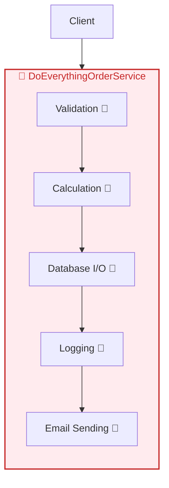

# 第03章：まず“最悪のコード”をわざと作ろう😈🧱

この章はね、「SOLIDって何が嬉しいの？」を**体で分かる**ために、あえて **地獄みたいなコード** を作ります😂🔥
“痛み”を先に知っておくと、次の章からの改善がめちゃくちゃ楽しくなるよ〜！🥳✨

---

## この章のゴール🎯✨

* 「変更が怖いコード」ってどんな感じか、**実体験**する😇💥
* “何がつらいか”を **言葉にできる** ようになる🗣️💖
* 次の章（責務・依存・境界）につながる「設計の観察眼」を作る👀🔍

---

## まずはプロジェクトを作ろう🧰🪟

今回は **Consoleアプリ** でいくよ（UIに引っ張られないからラク！）😊✨
ターゲットは **.NET 10**、言語は **C# 14** を想定でOK👌
（.NET 10はLTSで、C# 14は.NET 10上でサポート、Visual Studio 2026に.NET 10 SDKが入ってるよ）([Microsoft][1])

### Visual Studio で作る手順🧡

1. 「新しいプロジェクトの作成」→ **Console App**（C#）を選ぶ🖱️
2. フレームワークは **.NET 10** を選ぶ✅
3. プロジェクト名は例：`MiniECommerce.Bad`（“Bad”がポイント🤣）

### （任意）VS Code で作るなら💙

* ターミナルで `dotnet new console -n MiniECommerce.Bad -f net10.0` みたいに作れます👍
  （でもこの章はVisual Studioのほうが迷いにくいかも！😊）

---

## “最悪のコード”を貼ろう😈💣（まずは動かす！）


ここでは **「神クラス（God Class）」＋「if地獄」＋「責務ごちゃ混ぜ」＋「コピペ祭り」** をわざとやります😂🔥
`Program.cs` をまるっと置き換えてね👇



```csharp
using System;
using System.Collections.Generic;
using System.IO;
using System.Linq;

Console.WriteLine("Mini EC (Bad Version) 😈🛒");

var order = new OrderData
{
    OrderId = "ORD-0001",
    CustomerId = "C-001",
    CustomerType = "Student",              // "Normal", "Student", "VIP"
    PaymentMethod = "Card",                // "Card", "Bank", "COD"
    ShippingMethod = "Express",            // "Standard", "Express"
    CouponCode = "WELCOME10",              // "", "WELCOME10", "VIP20"
    Destination = "Tokyo",
    Items = new List<OrderItem>
    {
        new("BOOK-001", "C#入門📘", 2, 1800m),
        new("PEN-001", "ペン🖊️", 3, 120m)
    }
};

var service = new DoEverythingOrderService(); // ←もう名前からしてヤバい😂
var result = service.ProcessOrder(order);

Console.WriteLine(result);
Console.WriteLine("Done ✅");

public sealed class DoEverythingOrderService


{
    // 神クラス：注文、割引、ポイント、支払い、発送、ログ、全部ここ😇
    private static readonly Random _random = new();

    public string ProcessOrder(OrderData order)
    {
        // ① バリデーション（雑＆場当たり）
        if (order == null) return "order is null 💥";
        if (string.IsNullOrWhiteSpace(order.CustomerId)) return "no customer 💥";
        if (order.Items == null || order.Items.Count == 0) return "no items 💥";
        if (order.PaymentMethod == null) return "no payment 💥";
        if (order.ShippingMethod == null) return "no shipping 💥";

        // ② 小計計算（ここからロジック開始…と思いきや、途中でログとか出す）
        decimal subTotal = 0;
        foreach (var item in order.Items)
        {
            if (item.Quantity <= 0) return "bad qty 💥";
            if (item.UnitPrice < 0) return "bad price 💥";
            subTotal += item.Quantity * item.UnitPrice;
        }
        Console.WriteLine($"SubTotal = {subTotal} 💰"); // UI混在😇

        // ③ 割引計算（if地獄）


        decimal discount = 0;
        if (order.CouponCode == "WELCOME10")
        {
            discount = subTotal * 0.10m;
            if (discount > 1200m) discount = 1200m; // マジックナンバー✨


        }
        else if (order.CouponCode == "VIP20")
        {
            discount = subTotal * 0.20m;
        }
        else if (string.IsNullOrWhiteSpace(order.CouponCode))
        {
            discount = 0;
        }
        else
        {
            Console.WriteLine("Unknown coupon 😵‍💫"); // ここで出すなｗ
        }

        // ④ 送料計算（またif/switch）
        decimal shippingFee = 0;
        if (order.ShippingMethod == "Standard")
        {
            shippingFee = 500m;
            if (subTotal >= 5000m) shippingFee = 0m; // 送料無料条件がここにベタ書き
        }
        else if (order.ShippingMethod == "Express")
        {
            shippingFee = 980m;
            if (order.Destination == "Okinawa") shippingFee = 1480m; // なんでここだけ沖縄…？
        }
        else
        {
            return "Unknown shipping 💥";
        }

        // ⑤ ポイント（顧客タイプで分岐、またマジック）
        int points = 0;
        if (order.CustomerType == "Normal")
        {
            points = (int)(subTotal / 100m);
        }
        else if (order.CustomerType == "Student")
        {
            points = (int)(subTotal / 80m); // 学生だけ倍率違う、理由は不明😇
        }
        else if (order.CustomerType == "VIP")
        {
            points = (int)(subTotal / 50m);
            if (points > 5000) points = 5000; // 上限
        }
        else
        {
            Console.WriteLine("Unknown customer type 😵‍💫");
        }

        // ⑥ 合計
        var total = subTotal - discount + shippingFee;
        if (total < 0) total = 0;

        // ⑦ 支払い処理（if地獄＋コピペっぽさ）


        string paymentResult;
        if (order.PaymentMethod == "Card")
        {
            Console.WriteLine("Charging credit card... 💳");
            paymentResult = FakeCharge(total);
            if (paymentResult != "OK") return "Payment failed 💥";
        }
        else if (order.PaymentMethod == "Bank")
        {
            Console.WriteLine("Waiting bank transfer... 🏦");
            paymentResult = FakeBankCheck();
            if (paymentResult != "OK") return "Payment failed 💥";
        }
        else if (order.PaymentMethod == "COD")
        {
            Console.WriteLine("Cash on delivery... 💵");
            paymentResult = "OK"; // 適当ｗ
        }
        else
        {
            return "Unknown payment 💥";
        }

        // ⑧ 発送（支払いのあとにファイル書き込みやメールっぽいことまで）
        string trackingNo = "TRK-" + _random.Next(100000, 999999);
        Console.WriteLine($"Shipping... 🚚 Tracking={trackingNo}");

        // ログ保存（ビジネスロジックの中でI/O😇）


        var log = $"{DateTime.Now:yyyy-MM-dd HH:mm:ss}\t{order.OrderId}\t{order.CustomerId}\tTOTAL={total}\tPTS={points}\tTRK={trackingNo}\n";
        File.AppendAllText("orders.log", log);

        // なんちゃって通知（外部連携が直書きの気分）
        Console.WriteLine($"Send email to customer {order.CustomerId} 📧 (pretend)");

        // ⑨ 返す文字列も雑（DTOとか無し）
        return $"OK 🎉 OrderId={order.OrderId}, Total={total}, Discount={discount}, Shipping={shippingFee}, Points={points}, Tracking={trackingNo}";
    }

    private string FakeCharge(decimal amount)
    {
        // たまに失敗するようにして“怖さ”を演出😈
        if (amount > 10000m && _random.Next(0, 4) == 0) return "NG";
        return "OK";
    }

    private string FakeBankCheck()
    {
        if (_random.Next(0, 6) == 0) return "NG";
        return "OK";
    }
}

public sealed class OrderData
{
    public string OrderId = "";
    public string CustomerId = "";
    public string CustomerType = "";
    public string PaymentMethod = "";
    public string ShippingMethod = "";
    public string CouponCode = "";
    public string Destination = "";
    public List<OrderItem> Items = new();
}

public sealed record OrderItem(string Sku, string Name, int Quantity, decimal UnitPrice);
```

---

## 動かして“つらみ”を味わおう🤣🔥

実行すると、だいたいこんな雰囲気になるはず👇

* 小計が出る
* 支払いっぽいログが出る
* 追跡番号が出る
* `orders.log` に追記される

ここまでできたらOK！🎉✨

---

## ここからが本番：わざと仕様変更してみよ💥🛠️

「うわ…どこ直せばいいの…😇」ってなるのが正解です😂

### 変更ミッションA：支払い方法を追加して！💳➡️📱


* `PaymentMethod = "PayPay"` を追加したい（例）
* 期待：**既存コードをほぼ触らず**追加できるのが理想
* 現実：`ProcessOrder()` の if地獄を編集しないと詰む😇

✅観察してほしいこと

* どこに分岐がある？
* 支払い以外の処理（ログ/発送/ポイント）まで一緒に触りそうじゃない？😵‍💫

---

### 変更ミッションB：配送方法を追加して！🚚➡️📦

* `ShippingMethod = "Locker"`（ロッカー受取）を追加したい
* 現実：送料計算の if をいじるしかない＋他にも影響出そう😇

✅観察

* 送料ルールが増えるたびに、同じ場所をずっと編集する未来が見える？😇

---

### 変更ミッションC：クーポン仕様を変えて！🎫💥

* `WELCOME10` を「10%割引 → 12%割引」に変更
* 現実：割引ロジックがベタ書きなので、**他の割引も壊しそう**で怖い😂

✅観察

* 「割引の仕様」って、今後めっちゃ増えそうじゃない？（地獄の予感👻）

---

## “何がつらいか”を言葉にしよう🗣️✨（ここ超だいじ！）


この章のゴールは **リファクタじゃなくて、観察と言語化** だよ〜😊📝✨
次のメモを埋めてみてね👇

### つらみメモテンプレ📝💖

* このクラスがやってること（思いつく限り）

  * 例：注文検証、計算、割引、送料、ポイント、支払い、発送、ログ、通知…（多すぎ🤣）
* 仕様変更Aで直した場所：

  * 例：支払い分岐、ログ、表示…（関係ないのに触った？😇）
* 仕様変更Bで直した場所：
* 「怖い」と感じた瞬間：

  * 例：どこまで影響が波及するか読めない🌊😵‍💫

---

## 🤖AIの使いどころ（丸投げ禁止でね！）✨

AIに聞くときは、「正解を作らせる」より **観察を手伝わせる**のが相性いいよ😊💕

### コピペで使えるAIプロンプト例🧠✨

* 「この `DoEverythingOrderService` がやってる責務（役割）を、思いつく限り箇条書きして」
* 「このコードの変更理由になりそうなものを5〜10個あげて」
* 「このコードの問題点を、**“変更が怖い理由”**として説明して」
* 「仕様として増えそうなパターン（割引・支払い・配送）を予測して、どこが破綻しそうか教えて」

---

## 章末ミニ課題🎓✨（10〜20分でOK！）

1. 責務を**最低8個**書き出す📝
2. 「変更ミッションA or B」を1つだけやって、**直した箇所を数える**🔢😂
3. 「このコードが怖い理由」を**3行で**説明してみる🗣️💖

---

## 次章へのつなぎ🌉✨

この章で感じたモヤモヤは、次の言葉でスッキリ整理できるようになるよ😊🔍
次は **「責務・依存・境界」** っていう “設計の超基本単語” をそろえる章だよ〜！📚✨

必要なら、いま作った `Program.cs` をベースにして「どこがGod Classなの？」を一緒にマーキングもできるよ😆🖍️

[1]: https://dotnet.microsoft.com/en-us/platform/support/policy/dotnet-core?utm_source=chatgpt.com "NET and .NET Core official support policy"
