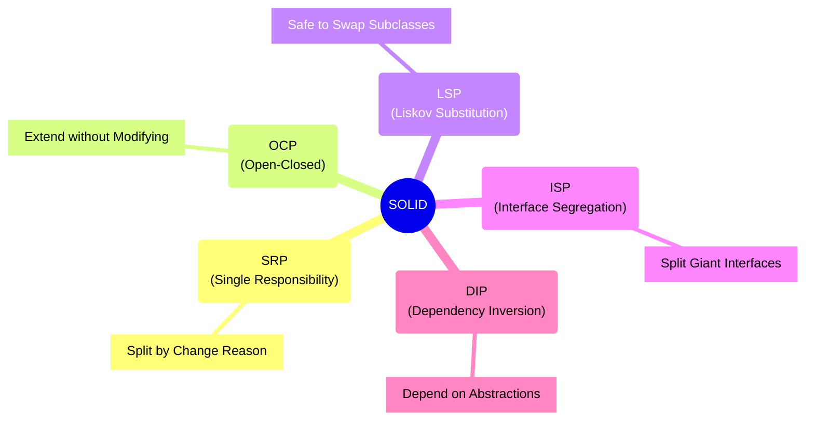

# 第07章：SOLID全体マップ🗺️🌈

この章は「5つの原則を覚える回」じゃなくて、**“どの問題に、どの原則が効くか”を地図みたいに頭に入れる回**だよ😊✨
ここができると、後の章でリファクタするときに「今どの方向へ直せばいいか」が迷子になりにくいの💪💕

---

## 7.1 この章のゴール🎯✨

読み終わったら、これができればOK〜！🥰

* 目の前のコードのモヤモヤを見て、「たぶんSRP」「これはDIPっぽい」って**あたりを付けられる**👀💡
* S/O/L/I/Dを**別々じゃなく“連携プレイ”で理解**できる🤝🌟
* 直す順番の基本（だいたい **S→I→D→O→L** になりやすい）を知る🧭✨

---

## 7.2 まずは一言で掴もう！SOLIDの“役割分担”🧠✨


SOLIDって、ざっくり言うと **「変更に強いコード」にするための作戦セット**だよ😊
それぞれの担当はこんな感じ👇

* **S（SRP）**：1つのクラスに“いろんな理由の変更”を詰め込まない📌
* **O（OCP）**：機能追加のたびに“既存コードを直しまくる”を減らす🚪✨
* **L（LSP）**：差し替えても“呼び出し側が壊れない”継承・ポリモーフィズム🧱
* **I（ISP）**：使わない機能まで押し付けない（約束を細く）✂️📄
* **D（DIP）**：上位（業務）が下位（DB/HTTP等）の都合に振り回されない🧲🔄

そして、2026の最新C#環境（.NET 10 / C# 14）や最新IDEでは、こういう設計を支える言語機能・開発体験が整ってるよ〜✨（C# 14 や .NET 10、Visual Studio 2026 の情報は公式ドキュメント参照）([Microsoft Learn][1])



---

## 7.3 “チーム”として見るとこうなる👯‍♀️🌈（超重要）


SOLIDは、だいたいこの流れで協力するの👇

### ✅ よくある黄金ルート（実務でめちゃ使う🪄）

1. **S（分ける）**：責務が混ざってたら、まず分ける
2. **I（細くする）**：インターフェースが太いなら、利用者ごとに分割
3. **D（依存の向きを直す）**：抽象に依存させて、差し替え可能に
4. **O（追加に強く）**：分岐を“部品追加”に変える
5. **L（差し替え安全）**：継承や実装がルール破ってないか最終チェック

> 🌟ポイント：**OCPは単独で成立しにくい**の。
> “差し替え”の土台として **ISP（細い契約）** と **DIP（抽象に依存）** が効いてくるよ🤝✨

---

## 7.4 SOLID早見表📖✨（症状→どれ？）


| つらみ/症状😵‍💫         | だいたい疑う原則🔎 | よく効く一手🪄               |
| ------------------- | ---------- | ---------------------- |
| 1クラスが巨大、修正が怖い       | **S**      | 責務（変更理由）で分割、I/Oとロジック分離 |
| if/switchが増えるたび既存修正 | **O**      | Strategy化、分岐ポイントを差し替えに |
| 派生クラス入れたら例外/挙動変     | **L**      | 継承やめて合成、契約（事前/事後条件）見直し |
| 使わないメソッド実装させられる     | **I**      | 役割別にインターフェース分割         |
| DB/外部APIに業務がベッタリ    | **D**      | 抽象（interface）に依存、DIで注入 |

---

## 7.5 “SOLID診断”のやり方🩺✨（地図の使い方）


コードを見て「どれ違反？」ってなるときは、**質問で当てにいく**のがコツだよ😊💕

### ① まずS（SRP）チェック📌

* このクラス、**変更理由**が2個以上ない？
  （例：支払い仕様変更＋DB変更＋画面表示変更…ぜんぶここ！？😇）

### ② 次にI（ISP）チェック✂️

* “使う側”が違うのに、同じインターフェースを押し付けてない？
  （画面は読み取りだけなのに更新メソッドまで見えてる…とか💦）

### ③ D（DIP）チェック🧲

* `new Sql...()` や `HttpClient` 直呼びが業務ロジックのど真ん中にない？
  → あると、テストも差し替えも地獄になりがち😵‍💫

### ④ O（OCP）チェック🚪

* 新しい仕様が来たら、**既存のif/switchを編集**する？
  → それ、追加に弱いサイン🚨

### ⑤ 最後にL（LSP）チェック🧱

* 派生クラスが「前より厳しい条件」を要求してない？
* 親なら成功するのに子だと例外、みたいな“置換崩れ”ない？💥

---

## 7.6 ミニ実例：このコード、S/O/L/I/Dで分類してみよ🧩✨


「注文→支払い→発送」っぽい雰囲気の、わざと“つらい”コードだよ😈（あとで直す前提！）

```csharp
public class OrderService
{
    public void PlaceOrder(Order order, string paymentType)
    {
        // ① バリデーション（入力チェック）
        if (order == null) throw new ArgumentNullException(nameof(order));
        if (order.Items.Count == 0) throw new InvalidOperationException("No items");

        // ② 料金計算（ビジネスロジック）
        var total = order.Items.Sum(x => x.Price * x.Quantity);

        // ③ 支払い（分岐）
        if (paymentType == "Credit")
        {
            var gateway = new CreditGateway(); // ← new 直書き
            gateway.Charge(total);
        }
        else if (paymentType == "PayPay")
        {
            var gateway = new PayPayGateway();  // ← new 直書き
            gateway.Pay(total);
        }

        // ④ 永続化（DB）
        var repo = new SqlOrderRepository();    // ← new 直書き
        repo.Save(order);

        // ⑤ ログ（副作用）
        File.AppendAllText("order.log", $"Ordered: {order.Id}\n");
    }
}
```

### ✅ 分類してみると…🗂️✨

* **S（SRP）**：バリデーション、計算、支払い、保存、ログ…責務が混在😇
* **O（OCP）**：支払い方法が増えるたび `if/else` を編集する未来が見える💥
* **I（ISP）**：今は出てないけど、支払いIFを太く作ると一気に地獄になりがち⚠️
* **D（DIP）**：`new SqlOrderRepository()` とか、具体実装に直依存で差し替え不可😵‍💫
* **L（LSP）**：この例は継承がないからまだ薄いけど、支払い手段を継承で増やし始めると事故りやすいゾ💣

> この章では「直し方の詳細」は次章以降でやるよ😊
> でも今は、**“どこがどれっぽいか”の地図が読めれば勝ち**🎉

---

## 7.7 “直す順番”のコツ🧭✨（迷子防止）


さっきの例を直すなら、だいたいこうなるよ👇

1. **S**：PlaceOrderの中身を「入力チェック」「計算」「支払い」「保存」「ログ」に分ける
2. **D**：支払い・保存・ログの“外部っぽい部分”を抽象化して注入できる形へ
3. **O**：支払い手段をStrategy化して、追加をクラス追加で済ませる
4. **I**：支払いIFが太りそうなら「必要最小限」に割る
5. **L**：支払い手段を差し替えても、同じ契約で動くか最終確認

---

## 7.8 AI（Copilot / Codex系）で“分類力”を爆上げする🤖✨

AIは、この章だと **「分類」と「観察」の相棒**にすると超強いよ😊💕

### 使えるプロンプト例①：S/O/L/I/Dで仕分け🗃️

* 「次のコードの問題点を **S/O/L/I/Dごとに分類**して。各カテゴリに理由を1行で。」

### 使えるプロンプト例②：変更理由の列挙（SRPの第一歩）📌

* 「このクラスの**変更理由**を5〜8個、できるだけ具体的に列挙して。」

### 使えるプロンプト例③：直す順番🧭

* 「このコードをSOLIDに近づけるための**安全なリファクタ手順**を、依存関係が壊れにくい順に箇条書きで。」

GitHub Copilot まわりの最新機能や案内ページも定期的に更新されてるから、困ったら“What's new”や機能一覧も見に行くと安心だよ📌✨([GitHub][2])

---

## 7.9 理解チェッククイズ🎓✨（サクッと！）

1. 「支払い手段が増えるたびに既存のswitchを修正」→ どれ？
2. 「RepositoryのSaveしか使わないのにDeleteまで実装強制」→ どれ？
3. 「派生クラスにしたら例外が増えた」→ どれ？
4. 「業務ロジックがSqlの都合に引きずられてる」→ どれ？
5. 「巨大クラス、変更理由が多すぎ」→ どれ？

**答え**🎀

1. O　2) I　3) L　4) D　5) S ✅

---

## 7.10 この章のまとめ🎁✨

* SOLIDは「5つの暗記」じゃなくて、**“変更に強くするチームプレイ”**👯‍♀️🌈
* 困ったら **症状→原則→一手** の流れで当てにいけばOK🧭✨
* 次章からは、S（SRP）を皮切りに、実際にスッキリ直していくよ〜🧹💕

---

次は **第8章：SRPの感覚「変更理由は1つ」ってどういうこと？🎯** に進もうね😊💖

[1]: https://learn.microsoft.com/ja-jp/dotnet/csharp/whats-new/csharp-14?utm_source=chatgpt.com "C# 14 の新機能"
[2]: https://github.com/features/copilot/whats-new?utm_source=chatgpt.com "See what's new with GitHub Copilot"
