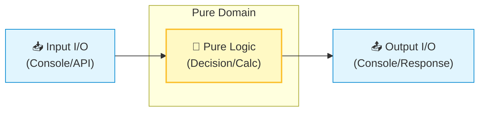

# 第09章：SRPの分割パターン①：入力・判断・出力を分ける📥🧠📤

この章はひとことで言うと…
**「I/O（入出力）とロジック（判断）を分離して、読みやすく＆テストしやすくする」**回だよ〜！😊💕

---

## 1) 今日できるようになること 🎯✨

* 「入力・判断・出力」が**ごちゃ混ぜ**になってるコードを見つけられる👀💥
* 判断ロジックを **“副作用なし（Pure）”** の形に抜き出せる🧼✨
* 抜き出した判断ロジックを **単体テスト** できるようになる🧪✅
* 変更に強くなる（UI変更・表示変更・ルール変更がぶつからない）💪🌈

※ちなみにC# 14 は .NET 10 でサポートされていて、Visual Studio 2026 ならそのまま使えるよ〜🧡 ([Microsoft Learn][1])
.NET 10 は LTS で、3年サポート（〜2028/11/10）だよ📅✨ ([Microsoft for Developers][2])

---

## 2) なんで分けるの？（SRPの“変更理由”で考える）🧠💡


「入力・判断・出力」が1つのメソッドに混ざると、こうなるよ〜😇💦

* 画面の文言を変えたい → **ロジックの中まで触って事故る**💥
* 送料ルールが変わった → **表示コードも一緒に触る羽目**😵‍💫
* テストしたい → Console 依存で **テストしにくい＆遅い**🐢💦

だから、SRPの考え方でこう分けるのが鉄板💎✨

* **入力（Input）**：外から情報をもらう（Console / API / 画面 / ファイル…）📥
* **判断（Decision）**：業務ルールで計算・判定する（できればPure）🧠
* **出力（Output）**：結果を外へ出す（Console / 画面 / APIレスポンス…）📤

変更理由もキレイに分かれるよ〜😊✨

* UI変更→入力/出力だけ
* ルール変更→判断だけ
* 表示形式変更→出力だけ

---

## 3) 見分けるコツ：副作用（Side Effect）を探す🔎⚡

判断ロジックから **追い出したいもの** はこれ👇（ほぼI/Oだと思ってOK）

* Console読み書き🖥️
* DB/ファイル/ネットワークアクセス🌐
* 現在時刻（DateTime.Now）や乱数🎲
* 環境変数・設定読み込み⚙️

判断はできるだけ
**「引数 → 計算 → 戻り値」** にするのがコツだよ🧼✨

---

## 4) まずは“混ざったコード”😈🧱（Before）

例：ミニECの「送料＋合計」をConsoleで計算するやつ🛒✨
（この段階はわざと混ぜます！）

```csharp
using System;
using System.Globalization;

Console.WriteLine("🛒 ミニEC：送料込み合計を計算するよ！");
Console.Write("小計（円）を入力してね：");
var subtotalText = Console.ReadLine();

Console.Write("商品点数を入力してね：");
var itemCountText = Console.ReadLine();

Console.Write("配送先は国内？海外？ (JP/INT)：");
var destText = (Console.ReadLine() ?? "").Trim().ToUpperInvariant();

if (!decimal.TryParse(subtotalText, NumberStyles.Number, CultureInfo.CurrentCulture, out var subtotal) ||
    !int.TryParse(itemCountText, out var itemCount) ||
    itemCount <= 0 ||
    (destText != "JP" && destText != "INT"))
{
    Console.WriteLine("入力が変だよ…😢");
    return;
}

decimal shippingFee = 0;

if (destText == "JP")
{
    shippingFee = subtotal >= 5000m ? 0m : 500m;
}
else
{
    shippingFee = 2000m + (200m * itemCount);
    if (subtotal >= 12000m) shippingFee = 0m;
}

var total = subtotal + shippingFee;

Console.WriteLine($"送料：{shippingFee:N0}円");
Console.WriteLine($"合計：{total:N0}円");
Console.WriteLine("完了✅");
```

### どこが「入力・判断・出力」？🧩

* 入力：ReadLineしてるところ📥
* 判断：送料計算の if/switch 🧠
* 出力：WriteLineしてるところ📤
  全部ひとつに詰まってるのが問題〜！😵‍💫💦

---

## 5) 分割していこう！🧹✨（After）



### ステップA：判断の材料を「データ」にまとめる📦

入力で集めた値を、判断へ渡す形にするよ😊

```csharp
public enum Destination
{
    Japan,
    International
}

public readonly record struct OrderRequest(decimal Subtotal, int ItemCount, Destination Destination);
public readonly record struct OrderResult(decimal ShippingFee, decimal Total);
```

---

### ステップB：「判断」だけの計算機を作る🧠✨（Console禁止！）

ここが超重要！
**Console 1行も書かない**のがポイントだよ🙅‍♀️🖥️

```csharp
public static class ShippingFeeCalculator
{
    public static decimal Calculate(in OrderRequest order)
    {
        if (order.ItemCount <= 0)
            throw new ArgumentOutOfRangeException(nameof(order.ItemCount));

        return order.Destination switch
        {
            Destination.Japan => order.Subtotal >= 5000m ? 0m : 500m,
            Destination.International => InternationalFee(order.Subtotal, order.ItemCount),
            _ => throw new ArgumentOutOfRangeException(nameof(order.Destination))
        };
    }

    private static decimal InternationalFee(decimal subtotal, int itemCount)
        => subtotal >= 12000m ? 0m : 2000m + 200m * itemCount;
}

public static class OrderPricing
{
    public static OrderResult Calculate(in OrderRequest order)
    {
        var shipping = ShippingFeeCalculator.Calculate(order);
        return new OrderResult(shipping, order.Subtotal + shipping);
    }
}
```

---

### ステップC：「入力」を専用にする📥✨

（入力の細かいバリデーション整理は次章でガッツリやるから、ここでは軽めでOK👌）

```csharp
using System.Globalization;

public static class ConsoleOrderInput
{
    public static bool TryRead(out OrderRequest order)
    {
        Console.Write("小計（円）：");
        var subtotalText = Console.ReadLine();

        Console.Write("商品点数：");
        var itemCountText = Console.ReadLine();

        Console.Write("配送先 (JP/INT)：");
        var destText = (Console.ReadLine() ?? "").Trim().ToUpperInvariant();

        if (!decimal.TryParse(subtotalText, NumberStyles.Number, CultureInfo.CurrentCulture, out var subtotal))
        {
            order = default;
            return false;
        }

        if (!int.TryParse(itemCountText, out var itemCount) || itemCount <= 0)
        {
            order = default;
            return false;
        }

        Destination? destination = destText switch
        {
            "JP" => Destination.Japan,
            "INT" => Destination.International,
            _ => null
        };

        if (destination is null)
        {
            order = default;
            return false;
        }

        order = new OrderRequest(subtotal, itemCount, destination.Value);
        return true;
    }
}
```

---

### ステップD：「出力」を専用にする📤✨

```csharp
public static class ConsoleOrderOutput
{
    public static void Show(in OrderResult result)
    {
        Console.WriteLine();
        Console.WriteLine($"送料：{result.ShippingFee:N0}円");
        Console.WriteLine($"合計：{result.Total:N0}円");
    }
}
```

---

### 仕上げ：Mainは“つなぐだけ”🤝✨

Main は薄〜く！これが気持ちいい💖

```csharp
Console.WriteLine("🛒 ミニEC：送料込み合計を計算するよ！");

if (!ConsoleOrderInput.TryRead(out var order))
{
    Console.WriteLine("入力が変だよ…😢");
    return;
}

var result = OrderPricing.Calculate(order);
ConsoleOrderOutput.Show(result);

Console.WriteLine("完了✅");
```

---

## 6) テストが爆速で書ける！🧪🚀

判断がPureになったから、Consoleなしでテストできるよ〜！最高！🥳💕

```csharp
using Xunit;

public class ShippingFeeCalculatorTests
{
    [Fact]
    public void Japan_Subtotal5000OrMore_IsFree()
    {
        var order = new OrderRequest(5000m, 1, Destination.Japan);
        Assert.Equal(0m, ShippingFeeCalculator.Calculate(order));
    }

    [Fact]
    public void Japan_SubtotalBelow5000_Is500()
    {
        var order = new OrderRequest(4999m, 1, Destination.Japan);
        Assert.Equal(500m, ShippingFeeCalculator.Calculate(order));
    }

    [Fact]
    public void International_Default_IsBasePlusPerItem()
    {
        var order = new OrderRequest(1000m, 3, Destination.International);
        Assert.Equal(2600m, ShippingFeeCalculator.Calculate(order)); // 2000 + 200*3
    }

    [Fact]
    public void International_Subtotal12000OrMore_IsFree()
    {
        var order = new OrderRequest(12000m, 10, Destination.International);
        Assert.Equal(0m, ShippingFeeCalculator.Calculate(order));
    }
}
```

---

## 7) 🤖AI（Copilot/Codex系）に頼むときの“いい聞き方”例💬✨

コピペで使えるよ〜😊💕

* 「このメソッドを **入力/判断/出力** に分割して。判断は **副作用ゼロ** にして」🧠
* 「判断部分だけを **純粋関数** にして、引数と戻り値の形を提案して」🧼
* 「今の送料計算の **境界値テスト** を xUnit で列挙して」🧪
* 「UI変更（文言・表示形式）が来てもロジックが壊れない構成にして」📤✨

※出てきたコードはそのまま信じず、**テスト通して確認**ね✅😺

---

## 8) できてるかチェック✅🧡（超大事）

* 判断ロジックのクラス/メソッドに **Console / HTTP / DB** が出てこない？🙅‍♀️
* 判断が「引数 → 戻り値」になってる？🧠➡️📤
* 送料ルール変更が来たとき、**判断だけ**直せる？🔧
* 表示変更が来たとき、**出力だけ**直せる？🎨
* 入力方式がConsole→APIに変わっても、判断は使い回せる？🔁✨

---

## 9) 練習問題🎓✨（手を動かすやつ！）

### 問1：出力の変更📤

「送料：xxx円」を「Shipping Fee: xxx JPY」にしたい！
👉 どのファイルだけ直せばいい？（答え：出力だけになるのが理想🩷）

### 問2：入力の変更📥

配送先を「JP/INT」じゃなくて「1/2」で選ばせたい！
👉 判断に手を入れずに、入力だけで対応できる？😊

### 問3：ルール追加🧠

「国内で小計が3000円未満なら手数料100円追加」を入れてみて！
👉 変更が判断だけで済んだら勝ち🏆✨（テストも追加してね🧪）

---

## まとめ🧾✨

* SRPは「1クラス1機能」じゃなくて、**1つの変更理由にまとめる**感覚だよ😊
* まずは鉄板の分割：**入力📥 / 判断🧠 / 出力📤**
* 判断をPureにすると、**読める・壊れにくい・テストできる**の三拍子🥳💕

次の第10章は、ここで軽く流した「検証（バリデーション）をどこに置く？」を、気持ちよく整理していくよ〜✅🧾✨

[1]: https://learn.microsoft.com/ja-jp/dotnet/csharp/whats-new/csharp-14 "C# 14 の新機能 | Microsoft Learn"
[2]: https://devblogs.microsoft.com/dotnet/announcing-dotnet-10/ "Announcing .NET 10 - .NET Blog"
