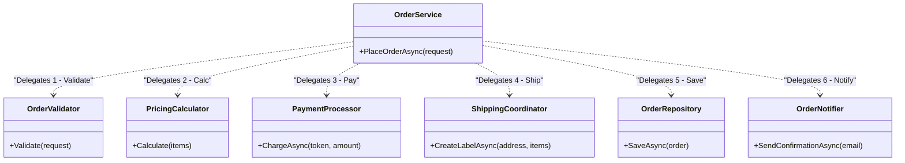

# 第11章：SRP実戦：サービス肥大化をスッキリさせる🧼✨

今日は **「でっかくなりすぎた OrderService（サービスクラス）」** を、SRP（単一責務）で **読みやすく・直しやすく・怖くない** 形にしていくよ〜😊🌸
（Visual Studio 2026 は .NET 10 と C# 14 をそのまま使える前提でOKだよ✨） ([Microsoft Learn][1])

---

## 1. 今日のゴール🎯✨

章の終わりに、これができるようになろう😊👍

* ✅ **「このクラス、責務いくつある…？」** を言葉にできる
* ✅ 肥大化サービスを **“役割ごとに小さく分ける”** 手順がわかる
* ✅ 変更が来ても **直す場所が局所化** されて「怖くない」状態になる🛡️✨

---

## 2. あるある💥「OrderService が全部やってる」問題😵‍💫


たとえばミニECで、最初はこうなる👇

* 入力チェック（バリデーション）✅
* 金額計算（税、送料、割引）💰
* 決済API呼び出し💳
* 配送ラベル作成📦
* DB保存💾
* メール送信📧
* ログ出力🪵

ぜーんぶ **OrderService** が抱えると…

* 😭 仕様追加のたびにOrderServiceが爆伸び
* 😱 ちょっと直したら決済が壊れた（関係ないはずなのに！）
* 🧪 テストが書きにくい（外部APIやDBが混ざりすぎ）

ここをSRPでスッキリさせるよ🧹✨

---

## 3. SRPのコツ再確認📌（超重要✨）

SRPのキモはこれ👇

> **「変更理由（変更したくなる理由）が1つ」になるようにする** 🎯

「メソッドが1つ」じゃないよ〜！🙅‍♀️
“このクラスは何の都合で変わる？” を聞くのがコツだよ😊

---

## 4. 進め方（安全ルート）🛣️🧪✨

肥大化サービスを分割するときは、順番が超大事！💡

### ステップ0：まず“壊してない”保証を作る🧪

* いきなり分割しない！
* 先に **最低限のテスト（キャラクタリゼーションテスト）** を置くと安心😊

### ステップ1：変更理由をメモする📝

* 「この処理、何のため？」「何が変わったら直す？」を箇条書き

### ステップ2：まず Extract Method（メソッド抽出）で塊を作る🧱

* Visual Studio の **Extract Method** が強い💪
  ショートカット：`Ctrl + R` → `Ctrl + M` ([Microsoft Learn][2])

### ステップ3：塊をクラスへ引っ越し🚚✨

* “かたまり”ができたら、新しいクラスに移す
* 型を別ファイルにするのは **Move type to matching file** が便利だよ🙌 ([Microsoft Learn][3])

### ステップ4：最後に OrderService を「段取り係」にする🎬

* OrderService は **オーケストレーター（流れだけ書く）** にする✨

---

## 5. 実例：Before（肥大化OrderService）😈🧱

「わざとツラい」例ね😂（イメージ掴む用に短くしてるよ）

```csharp
public sealed class OrderService
{
    public async Task<Guid> PlaceOrderAsync(OrderRequest request)
    {
        // 1) validate
        if (request.CustomerId == Guid.Empty) throw new ArgumentException("CustomerId is required");
        if (request.Items.Count == 0) throw new ArgumentException("Items is empty");
        if (request.Items.Any(i => i.Quantity <= 0)) throw new ArgumentException("Quantity must be positive");

        // 2) calculate price
        decimal subtotal = request.Items.Sum(i => i.UnitPrice * i.Quantity);
        decimal tax = Math.Round(subtotal * 0.10m, 2);
        decimal shippingFee = subtotal >= 5000 ? 0 : 500;
        decimal total = subtotal + tax + shippingFee;

        // 3) call payment gateway
        var paymentResult = await PaymentGateway.ChargeAsync(request.PaymentToken, total);
        if (!paymentResult.Success) throw new InvalidOperationException("Payment failed");

        // 4) create shipment
        var shipmentLabel = await ShippingApi.CreateLabelAsync(request.ShippingAddress, request.Items);

        // 5) save to db
        var orderId = Guid.NewGuid();
        await Db.InsertOrderAsync(orderId, request.CustomerId, subtotal, tax, shippingFee, total, shipmentLabel.TrackingNumber);

        // 6) send email
        await EmailSender.SendAsync(
            to: request.CustomerEmail,
            subject: "Thanks for your order!",
            body: $"OrderId={orderId}, Total={total}, Tracking={shipmentLabel.TrackingNumber}"
        );

        // 7) logging
        Console.WriteLine($"Order placed: {orderId}");

        return orderId;
    }
}
```

これ、**変更理由が多すぎ** るよね😵‍💫
税率変わる、送料ルール変わる、決済API変わる、メール文言変わる、DB項目増える…全部ここ！💥

---

## 6. 変更理由を “見える化” しよう📝✨（ここがSRPの勝ち筋！）

まずはこう分けて考えるよ😊

| かたまり   | 何が変わったら直す？  | 分けたくなるクラス名例           |
| ------ | ----------- | --------------------- |
| 入力チェック | 入力ルール・制約    | `OrderValidator`      |
| 金額計算   | 税率・送料・割引    | `PricingCalculator`   |
| 決済     | 決済プロバイダ仕様   | `PaymentProcessor`    |
| 配送     | 配送API・ラベル仕様 | `ShippingCoordinator` |
| 永続化    | DBスキーマ・保存方法 | `OrderRepository`     |
| 通知     | メール/通知仕様    | `OrderNotifier`       |

この表が作れたら、ほぼ勝ち🏆✨

---

## 7. 🤖AI活用タイム（超おすすめ）✨

### 7.1 責務の洗い出し（SRP用プロンプト）🧠

Copilot / Codex にこれ👇

* 「この `PlaceOrderAsync` の責務（変更理由）を箇条書きで10個出して。似てるものはグループ化して、クラス分割案も出して」

### 7.2 クラス名10個案（アウトラインのAIメモそのまま💖）

* 「分割後のクラス候補名を10個提案して。役割も1行で添えて」

👉 “命名” はAIが得意だから、ここは頼ってOKだよ😊✨

---

## 8. リファクタ手順（実戦）🧼✨

### 8.1 まず Extract Method で「塊」を作る🧱

Visual Studioで、責務ごとに範囲選択 → Extract Method✨
ショートカット：`Ctrl + R` → `Ctrl + M` ([Microsoft Learn][2])

おすすめの抽出メソッド名（例）👇

* `ValidateRequest(request)`
* `CalculateTotals(request)`
* `ChargePayment(request, total)`
* `CreateShipmentLabel(request)`
* `SaveOrder(...)`
* `SendConfirmation(...)`

ここで一回 **コミット**（または最低でも保存＆テスト実行）すると安心だよ😊🫶

---

### 8.2 次に「塊」をクラスへ移す🚚✨

抽出したメソッドを、新しいクラスへ移すよ。
最初は “インターフェースなし” でもOK！（DIPは後の章でやるからね😉）

#### After（分割後のイメージ）🌈



```csharp
public sealed class OrderService
{
    private readonly OrderValidator _validator = new();
    private readonly PricingCalculator _pricing = new();
    private readonly PaymentProcessor _payment = new();
    private readonly ShippingCoordinator _shipping = new();
    private readonly OrderRepository _repository = new();
    private readonly OrderNotifier _notifier = new();

    public async Task<Guid> PlaceOrderAsync(OrderRequest request)
    {
        _validator.Validate(request);

        var totals = _pricing.Calculate(request.Items);

        await _payment.ChargeAsync(request.PaymentToken, totals.Total);

        var label = await _shipping.CreateLabelAsync(request.ShippingAddress, request.Items);

        var orderId = await _repository.SaveAsync(request, totals, label);

        await _notifier.SendConfirmationAsync(request.CustomerEmail, orderId, totals, label);

        return orderId;
    }
}
```

見て〜！✨
**OrderService が “流れ” だけ** になって、めっちゃ読みやすい😊🎀

---

## 9. 新しくできたクラス（例）🧩✨

### 9.1 Validate担当✅（OrderValidator）

```csharp
public sealed class OrderValidator
{
    public void Validate(OrderRequest request)
    {
        if (request.CustomerId == Guid.Empty) throw new ArgumentException("CustomerId is required");
        if (request.Items.Count == 0) throw new ArgumentException("Items is empty");
        if (request.Items.Any(i => i.Quantity <= 0)) throw new ArgumentException("Quantity must be positive");
    }
}
```

### 9.2 金額計算担当💰（PricingCalculator）

```csharp
public sealed class PricingCalculator
{
    public OrderTotals Calculate(IReadOnlyList<OrderItemRequest> items)
    {
        decimal subtotal = items.Sum(i => i.UnitPrice * i.Quantity);
        decimal tax = Math.Round(subtotal * 0.10m, 2);
        decimal shippingFee = subtotal >= 5000 ? 0 : 500;
        return new OrderTotals(subtotal, tax, shippingFee);
    }
}

public readonly record struct OrderTotals(decimal Subtotal, decimal Tax, decimal ShippingFee)
{
    public decimal Total => Subtotal + Tax + ShippingFee;
}
```

### 9.3 別ファイル化の小ワザ📄✨

クラスが同一ファイルに増えてきたら、型名にカーソルを置いて `Ctrl + .` → **Move type to matching file** が便利だよ🙌 ([Microsoft Learn][3])

---

## 10. 「分割できた！」の判定チェック✅✨（SRPセルフテスト）

分割した各クラスに対して、これを聞いてみてね😊

* 「このクラスが変更される理由って、1つに言える？」🎯
* 「送料の仕様が変わったら、直すのは `PricingCalculator` だけ？」📦
* 「メール文言変わったら、直すのは `OrderNotifier` だけ？」📧
* 「決済会社を変えたら、直すのは `PaymentProcessor` だけ？」💳

**“だけ” が言えるほどSRPが効いてる** よ✨

---

## 11. ありがちな失敗😅💦（回避策つき！）

### 失敗1：細かくしすぎて迷子🥺

* 1メソッド1クラス、みたいにやると逆につらいことあるよ〜
  ✅ 回避：**「変更理由が同じものは一緒」** にする

### 失敗2：引数が増えすぎて地獄📦📦📦

✅ 回避：`OrderContext` / `PlaceOrderContext` みたいな **1つの箱** にまとめる（入れ物を作る）✨

### 失敗3：OrderService がまだ“何でも屋”のまま😵‍💫

✅ 回避：OrderServiceの中に「計算式」「メール本文」「SQL」が残ってないかチェック👀

---

## 12. 演習（やってみよ〜！）🧪🎀

### 演習A：分割の第一歩（15分）⏳

1. `ValidateRequest` と `CalculateTotals` を Extract Method
2. `OrderValidator` と `PricingCalculator` を作って移す
3. OrderService が「流れだけ」になってるか確認✨

### 演習B：仕様追加でSRPの効果を体感😆💡

**新要件：送料ルール変更**

* 「6000円以上で送料無料」に変える📦

👉 直すのが `PricingCalculator` だけなら勝ち〜！🏆✨

---

## 13. まとめ🌸✨

* SRPは **“変更理由を1つにする”** 原則🎯
* 肥大化サービスは、まず **メソッド抽出 → 役割クラスへ移動** が安全🧼
* Visual Studio のリファクタ（Extract Method / Rename / Move type）を使うと速いよ✨

  * Extract Method：`Ctrl + R` → `Ctrl + M` ([Microsoft Learn][2])
  * Rename：`Ctrl + R` → `Ctrl + R` ([Microsoft Learn][4])
  * Move type to matching file：`Ctrl + .` ([Microsoft Learn][3])
* そして、Visual Studio 2026 は .NET 10 / C# 14 を標準でサポート✨ ([Microsoft Learn][1])
* .NET 10 は LTS で、長く使えるのも安心材料だよ〜😊🫶 ([Microsoft for Developers][5])

---

次の章（第12章）で、いよいよ **OCP（拡張に開く／変更に閉じる）** に入って「追加が来ても既存を壊しにくい」設計に進むよ🚪✨
その前に、いまの `OrderService` をあなたの題材（ミニEC or 本貸出）に合わせて、**“あなたのコード版” の分割案**も一緒に作れるよ😊💖

[1]: https://learn.microsoft.com/en-us/visualstudio/releases/2026/release-notes?utm_source=chatgpt.com "Visual Studio 2026 Release Notes"
[2]: https://learn.microsoft.com/en-us/visualstudio/ide/reference/extract-method?view=visualstudio&utm_source=chatgpt.com "Extract a method refactoring - Visual Studio"
[3]: https://learn.microsoft.com/en-us/visualstudio/ide/reference/move-type-to-matching-file?view=visualstudio&utm_source=chatgpt.com "Move type to matching file refactoring - Visual Studio"
[4]: https://learn.microsoft.com/en-us/visualstudio/ide/reference/rename?view=visualstudio&utm_source=chatgpt.com "Refactor rename - Visual Studio (Windows)"
[5]: https://devblogs.microsoft.com/dotnet/announcing-dotnet-10/?utm_source=chatgpt.com "Announcing .NET 10"
