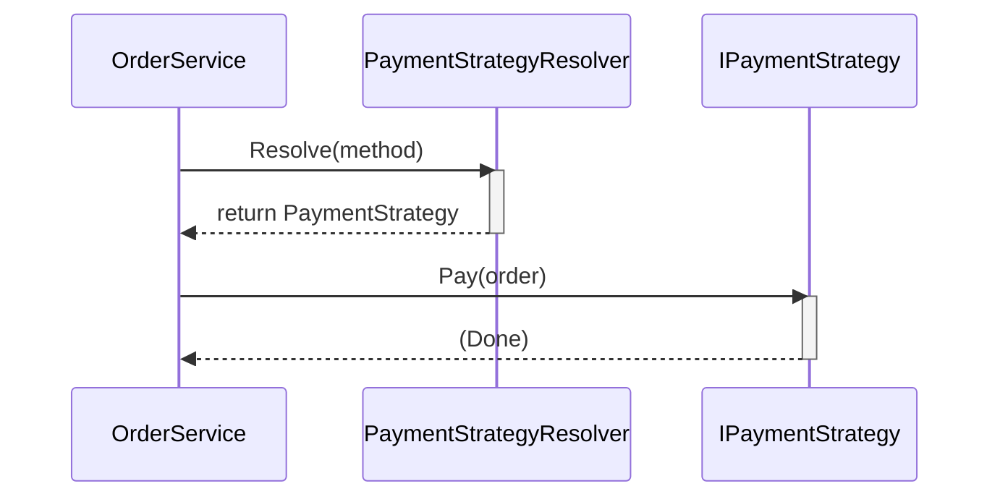

# 第13章：OCPの王道：Strategyで差し替え🎭🔁

[](https://www.researchgate.net/figure/UML-class-diagram-of-strategy-pattern_fig1_357540097?utm_source=chatgpt.com)


## この章でできるようになること🧠💪

* 「機能追加のたびに既存コードを直しまくる…😇」を減らす
* **if/switch の増殖ポイント**を見つけて「差し替え部品」に変える🎛️✨
* 追加が来ても **“新しいクラスを足すだけ”** に近づける🚀
* 「分岐はゼロにできない」けど、**分岐の置き場所を“境界”に寄せる**感覚がつく🏠🧱

---

## 1. まずは “あるある地獄” を見よう😵‍💫🔥

ミニECの「支払い」を想像してね🛒💳
最初は支払い方法が2つくらいだから、ついこう書いちゃう👇

```csharp
public enum PaymentMethod
{
    CreditCard,
    BankTransfer,
    CashOnDelivery
}

public sealed class Order
{
    public required string OrderId { get; init; }
    public required decimal TotalAmount { get; init; }
    public required PaymentMethod PaymentMethod { get; init; }
}

public sealed class OrderService
{
    public void Checkout(Order order)
    {
        // ここが増殖ポイント💥
        switch (order.PaymentMethod)
        {
            case PaymentMethod.CreditCard:
                ChargeCreditCard(order);
                break;

            case PaymentMethod.BankTransfer:
                RequestBankTransfer(order);
                break;

            case PaymentMethod.CashOnDelivery:
                PrepareCashOnDelivery(order);
                break;

            default:
                throw new NotSupportedException("Unknown payment method.");
        }

        // まだ続く…（メール送る、在庫引く、発送依頼…）😇
    }

    private void ChargeCreditCard(Order order) { /* ... */ }
    private void RequestBankTransfer(Order order) { /* ... */ }
    private void PrepareCashOnDelivery(Order order) { /* ... */ }
}
```

### これ、何がつらいの？😢

* 支払い方法が増えるたびに `OrderService` を編集する🛠️
* うっかり既存のケースを壊す💥
* 1つのクラスが「支払い全部の事情」を抱え込む😇
* 追加の影響範囲が広がる → **OCP違反が起きやすい**🚨

> OCPは「拡張に開いて、変更に閉じる」＝追加のために既存をあまり触らない方向にする考え方だよ🚪✨
> その王道の道具が **Strategy** 🎭（ふるまいを“部品化”して差し替える）だよ〜！ ([refactoring.guru][1])

---

## 2. Strategyってなに？🎭（超やさしく）


**「場合によって処理が変わる部分」を“差し替え可能な部品”にする**パターンだよ🔁✨

* ✅ 「支払い」みたいに **種類が増えやすい処理**に強い💪
* ✅ 追加＝「新しい部品を作って挿す」で済みやすい🧩
* ✅ `OrderService` は「支払いの細かい中身」を知らなくてよくなる😌

---

## 3. リファクタ手順（王道ルート）🧭✨

ここからが本番〜！🎀
「switchの中身」を外に出して、差し替えできるようにしていくよ🔧

### 手順①：支払いの“共通の形”をインターフェースにする📄✂️

```csharp
public interface IPaymentStrategy
{
    PaymentMethod SupportedMethod { get; }   // どの支払い担当？🎫
    void Pay(Order order);
}
```

### 手順②：ケースごとにクラスを作る（= Strategy）🧱✨

```csharp
public sealed class CreditCardPaymentStrategy : IPaymentStrategy
{
    public PaymentMethod SupportedMethod => PaymentMethod.CreditCard;

    public void Pay(Order order)
    {
        // クレカ決済の具体処理💳
        // 例：決済API呼び出し、与信、結果保存など
    }
}

public sealed class BankTransferPaymentStrategy : IPaymentStrategy
{
    public PaymentMethod SupportedMethod => PaymentMethod.BankTransfer;

    public void Pay(Order order)
    {
        // 振込案内の発行🏦
    }
}

public sealed class CashOnDeliveryPaymentStrategy : IPaymentStrategy
{
    public PaymentMethod SupportedMethod => PaymentMethod.CashOnDelivery;

    public void Pay(Order order)
    {
        // 代引きの準備📦
    }
}
```

ここで大事なのは👇

* `OrderService` から「各支払いの中身」が消えていく✨
* 追加は「新しいStrategyクラスを作る」が基本形になる🧩

---

## 4. 「じゃあ誰が選ぶの？」問題🤔👉 Resolver（選択係）を作ろう

分岐は完全にゼロにはできないことが多いよ🙂
でも、**分岐を“1か所”に閉じ込める**のが勝ち筋🏆✨

### 支払いStrategyを選ぶ係（Resolver）🗂️

```csharp
public sealed class PaymentStrategyResolver
{
    private readonly Dictionary<PaymentMethod, IPaymentStrategy> _map;

    public PaymentStrategyResolver(IEnumerable<IPaymentStrategy> strategies)
    {
        _map = strategies.ToDictionary(x => x.SupportedMethod);
    }

    public IPaymentStrategy Resolve(PaymentMethod method)
    {
        if (_map.TryGetValue(method, out var strategy))
            return strategy;

        throw new NotSupportedException($"Unsupported payment method: {method}");
    }
}
```

### OrderServiceは “選んで実行するだけ” に激やせ🎉



```csharp
public sealed class OrderService
{
    private readonly PaymentStrategyResolver _resolver;

    public OrderService(PaymentStrategyResolver resolver)
    {
        _resolver = resolver;
    }

    public void Checkout(Order order)
    {
        var payment = _resolver.Resolve(order.PaymentMethod);
        payment.Pay(order);

        // 以降の処理（在庫、メール、発送…）へ続く📦✉️
    }
}
```

**ポイント💡**

* `OrderService` は “支払いの種類が増える未来” に鈍感でOK😌
* 追加は `IPaymentStrategy` 実装を足して Resolver に認識させるだけになりやすい🧩✨

---

## 5. DI（依存性注入）で “自動で集める” と気持ちいい🤖🧲

ここは「あとでDIP/DI章でもっと本格的にやる」けど、今でも最低限だけ触れると超ラク😊

.NET のDIは `AddTransient` とかで登録できるよ🧱
（ドキュメント：`AddTransient` など） ([Microsoft Learn][2])
DIの考え方そのものも公式にまとまってるよ📚 ([Microsoft Learn][3])

例（コンソールでもWebでも考え方は同じ）👇

```csharp
using Microsoft.Extensions.DependencyInjection;

var services = new ServiceCollection();

services.AddTransient<IPaymentStrategy, CreditCardPaymentStrategy>();
services.AddTransient<IPaymentStrategy, BankTransferPaymentStrategy>();
services.AddTransient<IPaymentStrategy, CashOnDeliveryPaymentStrategy>();

services.AddTransient<PaymentStrategyResolver>();
services.AddTransient<OrderService>();

var provider = services.BuildServiceProvider();

var orderService = provider.GetRequiredService<OrderService>();
```

これで `IEnumerable<IPaymentStrategy>` に勝手に全部入ってくるのが嬉しいところ🎁✨

---

## 6. 追加が来ても “既存を触らない” を体験しよ🎮✨

新しい支払い方法「コンビニ払い」を追加してみるね🏪

### 追加①：enumに追加（ここは仕方ないこと多い🙆‍♀️）

```csharp
public enum PaymentMethod
{
    CreditCard,
    BankTransfer,
    CashOnDelivery,
    ConvenienceStore // 🏪
}
```

### 追加②：Strategyを1個足すだけ🎉

```csharp
public sealed class ConvenienceStorePaymentStrategy : IPaymentStrategy
{
    public PaymentMethod SupportedMethod => PaymentMethod.ConvenienceStore;

    public void Pay(Order order)
    {
        // コンビニ払い番号の発行など🏪🧾
    }
}
```

### 追加③：DI登録を1行足すだけ（使ってるなら）🧱

```csharp
services.AddTransient<IPaymentStrategy, ConvenienceStorePaymentStrategy>();
```

✅ **OrderServiceは一切変更なし** 🎊
これがOCPの「追加が怖くない」感覚だよ〜！🥳

---

## 7. テストで “OCPの気持ちよさ” を固める🧪✨

初心者さんはここが超大事！
設計の良さって、テストで「壊れてない」を確認できると一気に安心になるよ😊

### 例：Resolverが正しいStrategyを返すテスト（xUnit想定）

```csharp
using Xunit;

public sealed class PaymentStrategyResolverTests
{
    [Fact]
    public void Resolve_ReturnsStrategyByMethod()
    {
        var strategies = new IPaymentStrategy[]
        {
            new CreditCardPaymentStrategy(),
            new BankTransferPaymentStrategy(),
            new CashOnDeliveryPaymentStrategy()
        };

        var resolver = new PaymentStrategyResolver(strategies);

        var s = resolver.Resolve(PaymentMethod.BankTransfer);

        Assert.IsType<BankTransferPaymentStrategy>(s);
    }
}
```

「追加したらテストも1個足す」くらいにできると、未来が明るい🌅✨

---

## 8. よくある失敗パターン集😇（先に潰そ！）

### ❶ Strategyを作ったのに、結局OrderServiceにswitchが残る😢

* ✅ 分岐は “境界” に寄せよう（Resolver / Factory / UI側など）🧱

### ❷ Strategyが増えすぎて迷子😵‍💫

* ✅ 「増える見込みが高いところ」だけに使う✨
* ✅ 何でもかんでもStrategy化しない（やりすぎ注意は次章でも！⚖️）

### ❸ Strategy間でコピペが増える📎😇

* ✅ 共通処理は「小さなヘルパー」や「別サービス」に逃がす🧹
* ✅ “継承で共通化”は慎重に（LSP章で詳しくやるよ🧱）

---

## 9. Copilot / Codex系に頼るコツ🤖💬（そのまま使える！）

「今のswitchをStrategyにしたい」ときは、AIにこう投げると強いよ✨

* 💡プロンプト例①（設計案）

  * 「この `switch (PaymentMethod)` を Strategy パターンでリファクタしたい。`IPaymentStrategy` と `Resolver` を作って、`OrderService` を薄くしたコード案を出して」

* 💡プロンプト例②（安全な分割）

  * 「テストがない前提。壊さないために、最小の変更から段階的にStrategy化する手順をステップで出して」

* 💡プロンプト例③（命名）

  * 「支払い方法ごとのStrategyクラス名を、C#の一般的な命名で候補10個出して」

---

## 10. チェック問題（理解できた？）📝✨

### Q1️⃣ Strategy化すると、何がOCPっぽくなるの？

* ✅ **追加が“新クラス追加”で済みやすく**なって、既存修正が減る🎉

### Q2️⃣ 分岐は完全に消せる？

* ✅ だいたい無理🙂 でも **分岐を1か所に閉じ込める**のが大事🏠✨

### Q3️⃣ Strategyを使うときの鉄板用途は？

* ✅ **増えやすい“種類”**（支払い/割引/配送/通知など）に強い🧩

---

## 11. ミニ宿題（5〜15分）⏱️🎀

1. 「配送方法（通常/速達/クール便）」を **ShippingStrategy** にしてみてね📦❄️
2. Resolverで選べるようにして、`OrderService` を太らせない✨
3. 「新しい配送方法を1個追加」して、**OrderService無変更**を達成してみよう🥳

---

## まとめ🌈✨

* OCPは「追加で既存を触る量を減らす」方向の考え方🚪✨
* **Strategy** は「増えやすい処理」を部品化して差し替える王道🎭🔁 ([refactoring.guru][1])
* コツは **分岐を1か所に集める**（Resolver/Factory）🗂️
* DIを使うと Strategy の収集が自動化できてさらに気持ちいい🧲✨ ([Microsoft Learn][2])
* そして「やりすぎ注意⚖️」は次章でしっかりやるよ〜！😆💕

（おまけ：C# 14 と Visual Studio 2026 で最新機能を試せるよ、という公式案内もあるよ🧡） ([Microsoft Learn][4])

[1]: https://refactoring.guru/design-patterns/strategy/csharp/example?utm_source=chatgpt.com "Strategy in C# / Design Patterns"
[2]: https://learn.microsoft.com/en-us/dotnet/api/microsoft.extensions.dependencyinjection.servicecollectionserviceextensions.addtransient?view=net-10.0-pp&utm_source=chatgpt.com "ServiceCollectionServiceExtensi..."
[3]: https://learn.microsoft.com/en-us/aspnet/core/fundamentals/dependency-injection?view=aspnetcore-10.0&utm_source=chatgpt.com "Dependency injection in ASP.NET Core"
[4]: https://learn.microsoft.com/en-us/dotnet/csharp/whats-new/csharp-14?utm_source=chatgpt.com "What's new in C# 14"
