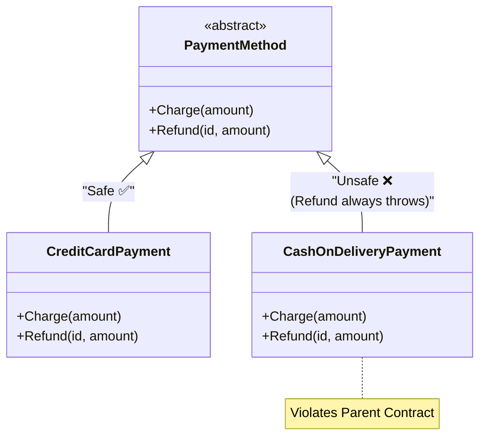

# 第16章：LSPの入口「継承するときの約束」📜

この章はひとことで言うと、**「継承＝機能追加」じゃなくて、まずは“約束を守る”が最優先だよ〜！**って回です😊💕

---

## この章でできるようになること🎯✨

* **LSP（リスコフ置換）**が何を守ろうとしてるかを、やさしい言葉で説明できる🗣️✨
* 「これ、継承していい…？🥺」を判断する**超シンプルなチェック**が持てる✅
* “継承したら便利そう”の罠（地雷💣）を早めに回避できる🏃‍♀️💨

---

## LSPを超ざっくり言うと…🍬


**「親の代わりに子を入れても、呼び出し側が壊れないこと」**です😊✨

ポイントはここ👇

* 呼び出し側は **“親の型”だけ**を信じて書かれてる
* だから子が来ても、**同じ約束で動く**必要がある

---

## まずは“呼び出し側の気持ち”になろう🥺📣


呼び出し側（使う側）は、こう思ってます👇

* 「この型なら、こう動くんだよね？🤝」
* 「ここで例外投げないよね？😇」
* 「結果の意味、変わらないよね？🧠」

LSPが壊れると、呼び出し側はこうなります👇

* `if (x is 子ども型)` みたいな**特別扱い**が増える😵‍💫
* 仕様追加のたびに**既存コードが壊れやすく**なる💥
* テストも増えるし、改修怖いし、地獄…🫠🔥

---

## ダメになりがちな例：返金できない支払いが“返金できる親”を継承しちゃう💸🙅‍♀️

ミニEC（注文→支払い→発送）だと、支払いって増えがちですよね😊
「クレカ」「銀行振込」「代引き」…✨

ここで “つい” やりがち👇

```csharp
public abstract class PaymentMethod
{
    public abstract string Name { get; }

    // 料金を請求する（成功したら支払いIDを返す）
    public abstract string Charge(decimal amount);

    // 返金する（成功した支払いIDなら返金できる…という期待）
    public virtual void Refund(string paymentId, decimal amount)
    {
        // ここでは「返金できる」前提の処理が書かれていく想定
        Console.WriteLine($"Refunded {amount} for {paymentId}");
    }
}

// 代引き（現金）は「そもそも決済IDで返金」みたいな世界観が合わない…
public sealed class CashOnDeliveryPayment : PaymentMethod
{
    public override string Name => "CashOnDelivery";

    public override string Charge(decimal amount)
        => "COD-" + Guid.NewGuid();

    public override void Refund(string paymentId, decimal amount)
        => throw new NotSupportedException("代引きはこの方式では返金できません");
}
```



一見「継承できてるしOKじゃない？🤔」って思うんだけど…

---

## どこがLSP違反なの？💥（超重要ポイント）


呼び出し側がこう書いてたとします👇

```csharp
public sealed class PaymentService
{
    public void RefundIfNeeded(PaymentMethod method, string paymentId, decimal amount)
    {
        // PaymentMethodなら返金できると思って呼んでいる
        method.Refund(paymentId, amount);
    }
}
```

ここに `CashOnDeliveryPayment` が入ると…
**「親の代わりに子を入れたら壊れた」** ですよね😵‍💫💣

つまり、呼び出し側は **親の約束** を信じただけなのに、
子が **“その約束、守れません”** って言い出した状態です🙅‍♀️

これがLSPの感覚です😊✨

---

## LSPチェックリスト（この章の主役）✅🧡

継承したいとき、まずこれだけ見てください👇✨

### ✅ 1) 子は、親が受け取れる入力を “同じように” 受け取れる？


* 親：`amount > 0` ならOK
* 子：`amount > 0` でも「それ無理」← ❌（条件をきつくしてる）

### ✅ 2) 子は、親が保証してる結果を “同じ意味” で返せる？


* 親：「成功したら支払いIDを返す」
* 子：「成功したけど空文字返す」← ❌（意味が変わる）

### ✅ 3) 子は、親より “壊れやすい動き” を増やしてない？


* 親：普通に動く
* 子：頻繁に `NotSupportedException` ← ❌（呼び出し側が死ぬ）

この3つのどれかが怪しかったら、**継承は黄色信号🚥⚠️**です。

---

## じゃあどう直すの？（この章では“方向性”まで）🧭✨

さっきの例は、ぶっちゃけ **親の設計が強すぎ** です🥺
「返金できる支払い」と「返金という概念がズレる支払い」を、同じ親に押し込んだのが原因💥

直し方は主にこれ👇

### 直し方A：親の“約束”を小さくする（できることだけ約束する）✂️


* `PaymentMethod` は **Chargeだけ**を約束
* Refundは別の約束にする（返金できるやつだけが持つ）

👉 これ、次の **ISP（19章）** にもつながる超大事パターンです😊✨

### 直し方B：そもそも継承しない（合成に逃げる）🧩


* 返金の仕組みを “部品” として組み合わせる
  👉 これは **第18章** でガッツリやります💪✨

---

## “約束”を明文化するコツ📌📝✨

LSPは気合いじゃなくて、**約束を言語化すると強い**です😊
おすすめはこの2つ👇

* **XMLコメント**に「前提」「保証」を書く
* **テスト**で「親の期待」を固定する🧪✨

C# 14 は .NET 10 でサポートされていて、Visual Studio 2026 / .NET 10 SDK で試せます😊 ([Microsoft Learn][1])
Visual Studio 2026 は .NET 10 と C# 14 を“追加設定なしで”完全サポートと案内されています🧰✨ ([Microsoft Learn][2])

---

## 🤖AI（Copilot/Codex系）に頼るとめっちゃ早いプロンプト集💖

GitHub Copilotは、エディタ上の提案だけじゃなく、複数ファイル編集やより自律的な作業モードも用意されています😊 ([Visual Studio Marketplace][3])
この章で使うと強いお願いの仕方はこちら👇✨

* 「この継承はLSPを満たしてる？**呼び出し側の視点**で破綻点を箇条書きで教えて」👀🧠
* 「親クラスのメソッドごとに、**前提条件／事後条件**を日本語で書いて」📝✨
* 「“親の型だけを使うテスト”をxUnitで3本作って。子に差し替えても全部通る形にして」🧪✅
* 「NotSupportedExceptionが出てる継承を見つけて、**継承しない案**を2パターン提案して」🧯🧩

---

## 章末ミニ演習🎓✨（手を動かすやつ！）

### 演習1：LSP違反を見つけよう🔍💥

次のどれが危ない？（理由も！）

* 子が入力条件を増やす（例：追加の制限をかける）
* 子が戻り値の意味を変える（例：成功なのにnull返す）
* 子が例外を増やす（例：NotSupportedExceptionだらけ）

👉 全部危ないです😇（どれがどのチェックリストに当たるか言えたら勝ち🎉）

### 演習2：あなたのミニEC題材に当てはめよう🛒💳

支払い方法を3つ書き出して👇

* それらは **同じ“約束”で扱える？**
* 無理なら、約束はどう分ける？（Charge/Refundなど）

---

## まとめ🌸✨

* LSPは「子は親の代わりになれる？」のルール😊
* 継承は **機能追加じゃなくて“約束の継承”** 📜
* 「NotSupportedExceptionで逃げる継承」はだいたい危険信号🚨
* 直し方は **約束を小さくする** or **継承しない** 🧩✨（次章以降で深掘り！）

---

次の第17章では、いよいよ **「条件（事前条件/事後条件）」でLSPをハッキリ言語化**していきますよ〜！🧠✨📌

[1]: https://learn.microsoft.com/ja-jp/dotnet/csharp/whats-new/csharp-14 "C# 14 の新機能 | Microsoft Learn"
[2]: https://learn.microsoft.com/ja-jp/visualstudio/releases/2026/release-notes "Visual Studio 2026 リリース ノート | Microsoft Learn"
[3]: https://marketplace.visualstudio.com/items?itemName=GitHub.copilot "
        GitHub Copilot - Visual Studio Marketplace
    "
