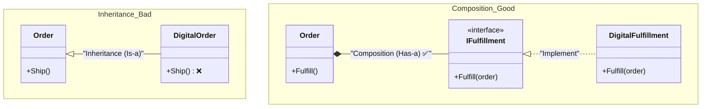

# 第18章：LSPの解決：継承より合成へ🧩✨

まず今日の“地図”ね🗺️
前の章（第17章）で「子クラスが親クラスの約束を破ると、呼び出し側が爆発する💥」を見たよね。
今回はその“超定番の解決策”＝ **継承を減らして、合成（composition）で組み立てる** を身につけます😊✨

※ちなみに本日時点（2026/01/09）では **.NET 10（LTS）** と **C# 14**、**Visual Studio 2026** が提供されています📦✨ ([Microsoft for Developers][1])

---

## 18-1. 今日のゴール🎯✨

この章が終わったら、次ができるようになります💪😊

* 😵‍💫「この継承、なんかムリしてない？」を嗅ぎ分けられる
* 🧩 “部品を組み合わせて”機能を作る（合成）に置き換えられる
* ✅ LSPを守ったまま、仕様追加がラクになる設計にできる

---

## 18-2. なんで継承がLSPを壊しやすいの？🧨

継承って便利に見えるんだけど、壊れやすいパターンがあるの🥲

### 💥典型パターン：親が約束しすぎる

親クラスが「できるはず」と宣言してるのに、子がそれを満たせない。

* 🙅‍♀️ 例外を投げて逃げる（NotSupportedExceptionとか）
* 🙅‍♀️ 条件が変わる（親は“いつでもOK”なのに子は“特定条件のみOK”）
* 🙅‍♀️ 結果の意味が変わる（親と同じメソッド名なのに中身の意味が別物）

これが起きると、**呼び出し側が “親のつもり” で使って壊れる**＝LSP違反💥

---

## 18-3. 合成（composition）ってなに？🧩💞


ひとことで言うと…

* 継承（is-a）：「AはBの一種」🧬
* 合成（has-a）：「AはBを持っている」🧰

合成は、**機能を“部品”にして持たせる**感じ✨
そして必要なところに **委譲（delegate）** するの😊

> 💡合成の強さ：
> 「親の約束を全部背負わない」→「できることだけ約束する」→LSPが守りやすい✅

---

## 18-4. 継承より合成に切り替えるサイン🚥👀


こんな匂いがしたら、合成に寄せると幸せになりやすいよ🍀

### 🚨合成にした方がいいサイン

* 😇 子クラスで「このメソッドは使いません」みたいになってる
* 💥 子クラスで NotSupportedException を投げたくなった
* 🧟‍♂️ 継承ツリーが深くなって、どこで何してるか追えない
* 🧩 機能を“組み合わせ”たい（A+B+Cのバリエーションが増える）

### ✅継承でもOKな場面（少なめ）

* 👯 親と子が “同じ約束” をちゃんと守れる
* 🧷 親は「共通の土台」だけ（状態・ルールを増やしすぎない）
* 🧠 呼び出し側が「親型で扱っても常に安全」って言い切れる

---

## 18-5. ハンズオン：継承で壊れた“発送”を合成で直す📦➡️🧩✨

題材はミニECっぽくいくね🛒💞
「物理商品」と「デジタル商品（ダウンロード）」があるとするよ📦📩

### 18-5-1. まず“事故る継承”を見てみよ😇💥


「注文 Order は発送できる」って親が約束しちゃってる例👇

```csharp
public abstract class Order
{
    public string OrderId { get; }
    public IReadOnlyList<string> Items { get; }

    protected Order(string orderId, IReadOnlyList<string> items)
    {
        OrderId = orderId;
        Items = items;
    }

    // 親が「発送できる」と約束しちゃってる
    public virtual string CreateShippingLabel(string address)
        => $"SHIP TO: {address} / ORDER: {OrderId}";

    public virtual void Ship(string address)
    {
        var label = CreateShippingLabel(address);
        Console.WriteLine(label);
        Console.WriteLine("Shipping...");
    }
}

public sealed class PhysicalOrder : Order
{
    public PhysicalOrder(string orderId, IReadOnlyList<string> items)
        : base(orderId, items) { }
}

public sealed class DigitalOrder : Order
{
    public DigitalOrder(string orderId, IReadOnlyList<string> items)
        : base(orderId, items) { }

    public override string CreateShippingLabel(string address)
        => throw new NotSupportedException("Digital order has no shipping label.");

    public override void Ship(string address)
        => throw new NotSupportedException("Digital order can't be shipped.");
}
```

はい…出ました…「投げて逃げる」🙈💥
これ、呼び出し側が Order を受け取ったら **DigitalOrder で爆死**します。

---

### 18-5-2. “呼び出し側が壊れる”のをテストで再現🧪💣

```csharp
public static class ShippingWorkflow
{
    public static void ShipAnyOrder(Order order, string address)
    {
        // 呼び出し側は「Orderなら発送できる」と信じてる
        order.Ship(address);
    }
}
```

`Order` を受け取ったのに、子が「できません！」って言い出す。
これが **置換できない**＝LSP違反だよ😵‍💫💥

---

### 18-5-3. 合成に置き換えよう🧩✨（発送は“部品”にする）




発想を変えるよ🌱
「注文そのもの」は *発送の責任* を持たない。
代わりに **フルフィルメント（Fulfillment：届け方）部品**を持つ！

#### ✅ポイント


* 注文は「フルフィルメントにお願いする」だけ🤝
* 物理なら“配送”の部品
* デジタルなら“ダウンロード案内”の部品

```csharp
public interface IFulfillment
{
    FulfillmentResult Fulfill(Order order);
}

public sealed record FulfillmentResult(bool Success, string Message);

public sealed class Order
{
    public string OrderId { get; }
    public IReadOnlyList<string> Items { get; }

    private readonly IFulfillment _fulfillment;

    public Order(string orderId, IReadOnlyList<string> items, IFulfillment fulfillment)
    {
        OrderId = orderId;
        Items = items;
        _fulfillment = fulfillment;
    }

    public FulfillmentResult Fulfill()
        => _fulfillment.Fulfill(this);
}
```

物理用とデジタル用の部品を作るよ👇

```csharp
public interface IShippingLabelPrinter
{
    void PrintLabel(string orderId, string address);
}

public sealed class PhysicalFulfillment : IFulfillment
{
    private readonly string _address;
    private readonly IShippingLabelPrinter _printer;

    public PhysicalFulfillment(string address, IShippingLabelPrinter printer)
    {
        _address = address;
        _printer = printer;
    }

    public FulfillmentResult Fulfill(Order order)
    {
        _printer.PrintLabel(order.OrderId, _address);
        return new FulfillmentResult(true, "Physical shipment started!");
    }
}

public interface IDownloadLinkIssuer
{
    string IssueLink(string orderId);
}

public sealed class DigitalFulfillment : IFulfillment
{
    private readonly IDownloadLinkIssuer _issuer;

    public DigitalFulfillment(IDownloadLinkIssuer issuer)
        => _issuer = issuer;

    public FulfillmentResult Fulfill(Order order)
    {
        var link = _issuer.IssueLink(order.OrderId);
        return new FulfillmentResult(true, $"Download link issued: {link}");
    }
}
```

#### 🥳何が嬉しいの？

* `Order` は「発送できる」と約束しない（約束しすぎない）✅
* できることだけIFulfillmentが約束する✅
* 物理もデジタルも「Fulfillできる」＝置換できる✅（LSPクリア🎉）

---

### 18-5-4. 仕様追加にも強いよ💪✨（例：店頭受け取り🏪）

「店頭受け取り」が増えたら、継承だとまた地獄になりがち😇
でも合成なら **部品を1個追加でOK**！

```csharp
public sealed class StorePickupFulfillment : IFulfillment
{
    private readonly string _pickupCode;

    public StorePickupFulfillment(string pickupCode)
        => _pickupCode = pickupCode;

    public FulfillmentResult Fulfill(Order order)
        => new(true, $"Pickup ready! Code: {_pickupCode}");
}
```

既存の `Order` は直さなくてOK寄りになる✨（OCP味も出てくる😋）

---

## 18-6. 合成でよく使う“小技パターン”4つ🧰✨


### ① Strategy（差し替え作戦）🎭

「やり方だけ変えたい」を部品にする
→ 今回の IFulfillment がまさにそれ😊

### ② Decorator（後付け）🎀

「ログつける」「リトライする」「計測する」みたいな横入りを、継承じゃなく“包む”で実現✨

### ③ Adapter（変換）🔌

外部APIの形が微妙でも、内側を守るために“変換器”を置く🛡️
（これも合成で作ることが多いよ）

### ④ Null Object（何もしない部品）😶

「nullチェック地獄」を避ける
“何もしない実装”を入れておくとコードがスッキリするよ✨

---

## 18-7. AIに手伝ってもらうコツ🤖📝（そのままコピペOK💞）

### 🧭設計の見直し相談

* 「この継承階層がLSP違反になる可能性を指摘して。呼び出し側が壊れる例も出して」
* 「継承をやめて合成にするなら、部品（インターフェース）案を3つ出して」

### 🧩リファクタ手順を作ってもらう

* 「NotSupportedExceptionを投げている箇所を無くすために、合成へ移行するステップを箇条書きで」
* 「既存のpublic APIをなるべく壊さずに、合成へ移す移行プランを出して」

### 🧪テスト観点を出してもらう

* 「IFulfillmentの実装が置換可能（LSP）か確認するテスト観点を5つ」
* 「物理・デジタル・店頭受取で共通に満たすべき契約（contract）を文章で定義して」

※GitHub Copilot を使うなら、Visual Studio統合の要件などは公式のQuickstartがまとまってるよ📘 ([GitHub Docs][2])

---

## 18-8. つまずきポイントQ&A🥺💬

### Q1. 「合成にするとクラス増えすぎない？」😵‍💫

A. うん、増える！でもね、増えるのは **役割が分かれた証拠** でもあるよ✨
“1個が小さくて読みやすい”ほうが、結果的に速い🏃‍♀️💨

### Q2. 「どこまで部品化していいの？」🤔

A. まずはここだけでOK👇

* 子クラスが“できないこと”を抱えてる場所
* if/switchが増え続ける場所
* “組み合わせ爆発”しそうな場所

---

## 18-9. 理解チェック（ミニ問題）📌✨

### ✅問題1

「子クラスで NotSupportedException を投げたくなった」
これが危険な理由を一言で！

> ✅答え：親型で扱ったときに安全じゃなくなり、置換できない（LSP違反）💥

### ✅問題2

物理・デジタル・店頭受け取りがあるとき、継承より合成が向く理由は？

> ✅答え：できること（契約）を“部品ごと”に分けて、組み替えで対応できるから🧩✨

---

## 18-10. まとめ🎀✨（次章へつながるよ〜！）

* 継承は「約束を背負う」から、ムリするとLSPが壊れやすい😵‍💫
* **合成は“できることだけ約束する”**設計にしやすくて、LSPを守りやすい🧩✅
* 部品化（Strategy/Adapter/Decorator/NullObject）で、追加にも強くなる💪✨

そしてね…今日の話、次章の **ISP（インターフェース分離）✂️📄** と相性バツグン！
「約束（インターフェース）を太くしない」が、合成をさらに気持ちよくするよ😊💞

[1]: https://devblogs.microsoft.com/dotnet/announcing-dotnet-10/?utm_source=chatgpt.com "Announcing .NET 10"
[2]: https://docs.github.com/copilot/get-started/quickstart?utm_source=chatgpt.com "Quickstart for GitHub Copilot"
