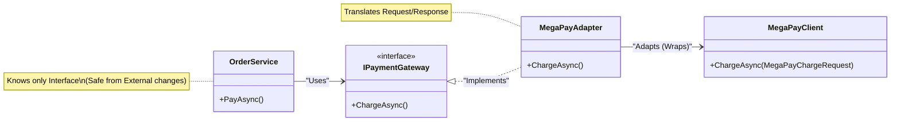

# 第21章：ISP＋外部連携：Adapterで変換して守る🔌🛡️

（テーマ：**外部APIの“都合”を、アプリの内側に持ち込まない**💪💖）

この章のゴールはこれだよ〜！😊🌸

* 外部API（決済・配送・在庫・通知など）がイケてなくても😇、**自分のコードを綺麗に保つ**
* ISPの考え方で、**必要な約束（インターフェース）だけ**に絞る✂️
* Adapterで、**外側→内側の変換壁**（境界）を作る🧱✨
* テストが一気に楽になる（ここ超大事）🧪💕

ちなみに、.NET 10 は 2025/11/11 リリースの LTS で、C# 14 は .NET 10 でサポート、Visual Studio 2026 に .NET 10 SDK が入ってるよ📦✨ ([Microsoft][1])

---

## 1) まず「外部連携あるある地獄」😵‍💫💥


外部SDKや外部APIって、だいたいこうなるの…👇

* メソッドがやたら多い（太い）📌
* 名前やデータ構造が微妙（クセ強）🌀
* 例外やエラーが独自で扱いづらい⚠️
* アプリ内の“言葉”と合ってない（ドメインとズレる）🧩

そして一番ありがちなミスがこれ👇
**アプリの中心（業務ロジック）が、外部SDKに直接依存する**😇
→ すると、変更・差し替え・テストが全部きつくなる💦

ここで ISP が効くよ✂️✨
**「使わないメソッドまで実装させない」「必要な約束だけにする」**って発想ね😊💕

---

## 2) 今日の結論：こう分けると勝ち🏆✨


外部連携は、基本この形にしよう〜👇🥰

* ✅ 内側（業務側）

  * **小さくて必要十分なインターフェース**（例：`IPaymentGateway`）だけを定義
  * そのインターフェースだけに依存する（外部SDKを知らない）🙈

* ✅ 外側（インフラ側）

  * 外部SDK・外部APIのクセを全部引き受ける😤
  * **Adapter** が「翻訳係」になる🗣️➡️🗣️✨
  * DTO変換、例外変換、リトライ方針、ログ…ぜんぶここ！

この構造、見た目は地味だけど…
**“将来の自分”が泣かない**設計になるよ😭➡️😊💕

---

## 3) 例題：決済API（外部SDK）を守りながら使う💳🛡️

### ✅ やりたいこと（業務側の言葉）

* 注文IDに対して
* 指定金額を
* “チャージする”

…だけでいい！他はいらん！✋😆

---

### 3.1 内側（業務）に「細いインターフェース」を作る✂️✨


```csharp
public readonly record struct OrderId(string Value);

public readonly record struct Money(decimal Amount, string Currency);

public enum PaymentStatus
{
    Succeeded,
    Failed
}

public sealed record PaymentResult(
    PaymentStatus Status,
    string? TransactionId,
    string? ErrorCode,
    string? ErrorMessage);

public interface IPaymentGateway
{
    Task<PaymentResult> ChargeAsync(OrderId orderId, Money amount, CancellationToken ct);
}
```

ポイントはこれだよ😊🌸

* 外部SDKの型を **一切出さない** 🙅‍♀️
* 業務に必要なメソッドだけ（超スリム）✂️✨
* `PaymentResult` も自分たちの都合の良い形にする💕

---

### 3.2 外部SDK（例：クセ強クライアント）を想定😇


外部SDKってだいたい、こんなノリ👇（イメージ）

```csharp
// 外部SDK側（例）: 変更されうる＆クセ強い
public sealed class MegaPayClient
{
    public Task<MegaPayChargeResponse> ChargeAsync(MegaPayChargeRequest req, CancellationToken ct) => throw new NotImplementedException();
}

public sealed record MegaPayChargeRequest(string MerchantId, string OrderNo, decimal Amount, string Currency);
public sealed record MegaPayChargeResponse(string TxId, string ResultCode, string? Message);
```

---

### 3.3 Adapter：外部SDKをラップして「翻訳」する🔁🛡️




```csharp
public sealed class MegaPayAdapter : IPaymentGateway
{
    private readonly MegaPayClient _client;
    private readonly string _merchantId;

    public MegaPayAdapter(MegaPayClient client, string merchantId)
    {
        _client = client;
        _merchantId = merchantId;
    }

    public async Task<PaymentResult> ChargeAsync(OrderId orderId, Money amount, CancellationToken ct)
    {
        try
        {
            var req = new MegaPayChargeRequest(
                MerchantId: _merchantId,
                OrderNo: orderId.Value,
                Amount: amount.Amount,
                Currency: amount.Currency
            );

            var res = await _client.ChargeAsync(req, ct);

            // 外部の結果コードを、内側の言葉へ変換✨
            return res.ResultCode switch
            {
                "OK" => new PaymentResult(PaymentStatus.Succeeded, res.TxId, null, null),
                _    => new PaymentResult(PaymentStatus.Failed, null, res.ResultCode, res.Message)
            };
        }
        catch (Exception ex)
        {
            // 外部例外は “境界” で止める（内側へ漏らさない）🧱
            return new PaymentResult(PaymentStatus.Failed, null, "EXCEPTION", ex.Message);
        }
    }
}
```


ここ、めちゃ重要だよ〜！🥹✨

* **外部のResultCode** を、内側の `PaymentStatus` に変換する
* 外部例外をそのまま投げない（内側が外部事情に振り回される）😇
* Adapterが「防波堤」🌊🧱✨

---

## 4) 業務サービス側は、外部の存在を忘れる😌💕


```csharp
public sealed class OrderService
{
    private readonly IPaymentGateway _paymentGateway;

    public OrderService(IPaymentGateway paymentGateway)
    {
        _paymentGateway = paymentGateway;
    }

    public async Task<bool> PayAsync(OrderId orderId, Money amount, CancellationToken ct)
    {
        var result = await _paymentGateway.ChargeAsync(orderId, amount, ct);

        if (result.Status == PaymentStatus.Succeeded) return true;

        // 失敗時の処理（ログ・通知など）はここで自由に✨
        return false;
    }
}
```

OrderServiceは **外部SDKを一切知らない**🙈✨
だから…

* 決済会社を変える（MegaPay→OtherPay）も、Adapter差し替えでOK🔁
* テストは Fake を差すだけでOK🧪💕

---

## 5) DI登録：差し替え可能にする🔧✨

ASP.NET Core / Worker / Console でも考え方同じだよ😊

```csharp
using Microsoft.Extensions.DependencyInjection;

var services = new ServiceCollection();

// 外部クライアント登録（実際はHttpClientやSDKの作法に合わせて）
services.AddSingleton(new MegaPayClient());

// 内側に見せるのは IPaymentGateway だけ✨
services.AddScoped<IPaymentGateway>(sp =>
{
    var client = sp.GetRequiredService<MegaPayClient>();
    return new MegaPayAdapter(client, merchantId: "MERCHANT-001");
});

services.AddScoped<OrderService>();

var provider = services.BuildServiceProvider();
```

---

## 6) テストが爆速でラクになる🧪🚀✨（ここが最高）


外部SDKに依存してると、テストがこうなる👇

* 変な初期化が必要
* 使わないメソッドまでモック地獄
* 通信しないと確認できない（遅い）

でも ISP＋Adapter だと、こう👇😍

* **業務テストは Fake で一瞬**
* Adapterは別枠で「結合テスト」すればOK

### 6.1 Fakeで業務テスト（例：xUnit想定）🧪💕

```csharp
public sealed class FakePaymentGateway : IPaymentGateway
{
    public PaymentResult NextResult { get; set; }
        = new(PaymentStatus.Succeeded, "TX-FAKE", null, null);

    public Task<PaymentResult> ChargeAsync(OrderId orderId, Money amount, CancellationToken ct)
        => Task.FromResult(NextResult);
}
```

---

## 7) 外部通信するなら：HttpClientの作法も押さえる📡🧠


外部APIを叩く実装になるなら、.NET は “作法” があるよ〜😊

* `HttpClient` の扱いを雑にすると、ソケット枯渇などの問題が起きうる
* その対策として、`IHttpClientFactory` や “typed client” が推奨される流れ✨ ([Microsoft Learn][2])
* ただし **Cookieが必要なケースでは注意点**もある（共有・破棄など）🍪⚠️ ([Microsoft Learn][3])
* 回復性（リトライ等）を組みやすくする説明もあるよ🛡️ ([Microsoft Learn][4])

この章の“結論”としては：
**外部通信の詳細も、Adapter側（外側）へ閉じ込める**🔒✨
業務ロジック側に「HttpClient」「JSON」「ResultCode」みたいなのを漏らさないのが勝ち🏆😊

---

## 8) Copilotに頼むと超はかどるプロンプト集🤖💕

* 「この外部SDKのレスポンスを、`PaymentResult` に安全にマッピングして。失敗コードも考慮して」
* 「例外を内側に漏らさない方針で、Adapterの実装案を3パターン出して」
* 「`IPaymentGateway` のテスト用 Fake 実装を作って。成功・失敗を切り替えられるように」
* 「外部DTOと内部モデルの変換クラス（Mapper）を作って。責務が肥大化しないように分割して」

---

## 9) 演習（3段階）📚✨

### レベル1（ウォームアップ）😊

* `IShippingGateway` を作って、`CreateShipmentAsync` だけ定義✂️
* Adapterで外部の `ShipmentStatusCode` を内側の enum に変換

✅ 合格ライン：業務側が外部SDKの型を一切参照してないこと🙈

### レベル2（実戦）🔥

* 外部が返すエラー形式（コード＋メッセージ）を、内側の `ErrorCode/ErrorMessage` に統一
* タイムアウト・キャンセル（`CancellationToken`）をちゃんと流す

✅ 合格ライン：OrderServiceのテストが Fake だけで完結🧪

### レベル3（強い）💪✨

* Adapterを「DTO変換」「通信」「例外変換」に分割（SRPも同時に意識）🧹
* Adapterの結合テスト（スタブサーバー or テストダブル）方針を文章化📝

✅ 合格ライン：外部差し替えの影響範囲が“Adapter周辺だけ”になってる🔁✨

---

## 10) 理解チェッククイズ（サクッと）📝😊

1. 外部SDKの型を業務側に漏らすと、何が困る？😇
2. ISPの観点で「良いインターフェース」ってどんな形？✂️
3. Adapterは何を“変換”する？（最低3つ言ってみて）🔁
4. 業務テストで Fake を差すと何が嬉しい？🧪✨

---

必要なら、この章の続きとして👇も一緒に作れるよ😊💕

* 「決済だけじゃなく、配送APIでもう1セット（まるごと）実装」📦
* 「エラー設計（例外にする？Result型にする？）の選び方」⚖️
* 「Adapter肥大化を防ぐ分割テンプレ（Mapper／Client／Policy）」🧱✨

[1]: https://dotnet.microsoft.com/en-us/platform/support/policy/dotnet-core?utm_source=chatgpt.com "NET and .NET Core official support policy"
[2]: https://learn.microsoft.com/en-us/dotnet/fundamentals/networking/http/httpclient-guidelines?utm_source=chatgpt.com "HttpClient guidelines for .NET"
[3]: https://learn.microsoft.com/en-us/dotnet/core/extensions/httpclient-factory?utm_source=chatgpt.com "Use the IHttpClientFactory - .NET"
[4]: https://learn.microsoft.com/ja-jp/dotnet/architecture/microservices/implement-resilient-applications/use-httpclientfactory-to-implement-resilient-http-requests?utm_source=chatgpt.com "IHttpClientFactory を使用して回復性のある HTTP 要求を実装 ..."
