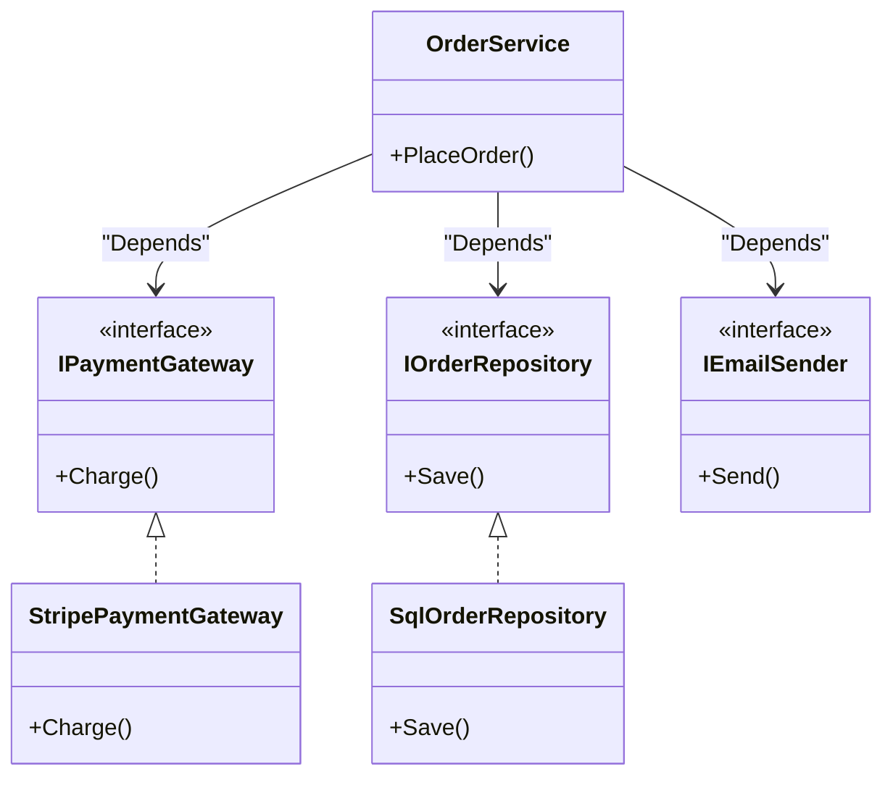

# 第23章：DIの基本：newしないで外から渡す🎁

この章はね、ひとことで言うと👇
**「業務ロジックの中で `new` して“接着剤”でベタベタにしないで、外から部品を渡して“差し替え可能”にしよう」**って話だよ😊🧩✨

.NET には DI（依存性注入）を前提にした仕組み（Microsoft.Extensions.*）が用意されてて、公式ドキュメントでも DI の使い方・考え方が整理されてるよ📚✨ ([Microsoft Learn][1])
（そして C# 14 は .NET 10 対応、Visual Studio 2026 に .NET 10 SDK が同梱って明記されてるよ🧡） ([Microsoft Learn][2])

---

## 1) まず大事な誤解をほどくね🧸💭「newは悪」じゃない！

結論から言うと…

* ❌ **「どこでも new しちゃう」**のが問題
* ✅ **「組み立て場所（後で第24章でやるComposition Root）だけで new する」**のはOK

つまり、「newを絶対禁止！」じゃなくて、
**“newする場所を1か所（または少数）に寄せる”**のが勝ち筋だよ🏆✨

公式のガイドラインでも「依存先を直接インスタンス化すると特定実装に結びついて結合が強くなるから避けようね」みたいな方向で説明されてるよ🧷 ([Microsoft Learn][3])

---

## 2) DIP と DI の関係をスッキリ整理🧼✨（ここ超重要！）

* **DIP（第22章）**：設計の“原則”📜
  👉「上位（業務）は下位（DB/HTTPなど）に依存しないで、**抽象（interface）に依存しよう**」
* **DI（第23章）**：原則を実現する“やり方”🛠️
  👉「その抽象（interface）を、**外から渡そう（注入しよう）**」

DIP が「こうあるべき！」で、DI が「じゃあこうやって実装しよ！」って関係だよ😊🧠✨

---

## 3) 例題：ミニECの「注文確定」🛒📦（new地獄→DIで救出）

### ❌ 悪い例：業務ロジックの中が `new` だらけ😇💥

```csharp
public class OrderService
{
    public void PlaceOrder(Order order)
    {
        // ここで new しまくり…
        var payment = new StripePaymentGateway("api-key");
        var repo = new SqlOrderRepository("connection-string");
        var email = new SmtpEmailSender("smtp.example.com");

        payment.Charge(order.TotalPrice);
        repo.Save(order);
        email.Send(order.CustomerEmail, "注文ありがとう！", "本文...");
    }
}
```

これ、何が辛いかっていうと…😭

* 決済手段を増やしたい → `OrderService` を直すことになりがち💥
* DB を変えたい → `OrderService` を直すことになりがち💥
* テストしたい → 外部通信やDB接続が走って地獄😵‍💫
* “OrderService が何してるか”が読みにくい（組み立てが混ざってる）📦🧱

---

## 4) ✅ 良い例：コンストラクタ注入（Constructor Injection）🎁✨


### Step 1：まず「差し替えたいもの」を interface にする🎭



```csharp
public interface IPaymentGateway
{
    void Charge(decimal amount);
}

public interface IOrderRepository
{
    void Save(Order order);
}

public interface IEmailSender
{
    void Send(string to, string subject, string body);
}
```

### Step 2：実装クラスは普通に作る（これは“部品”）🧩

```csharp
public class StripePaymentGateway : IPaymentGateway
{
    private readonly string _apiKey;
    public StripePaymentGateway(string apiKey) => _apiKey = apiKey;

    public void Charge(decimal amount)
    {
        // Stripe決済…（ここは省略）
    }
}

public class SqlOrderRepository : IOrderRepository
{
    private readonly string _connectionString;
    public SqlOrderRepository(string connectionString) => _connectionString = connectionString;

    public void Save(Order order)
    {
        // SQL保存…（省略）
    }
}

public class SmtpEmailSender : IEmailSender
{
    private readonly string _host;
    public SmtpEmailSender(string host) => _host = host;

    public void Send(string to, string subject, string body)
    {
        // SMTP送信…（省略）
    }
}
```

### Step 3：OrderService は **newしない**！外から受け取る🎁✨

```csharp
public class OrderService
{
    private readonly IPaymentGateway _payment;
    private readonly IOrderRepository _repo;
    private readonly IEmailSender _email;

    public OrderService(
        IPaymentGateway payment,
        IOrderRepository repo,
        IEmailSender email)
    {
        _payment = payment;
        _repo = repo;
        _email = email;
    }

    public void PlaceOrder(Order order)
    {
        _payment.Charge(order.TotalPrice);
        _repo.Save(order);
        _email.Send(order.CustomerEmail, "注文ありがとう！", "本文...");
    }
}
```

ここがポイント😍👇
`OrderService` は **「何をするか」だけ**に集中できて、
「どうやって作るか」は外へ追い出せたの🎉

### Step 4：組み立て場所（仮のComposition Root）で new する🧱✨

まだ DI コンテナは使わないよ！（それは次章🫶）
まずは手動でOK👌

```csharp
// Program.cs など（組み立て場所）
var payment = new StripePaymentGateway("api-key");
var repo = new SqlOrderRepository("connection-string");
var email = new SmtpEmailSender("smtp.example.com");

var orderService = new OrderService(payment, repo, email);

orderService.PlaceOrder(order);
```

こうすると「差し替え」が超簡単になるよ🎭✨

---

## 5) DIのいちばん強いご褒美：テストが“爆速で安全”になる🧪⚡

### Fake（偽物）を注入してテストできる！🧸

```csharp
public class FakePaymentGateway : IPaymentGateway
{
    public decimal ChargedAmount { get; private set; }
    public void Charge(decimal amount) => ChargedAmount = amount;
}
```

```csharp
// ざっくりテスト例（テストフレームワークは何でもOK）
var fakePayment = new FakePaymentGateway();
var fakeRepo = new FakeOrderRepository();
var fakeEmail = new FakeEmailSender();

var sut = new OrderService(fakePayment, fakeRepo, fakeEmail);

sut.PlaceOrder(new Order { TotalPrice = 1200m, CustomerEmail = "a@b.com" });

Debug.Assert(fakePayment.ChargedAmount == 1200m);
```

外部I/Oが絡むものほど DI が刺さるよ🧡
（公式の DI 解説でも、依存関係の解決や“依存グラフ”の話が出てくるよ） ([Microsoft Learn][1])

---

## 6) 「注入すべき依存」と「注入しなくていいもの」仕分け表🧺✨

ここ、超ありがちな迷いポイントだから、覚え方を置いとくね😉💕

### ✅ 注入する（差し替えたい・外部とつながる・環境で変わる）

* DBアクセス（Repository）🗄️
* HTTPクライアント（外部API）🌍
* ファイルIO📁
* メール送信📧
* 現在時刻（`IClock` みたいにする）⏰
* 乱数（`IRandom` みたいにする）🎲
* 設定値の塊（Options的なオブジェクト）⚙️
* ログ（ILogger的なもの）📝

※「直接インスタンス化を避けよう」「小さくテストしやすいサービスに」みたいな設計ガイドもあるよ📘 ([Microsoft Learn][3])

### ❌ 注入しない（その場の値・データ・ドメインの“もの”）

* `Order` / `Customer` みたいな **エンティティや値オブジェクト**🧾
* `decimal amount` / `string email` みたいな **メソッド引数のデータ**📦
* ただのDTO（運搬用）🚚
* 一時的な計算結果🧮

**コツ**：
「それは“部品（サービス）”？ それとも“データ”？」って聞くと迷いが減るよ😊✨

---

## 7) 注入のやり方は3つあるよ（でも基本はこれ！）🥇

### ① コンストラクタ注入（いちばんおすすめ）🥰

* 必要な依存が明確になる
* nullで壊れにくい
* テストしやすい
  ➡️ **基本これでOK！**

### ② メソッド注入（“その呼び出しだけ必要”なとき）📩

例：支払いの「今回だけ使う」ポリシーなど
（でも初心者のうちは無理に使わなくてOK）

### ③ プロパティ注入（基本おすすめしない）⚠️

* いつセットされるか分かりにくい
* セット忘れでnull落ちしやすい
  ➡️ 「どうしても」以外は避けよ💦

---

## 8) “new地獄”をDIに直すリファクタ手順🪄✨（テンプレ）

迷ったら、この順番でやると失敗しにくいよ😊

1. **業務クラスが `new` してるもの**を全部リストアップ📝
2. その中で **外部I/O・差し替えたいもの**に印をつける✅
3. それらを interface にする（`I○○`）🎭
4. フィールドに保持し、**コンストラクタで受け取る**🎁
5. `new` は **組み立て場所へ移動**🧱
6. テストでは Fake を注入して確認🧪✨

---

## 9) Visual Studio の小技🪄（楽して勝とう🥳）

* **Ctrl + .**：提案（Quick Actions）でリファクタ候補が出やすいよ✨
* 「Extract Interface」系の操作で、interface 化がラクになることが多いよ🧩
* リネーム（名前の整理）を先にやると、DI後の構造が読みやすくなるよ📚✨

VS Code派でもC#拡張で同じ方向には進めるけど、リファクタ体験は Visual Studio が強い場面が多いかも😊

---

## 10) 🤖AIに頼ると速いところ（おすすめプロンプト付き）✨

Copilot / Codex系に投げるなら、こんな感じが便利だよ🫶

* 「このクラスが `new` している依存を列挙して、注入すべきものを分類して」🧺
* 「このクラスをコンストラクタ注入にリファクタして。手順も説明して」🛠️
* 「Fake実装を3つ作って。テストで何を検証すべきかも提案して」🧪
* 「DI後に責務が増えすぎてないか、改善案を出して」🎯

※AIは“勢いで直す”ことがあるから、**コンパイル通るか・責務が変わってないか**は必ず見るのがコツだよ😉✨

---

## 11) 演習（手を動かすパート）✍️✨

### 演習A：`new SmtpEmailSender()` をやめよう📧❌

1. `IEmailSender` を作る
2. `OrderService` のコンストラクタで受け取る
3. `Program.cs` 側で `new SmtpEmailSender()` して渡す

**できたら自分に拍手👏🥳**

### 演習B：時刻を注入してテスト可能にしよう⏰🧪

* `DateTime.Now` を直接使ってる箇所を探して、`IClock` を作る
* 本番：`SystemClock`（Nowを返す）
* テスト：`FakeClock`（固定時刻を返す）

### 演習C：「注入しなくていいもの」を見抜こう👀✨

次を見て「注入する？しない？」を仕分けしてね👇

* `ILogger`
* `Order`
* `HttpClient`（外部API呼び出し用）
* `decimal discountRate`
* `IRandom`

---

## 12) 章末チェック✅（ここまでできたら合格🎓✨）

* DI が **DIPを実現する“やり方”**だと説明できる😊
* コンストラクタ注入で **業務ロジックから `new` を追い出せる**🎁
* 注入すべき依存（外部I/O・差し替え対象）を見抜ける👀
* Fakeを注入して **テストが軽くなる理由**が分かる🧪⚡

---

## 13) 次章の予告🎀（第24章：.NETのDIで“組み立て場所”を作る🧱🧩）

次はついに、.NET の DI コンテナ（`IServiceCollection` とか）で
**登録して自動で組み立てる**世界に入るよ🤖✨

公式にも DI の基本・使い方のチュートリアルがまとまってるから、今のうちに「へぇ〜こういう全体像なんだ」って眺めておくと超スムーズだよ📚 ([Microsoft Learn][4])

---

もしよければ、この章の例題を「本の貸出管理📚」バージョン（Repository・通知・現在時刻がめちゃ刺さる）でも同じ構造で作って、**Before/After**を並べた“教材っぽい完成形”にして出せるよ😊💕

[1]: https://learn.microsoft.com/en-us/dotnet/core/extensions/dependency-injection?utm_source=chatgpt.com "Dependency injection - .NET"
[2]: https://learn.microsoft.com/en-us/dotnet/csharp/whats-new/csharp-14?utm_source=chatgpt.com "What's new in C# 14"
[3]: https://learn.microsoft.com/en-us/dotnet/core/extensions/dependency-injection-guidelines?utm_source=chatgpt.com "Dependency injection guidelines - .NET"
[4]: https://learn.microsoft.com/en-us/dotnet/core/extensions/dependency-injection-usage?utm_source=chatgpt.com "Tutorial: Use dependency injection in .NET"
