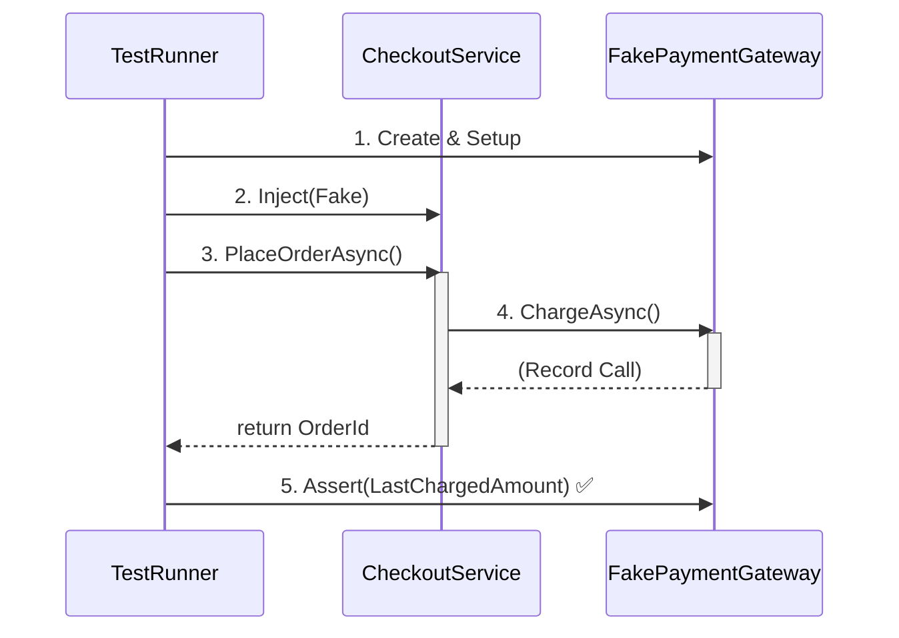

# 第25章：DIPが効く瞬間：テストで差し替える🧪🔁

この章はズバリ、**「外部I/O（DB・HTTP・メール・日時など）を差し替えて、テストを爆速＆安心にする」**回だよ😊💕

DIP（依存性逆転）が“気持ちよく効く瞬間”って、だいたい **テスト**で体感できるんだ〜！
「え、こんなにラクになるの！？😳」ってなるはず✨

---

## 25.1 この章のゴール🎯💖

読み終わったら、これができるようになるよ👇

* ✅ **外部依存（DB/HTTP/メール/時刻）をテストで差し替える**意味が腹落ちする
* ✅ **Fake（偽物）**で「早い・安定・無料（外部課金なし）」テストが書ける
* ✅ **Mock（呼ばれたか確認）**が必要な場面が分かる
* ✅ DIコンテナでも **テスト用に置き換え**できるようになる

ちなみに .NET 10 は 2025/11/11 に LTS として出てるよ（サポート期間も長め）📅✨ ([Microsoft][1])
C# 14 の新機能は Visual Studio 2026 か .NET 10 SDK で試せるよ🧠✨ ([Microsoft Learn][2])

---

## 25.2 「差し替え」って何を差し替えるの？🔌🧩

アプリが“現実世界”に触るところって、だいたいここ👇

* 💾 DBアクセス（Repository / EF Core / Dapper）
* 🌐 外部API（HttpClient）
* ✉️ メール送信（SMTP / SaaS）
* 💳 決済（課金が絡む！）
* 🕒 時刻（DateTime.Now）
* 🎲 ランダム（Guid.NewGuid / Random）

これらをテストで本物のまま使うと…

* 😵 テストが遅い（DB起動、ネット待ち…）
* 😵 たまに落ちる（ネット不調、タイムアウト）
* 😵 お金がかかる（決済/メール）
* 😵 再現できない（時刻と乱数）

だから、**テストでは差し替える**のが勝ち筋だよ💪✨

---

## 25.3 DIPが効く“気持ちいい形”🥰🧲

DIPを超ざっくり言うと👇

* 🏰 **上位（業務ロジック）**は
* 🔧 **下位（DB/HTTPなどの実装）**に直接依存しないで
* 📄 **抽象（interface）**に依存する

するとテストでは👇ができる！

* 本番：interface → 本物実装を注入
* テスト：interface → Fake/Mock を注入

これが **「差し替え」**だよ😊✨
.NET のDIはこの考え方が前提として組み込まれてる（登録・ライフタイムなど）📦 ([Microsoft Learn][3])

---

## 25.4 例題：ミニECの「注文→決済→メール」🛒💳✉️

### まずは“しんどい版”😇（差し替え不能）

ポイント：**new / DateTime.Now / 直接HTTP** が混ざってるとテストが辛い💥

```csharp
public class CheckoutService_Bad
{
    public async Task<string> PlaceOrderAsync(decimal amount, string userEmail)
    {
        // 決済（本物）: 外部に課金が発生するかも…
        var http = new HttpClient();
        var res = await http.PostAsync("https://pay.example.com/charge",
            new StringContent(amount.ToString()));

        if (!res.IsSuccessStatusCode)
            throw new InvalidOperationException("Payment failed");

        // 時刻（本物）: テストが不安定になりやすい
        var orderId = Guid.NewGuid().ToString();
        var now = DateTime.Now;

        // メール（本物）: 外部に送られる＆遅い
        using var smtp = new System.Net.Mail.SmtpClient("smtp.example.com");
        await smtp.SendMailAsync("noreply@example.com", userEmail,
            "Order confirmed", $"{orderId} at {now}");

        return orderId;
    }
}
```

これ、テスト書くとしたら地獄だよね😂

* 決済API叩くの？💸
* メール送っちゃうの？✉️
* GUIDと時刻が毎回変わるの？🎲🕒

---

## 25.5 “気持ちいい版”：抽象（interface）を切る✂️✨

ここからがDIPの本番だよ🤖💕

### ① 外部依存を「ポート（口）」として宣言📄

```csharp
public interface IPaymentGateway
{
    Task ChargeAsync(decimal amount);
}

public interface IEmailSender
{
    Task SendAsync(string to, string subject, string body);
}

public interface IClock
{
    DateTime Now { get; }
}

public interface IIdGenerator
{
    string NewId();
}
```

### ② 業務ロジックは “抽象だけ” を使う🏰✨

```csharp
public class CheckoutService
{
    private readonly IPaymentGateway _payment;
    private readonly IEmailSender _email;
    private readonly IClock _clock;
    private readonly IIdGenerator _ids;

    public CheckoutService(
        IPaymentGateway payment,
        IEmailSender email,
        IClock clock,
        IIdGenerator ids)
    {
        _payment = payment;
        _email = email;
        _clock = clock;
        _ids = ids;
    }

    public async Task<string> PlaceOrderAsync(decimal amount, string userEmail)
    {
        await _payment.ChargeAsync(amount);

        var orderId = _ids.NewId();
        var now = _clock.Now;

        await _email.SendAsync(
            to: userEmail,
            subject: "Order confirmed",
            body: $"{orderId} at {now:yyyy-MM-dd HH:mm:ss}");

        return orderId;
    }
}
```

この時点で勝ち確🎉
テスト側が好きに差し替えられる✨

---

## 25.6 Fake（偽物）で「速い＆安定」テストを書く🧪⚡


### Fakeたち（テスト専用の実装）🧸✨



```csharp
public class FakePaymentGateway : IPaymentGateway
{
    public decimal? LastChargedAmount { get; private set; }

    public Task ChargeAsync(decimal amount)
    {
        LastChargedAmount = amount; // 呼ばれた記録だけ残す
        return Task.CompletedTask;
    }
}

public class FakeEmailSender : IEmailSender
{
    public List<(string To, string Subject, string Body)> Sent { get; } = new();

    public Task SendAsync(string to, string subject, string body)
    {
        Sent.Add((to, subject, body));
        return Task.CompletedTask;
    }
}

public class FakeClock : IClock
{
    public DateTime Now { get; set; }
}

public class FakeIdGenerator : IIdGenerator
{
    private readonly Queue<string> _ids = new();
    public FakeIdGenerator(params string[] ids)
    {
        foreach (var id in ids) _ids.Enqueue(id);
    }
    public string NewId() => _ids.Dequeue();
}
```

### テスト（xUnit例）🧡

```csharp
using Xunit;

public class CheckoutServiceTests
{
    [Fact]
    public async Task PlaceOrderAsync_ChargesAndSendsEmail_AndReturnsOrderId()
    {
        // Arrange 🎀
        var payment = new FakePaymentGateway();
        var email = new FakeEmailSender();
        var clock = new FakeClock { Now = new DateTime(2026, 1, 9, 10, 30, 0) };
        var ids = new FakeIdGenerator("ORDER-0001");

        var sut = new CheckoutService(payment, email, clock, ids);

        // Act 🚀
        var orderId = await sut.PlaceOrderAsync(1200m, "alice@example.com");

        // Assert ✅
        Assert.Equal("ORDER-0001", orderId);
        Assert.Equal(1200m, payment.LastChargedAmount);

        Assert.Single(email.Sent);
        var mail = email.Sent[0];
        Assert.Equal("alice@example.com", mail.To);
        Assert.Contains("ORDER-0001", mail.Body);
        Assert.Contains("2026-01-09 10:30:00", mail.Body);
    }
}
```

💡ここが美味しいポイント😋

* ネット0秒🌐❌
* 外部課金0円💸❌
* 毎回同じ結果（時刻とID固定）🕒🎲✅

---

## 25.7 FakeとMockの使い分け（超大事）🧠✨

### 🧸 Fake：状態を持って、あとで検証する

* 「送ったメール内容を見たい」
* 「最後に課金した金額を見たい」

→ 今回みたいに `FakeEmailSender.Sent` を確認するやつ😊

### 🎭 Mock：呼び出し回数・引数など “契約” を厳密に確認

* 「決済が1回だけ呼ばれたことを保証したい」
* 「特定の順序で呼ばれたことを保証したい」

ただし初心者は、**まずFakeでOK**だよ👍✨
Mockは便利だけど、やりすぎると「実装に縛られたテスト」になって逆に壊れやすい😵‍💫

---

## 25.8 DIコンテナごと“テスト用に組み立てる”🧱🧪

「本番と同じ `ServiceCollection` 構成で、テストだけ差し替えたい！」って時あるよね😊
.NET のDIは `ServiceCollection` に登録して `BuildServiceProvider()` する流れが基本だよ📦 ([Microsoft Learn][3])

```csharp
using Microsoft.Extensions.DependencyInjection;
using Xunit;

public class CheckoutServiceContainerTests
{
    [Fact]
    public async Task PlaceOrderAsync_Works_WithTestOverrides()
    {
        // Arrange 🎀
        var services = new ServiceCollection();

        // 本番なら本物実装を登録するところだけど…
        // テストでは Fake を登録しちゃう！
        var fakePayment = new FakePaymentGateway();
        var fakeEmail = new FakeEmailSender();

        services.AddSingleton<IPaymentGateway>(fakePayment);
        services.AddSingleton<IEmailSender>(fakeEmail);
        services.AddSingleton<IClock>(new FakeClock { Now = new DateTime(2026, 1, 9, 12, 0, 0) });
        services.AddSingleton<IIdGenerator>(new FakeIdGenerator("ORDER-9999"));

        services.AddTransient<CheckoutService>();

        using var provider = services.BuildServiceProvider();

        var sut = provider.GetRequiredService<CheckoutService>();

        // Act 🚀
        var orderId = await sut.PlaceOrderAsync(500m, "bob@example.com");

        // Assert ✅
        Assert.Equal("ORDER-9999", orderId);
        Assert.Equal(500m, fakePayment.LastChargedAmount);
        Assert.Single(fakeEmail.Sent);
    }
}
```

これができると、**「本番の組み立て方」と「テストの差し替え」**が同じ思想で揃うので気持ちいいよ〜🥰✨

---

## 25.9 よくある落とし穴集⚠️😵‍💫（ここ踏む人多い！）

### ① “new しちゃう病”が残ってる

* `new HttpClient()`
* `DateTime.Now`
* `Guid.NewGuid()`

→ これがロジックに混ざると、差し替えが効かない😭
**IClock / IIdGenerator** みたいな小さな抽象が効くよ🧩✨

### ② Fakeが「賢すぎる」

Fakeにロジックを盛りすぎると、テストが“別実装”になって事故る😇
→ Fakeは基本「記録するだけ」「決まった結果を返すだけ」でOK😊

### ③ 何でもかんでもMockで縛る

「このメソッドがこう呼ばれた」ばかり検証すると、リファクタでテストが崩壊しがち💥
→ “結果” を見るテスト（状態検証）を優先しよ👍

---

## 25.10 Copilot/Codexに頼ると強いプロンプト集🤖💕

そのまま貼って使えるよ✨

* 🤖「`IClock` と `IIdGenerator` を導入して、DateTime.Now と Guid.NewGuid を置き換えて」
* 🤖「`IEmailSender` のFake実装を作って、送信履歴をListで保持して」
* 🤖「AAAパターンでxUnitのテストを3本作って（正常系・決済失敗・メール失敗）」
* 🤖「DIコンテナの登録をテスト用に上書きする例を出して」

---

## 25.11 練習問題（手を動かすやつ）🏃‍♀️💨✨

### 問題A：決済失敗をテストしよう💳❌

* `FakePaymentGateway` に「失敗するモード」を追加（例：`ShouldFail`）
* 決済失敗時は例外を投げる仕様にして、テストで確認

ヒント👇

```csharp
public class FakePaymentGateway : IPaymentGateway
{
    public bool ShouldFail { get; set; }
    public Task ChargeAsync(decimal amount)
        => ShouldFail ? Task.FromException(new InvalidOperationException("fail"))
                      : Task.CompletedTask;
}
```

### 問題B：メール内容のテンプレを分離しよう✉️🧩

* メール本文生成を `IEmailTemplate` として抽象化してみよう
* テストで「テンプレ差し替え」ができたら勝ち🎉

---

## 25.12 章末チェックリスト✅📝✨

* ✅ テストで差し替えたい依存を列挙できる（DB/HTTP/メール/時刻/乱数）
* ✅ ロジック側は interface だけ見てる（本物を知らない）
* ✅ Fakeで「記録→Assert」が書ける
* ✅ DIコンテナでもテスト用登録ができる

---

## 次（第26章）へのつながり🌈🔜

次は総合演習に入るよ📝🔍
この章で覚えた **「差し替えできる形」**があると、総合演習のラストで **テストがガチで武器**になるからね💪🧪✨

必要なら、この章のサンプルを「ミニEC題材（注文・支払い・発送）」の形に合わせて、**章全体をあなたの既存コード構成に寄せた版**にして書き直すよ😊💕

[1]: https://dotnet.microsoft.com/ja-jp/platform/support/policy/dotnet-core?utm_source=chatgpt.com ".NET および .NET Core の公式サポート ポリシー"
[2]: https://learn.microsoft.com/en-us/dotnet/csharp/whats-new/csharp-14?utm_source=chatgpt.com "What's new in C# 14"
[3]: https://learn.microsoft.com/ja-jp/dotnet/core/extensions/dependency-injection?utm_source=chatgpt.com "NET での依存関係の挿入"
