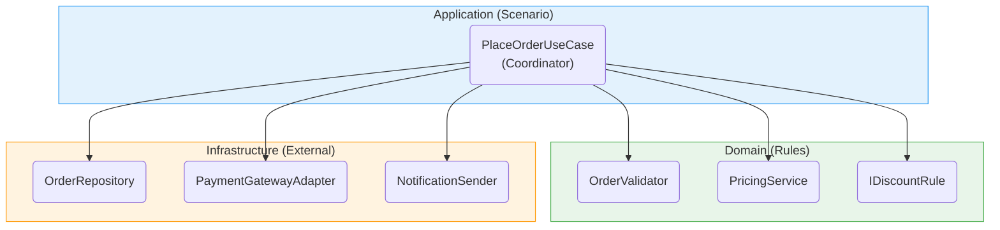

# 第27章：総合演習[2]：クラス構造を「綺麗」にする（SRP/OCP/LSP/ISP）🧱✨

# 第27章：総合演習[2] クラス構造を「綺麗」にする（SRP/OCP/LSP/ISP）🧱✨

この章はね…**コードの見た目を整える回**じゃなくて、
**「変更が来ても、どこを触ればいいか一瞬で分かる構造」を作る回**だよ〜😊💕

---

## この章のゴール🎯✨

* ✅ **SRP**：クラスの役割がスパッと説明できる（「この子はこれだけする」）
* ✅ **OCP**：仕様追加が「新クラス追加」で済む（既存の修正が最小）
* ✅ **LSP**：差し替えても壊れない継承／差し替え設計になる
* ✅ **ISP**：使う側が「必要な約束だけ」見える（太いインターフェース卒業🎓）

※まだDIコンテナ登録はしないよ（それは次章で完成させる）😊

---

## まず「現状のぐちゃぐちゃ」を確認しよ😈🧱

想定：前章までで、こんな感じの **God Class（全部入り）** があるやつ！

* `OrderService` が
  検証✅、価格計算💰、割引🎫、支払い💳、発送🚚、保存💾、通知📩、ログ📝…全部やってる

こうなるとどうなる？👇

* ちょい修正が怖い😱
* if/switchが増殖🌱
* テストしづらい🧪💦
* 「どこが仕様？」が読めない📚😵‍💫

---

## 今日の作戦マップ🗺️✨（やる順番が超だいじ）

この順番にやると、迷子になりにくいよ〜😊💕

1. **SRPで“責務の島”を作る**（分ける）🏝️
2. **OCPで“増えそうなところ”を差し替えにする**（Strategy化）🎭
3. **LSPで“差し替える約束”を守らせる**（投げる継承はやめる）🧱
4. **ISPで“太い約束”を分割する**（読む人を救う）✂️

---

# 1) SRP：責務の島を作ろう🏝️✨


## SRPの合言葉📌

**「変更理由ごとに分ける」**だよ😊
メソッド数じゃないよ！「理由」だよ！

---

## 1-1. “変更理由”を付箋みたいに出す📝✨（超おすすめ）


`OrderService` を眺めて、変更理由を分類するよ👇

* ✅入力チェック（必須・形式）
* ✅業務ルール検証（在庫ある？金額OK？）
* 💰価格計算（小計、送料、税）
* 🎫割引（クーポン、会員、キャンペーン）
* 💳支払い（決済の種類で分岐）
* 🚚発送（配送方法で分岐）
* 💾保存（DB/ファイル/メモリ）
* 📩通知（メール/アプリ通知）
* 📝ログ

この時点で、もう「クラス1個でやる量」じゃないのが見えるはず😇

---

## 1-2. まず“外側の都合”と“内側のロジック”を切り分ける🧼✨

最初に切るとラクな境界はこれ👇

* 外側：I/O・保存・通知・外部API
* 内側：検証・計算・判断（純粋ロジック寄り）

この章ではまず「内側のクラス構造」を綺麗にするよ🧠✨

---

## 1-3. 分割後のざっくり構造（完成イメージ）🧱✨


（名前は例！あなたの題材に合わせてOKだよ😊）

```text
Application（アプリの進行役）
  - PlaceOrderUseCase（注文を進める司令塔）

Domain（業務ルールと計算）
  - OrderValidator（検証）
  - PricingService（合計計算）
  - Discount: IDiscountRule（割引ルール群）
  - Shipping: IShippingFeeCalculator（送料計算群）

Infrastructure（外部）
  - OrderRepository（保存）
  - PaymentGatewayAdapter（決済）
  - NotificationSender（通知）
```

「司令塔（UseCase）」が、各専門家を呼ぶ感じだよ👯‍♀️✨



---

# 2) OCP：増える所を “差し替え” にする🎭🔁

OCPのコツはね、**増える所を当てに行く**こと！🎯

ミニECだと増えやすいのはだいたい👇

* 🎫割引ルール（追加されがち）
* 🚚送料/配送（追加されがち）
* 💳支払い方法（追加されがち）

ここを **if/switchから卒業**させるよ〜😊✨

---

## 2-1. 割引をStrategy化🎫✨（いちばん気持ちいいやつ）


### ✅インターフェース（ルールの約束）

```csharp
public interface IDiscountRule
{
    /// <summary>割引額（マイナスの金額じゃなく「割引分」）を返す</summary>
    Money CalculateDiscount(Order order, Money subTotal);
}
```

### ✅ルールを増やす（新クラス追加でOK）

```csharp
public sealed class MemberRankDiscountRule : IDiscountRule
{
    public Money CalculateDiscount(Order order, Money subTotal)
        => order.Customer.IsPremium ? subTotal * 0.05m : Money.Zero;
}

public sealed class CouponDiscountRule : IDiscountRule
{
    public Money CalculateDiscount(Order order, Money subTotal)
        => order.CouponCode == "WELCOME" ? new Money(500) : Money.Zero;
}
```

### ✅価格計算側（ルールを“列挙して足すだけ”）

```csharp
public sealed class PricingService
{
    private readonly IReadOnlyList<IDiscountRule> _rules;

    public PricingService(IReadOnlyList<IDiscountRule> rules) => _rules = rules;

    public PriceBreakdown Calculate(Order order)
    {
        var subTotal = order.Items.Sum(i => i.UnitPrice * i.Quantity);
        var discount = _rules.Select(r => r.CalculateDiscount(order, subTotal))
                             .Aggregate(Money.Zero, (a, b) => a + b);

        var discounted = subTotal - discount;
        return new PriceBreakdown(subTotal, discount, discounted);
    }
}
```

🎉これで「割引追加」が来ても、**既存コードにifを足さない**で済む！

---

## 2-2. 送料もStrategy化🚚✨

```csharp
public interface IShippingFeeCalculator
{
    ShippingMethod Method { get; }
    Money Calculate(Order order);
}

public enum ShippingMethod { Standard, Express, Pickup }
```

```csharp
public sealed class StandardShipping : IShippingFeeCalculator
{
    public ShippingMethod Method => ShippingMethod.Standard;
    public Money Calculate(Order order) => new Money(600);
}

public sealed class PickupShipping : IShippingFeeCalculator
{
    public ShippingMethod Method => ShippingMethod.Pickup;
    public Money Calculate(Order order) => Money.Zero;
}
```

呼ぶ側は「Methodで選ぶ」だけ（switchはここで1回だけに封じるのはアリ）👇

```csharp
public sealed class ShippingService
{
    private readonly IReadOnlyDictionary<ShippingMethod, IShippingFeeCalculator> _map;

    public ShippingService(IEnumerable<IShippingFeeCalculator> calculators)
        => _map = calculators.ToDictionary(c => c.Method);

    public Money CalculateFee(Order order)
        => _map[order.ShippingMethod].Calculate(order);
}
```

---

# 3) LSP：差し替えても壊れない約束🧱✨

ここ、初心者さんがいちばんハマるやつ〜！😵‍💫💦
**「子クラスが、親のルールを破る」**と壊れるの。

---

## 3-1. ありがちなLSP破壊例🙅‍♀️💥（NotSupportedException地獄）


```csharp
public interface IPaymentMethod
{
    void Charge(Money amount);
    void Refund(Money amount);
}

public sealed class ConvenienceStorePayment : IPaymentMethod
{
    public void Charge(Money amount) { /* ok */ }

    public void Refund(Money amount)
        => throw new NotSupportedException("コンビニ払いは返金できません");
}
```

これ、呼ぶ側が `Refund` を信じて呼ぶと死ぬ😇
**「親の代わりに子を入れても壊れない」**が守れてない（＝LSP違反）🧱💥

---

## 3-2. LSPの直し方①：契約を分ける（ISPにも効く）✂️✨

「返金できる支払い」と「できない支払い」を、同じ約束にしない😊

```csharp
public interface IChargePayment
{
    void Charge(Money amount);
}

public interface IRefundPayment
{
    void Refund(Money amount);
}
```

```csharp
public sealed class CreditCardPayment : IChargePayment, IRefundPayment
{
    public void Charge(Money amount) { /* ... */ }
    public void Refund(Money amount) { /* ... */ }
}

public sealed class ConvenienceStorePayment : IChargePayment
{
    public void Charge(Money amount) { /* ... */ }
}
```

こうすると、呼ぶ側は「返金が必要な時だけ `IRefundPayment` を要求」できる✨
→ **差し替えで壊れない**が自然にできるよ😊💕

---

# 4) ISP：太いインターフェースを分割しよ✂️📄

## 4-1. ありがちな太いRepository😵‍💫

```csharp
public interface IOrderRepository
{
    Order? FindById(string id);
    void Save(Order order);
    void Delete(string id);
    IEnumerable<Order> Search(string keyword);
    // まだ増える…
}
```

「読むだけの画面」でも `Delete` が見えちゃうの、つらいよね😇

---

## 4-2. 読み取り用・書き込み用に分割📖✍️


```csharp
public interface IOrderReader
{
    Order? FindById(string id);
    IEnumerable<Order> Search(string keyword);
}

public interface IOrderWriter
{
    void Save(Order order);
    void Delete(string id);
}
```

そして実装は両方を持ってもOK😊

```csharp
public sealed class InMemoryOrderRepository : IOrderReader, IOrderWriter
{
    private readonly Dictionary<string, Order> _db = new();

    public Order? FindById(string id) => _db.GetValueOrDefault(id);

    public IEnumerable<Order> Search(string keyword)
        => _db.Values.Where(o => o.Customer.Name.Contains(keyword, StringComparison.OrdinalIgnoreCase));

    public void Save(Order order) => _db[order.Id] = order;

    public void Delete(string id) => _db.Remove(id);
}
```

これで「利用者ごとに必要な約束だけ」見える👀✨
読みやすさ爆上がり〜😊💕

---

# 5) 司令塔（UseCase）で流れを整える👩‍🏫✨


クラス分割ができたら、最後に「注文の流れ」を1か所にまとめるよ！

```csharp
public sealed class PlaceOrderUseCase
{
    private readonly OrderValidator _validator;
    private readonly PricingService _pricing;
    private readonly ShippingService _shipping;
    private readonly IChargePayment _payment;
    private readonly IOrderWriter _writer;

    public PlaceOrderUseCase(
        OrderValidator validator,
        PricingService pricing,
        ShippingService shipping,
        IChargePayment payment,
        IOrderWriter writer)
    {
        _validator = validator;
        _pricing = pricing;
        _shipping = shipping;
        _payment = payment;
        _writer = writer;
    }

    public void Execute(Order order)
    {
        _validator.ValidateOrThrow(order);

        var price = _pricing.Calculate(order);
        var shippingFee = _shipping.CalculateFee(order);
        var total = price.Discounted + shippingFee;

        _payment.Charge(total);
        _writer.Save(order);
    }
}
```

この時点では「組み立て」はまだ手作業でOK👍
次章でDIコンテナに登録して、完成形にするよ🔌🧪🚀

---

# 6) Visual Studio 2026 × AI活用のコツ🤖✨（この章向け）


Visual Studio 2026はAI統合が強化されたよ、って公式に案内されてるよ〜😊 ([Microsoft Learn][1])
CopilotもVSでの使い方が公式ドキュメントにまとまってる✨ ([Microsoft Learn][2])

## 使えるプロンプト例💬✨（コピペOK）

* 「この `OrderService` の責務を“変更理由”で分類して、クラス分割案を出して」🧠
* 「割引のif/switchをStrategyにして。インターフェース名と実装クラス名も提案して」🎭
* 「このインターフェース、使う側が困ってる。ISPで分割して」✂️
* 「LSP違反になってる箇所を“呼び出し側の視点”で説明して」🧱

ポイント：**“何を守りたいか（追加が来る/壊したくない/差し替えたい）”を一言足す**と精度上がるよ😊💕

---

# 7) この章の到達チェック✅✨（合格ライン）

次の質問にスラスラ答えられたら勝ち〜😊🎉

* ✅このクラスの責務を1文で言える？（SRP）
* ✅新しい割引を追加する時、既存コードをほぼ触らない？（OCP）
* ✅「できない操作」を例外でごまかしてない？（LSP）
* ✅読むだけの人が、削除メソッドを見なくて済む？（ISP）

---

# 8) おまけ：最新バージョン周りの確認メモ🧷✨

* C# 14 の新機能は公式の「What’s new」でまとめられてて、.NET 10 SDKやVisual Studio 2026で試せるよ〜😊 ([Microsoft Learn][3])
* .NET 10 は配布ページや “What’s new” が公開されてるよ📦✨ ([Microsoft][4])
* .NET 10 はLTS扱いとして案内されてる資料もあるよ🛡️ ([GitHub][5])

---

## 次章予告👀✨

次は、ここで作った綺麗な構造を **DIP/DI** で「疎結合の完成形」にするよ🔌✨
DIコンテナ登録して、テストで差し替えて、**“怖くない変更”を完成**させようね🧪🚀

---

もし今の「ぐちゃぐちゃ版（OrderService等）」のコードを貼ってくれたら、**あなたのコードを素材にして**
この章の「分割案 → 具体的なクラス設計 → 置き場所（フォルダ構成）」まで一気に作ってあげるよ😊💖

[1]: https://learn.microsoft.com/en-us/visualstudio/releases/2026/release-notes?utm_source=chatgpt.com "Visual Studio 2026 Release Notes"
[2]: https://learn.microsoft.com/en-us/visualstudio/ide/visual-studio-github-copilot-get-started?view=visualstudio&utm_source=chatgpt.com "Get Started with GitHub Copilot - Visual Studio (Windows)"
[3]: https://learn.microsoft.com/en-us/dotnet/csharp/whats-new/csharp-14?utm_source=chatgpt.com "What's new in C# 14"
[4]: https://dotnet.microsoft.com/en-US/download/dotnet/10.0?utm_source=chatgpt.com "Download .NET 10.0 (Linux, macOS, and Windows) | .NET"
[5]: https://github.com/dotnet/core/blob/main/release-notes/10.0/README.md?utm_source=chatgpt.com "core/release-notes/10.0/README.md at main · dotnet/ ..."
