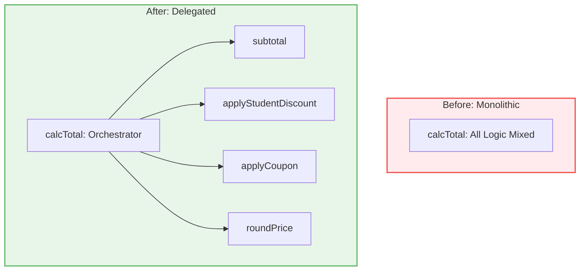

# 第01章：はじめに（設計ってなに？）🌸

> この章は「SOLIDを学ぶ前の準備運動」だよ〜🏃‍♀️💨
> まずは **“設計って何のためにやるの？”** を、やさしく腹落ちさせちゃおう😊🧡


---

## この章でできるようになること ✅🌟

* **「設計の目的」**を、自分の言葉で言えるようになる🗣️✨
* **「設計がないと起きる地獄」**がイメージできる😱➡️😌
* 自分のコードの **“困りごと” を3つ**見つけてメモできる📝💡

---

## 1. そもそも「設計」ってなに？🏗️🧸

プログラミングの設計って、ひとことで言うと…

**「コードの部屋割り（構造づくり）」**だよ🏠✨

* どこに何を書く？📦
* どのクラスが何を担当する？👩‍🍳
* 変更が来たら、どこを直す？🔧

設計があると、コードが **散らからない**し、後から **探しやすい**し、直しやすい😊🧹✨

---

## 2. なんで設計が必要になるの？🤔💭

理由はシンプルで、アプリって **必ず変更される**から！🔁✨

たとえば「Campus Café 注文アプリ ☕️📦」で…

* 「学割つけて！」🎓
* 「雨の日は5%OFFで！」☔️
* 「PayPay追加して！」📱
* 「通知、メールじゃなくてアプリで！」🔔

こういう“追加・変更”が来るたびに、コードがグチャグチャだと…
**直すのが怖くなる**😵💦

---

## 3. 設計がないと起きがちな3つの悲劇 😇➡️😱

### 悲劇①：変更すると別の場所が壊れる💥

「ここ直したら、あっちの表示が死んだ…」みたいなやつ😭

### 悲劇②：同じようなコードが増殖する🧟‍♀️

コピペで増やすと、修正が **全箇所対応**になって地獄👻

### 悲劇③：読めない（＝触れない）📕🚫

未来の自分がこうなる👇
「え、これ…誰が書いたん…？（昨日の自分）」😇

---

## 4. “良い設計”って、結局なに？🌷✨

超ざっくり「良い設計」はこの3つが強い💪💕

### ① 変更しやすい 🔧✨

機能追加や仕様変更が来ても、直す場所が少ない！

### ② 読みやすい 👀✨

「どこに何が書いてあるか」がパッと分かる！

### ③ テストしやすい ✅🧪

自動テストが書ける形だと、安心して直せる！

> SOLIDは、この「良い設計」を作るための **具体的なコツ集**だよ🧰✨

---

## 5. ちょい実装で体感しよ！⚙️☕️（“設計が弱い例”）

まずは、わざと「設計が弱い」例を見てみよう😈💡
（※この章はまだSOLIDしない！“痛み”を先に知るやつ！）

```ts
// 注文の合計を出す（雑に全部入り）😵‍💫
type Item = { name: string; price: number; qty: number };

function calcTotal(items: Item[], userType: "normal" | "student", coupon?: "NONE" | "OFF10") {
  let total = 0;

  for (const it of items) {
    total += it.price * it.qty;
  }

  // 学割（10%OFF）
  if (userType === "student") {
    total = total * 0.9;
  }

  // クーポン（さらに10%OFF）
  if (coupon === "OFF10") {
    total = total * 0.9;
  }

  // 端数処理（四捨五入）
  total = Math.round(total);

  return total;
}
```

ぱっと見は動くけど…未来にこう言われたら？😇💥

* 「クーポン種類増やして！」🎟️🎟️🎟️
* 「雨の日割も追加して！」☔️
* 「端数処理、切り捨てに変えて！」✂️
* 「テスト書いて！」✅

この関数、**何でも屋さん**すぎて…変更が来るほどツラくなるやつ🥲

---

## 6. “設計の第一歩”は、責務（担当）を分けること✂️🧩

SOLIDの前に、まずは超ミニでいいから分けてみる😊✨
（「仕事を小分けにする」だけで、だいぶ未来が楽になるよ〜）

```ts
type Item = { name: string; price: number; qty: number };
type UserType = "normal" | "student";
type Coupon = "NONE" | "OFF10";

function subtotal(items: Item[]) {
  return items.reduce((sum, it) => sum + it.price * it.qty, 0);
}

function applyStudentDiscount(total: number, userType: UserType) {
  return userType === "student" ? total * 0.9 : total;
}

function applyCoupon(total: number, coupon?: Coupon) {
  return coupon === "OFF10" ? total * 0.9 : total;
}

function roundPrice(total: number) {
  return Math.round(total);
}

function calcTotal(items: Item[], userType: UserType, coupon?: Coupon) {
  let total = subtotal(items);
  total = applyStudentDiscount(total, userType);
  total = applyCoupon(total, coupon);
  return roundPrice(total);
}
```



これだけで良くなる点👇✨

* 変更が来ても「該当関数だけ」直せる🔧
* テストも「部分ごと」に書ける✅
* 読む人が理解しやすい👀

> ここから先の章で、これをもっと「追加に強い形」に進化させるのがSOLIDだよ🧠🌈

---

## 7. ミニ課題：あなたの「困りごと」3つ書こう📝💖

次のテンプレでOK！1〜3分でサクッと☺️

* 困りごと①：例）修正すると別の機能が壊れがち💥
* 困りごと②：例）同じ処理がコピペで増える🧟‍♀️
* 困りごと③：例）あとで読んだら意味が分からない📕😭

💡ポイント：
「困りごと＝将来の変更点」になりやすいよ🔮✨
SOLIDは、まさにそこを助けてくれるやつ！

---

## 8. 自己チェッククイズ（ゆるめ）🎓✨

Q1. 設計の目的をひとことで言うと？
Q2. 設計が弱いと「変更」が怖くなるのはなぜ？
Q3. “良い設計”の特徴を3つ言うと？
Q4. さっきの例で、何でも屋になってたのはどこ？
Q5. 分割の第一歩として一番効く行動は？

（答え例）
A1. 変更に強くするため🏋️‍♀️✨
A2. 直す場所が増えたり、影響範囲が読めないから😵
A3. 変更しやすい／読みやすい／テストしやすい✅
A4. `calcTotal`（全部やってた）😈
A5. 責務（担当）を分ける✂️🧩

---

## 9. AI活用ミニコーナー 🤖💡（超おすすめ）

AI拡張があるなら、次のお願いがめっちゃ効くよ〜✨

* 「この関数の責務が混ざってる部分を指摘して🥺」
* 「テストしやすい形に分割案ちょうだい✅」
* 「変更要求（学割追加/クーポン追加）に強い案は？🔁」

⚠️でも大事：
**“採用するか決めるのは人間（あなた）”**だよ👩‍💻💖
AIはアイデア係、最後の判断はあなたがやるのが最強！

---

## 10. プチコラム：いまどき環境の小ネタ（2026年1月）📌✨

* TypeScript は **5.9** のリリースノートが更新されていて、`tsc --init` の改善や `import defer`、`--module node20` などが入ってるよ🧠✨ ([TypeScript][1])
* VS Code は **v1.108（December 2025）** が **2026-01-08** リリースで、エージェント系（Agent Skills）の話も出てるよ🤖🧰 ([Visual Studio Code][2])
* Node.js は公式トップで **v24.12.0 が Latest LTS** として案内されてるよ🟢 ([Node.js][3])

---

## まとめ 🌸🎉

この章でいちばん大事なのはこれ👇✨

**設計は「未来の変更の痛み」を減らすための工夫**だよ🧸💖

次の章から、もう少しずつ「実際の道具（環境や型、用語）」を整えて、SOLIDを気持ちよく学べる土台を作っていこうね☺️📚✨

[1]: https://www.typescriptlang.org/docs/handbook/release-notes/typescript-5-9.html "TypeScript: Documentation - TypeScript 5.9"
[2]: https://code.visualstudio.com/updates "December 2025 (version 1.108)"
[3]: https://nodejs.org/en "Node.js — Run JavaScript Everywhere"
