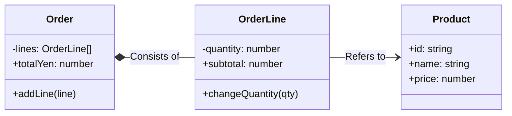

# 第03章：TypeScriptで「クラス設計」の最低限🏫✨

（class / interface / private / readonly を“ちゃんと使える”ようになる回だよ〜😊🧸）


---

## 1) 今日のゴール🎯✨

この章を終えると、こんなことができるようになるよ👇😊

* **「データだけ」じゃなくて「ふるまいも持つ」クラス**が書ける📦➡️🤖
* **外から勝手に壊されない**ように、`private` / `readonly` を使って守れる🔐✨
* `interface` を使って、**「こう使ってね」って約束（契約）**を作れる🤝
* `Order` と `Product` を、**型とクラスでキレイに表現**できるようになる☕️📦

ちなみに TypeScript は今 `5.9.x` が最新安定版として案内されてるよ（npm と公式DLページの表示より）。([npm][1])

---

## 2) まずは超大事：class / interface / type の役割分担🧠✨


### ✅ class（クラス）＝「データ + ふるまい」🏗️

* 状態（プロパティ）を持つ
* ルール（メソッド）も持つ
* **“正しい状態しか作れない”**ようにできる（これが設計の強さ💪）

### ✅ interface（インターフェース）＝「約束」🤝

* 「この形で使ってね！」を表す
* たとえば後の章で、通知や保存を差し替えるときに超効く🔁✨

### ✅ type（型エイリアス）＝「データ形状」🧾

* JSONっぽいデータ（DTO）や Union 型に強い🎛️
* “ただのデータ”なら `type` で十分なことも多いよ🙂

---

## 3) 失敗しやすいポイント：クラスは “雑に public” にしない🙅‍♀️💥

### 🧨ありがち事故

* `public price: number` とかで公開して、外から `-100` 入れられる😱
* “注文の合計” みたいな大事ロジックが、UIや入出力と混ざる🌀
* `readonly` を付けずに、後から書き換わってバグる🐛💦

### ✅対策の基本セット

* **外に見せるのは最小限**（public を絞る）✂️
* **勝手に書き換えさせない**（`readonly` / `private`）🔐
* **ルールはクラスの中**（不変条件＝invariant を守る）🛡️

---

## 4) “守る力” の4点セット🔐✨（ここ超重要！）

### 4-1) `private`：外から触らせない🔒

TypeScript の `private` は「型チェック上」アクセス禁止にしてくれるよ（安全性UP！）([TypeScript][2])

```ts
class Product {
  private priceYen: number;

  constructor(priceYen: number) {
    this.priceYen = priceYen;
  }
}
```

### 4-2) `readonly`：一度決めたら変えない🧊

“ID” とか “作成日時” とか、あとから変わっちゃダメなやつに最強💪

```ts
class Product {
  readonly id: string;
  readonly name: string;

  constructor(id: string, name: string) {
    this.id = id;
    this.name = name;
  }
}
```

### 4-3) コンストラクタの “パラメータプロパティ” 🎁

TypeScript には、**引数に `private` / `readonly` を付けると、そのままメンバー宣言＋代入**までやってくれる便利技があるよ✨([TypeScript][2])

```ts
class Product {
  constructor(
    public readonly id: string,
    public readonly name: string,
    private priceYen: number,
  ) {}
}
```

> これ、初心者がいきなり多用すると「どこでプロパティ増えたの？」って迷子になりやすいけど、慣れると超気持ちいいやつ🥹✨
> 迷ったら最初は普通にプロパティ宣言→慣れたら移行でOKだよ👍

### 4-4) getter：安全に見せる👀✨

値を見せたいけど、直接いじられたくないときに便利！

```ts
class Product {
  constructor(
    public readonly id: string,
    public readonly name: string,
    private priceYen: number,
  ) {}

  get price(): number {
    return this.priceYen;
  }
}
```

TypeScript のアクセサ（getter/setter）の基本は公式にもまとまってるよ🧠([TypeScript][3])

---

## 5) ちょい上級：`private` と `#private` の違い（知ってると得）🧩✨

* `private`：TypeScript の型チェックで守る（実行時は JS 的には触れちゃう場合がある）
* `#private`：JavaScript の仕様で **実行時もガチで触れない**（ランタイム強制）([MDN Web Docs][4])

```ts
class SecretBox {
  #secret = "NYA";

  reveal() {
    return this.#secret;
  }
}
```

> ふつうのアプリ開発は `private` で十分なことが多いよ😊
> 「絶対に実行時も触らせたくない」なら `#private` が候補って覚え方でOK👌

---

## 6) ミニプロジェクト：Order と Product を “壊れない” 形で作る☕️📦✨

ここから、**「Campus Café 注文アプリ（超ミニ）」** の土台を作るよ🌱
テーマ：**注文（Order）** と **商品（Product）** を、型とクラスで表現する！

### 6-1) まずは “ただのデータ” を type で表す🧾

「注文の入力」みたいな、外から来るデータはまず `type` にすると扱いやすいよ😊

```ts
export type ProductInput = {
  id: string;
  name: string;
  priceYen: number;
};

export type OrderLineInput = {
  productId: string;
  quantity: number;
};
```

### 6-2) つぎに “ルールを守る” クラスを作る🛡️

ポイントはここ👇✨

* **価格はマイナス禁止**
* **数量は1以上**
* **合計は Order が責任を持って計算**（外に散らさない）

```ts
export class Product {
  constructor(
    public readonly id: string,
    public readonly name: string,
    private priceYen: number,
  ) {
    if (!id) throw new Error("id is required");
    if (!name) throw new Error("name is required");
    if (!Number.isInteger(priceYen) || priceYen < 0) {
      throw new Error("priceYen must be an integer >= 0");
    }
  }

  get price(): number {
    return this.priceYen;
  }
}

export class OrderLine {
  constructor(
    public readonly product: Product,
    private quantity: number,
  ) {
    if (!Number.isInteger(quantity) || quantity <= 0) {
      throw new Error("quantity must be an integer >= 1");
    }
  }

  get subtotal(): number {
    return this.product.price * this.quantity;
  }

  changeQuantity(quantity: number) {
    if (!Number.isInteger(quantity) || quantity <= 0) {
      throw new Error("quantity must be an integer >= 1");
    }
    this.quantity = quantity;
  }
}

export class Order {
  private lines: OrderLine[] = [];

  addLine(line: OrderLine) {
    this.lines.push(line);
  }

  get totalYen(): number {
    return this.lines.reduce((sum, line) => sum + line.subtotal, 0);
  }

  // 外に配列そのものを渡すと壊されやすいのでコピーを返す🧠
  get allLines(): readonly OrderLine[] {
    return [...this.lines];
  }
}
```

### 💡ここが “設計の芽” 🌱✨

* `Order.totalYen` を外に計算させない → **ロジックが散らばらない**🧠
* `lines` を `private` にして、`allLines` はコピー → **勝手に壊されない**🔐
* ルール（価格>=0、数量>=1）を constructor で守る → **変な状態が存在できない**🛡️



---

## 7) `interface` の練習：依存じゃなく「約束」を作る🤝✨

この章では “差し替え” まではやらないけど、雰囲気だけ先取りしちゃお😊

例：将来「割引計算」を差し替えたいとする🎟️
そのとき `interface` が “差し替え口” になるよ✨

```ts
export interface DiscountPolicy {
  apply(totalYen: number): number; // 割引後の合計を返す
}

export class NoDiscount implements DiscountPolicy {
  apply(totalYen: number): number {
    return totalYen;
  }
}
```

> この “差し替え口” の考え方が、後の OCP / DIP で一気に効いてくるよ〜！🚀✨

---

## 8) AI（Copilot / Codex系）を使うときのコツ🤖🪄

### ✅おすすめプロンプト（そのまま投げてOK）💌

* 「`Order` が不変条件を守れるように、public を減らして改善案出して」
* 「`Product` に価格のバリデーションを入れて、設計意図もコメントで説明して」
* 「`lines` を外から壊されないようにする方法を3案、メリデメ付きで」

### ⚠️注意（ここ大事）

AIはときどき、**“便利そうだけど余計な抽象化”** を入れてくるよ😂
この章の段階では、次のルールで採用すると安全✅

* **今必要な分だけ**（未来を当てにいかない）🎯
* public を減らして壊れにくくするのはOK
* いきなり巨大なパターン導入（Factory地獄など）は保留🫷💦

---

## 9) ミニ課題（提出物）🎁✨

「できた！」の証拠として、これをやってみてね😊📝

### 課題A：`Order` に “同じ商品は1行にまとめる” ルールを追加🧠

* すでに同じ `product.id` があるなら、数量を足す（新規行にしない）

### 課題B：`Product` に `rename(newName)` を追加（ただし空文字禁止）✏️

* `name` は `readonly` のままにする？ それとも変更を許す？
* どっちが良いか、理由も1行で書く📝✨

### 課題C：`Order.totalYen` をテストしやすい形に整える🧪

* “外部に依存しない純粋ロジック” になってるかチェック✅

---

## 10) 今日のまとめ🌸✨

* `class` は「データ + ふるまい」📦🤖
* `private` / `readonly` で **壊れない形にする**🔐
* `interface` は「約束」で、未来の差し替え口になる🤝
* “正しい状態しか作れない” を目指すと設計が一気にラクになる🛡️✨

---

次の第4章では、この章で作った `Order` たちを題材にして、**責務・依存・抽象・結合度**みたいな「設計の言葉」を、やさしく整理していくよ📖😊✨

[1]: https://www.npmjs.com/package/typescript?utm_source=chatgpt.com "TypeScript"
[2]: https://www.typescriptlang.org/docs/handbook/classes.html?utm_source=chatgpt.com "Handbook - Classes"
[3]: https://www.typescriptlang.org/docs/handbook/2/classes.html?utm_source=chatgpt.com "Documentation - Classes"
[4]: https://developer.mozilla.org/en-US/docs/Web/JavaScript/Reference/Classes/Private_elements?utm_source=chatgpt.com "Private elements - JavaScript - MDN Web Docs"
