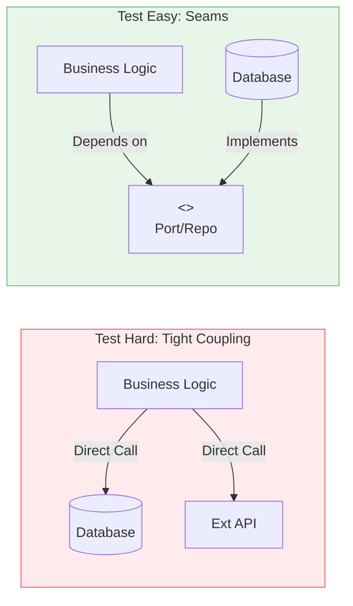

# 第06章：テストと設計の関係（テストは味方）🧫✅

この章はね、ひとことで言うと…
**「テストを書きやすいコード＝だいたい設計が良い」**って感覚を手に入れる回だよ〜😊🌸


---

## 1) この章でできるようになること🎯✨

* 「テストしにくいコード」が**なぜ設計的にツラいのか**説明できる🧠💡
* **Vitest**でテストを動かせるようになる🏃‍♀️💨（最近の最新版は 4系だよ）([npm][1])
* ミニプロジェクトの「料金計算」を題材に、**ユニットテストを1本以上**書ける💰✅
* **設計をちょい改善してテストしやすくする**体験ができる🧼✨

---

## 2) なんで「テスト」が「設計」とつながるの？🔗🤔

### ✅ テストしにくいコードあるある😵‍💫

* 入力がどこから来るのかわからない（グローバルや環境変数に依存）🌪️
* 時刻（`Date.now()`）や乱数（`Math.random()`）で結果が毎回変わる🎲
* DB/通信/ファイルアクセスが**計算ロジックに混ざってる**📡💥
* 1つの関数がデカすぎて、どこを検証したいのか不明👀💦

### ✅ つまりこういうこと💡

**テストって「このコード、外から見てちゃんと説明できる？」の確認作業**なのね😊

* 入力（引数）がハッキリしてて
* 出力（戻り値）がハッキリしてて
* 余計な副作用が少ないほど
  → テストが書きやすい✨
  → 設計もスッキリしがち✨

---

## 3) テストの種類（超ざっくり）🧁📚

* **ユニットテスト**：小さい部品（関数/クラス）を高速に検証⚡✅
* **結合テスト**：複数部品をつないで検証🔌✅
* **E2E**：ユーザー操作に近い形で検証🧑‍💻✅

この章はまず **ユニットテスト**に集中するよ〜！🧸✨

---

## 4) 今どきのテストツール：Vitestを使うよ🧡⚡

* Vitestは **Vite系の速さ**を活かしたテストランナーで、Jest互換のAPIも多いよ〜😊([Vitest][2])
* 「expect」もJest互換の書き味があるから入りやすい👍✨([Vitest][3])
* 参考までに：Jestの最新版は 30系（安定版が30）だよ〜🃏([Jest][4])

（TypeScript自体の最新版も 5.9系だね）([npm][5])

---

## 5) まずは最短で「テストを動かす」🧪🏃‍♀️

### 5-1) インストール（必要最低限）📦✨

```bash
npm i -D vitest @types/node
```

### 5-2) `package.json` にスクリプト追加📝

```json
{
  "scripts": {
    "test": "vitest",
    "test:run": "vitest run"
  }
}
```

* `npm test`：監視モードでサクサク回る🌀✨
* `npm run test:run`：CI向けに1回だけ実行🎯

---

## 6) ミニ題材：料金計算を「テストで守る」💰🛡️✨

ここからが本番〜！
**「Campus Café 注文」**の料金計算を、テストで安心にしていくよ☕️📦✅

### 6-1) まず「テストしやすい形」にするコツ🍀

料金計算は、こういう形が最高にテスト向き😊✨

* 入力：注文内容（商品と数量）
* 出力：合計金額（数値）
* 外部依存：なし（通信/DB/時刻を混ぜない）

---

## 7) 実装：`calculateTotal` を作る🧾✨

### 7-1) 実装ファイル：`src/domain/priceCalculator.ts`

※お金は **小数を避けて整数（円）で扱う**のがおすすめだよ〜💴✨

```ts
export type Yen = number;

export type LineItem = {
  name: string;
  unitPrice: Yen; // 例: 480
  quantity: number; // 例: 2
};

export type Discount = {
  type: "none" | "percent" | "fixed";
  value: number; // percentなら 10 (=10%)、fixedなら 100 (=100円引き)
};

function assertIntegerYen(value: number): void {
  if (!Number.isInteger(value) || value < 0) {
    throw new Error(`Yen must be a non-negative integer. got=${value}`);
  }
}

function calcSubtotal(items: LineItem[]): Yen {
  const subtotal = items.reduce((sum, item) => {
    if (!Number.isInteger(item.quantity) || item.quantity <= 0) {
      throw new Error(`quantity must be positive integer. got=${item.quantity}`);
    }
    assertIntegerYen(item.unitPrice);
    return sum + item.unitPrice * item.quantity;
  }, 0);

  assertIntegerYen(subtotal);
  return subtotal;
}

function applyDiscount(subtotal: Yen, discount: Discount): Yen {
  assertIntegerYen(subtotal);

  if (discount.type === "none") return subtotal;

  if (discount.type === "percent") {
    // 例: 10%引き → subtotal * 0.9
    const rate = discount.value / 100;
    const discounted = Math.floor(subtotal * (1 - rate));
    assertIntegerYen(discounted);
    return discounted;
  }

  if (discount.type === "fixed") {
    const discounted = Math.max(0, subtotal - discount.value);
    assertIntegerYen(discounted);
    return discounted;
  }

  // 将来discount.typeが増えても、TypeScriptがここを守ってくれる👍
  const _exhaustive: never = discount.type;
  return _exhaustive;
}

function addTax(amount: Yen, taxRate: number): Yen {
  // taxRate: 0.1 (=10%) みたいな想定
  if (taxRate < 0 || taxRate > 1) throw new Error(`taxRate must be 0..1 got=${taxRate}`);
  assertIntegerYen(amount);

  const taxed = Math.floor(amount * (1 + taxRate));
  assertIntegerYen(taxed);
  return taxed;
}

export function calculateTotal(
  items: LineItem[],
  discount: Discount,
  taxRate: number
): Yen {
  const subtotal = calcSubtotal(items);
  const discounted = applyDiscount(subtotal, discount);
  return addTax(discounted, taxRate);
}
```

---

## 8) テスト：まず1本！🎉✅

### 8-1) テストファイル：`src/domain/priceCalculator.test.ts`

```ts
import { describe, expect, test } from "vitest";
import { calculateTotal, type LineItem } from "./priceCalculator";

describe("calculateTotal", () => {
  test("割引なし：小計に税を足す", () => {
    const items: LineItem[] = [
      { name: "Café Latte", unitPrice: 480, quantity: 2 }, // 960
      { name: "Cookie", unitPrice: 220, quantity: 1 }, // 220
    ];

    // 小計 1180、税10%→ 1298（小数切り捨て）
    const total = calculateTotal(items, { type: "none", value: 0 }, 0.1);
    expect(total).toBe(1298);
  });
});
```

### 8-2) 実行🏃‍♀️💨

```bash
npm test
```

通ったら勝ち〜！🎊🥳✨

---

## 9) ちょい応用：表形式でテストする（増やしやすい）📋✨

Vitestは `test.each` みたいな **Jest互換の書き方**もできるよ〜😊([Vitest][6])

```ts
import { describe, expect, test } from "vitest";
import { calculateTotal, type LineItem } from "./priceCalculator";

describe("calculateTotal - table tests", () => {
  const baseItems: LineItem[] = [
    { name: "Sandwich", unitPrice: 500, quantity: 1 } // 500
  ];

  test.each([
    ["none", { type: "none", value: 0 }, 0.1, 550],
    ["10% off", { type: "percent", value: 10 }, 0.1, 495], // 500→450→税で495
    ["100yen off", { type: "fixed", value: 100 }, 0.1, 440], // 500→400→税で440
  ])("%s", (_name, discount, taxRate, expected) => {
    const total = calculateTotal(baseItems, discount as any, taxRate);
    expect(total).toBe(expected);
  });
});
```

---

## 10) 「テストしにくい設計」を「テストしやすく」するミニ改善🧼✨

### ありがちな悪い例（イメージ）😇💥

* `calculateTotal()` の中で

  * DBから税率を取ってきたり📡
  * 今日の日付でキャンペーン判定したり🕒
  * ログ出したり🧾
    → するとテストが一気にしんどい😵‍💫

### いい分け方（超大事）🌈

* **domain（計算）**：純粋に「入力→出力」だけ
* **infra（取得/保存/通知）**：外部に触る
* **app（つなぎ役）**：必要なものを集めてdomainを呼ぶ

この分け方をすると、domainがテスト天国になるよ🏝️✨



---

## 11) カバレッジ（おまけだけど強い）🧡📊

Vitestは **V8の仕組みでカバレッジ**を取れるよ（NodeみたいにV8上で動く環境が必要）([Vitest][7])
カバレッジ用のパッケージもあるよ〜📦([npm][8])

### 入れるならこれ👇

```bash
npm i -D @vitest/coverage-v8
```

### 実行例👇

```bash
npx vitest --coverage
```

---

## 12) AI（Copilot/Codex）を使うときの勝ちパターン🤖🏆✨

### ✅ おすすめプロンプト例（そのまま使ってOK）💬

* 「この関数のユニットテストをVitestで。**境界値**と**異常系**も入れて」🧪✨
* 「テストが書きやすいように、**副作用を外に追い出す**リファクタ案を出して」🧼🔧
* 「このテスト、意図が伝わる名前に直して」📝💖

### ⚠️ 注意ポイント

AIが出したテストは、ときどき

* 期待値がズレてる
* 本当は守りたい仕様が抜けてる
  があるから、**最後は人間の目でOK出す**のが大事だよ👀✅

---

## 13) ミニ課題（やってみよ〜！）🎒✨

### 課題A：テストをもう2本増やす🧪➕

* 10%引きのケース🎟️
* 100円引きのケース💴

### 課題B：異常系テストを1本書く🚨

* quantityが0のとき例外になるか
* unitPriceが負のとき例外になるか

（例外テストはこう書けるよ👇）

```ts
import { expect, test } from "vitest";
import { calculateTotal } from "./priceCalculator";

test("quantityが0ならエラー", () => {
  expect(() =>
    calculateTotal([{ name: "Tea", unitPrice: 300, quantity: 0 }], { type: "none", value: 0 }, 0.1)
  ).toThrow();
});
```

### 課題C：わざとバグらせて、テストが守ってくれるのを見る😈🛡️

* `Math.floor` を `Math.round` に変えてみる
  → テストが落ちたら「守られてる！」ってことだよ🎉

---

## 14) 今日のまとめ🎀✨

* **テストしにくい＝設計がしんどいサイン**になりやすい😵‍💫
* 料金計算みたいなロジックは **純粋関数化**するとテストが爆ラク🧡
* Vitestで **まず1本テストを書けたら大勝利**🎊😊✨
* テストは敵じゃなくて、未来の自分の味方〜！🫶🧸✅

---

次の章（第7章）では、この「テストで守れる状態」を土台にして、**安全にリファクタリング**していくよ〜🧼🔁✨

[1]: https://www.npmjs.com/package/vitest?utm_source=chatgpt.com "vitest"
[2]: https://vitest.dev/guide/comparisons?utm_source=chatgpt.com "Comparisons with Other Test Runners | Guide"
[3]: https://vitest.dev/api/expect.html?utm_source=chatgpt.com "expect"
[4]: https://jestjs.io/versions?utm_source=chatgpt.com "Jest Versions"
[5]: https://www.npmjs.com/package/typescript?utm_source=chatgpt.com "TypeScript"
[6]: https://vitest.dev/api/?utm_source=chatgpt.com "Test API Reference"
[7]: https://vitest.dev/guide/coverage?utm_source=chatgpt.com "Coverage | Guide"
[8]: https://www.npmjs.com/package/%40vitest/coverage-v8?utm_source=chatgpt.com "vitest/coverage-v8"
