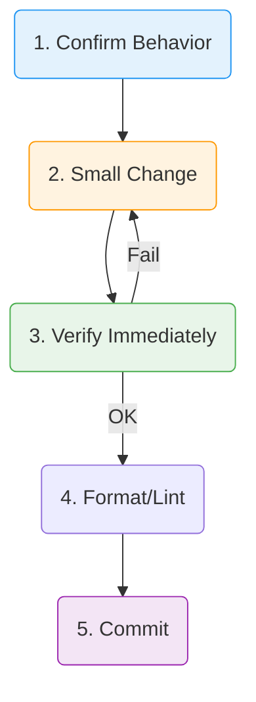

# 第07章：リファクタリングの基本（安全に整える）🧼✨


（テーマ：**小さく直す→すぐ動かす→また小さく直す**🔁）


---

## 0) この章でできるようになること 🎯✨

* 「リファクタリング」と「仕様変更」を区別できるようになる😺🧠
* **壊さずに**読みやすくする手順（安全運転）が身につく🚗💨🛡️
* 命名＆関数分割で、コードの見通しが良くなる👀✨
* AI（Copilot/Codex）に頼りつつ、**事故らない使い方**ができる🤖🔍✅

---

## 1) リファクタリングってなに？🤔💡

**動き（ふるまい）を変えずに、内部の形を良くすること**だよ🧸✨

* ✅ 読みやすくする
* ✅ 変更しやすくする
* ✅ テストしやすくする
* ✅ バグを生みにくくする

逆に「仕様変更」は、動きを変えるやつ！🚦
例）「学割を追加する」「送料のルールを変える」みたいなやつね📦💰

---

## 2) 安全にやるための“黄金ルール” 🥇🛡️


リファクタは、コツを守るとめっちゃ安全になるよ😊✨

### 2-1) “小さく”が正義 ✂️🧩

* 1回の変更は小さく
* 1コミットも小さく
* 「いま何を改善したの？」が説明できる単位でやる🎀

### 2-2) “動作確認”はこまめに ✅🔁

* テストがあるなら：テストを回す🏃‍♀️💨
* テストがないなら：最低でも「今の動き」を固定する（後で紹介するよ）📌

### 2-3) “きれいにする順番”がある 🧹✨

おすすめの順番はこれ👇

1. **命名**（変数・関数・クラス）📝
2. **長い関数を分割**✂️
3. **重複を減らす**（コピペ削減）🧬
4. **依存関係を整理**（次の章以降のSOLIDに繋がる）🧶

---

## 3) 最新ツール事情（リファクタに効くところだけ）🧰✨

* TypeScript の安定最新版は npm では **5.9.3**（本日時点）だよ📌 ([npm][1])
* TypeScript 5.9 では **ホバー表示（型のツールチップ）を展開できる**など、型の見通しが良くなる改善が入ってるよ👀✨ ([TypeScript][2])
* VS Code は **v1.108（2025年12月アップデート）**が **2026-01-08**リリース📅💻 ([Visual Studio Code][3])
* テストは Vitest が **v4系**になってて、今どきのTS開発と相性よし🧪⚡ ([Vitest][4])
* Node.js は **24系がLTS入り**してる（安定運用寄り）🟢 ([Node.js][5])

---

## 4) リファクタの“安全運転”テンプレ 🧭🛡️


これを毎回の型にしちゃうと強いよ💪😊

### ✅ 安全テンプレ（5手）

1. **いまの動きを確認**（テスト or 手動チェック項目を書く）📝
2. **小さく直す**（命名1個、関数抽出1回…）✂️
3. **すぐ確認**（テスト/実行）✅
4. **整形・lint**（見た目のノイズを減らす）🎀
5. **コミット**（差分が説明できるうちに）📌



---

## 5) 実戦：ぐちゃぐちゃ関数を“命名＆分割”で救う ☕️📦✨

題材はミニプロジェクトの「Campus Café」っぽく、注文合計の計算にするね😋

### 5-1) Before：ニオイがするコード 👃💥


ポイント：長い・条件が多い・数字が直書き・変数名が弱い…😵‍💫

```ts
type Item = { name: string; price: number; qty: number };
type Order = {
  items: Item[];
  isStudent: boolean;
  coupon?: "NONE" | "RAIN" | "SET";
  takeout: boolean;
};

export function calc(order: Order): number {
  let a = 0;

  for (const i of order.items) {
    a += i.price * i.qty;
  }

  // coupon
  if (order.coupon === "RAIN") {
    a = Math.floor(a * 0.9);
  } else if (order.coupon === "SET") {
    if (a >= 1200) a -= 200;
  }

  // student
  if (order.isStudent) {
    a = Math.floor(a * 0.95);
  }

  // takeout tax
  if (order.takeout) {
    a = Math.floor(a * 1.08);
  } else {
    a = Math.floor(a * 1.1);
  }

  // shipping(?) service fee
  if (a < 500) a += 120;

  return a;
}
```

---

## 6) Step0：まず“動きを固定”する（超だいじ！）📌🧪


リファクタで怖いのは「知らないうちに動きが変わる」こと😱
だから先に **キャラクタリゼーションテスト**（現状固定テスト）を置くよ✅

```ts
import { describe, it, expect } from "vitest";
import { calc } from "./calc";

describe("calc (characterization)", () => {
  it("雨の日 + 学割 + 店内の組み合わせが変わらない", () => {
    const result = calc({
      items: [
        { name: "Latte", price: 480, qty: 1 },
        { name: "Muffin", price: 360, qty: 1 },
      ],
      isStudent: true,
      coupon: "RAIN",
      takeout: false,
    });

    // 今の結果を固定（あとでリファクタしてもここは同じであるべき）
    expect(result).toBe( (/* ここは一度実行して出た値 */ 0) );
  });
});
```

> ✅ コツ：最初は `toBe(0)` のまま実行して、出た値に書き換える方式でOKだよ😊
> 「美しい期待値」じゃなくて「現状固定」が目的✨

---

## 7) Step1：命名だけ直す（動作は変えない）📝✨

`a` とか `calc` は、読んだ瞬間に意味が分からないのがつらい😢
まずは**意味のある名前**にするよ🌸

* `calc` → `calculateTotalPrice`
* `a` → `subtotal`（または `totalBeforeTax`）

ここは VS Code の **Rename Symbol（F2）** が超便利だよ⚡️🪄

---

## 8) Step2：関数を切り出す（“読みやすさ”を爆上げ）✂️📈


長い関数は「見出しがない文章」みたいなもの📚😵
だから処理ごとに **Extract Function** しちゃおう✨

分割の目安はこれ👇

* 「コメントが欲しくなる場所」＝関数の境界候補👀
* 「ここから先は別の話」＝分割候補🧩
* 「条件分岐が続く」＝分割候補🚥

### After（分割版）✨

```ts
type Item = { name: string; price: number; qty: number };
type Order = {
  items: Item[];
  isStudent: boolean;
  coupon?: "NONE" | "RAIN" | "SET";
  takeout: boolean;
};

export function calculateTotalPrice(order: Order): number {
  const itemsTotal = calculateItemsTotal(order.items);
  const discounted = applyDiscounts(itemsTotal, order);
  const taxed = applyTax(discounted, order.takeout);
  const finalTotal = applySmallOrderFee(taxed);
  return finalTotal;
}

function calculateItemsTotal(items: Item[]): number {
  let total = 0;
  for (const item of items) total += item.price * item.qty;
  return total;
}

function applyDiscounts(total: number, order: Order): number {
  let result = total;
  result = applyCoupon(result, order.coupon ?? "NONE");
  result = applyStudentDiscount(result, order.isStudent);
  return result;
}

function applyCoupon(total: number, coupon: Order["coupon"]): number {
  if (coupon === "RAIN") return Math.floor(total * 0.9);
  if (coupon === "SET" && total >= 1200) return total - 200;
  return total;
}

function applyStudentDiscount(total: number, isStudent: boolean): number {
  return isStudent ? Math.floor(total * 0.95) : total;
}

function applyTax(total: number, takeout: boolean): number {
  return takeout ? Math.floor(total * 1.08) : Math.floor(total * 1.1);
}

function applySmallOrderFee(total: number): number {
  return total < 500 ? total + 120 : total;
}
```

✅ ここまで来ると「上から読んだだけで流れが分かる」ようになるよね🥹✨
そして、この形が次のSOLID（特にSRP/OCP）に繋がっていくよ🧶🌈

---

## 9) Step3：マジックナンバー退治 🧙‍♀️💥➡️📌


`0.9` とか `1200` とか `120` とか…
「何それ？」って未来の自分が泣くやつ😭

こうする👇

```ts
const COUPON_RAIN_RATE = 0.9;
const SET_DISCOUNT_THRESHOLD = 1200;
const SET_DISCOUNT_AMOUNT = 200;
const STUDENT_RATE = 0.95;
const TAX_TAKEOUT = 1.08;
const TAX_DINE_IN = 1.1;
const SMALL_ORDER_THRESHOLD = 500;
const SMALL_ORDER_FEE = 120;
```

✅ “数字に名前を付ける”だけで、読めるコードに進化するよ🦋✨

---

## 10) AI活用：事故らない頼み方テンプレ 🤖🧯✨

AIに「全部直して！」って言うと、でっかい差分が出て事故りやすい😇💥
だから **小さく依頼**するよ！

### 10-1) 良い依頼（小さく・手順）📝

* 「`calc` を `calculateTotalPrice` にリネームして。動作は変えないで」
* 「この関数、処理ブロックごとに Extract Function する案を“手順だけ”出して」
* 「Vitestで現状固定テストを3ケース作って」
* 「差分を最小にしたい。まず命名だけ直して」

### 10-2) AIが出した差分の“チェック項目”🔍✅

* 変更が大きすぎない？（意図せぬ仕様変更の匂い）👃
* 変数の意味が変わってない？（税計算とか）💰
* 端数処理（`Math.floor`）がズレてない？⚠️
* テストが増えた？ それとも消えた？🧪
* 「小さなコミット」に分割できる？📌

---

## 11) ミニ課題（やってみよ〜！）🎒✨

### 課題A：命名だけ改善📝

* `calc` / `a` / `i` を「意味が伝わる名前」に変える
* テストが全部通るのを確認✅

### 課題B：Extract Function で3つに分割✂️

* 合計
* 割引
* 税＆手数料
  の3ブロックに分ける（今回の例みたいに）✨

### 課題C：マジックナンバーに名前を付ける📌

* 割引率・税率・閾値に定数名をつける
* 「何の数字か」が説明できたら勝ち🏆🎉

---

## 12) まとめ：リファクタの最強チェックリスト 🧾✅✨

* [ ] 動きは変えてない（テストで固定）🧪
* [ ] 変更は小さい（説明できる）🧩
* [ ] 命名が強い（読んだ瞬間に意味が分かる）📝
* [ ] 関数が短い（役割がはっきり）✂️
* [ ] 数字に名前がある（意図が読める）📌
* [ ] AIの差分は人間がレビューした🤖🔍👩‍💻

---

## おまけ：理解度チェック（3問）🎓💡

1. リファクタリングと仕様変更の違いを一言で言うと？🗣️
2. リファクタで一番やっちゃダメな進め方はどれ？😱

   * A: 小さく直してテスト
   * B: まとめて大改造して最後に動作確認
3. `a = Math.floor(a * 1.1)` みたいなコードの“弱点”は何？👀

---

次の章（第8章）で、ここまでの経験を「SOLIDの全体地図」に繋げて、迷子にならないようにするよ🗺️🌟
もしよかったら、この章の課題用に **あなたの“現状のcalc関数”**（今あるやつ）貼ってくれたら、**壊さず直す手順**を「コミット刻み」まで具体化して一緒にやるよ😊🧡

[1]: https://www.npmjs.com/package/typescript?utm_source=chatgpt.com "TypeScript"
[2]: https://www.typescriptlang.org/docs/handbook/release-notes/typescript-5-9.html?utm_source=chatgpt.com "Documentation - TypeScript 5.9"
[3]: https://code.visualstudio.com/updates?utm_source=chatgpt.com "December 2025 (version 1.108)"
[4]: https://vitest.dev/blog/vitest-4?utm_source=chatgpt.com "Vitest 4.0 is out!"
[5]: https://nodejs.org/en/blog/release/v24.11.0?utm_source=chatgpt.com "Node.js v24.11.0 (LTS)"
