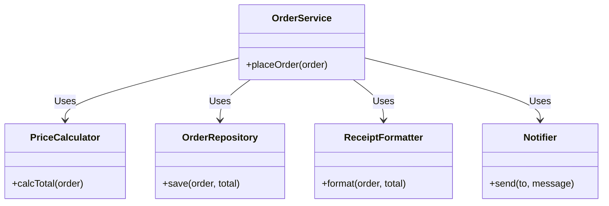

# 第09章：SRP（単一責任）の基本🌷

（Single Responsibility Principle）


---

## 0. この章でできるようになること🎯💕

* 「SRPって結局なに？」を、自分の言葉で説明できる🗣️✨
* クラスやモジュールの**“責務（せきむ）”**を見つけられる🔍💡
* 「このクラス、分けたほうがいいかも…」を**変更理由**から判断できる🧠🧩
* ミニプロジェクト（Campus Café ☕️📦）の `OrderService` を、SRP観点で“診断”できる👩‍⚕️🩺✨

---

## 1. まずSRPのいちばん大事な一言🌸

SRPはこう覚えると強いよ👇✨

* **「クラス（モジュール）は、変更される理由が1つだけ」**📌
* 言い換えると **「1つの“役割（アクター）”にだけ責任を持つ」**って感じ🙋‍♀️🎭

この「1つの理由でだけ変更される」がSRPの核だよ〜！✨ ([クリーンコーダーブログ][1])

---

## 2. “責務”ってなに？（ここが一番つまずく🥺）

責務＝「このコードが引き受けてる仕事」なんだけど、SRP的にはこう考えるのが超ラク👇💕

### ✅ 責務の正体は「変更理由」🛠️

たとえば注文アプリで、同じクラスがこんな理由で変更されるなら…

* 割引ルールが変わった🎟️
* レシートの見た目（文言・レイアウト）が変わった🧾
* 保存先がDBになった💾
* 通知がメール→アプリ通知になった🔔

これ、**“変更の原因”がバラバラ**だよね？😵
つまりそのクラスは **責務が混ざってる**可能性が高い、って判断できるよ✨

---

## 3. SRPのありがちな誤解TOP3😇💥

### 誤解①：SRP＝「クラスは小さければ小さいほど正義」🏷️

→ **小さくしすぎて逆に読みにくい**ことある😂
「変更理由が同じなら、まとまっててOK」だよ🧸✨

### 誤解②：SRP＝「メソッド1個のクラス量産」🐣🐣🐣

→ それは“やりすぎSRP”になりがち😵
「何が変わるか」で切るのが本筋だよ✂️✨

### 誤解③：SRP＝「責務は1つ＝機能も1つ」🎮

→ ちがうよ〜！
“機能”じゃなくて、**“変更される理由（誰が何のために変えるか）”**が1つかどうかだよ🎯 ([ウィキペディア][2])

---

## 4. SRPが効くと何がうれしいの？🎁✨

SRPが効くと、こうなるよ👇🥰

* 変更が怖くなくなる😌🛡️
* 影響範囲が小さくなる（バグが広がりにくい）🧯
* テストが書きやすくなる✅
* AIに投げたときの修正提案が当たりやすくなる🤖🎯

---

## 5. 実戦：SRP違反の“あるある”コードを書いて嗅ぐ👃💥

まずは「ニオイ」を体験しよ〜🧪✨
（Campus Café の注文処理っぽいやつ☕️📦）

### 😵 悪い例：なんでも屋 `OrderService`

* 料金計算もする💰
* 保存もする💾
* レシート文字列も作る🧾
* 通知もする🔔

```ts
// order/OrderService.ts
type OrderItem = { name: string; price: number; qty: number };
type Order = { id: string; items: OrderItem[]; customerEmail: string };

export class OrderService {
  placeOrder(order: Order): string {
    // 1) 料金計算（ルール）
    const total = this.calcTotal(order);

    // 2) 保存（インフラ都合）
    this.saveAsJson(order, total);

    // 3) レシート生成（表示・文言）
    const receipt = this.buildReceipt(order, total);

    // 4) 通知（外部連携）
    this.sendEmail(order.customerEmail, receipt);

    return receipt;
  }

  private calcTotal(order: Order): number {
    return order.items.reduce((sum, item) => sum + item.price * item.qty, 0);
  }

  private saveAsJson(order: Order, total: number) {
    // 実装は省略：ファイル保存やDB保存を想定
    // ここが変わる理由：保存先・形式・例外処理・リトライ…💾
  }

  private buildReceipt(order: Order, total: number): string {
    // ここが変わる理由：レシート文言・税表示・レイアウト…🧾
    return `Order ${order.id}\nTOTAL: ${total}`;
  }

  private sendEmail(to: string, receipt: string) {
    // ここが変わる理由：通知手段・API・失敗時の扱い…🔔
  }
}
```

### ✅ SRP的に「変更理由」を付箋で貼ると…🏷️✨

このクラス、少なくともこんな理由で変わるよね👇😵

* **会計ルール**が変わる（合計・税・割引）💰
* **保存の都合**が変わる（DB/ファイル/クラウド、形式、失敗時）💾
* **表示/文言**が変わる（レシート）🧾
* **通知手段**が変わる（メール/アプリ/LINE風…）🔔

変更理由が4つもある＝**SRP違反の可能性が高い**！💥

---

## 6. SRPリファクタ：まずは“責務の分離”だけやる✂️✨

ここでは（まだ他の原則に深入りせず）
**「仕事を分ける」**だけに集中するよ〜😊🌷

### 🌟 目標：`OrderService` を「調整役」にする🎛️

* OrderService：**注文の流れを取りまとめる**（オーケストラ🎻）
* 計算：計算担当へ💰
* 保存：保存担当へ💾
* レシート：整形担当へ🧾
* 通知：通知担当へ🔔

```ts
// order/PriceCalculator.ts
import type { Order } from "./types";

export class PriceCalculator {
  calcTotal(order: Order): number {
    return order.items.reduce((sum, item) => sum + item.price * item.qty, 0);
  }
}
```

```ts
// order/ReceiptFormatter.ts
import type { Order } from "./types";

export class ReceiptFormatter {
  format(order: Order, total: number): string {
    return `Order ${order.id}\nTOTAL: ${total}`;
  }
}
```

```ts
// order/OrderRepository.ts
import type { Order } from "./types";

export class OrderRepository {
  save(order: Order, total: number): void {
    // ここに保存の詳細（ファイル/DB/クラウド等）
  }
}
```

```ts
// order/Notifier.ts
export class Notifier {
  send(to: string, message: string): void {
    // ここに通知の詳細（メール/外部API等）
  }
}
```

```ts
// order/types.ts
export type OrderItem = { name: string; price: number; qty: number };
export type Order = { id: string; items: OrderItem[]; customerEmail: string };
```

```ts
// order/OrderService.ts
import type { Order } from "./types";
import { PriceCalculator } from "./PriceCalculator";
import { ReceiptFormatter } from "./ReceiptFormatter";
import { OrderRepository } from "./OrderRepository";
import { Notifier } from "./Notifier";

export class OrderService {
  constructor(
    private readonly calc = new PriceCalculator(),
    private readonly repo = new OrderRepository(),
    private readonly formatter = new ReceiptFormatter(),
    private readonly notifier = new Notifier()
  ) {}

  placeOrder(order: Order): string {
    const total = this.calc.calcTotal(order);
    this.repo.save(order, total);

    const receipt = this.formatter.format(order, total);
    this.notifier.send(order.customerEmail, receipt);

    return receipt;
  }
  }
}
```



### ✅ これで何が良くなった？🎉

* 会計ルールが変わったら → `PriceCalculator` だけ見ればOK💰
* レシートが変わったら → `ReceiptFormatter` だけ直せばOK🧾
* 保存先が変わったら → `OrderRepository` だけ直せばOK💾
* 通知が変わったら → `Notifier` だけ直せばOK🔔

**変更理由が散らばって、影響が局所化**したよ〜！🥳✨

---

## 7. “分けどき”判断のコツ3つ🧠✨

SRPの判断で迷ったら、この3つをチェック✅💕

### ✅ コツ①：「誰が困る変更？」で分ける（アクター思考）🎭

* 会計担当が言いそう：割引・税・端数処理💰
* 店長が言いそう：売上データ・保存・運用💾
* お客さんが見る：レシート表示🧾
* 運用担当が困る：通知の失敗・リトライ🔔

SRPは「1つのアクターに責任を持つ」って説明もよく使われるよ✨ ([ウィキペディア][2])

### ✅ コツ②：「変更理由を日本語で言える？」🗣️

クラス名を主語にして、こう言ってみて👇

* 「このクラスは、○○が変わるときに直す」
  これが **2つ以上** 出たら黄色信号🚥💛

### ✅ コツ③：修正のたびに “別の部分” を触ってない？🧩

「保存いじっただけなのに、レシートも編集した…」みたいな
**巻き込み修正**が増えてたら、分けどきサインだよ😵💦

---

## 8. ミニ課題（この章のアウトライン通り）📝😊

### 課題A：`OrderService` の責務を3つ列挙してみよう🏷️✨

さっきの“悪い例”の `OrderService` を見て、
「このクラスが引き受けてる仕事」を3つ書く✍️（できれば4つでもOK🥳）

例（答えの形）👇

* 料金を計算してる💰
* 保存してる💾
* レシートを作ってる🧾
* 通知してる🔔

### 課題B：変更理由カードを作る🃏✨

「将来ありそうな変更」を5個、箇条書きで作ってね📝
（例：学割追加🎓、レシートに店名追加🏪、保存先をDBに変更💾…）

---

## 9. AI（Copilot/Codex）に頼るときの“勝ちプロンプト”🤖🏆✨

そのまま貼って使える系いくよ〜！💕

### ✅ 1) 責務を洗い出させる

```text
このOrderServiceの責務（変更理由）を箇条書きで列挙して。
各責務に対して「誰（どの役割/アクター）が変更を要求しそうか」も書いて。
```

### ✅ 2) SRPに沿った分割案を出させる

```text
SRPの観点でクラスを分割したい。
分割後のクラス名案と、それぞれの責務、依存関係（呼び出し方向）を提案して。
まずはDIPなどは気にせず「責務の分離」を優先して。
```

### ✅ 3) リファクタ後の差分レビューをさせる（超大事）🔍

```text
このリファクタで「変更理由が1つに寄ったか？」をチェックして。
まだ混ざってる責務があれば指摘して、改善案も出して。
```

---

## 10. 2026ミニ情報（今回の章に関係する“鮮度”だけ）🗞️✨

* TypeScriptは **5.9系**のドキュメント/リリース情報が公開されていて、npm上でも **5.9.3** が “Latest” として案内されてるよ📦✨ ([TypeScript][3])
* TypeScript 5.7では `--target es2024` / `--lib es2024` のサポートも入って、より新しいECMAScript機能を狙いやすくなってるよ🚀 ([Microsoft for Developers][4])

（SRP自体は普遍だけど、言語・標準ライブラリが進むほど「責務を型とモジュールで分ける」がやりやすくなる感じだよ〜😊✨）

---

## 11. まとめ🌷🎀

* SRPは「1つの理由でだけ変更される」が核📌 ([クリーンコーダーブログ][1])
* 迷ったら「変更理由」と「誰（アクター）」で切る🎭✨ ([ウィキペディア][2])
* まずは **“なんでも屋”を“調整役”にして、仕事を担当へ分ける**✂️🧩
* 次の章（第10章）で、「どんな分け方パターンがあるか」をもっと型として学べるよ〜🎉💕

---

次は第10章（SRPの分け方パターン🧩✨）に合わせて、
「分割軸のテンプレ（変換/永続化/表示/ルール/通信…）」を、Campus Caféに“当てはめ表”みたいにして一気にわかりやすくしていこっか？😊💕

[1]: https://blog.cleancoder.com/uncle-bob/2014/05/08/SingleReponsibilityPrinciple.html?utm_source=chatgpt.com "The Single Responsibility Principle - Clean Coder Blog"
[2]: https://en.wikipedia.org/wiki/Single-responsibility_principle?utm_source=chatgpt.com "Single-responsibility principle"
[3]: https://www.typescriptlang.org/docs/handbook/release-notes/typescript-5-9.html?utm_source=chatgpt.com "Documentation - TypeScript 5.9"
[4]: https://devblogs.microsoft.com/typescript/announcing-typescript-5-7/?utm_source=chatgpt.com "Announcing TypeScript 5.7"
