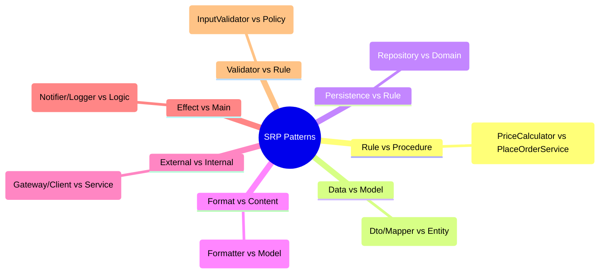

# 第10章：SRPの分け方パターン（分割の型）🧩✨


（テーマ：**「分けたいけど、どう切ればいいの？」を“型”で解決するよ〜！**🥰）


---

## 0. この章でできるようになること🎯💖

* 「責務（せきむ）」を**“変更理由”として説明**できるようになる🗣️✨
* ゴチャっとした処理を見たときに、**よくある分割軸（型）**でスパッと切れる✂️😊
* 分割したあとに「やりすぎ」「逆に意味ない」を判定できる👀⚖️

---

## 1. SRPを30秒でおさらい🌷⏱️

SRPはざっくり言うと、

> **「そのコードが変更される理由は、1種類にしよう」**
> （＝変更理由が複数あるなら、混ざってるサイン🚨）

だよ〜😊✨

ポイントは「**責務＝機能**」じゃなくて、
**責務＝変更理由（なぜ直すことになるか）**って捉えること！🧠💡

---

## 2. まずは“分割軸”を見つけるコツ🔎✨（超重要！）


### ✅ 2-1. 変更理由をメモる📝

コードを見て、次を箇条書きしてみてね👇

* 「仕様変更が来そうなところ」📩
* 「外部都合で変わるところ」🌍（DB/API/表示形式など）
* 「ビジネスルールが増えそうなところ」🎟️💰
* 「ログや通知など“おまけ副作用”」🔔🧾

このメモが、そのまま分割のヒントになるよ☺️

### ✅ 2-2. “一緒に変わるもの”は近くに置く🤝

逆にいうと、
**別々のタイミングで変わるものは別々にする**のがSRPの基本だよ〜✂️✨

---

## 3. SRPの「分割の型」カタログ🧩📚✨



（ここが本編！困ったらこの型から選べばOK😊）

### 型A：ルール（ドメイン）🧠 と 手続き（流れ）🚶‍♀️ を分ける


**ありがち混在**：
「合計計算（ルール）」と「注文処理の順番（流れ）」が同じ場所にいる😵

**分け方の目安**👇

* ルール：**純粋に計算/判定**（入→出が決まる）🧮✨
* 手続き：保存・通知・画面表示などを**順番に呼ぶ**📦🔔

**よくある名前例**

* `PriceCalculator`（ルール）
* `PlaceOrderService`（流れ/ユースケース）

---

### 型B：データ変換（DTO/Mapper）🔁 と 本体モデル🧱 を分ける

**混ざると地獄**：
APIの形が変わるたびに、ドメインのルールまで巻き添え🍥😵

**分け方**👇

* 変換：`OrderDto -> Order` / `Order -> ReceiptViewModel` みたいな橋渡し🌉
* 本体：`Order` や `Money` など、ルールの中心🧠

---

### 型C：永続化（DB/ファイル）💾 と ルール🧠 を分ける


DBの都合（列追加・SQL変更）で、ルールが汚れるのは避けたい〜😢

**分け方**👇

* `OrderRepository`：保存の責任💾
* `Order` / `PriceCalculator`：ルールの責任🧠

---

### 型D：表示・フォーマット🖨️ と 中身（データ）📦 を分ける

レシートの見た目変更で、注文ロジックが変わるのイヤだよね🥺

**分け方**👇

* `ReceiptFormatter`：文字列にする責任🧾
* `OrderSummary`：中身の責任📦

---

### 型E：外部通信（HTTP/メール/決済）🌐 と 中身🧠 を分ける

外部APIは仕様変更が起きやすいから、混ぜるとつらい😇

**分け方**👇

* `PaymentGateway` / `EmailClient`：外部と話す📡
* `CheckoutService`：どう使うか決める🧠

---

### 型F：副作用（ログ/通知/計測）📣 と 本筋🛤️ を分ける


ログや通知は「やること自体は単純」だけど、混ざると読みにくくなる代表🥹

**分け方**👇

* `Notifier`：通知する責任🔔
* 本筋サービス：通知を「いつ呼ぶか」だけ決める🧭

---

### 型G：バリデーション✅ と ビジネスルール🧠 を分ける

入力チェック（空/範囲/型）と、割引ルール（学割/雨の日）を混ぜると話がごちゃる〜😵‍💫

**分け方**👇

* `InputValidator`：入力の正しさ✅
* `DiscountPolicy`：割引ルール🎟️

---

## 4. ミニプロジェクト例：OrderServiceが全部やってる😇🔥（Before→After）

### 4-1. Before：なんでも屋サービス（いったん“わざと”ね😂）

```ts
type OrderItem = { name: string; price: number; qty: number };
type OrderInput = { items: OrderItem[]; couponCode?: string; userEmail: string };

export class OrderService {
  async placeOrder(input: OrderInput): Promise<string> {
    // ①入力チェック
    if (input.items.length === 0) throw new Error("items required");
    if (!input.userEmail.includes("@")) throw new Error("email invalid");

    // ②料金計算（ルール）
    let total = input.items.reduce((sum, i) => sum + i.price * i.qty, 0);

    // ③クーポン適用（ルール）
    if (input.couponCode === "STUDENT10") total *= 0.9;
    if (input.couponCode === "RAINY5") total -= 5;

    // ④保存（永続化）
    const orderId = "ORD-" + Math.random().toString(16).slice(2);
    await fakeDbInsert({ orderId, input, total });

    // ⑤レシート作成（表示）
    const receipt = `Order ${orderId}\nTOTAL: ${total}`;

    // ⑥通知（副作用）
    await fakeSendEmail(input.userEmail, receipt);

    return orderId;
  }
}

// ダミー
async function fakeDbInsert(_x: unknown) {}
async function fakeSendEmail(_to: string, _body: string) {}
```

これ、動くけど…変更理由が多すぎる〜！😵‍💫
「クーポン追加」「DB変更」「メール文面変更」「入力チェック追加」全部ここが燃える🔥

---

### 4-2. After：分割の型でスパッと切る✂️✨


**狙い：変更理由ごとに置き場所を分ける**だよ😊

```ts
// 🧠 ルール（計算）
export class PriceCalculator {
  calculate(items: { price: number; qty: number }[]): number {
    return items.reduce((sum, i) => sum + i.price * i.qty, 0);
  }
}

// 🎟️ ルール（割引）
export interface DiscountPolicy {
  apply(total: number): number;
}

export class Student10Discount implements DiscountPolicy {
  apply(total: number): number {
    return total * 0.9;
  }
}

export class Rainy5Discount implements DiscountPolicy {
  apply(total: number): number {
    return total - 5;
  }
}

export class NoDiscount implements DiscountPolicy {
  apply(total: number): number {
    return total;
  }
}

// ✅ 入力チェック
export class OrderInputValidator {
  validate(input: { items: unknown[]; userEmail: string }) {
    if (input.items.length === 0) throw new Error("items required");
    if (!input.userEmail.includes("@")) throw new Error("email invalid");
  }
}

// 💾 永続化
export interface OrderRepository {
  save(order: { orderId: string; total: number; raw: unknown }): Promise<void>;
}

// 🧾 表示（フォーマット）
export class ReceiptFormatter {
  format(orderId: string, total: number): string {
    return `Order ${orderId}\nTOTAL: ${total}`;
  }
}

// 🔔 通知
export interface Notifier {
  notify(to: string, message: string): Promise<void>;
}

// 🚶‍♀️ 流れ（ユースケース）
export class PlaceOrderService {
  constructor(
    private readonly validator: OrderInputValidator,
    private readonly priceCalc: PriceCalculator,
    private readonly discount: DiscountPolicy,
    private readonly repo: OrderRepository,
    private readonly receipt: ReceiptFormatter,
    private readonly notifier: Notifier
  ) {}

  async execute(input: { items: { price: number; qty: number }[]; couponCode?: string; userEmail: string }) {
    this.validator.validate(input);

    const base = this.priceCalc.calculate(input.items);
    const total = this.discount.apply(base);

    const orderId = "ORD-" + crypto.randomUUID();

    await this.repo.save({ orderId, total, raw: input });

    const message = this.receipt.format(orderId, total);
    await this.notifier.notify(input.userEmail, message);

    return orderId;
  }
}
```

※ `crypto.randomUUID()` はブラウザ/Nodeどちらも使える流れが強いから、ID生成も外だししたくなったら（変更理由が出たら）分ければOKだよ〜😉✨

---

## 5. 分割できたか判定する「SRPチェック」✅💯

分割した各クラス/モジュールに対して、これを聞いてみてね👇

* **「これが変わる理由、1個だけ？」**🎯
* **「名前が“何を担当するか”を言えてる？」**🪧
* **「変更の頻度が違うもの、混ざってない？」**📆
* **「テストが書きやすくなった？」**🧪✨（地味に超重要）

---

## 6. “やりすぎ分割”を防ぐコツ⚠️😂


SRPって、頑張りすぎると

* 1メソッド1クラス病🏥
* ファイルが増えすぎて迷子🗂️😵
* 逆に追いづらい（凝集度が下がる）🌀

になりがち！

### ✅ セーフな進め方（おすすめ）🪜

* まずは **「でかい塊を2〜3個に割る」**
* その後「変更理由が別だ」と確信したら追加分割
  この順がいちばん事故らないよ😊✨

---

## 7. AI（Copilot/Codex）に手伝わせるテンプレ🤖💡

そのまま貼って使えるやつ置いとくね🧸✨

**① 責務の洗い出し**

```text
この TypeScript のクラスの「変更理由（責務）」を列挙して、
SRP観点で分割案（クラス名/責務/依存関係）を提案して。
過剰分割にならないよう、まずは2〜4個の塊で。
```

**② After案をコード化**

```text
提案した分割案を、TypeScriptで最小実装して。
依存は interface にして、PlaceOrderService から注入できる形で。
```

**③ テストも一緒に**

```text
分割後に一番おいしいテスト（料金計算/割引/通知の呼ばれ方）を
Vitest想定でサンプルを書いて。
```

Vitestは「Viteネイティブで速い」「Jest互換」路線が強くて、最近もメジャーアップデートが出てるよ〜🧪⚡ ([vitest.dev][1])

---

## 8. ミニ課題（この章のゴール）🎒✨

### 課題A：分割軸メモ📝

Beforeコードを読んで、変更理由を最低5個書いてみてね😊
（例：クーポン追加、レシート文面、保存方式、通知手段、入力ルール…）

### 課題B：型で分割🧩

次の「型」を最低3つ使って分割してみよう👇

* ルール vs 流れ
* 永続化 vs ルール
* 表示 vs 中身
* 副作用 vs 本筋

### 課題C：効果を言葉にする💬✨

「どの変更がどこに閉じ込められたか」を3行で説明できたら勝ち🏆💖

---

## 9. 2026年1月時点の“実務メモ”📌✨（リサーチ結果）

* TypeScriptは **5.9系**の情報が公式にまとまっていて、Node向け設定として `--module node20` みたいな **安定オプション**も案内されてるよ🧠🔧 ([TypeScript][2])
* Node.js は公式ページ上で **v24.12.0 が Latest LTS**、**v25.2.1 が Latest Release** と表示されてるよ⚙️✨ ([Node.js][3])
* `typescript-eslint` は **毎週リリース**の運用が明記されてて、直近でも **v8.52.0（2026-01-05）**が出てるよ🧹✨ ([TypeScript ESLint][4])

（こういう周辺ツールが元気だと、分割したコードの品質も保ちやすいのだ😊🫶）

---

## 10. まとめ🌸✨

SRPの分割は「センス」じゃなくて、**型**でできるよ〜！🧩💖
困ったらこの順でOK👇

1. 変更理由を書き出す📝
2. 近い理由をまとめて、まず2〜4塊に割る✂️
3. 「型A〜G」から当てはめる🧠
4. テストが書きやすくなったら大成功🧪🎉

---

次の第11章では、今日の「分割の型」を使って、**実際にサービスを割ってテストしやすくなる快感**を体験しよ〜！⚔️🔥😊

[1]: https://vitest.dev/?utm_source=chatgpt.com "Vitest | Next Generation testing framework"
[2]: https://www.typescriptlang.org/docs/handbook/release-notes/typescript-5-9.html?utm_source=chatgpt.com "Documentation - TypeScript 5.9"
[3]: https://nodejs.org/en "Node.js — Run JavaScript Everywhere"
[4]: https://typescript-eslint.io/users/releases/?utm_source=chatgpt.com "Releases"
