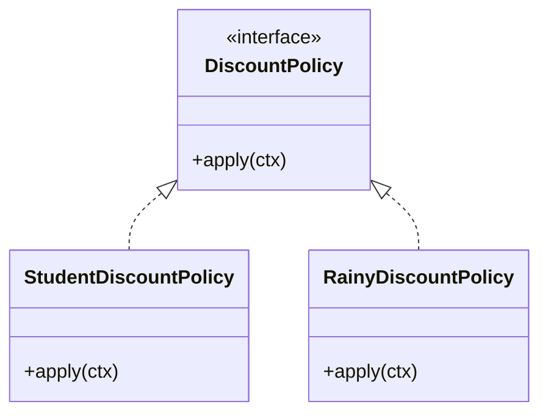

# 第12章：OCP（拡張に開く、修正に閉じる）🚪✨

今日は **OCP** を、ミニプロジェクトの「クーポン割引」を題材にして、めちゃ体感で覚えちゃおう〜😊🎟️
ちなみに **2026/01/09 時点**で、TypeScript の最新リリースノートは **TypeScript 5.9** が更新されてるよ（ドキュメント更新日も表示されてる）📌 ([TypeScript][1])
npm の `typescript` も **latest 5.9.3** として掲載されてるよ✨ ([npm][2])


---

## この章でできるようになること ✅🌟

* 「機能追加のたびに switch を編集する地獄😵」を、設計で回避できるようになる
* **どこが変わりやすいか**を見抜いて、拡張ポイントを作れる
* 追加機能を **既存コードほぼノータッチ**で入れられる形にできる
* AI にリファクタ案を出させつつ、人間が安全に採用判断できる🤖🧠

---

## OCPってなに？ ざっくり一言で 🍰✨


**「新しい機能を足すとき、すでに安定してるコードはなるべく触らない」** だよ😊🛡️

* **拡張に開く**：新しい割引ルールを “追加” できる
* **修正に閉じる**：既存の計算ロジック（安定してる場所）は “編集” しない

ポイントはこれ👇
**「変更が起きる場所」を決めて、そこに集める** 🧲✨
（ゼロ修正が理想だけど、現実は「修正が最小」でも大勝利だよ〜🎉）

---

## まずは OCP違反あるあるを見よう 👃💥

### あるある症状トップ3 🥺

1. `switch (coupon.type)` が育ちすぎる🌳
2. クーポン追加のたびに **同じファイルを毎回編集**😇
3. 1つの関数が「全クーポンの知識」を抱えて太る🍔

これ、最初はラクなんだけど…
**追加が増えるほど壊しやすい**し、レビューも怖いし、テストも増やしにくいの🥲

---

## お題 ミニプロジェクトのクーポン割引 ☕️🎟️

「Campus Café」で、注文合計にクーポンを適用するよ〜！

### まずはダメになりやすい実装 😵‍💫


```ts
// ❌ OCP的につらくなりやすい例：追加のたびにここを編集する

export type Coupon =
  | { type: "STUDENT"; percentOff: number }
  | { type: "RAINY"; amountOff: number }
  | { type: "SET"; amountOff: number };

export function applyCoupon(total: number, coupon: Coupon): number {
  switch (coupon.type) {
    case "STUDENT":
      return Math.max(0, total - total * (coupon.percentOff / 100));
    case "RAINY":
      return Math.max(0, total - coupon.amountOff);
    case "SET":
      return Math.max(0, total - coupon.amountOff);
    default: {
      // ここに来ないはず…のはず…😇
      const _exhaustive: never = coupon;
      return total;
    }
  }
}
```

#### これが何で困るの？ 🤔

* クーポンが増えるたび、**毎回この関数を編集**する
* 間違って既存ケースを壊すリスクが増える
* 「仕様の追加」なのに「既存の重要ロジック」を触ることになる🧨

---

## OCPの解決イメージ 変わるものを外に出す 🧳✨


OCPのコツはこれ👇

### 1 変わりやすいところを見つける 🔎

この例だと **割引の種類**が増えるのが未来で濃厚だよね🎟️📈

### 2 差し替え口を作る 🧩

「割引の計算」を **インターフェース**にする✨

### 3 追加は新しいファイルを増やすだけ 📁

既存の計算本体はなるべく触らない💪

---

## 改善版 Strategy風にして OCPを満たす 🧠🔁✨


### フォルダ案 📁✨

* `src/domain/discount/DiscountPolicy.ts`
* `src/domain/discount/policies/StudentDiscountPolicy.ts`
* `src/domain/discount/policies/RainyDiscountPolicy.ts`
* `src/domain/discount/policies/SetDiscountPolicy.ts`
* `src/app/discount/discountRegistry.ts` ← ここが「追加の入口」になりやすい🎯
* `src/domain/discount/applyDiscount.ts`



---

### 1 割引の差し替え口を作る 🧩

```ts
// src/domain/discount/DiscountPolicy.ts

export type DiscountKind = string;

export type DiscountContext = {
  total: number;
};

export interface DiscountPolicy {
  kind: DiscountKind;
  apply(ctx: DiscountContext): number; // 返すのは「割引後の合計」
}
```

---

### 2 各割引をクラスとして追加していく 🎟️✨

```ts
// src/domain/discount/policies/StudentDiscountPolicy.ts

import type { DiscountPolicy, DiscountContext } from "../DiscountPolicy";

export class StudentDiscountPolicy implements DiscountPolicy {
  public readonly kind = "STUDENT";

  constructor(private readonly percentOff: number) {}

  apply(ctx: DiscountContext): number {
    return Math.max(0, ctx.total - ctx.total * (this.percentOff / 100));
  }
}
```

```ts
// src/domain/discount/policies/RainyDiscountPolicy.ts

import type { DiscountPolicy, DiscountContext } from "../DiscountPolicy";

export class RainyDiscountPolicy implements DiscountPolicy {
  public readonly kind = "RAINY";

  constructor(private readonly amountOff: number) {}

  apply(ctx: DiscountContext): number {
    return Math.max(0, ctx.total - this.amountOff);
  }
}
```

（Set も同じ感じで OK だよ〜🧸✨）

---

### 3 ドメイン側は “知らない” で通す 😎🛡️

```ts
// src/domain/discount/applyDiscount.ts

import type { DiscountPolicy, DiscountContext, DiscountKind } from "./DiscountPolicy";

export function applyDiscount(
  total: number,
  kind: DiscountKind,
  policies: Map<DiscountKind, DiscountPolicy>
): number {
  const policy = policies.get(kind);
  if (!policy) return total; // 未登録なら何もしない（仕様次第でエラーでもOK）
  const ctx: DiscountContext = { total };
  return policy.apply(ctx);
}
```

✅ ここ大事！
`applyDiscount` は **STUDENT とか RAINY とかの具体名を知らない**。
だから新しい割引が増えても、ここは触らなくてよくなるの🎉

---

### 4 追加の入口を “1か所” に集める 🧲✨


```ts
// src/app/discount/discountRegistry.ts

import type { DiscountKind, DiscountPolicy } from "../../domain/discount/DiscountPolicy";
import { StudentDiscountPolicy } from "../../domain/discount/policies/StudentDiscountPolicy";
import { RainyDiscountPolicy } from "../../domain/discount/policies/RainyDiscountPolicy";
// import { SetDiscountPolicy } from ...

export function buildDiscountPolicies(): Map<DiscountKind, DiscountPolicy> {
  // ✅ ここが「拡張ポイント」になりやすい
  // 新しい割引を追加するときは、基本ここに “登録を足す” だけ
  return new Map<DiscountKind, DiscountPolicy>([
    ["STUDENT", new StudentDiscountPolicy(10)],
    ["RAINY", new RainyDiscountPolicy(100)],
    // ["SET", new SetDiscountPolicy(50)],
  ]);
}
```

ここを「追加の入口」にしておくと、変更が散らばらないよ😊✨
（のちの章でやる DI/DIP にもつながっていくよ〜💉🌈）

---

## 動作イメージ 🧪✨

```ts
import { buildDiscountPolicies } from "./app/discount/discountRegistry";
import { applyDiscount } from "./domain/discount/applyDiscount";

const policies = buildDiscountPolicies();

const total = 1200;
const afterStudent = applyDiscount(total, "STUDENT", policies);
const afterRainy = applyDiscount(total, "RAINY", policies);

console.log({ afterStudent, afterRainy });
```

---

## テストで「拡張しても壊れない」を守る ✅🛡️


Vitest は **4.0** が出てるよ〜⚡（公式のアナウンスあり） ([vitest.dev][3])

```ts
// src/domain/discount/applyDiscount.test.ts
import { describe, it, expect } from "vitest";
import { buildDiscountPolicies } from "../../app/discount/discountRegistry";
import { applyDiscount } from "./applyDiscount";

describe("applyDiscount", () => {
  it("STUDENTが10%オフになる", () => {
    const policies = buildDiscountPolicies();
    expect(applyDiscount(1000, "STUDENT", policies)).toBe(900);
  });

  it("RAINYが100円引きになる", () => {
    const policies = buildDiscountPolicies();
    expect(applyDiscount(1000, "RAINY", policies)).toBe(900);
  });

  it("未登録の割引は何もしない", () => {
    const policies = buildDiscountPolicies();
    expect(applyDiscount(1000, "UNKNOWN", policies)).toBe(1000);
  });
});
```

---

## 演習 ミッション3本 🎯🎉

### ミッション1 新クーポン BIRTHDAY を追加 🎂🎟️


要件：**合計から 200円引き**
やること：

* `BirthdayDiscountPolicy.ts` を追加
* `discountRegistry.ts` に登録を1行追加
* テストを1本追加してグリーンに✅

👉 成功したら、「既存の applyDiscount を触らずに追加できた！」ってなるはず🥳✨

---

### ミッション2 ルール変更の怖さを体験 🧨➡️🛡️

* `RAINY` を「雨の日は 100円引き」から「150円引き」に変更してみてね
* 変更箇所がどこか、すぐ分かる？👀
  （分かりやすい＝設計の勝ち🌸）

---

### ミッション3 仕様を増やしても switch を増やさない 🔁✨

* `applyDiscount` の中に `switch` を絶対書かない縛りでやってみてね😆

---

## よくある勘違いコーナー 🤯💡

### 勘違い1 OCPは一切修正しない原則

→ 現実は「修正を最小化」できればOKだよ😊
**安定した重要ロジック**を守るのが目的🛡️

### 勘違い2 なんでも interface にすれば強い

→ 早すぎ抽象化はコスト🍔💸
「増えそう」「変わりそう」が見えたところだけでOK👌

---

## AI活用 うまい使い方テンプレ 🤖📝✨

### 追加に強いリファクタ依頼

* 「この switch を OCPに沿って Strategy にして」
* 「差し替え口（interface）と registry を作って」
* 「変更は小さなステップで、テストも一緒に」

### 差分レビューのお願い

* 「変更ファイル一覧を出して」
* 「既存仕様が壊れる可能性を指摘して」
* 「テストケースを3つ提案して」

AI は提案が得意だけど、**採用判断は人間がやる**のが安全だよ〜👩‍💻🧠✨

---

## まとめ 今日の持ち帰り 🎒✨

* OCPは「追加のたびに既存の重要コードを触らない」ための考え方🚪🛡️
* `switch/if` が増えだしたら、**変わる部分を外に出す**サイン👃💥
* 「差し替え口」＋「登録場所を1か所」にすると、拡張がラクになる🎟️📦
* テストがあると、拡張しても怖くない✅

---

次の第13章では、この流れをもっと王道の形にして、**戦略パターンで差し替え**を気持ちよく極めるよ〜🧠🔁✨

[1]: https://www.typescriptlang.org/docs/handbook/release-notes/typescript-5-9.html?utm_source=chatgpt.com "Documentation - TypeScript 5.9"
[2]: https://www.npmjs.com/package/typescript?activeTab=versions&utm_source=chatgpt.com "typescript"
[3]: https://vitest.dev/blog/vitest-4?utm_source=chatgpt.com "Vitest 4.0 is out!"
